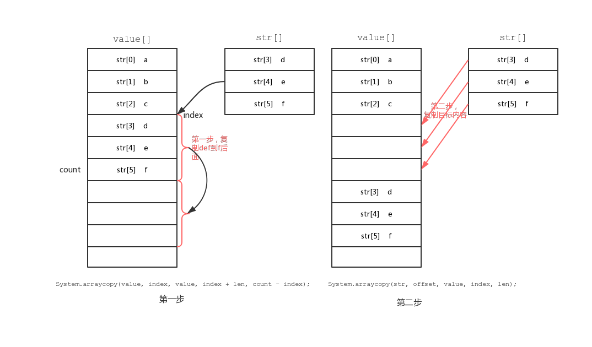
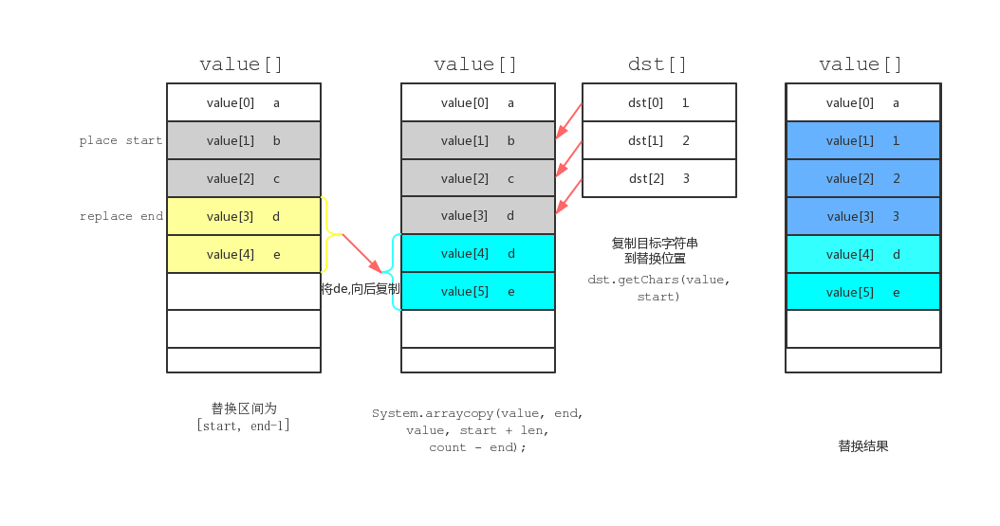
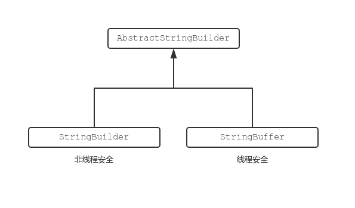
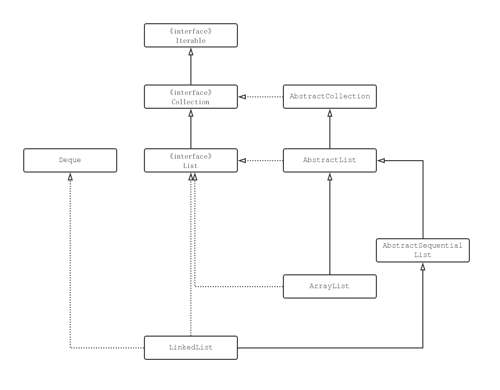
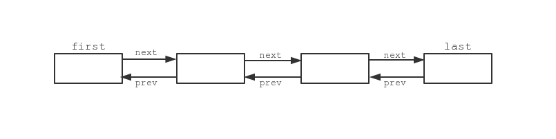
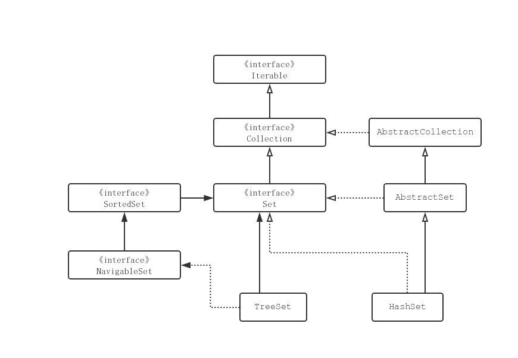
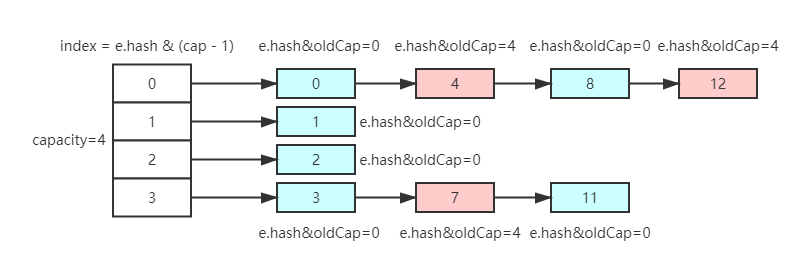
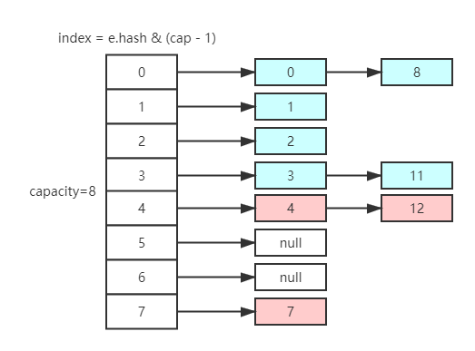

# Object类分析

Object是所有类的父类，任何类都默认继承Object。Object类到底实现了哪些方法？

#### 1．clone方法

保护方法，实现对象的浅复制，只有实现了Cloneable接口才可以调用该方法，否则抛出CloneNotSupportedException异常。

#### 2．getClass方法

final方法，获得运行时类型。

#### 3．toString方法

该方法用得比较多，一般子类都有覆盖。

#### 4．finalize方法

该方法用于释放资源。因为无法确定该方法什么时候被调用，很少使用。

#### 5．equals方法

该方法是非常重要的一个方法。一般equals和==是不一样的，但是在Object中两者是一样的。子类一般都要重写这个方法。

#### 6．hashCode方法

该方法用于哈希查找，重写了equals方法一般都要重写hashCode方法。这个方法在一些具有哈希功能的Collection中用到。**在Object中，hashCode返回的是对象所在的内存地址**

一般必须满足`obj1.equals(obj2)==true`。可以推出`obj1.hash- Code()==obj2.hashCode()`，但是hashCode相等不一定就满足equals。不过为了提高效率，应该尽量使上面两个条件接近等价。

#### 7．wait方法

wait方法就是使当前线程等待该对象的锁，当前线程必须是该对象的拥有者，也就是具有该对象的锁。wait()方法一直等待，直到获得锁或者被中断。wait(long timeout)设定一个超时间隔，如果在规定时间内没有获得锁就返回。

调用该方法后当前线程进入睡眠状态，直到以下事件发生。

（1）其他线程调用了该对象的notify方法。

（2）其他线程调用了该对象的notifyAll方法。

（3）其他线程调用了interrupt中断该线程。

（4）时间间隔到了。

此时该线程就可以被调度了，如果是被中断的话就抛出一个InterruptedException异常。

#### 8．notify方法

该方法唤醒在该对象上等待的某个线程。

#### 9．notifyAll方法

该方法唤醒在该对象上等待的所有线程。


# AbstractCollection类

## add()

抽象集合中并不能插入元素。硬插会抛出异常。

```java
public boolean add(E e) {
    throw new UnsupportedOperationException();
}
```


## contains()

`Collection`组织下的对象为线性结构，所以搜索默认采用的线性搜索的方法。如果是hash或者binary tree，子类重写该函数就能实现更高效的搜索方法。

```java
public boolean contains(Object o) {
    Iterator<E> it = iterator();
    if (o==null) {
        while (it.hasNext())
            if (it.next()==null)
                return true;
    } else {
        while (it.hasNext())
            if (o.equals(it.next()))
                return true;
    }
    return false;
}
```


## boolean containsAll(Collection<?> c)

对每个`c`中的元素执行一次`contains`，时间复杂度为O($N^2$)


## remove()

`Collection`中，`null`也是合法的元素，所以在删除的时候需要考虑到`null`的感受。删除同样是遍历`Collection`的迭代器，找到目标元素之后通过迭代器将其删除。

```java
public boolean remove(Object o) {
    Iterator<E> it = iterator();
    if (o==null) {
        while (it.hasNext()) {
            if (it.next()==null) {
                it.remove();
                return true;
            }
        }
    } else {
        while (it.hasNext()) {
            if (o.equals(it.next())) {
                it.remove();
                return true;
            }
        }
    }
    return false;
}
```


## removeAll

遍历collection，若果当前元素**属于**需要被删除的元素，那么直接通过迭代器删除。

```java
public boolean removeAll(Collection<?> c) {
    Objects.requireNonNull(c);
    boolean modified = false;
    Iterator<?> it = iterator();
    while (it.hasNext()) {
        if (c.contains(it.next())) {
            it.remove();
            modified = true;
        }
    }
    return modified;
}
```


## retainAll()

遍历collection，若果当前元素**不属于**需要被删除的元素，那么直接通过迭代器删除。

```java
public boolean retainAll(Collection<?> c) {
    Objects.requireNonNull(c);
    boolean modified = false;
    Iterator<E> it = iterator();
    while (it.hasNext()) {
        if (!c.contains(it.next())) {
            it.remove();
            modified = true;
        }
    }
    return modified;
}
```


`retailAll`与`removeAll`除了删除的判断条件正好相反，其他部分是一样的代码，


## toArray()

Collection无序、允许NULL，允许重复元素，**所以基本思路大概就是，定义一个数组，然后遍历集合元素**，将遍历的每个元素放到新定义的数组中，然后返回。

实现分成了三个部分：

1.数组的实际长度 == size()返回的长度

​	**循环size()个元素之后，检查如果没有剩余元素，立即返回**

2.数组的实际长度  > size()返回的长度

​	**在复制过程中，如果在循环过程中结束，立即返回**

3.数组的实际长度 < size()返回的长度

​	**在复制size()个元素之后，检查如果还有剩余元素，将数组长度len扩大到len+len/2+1，再继续复制。重复这个过程，知道没有剩余元素。**


存在以上三种情况的原因在于：**`size()`函数是由子类实现的，所以我们并不清楚`size()`返回的是否就是真实的元素数目（虽然这个可能性比较小，但是有可能返回的数比集合内的数目要大或者小）。为了让我们的函数有更好的容错性，代码中要考虑到不一致的情况。**

```java
public Object[] toArray() {
    // Estimate size of array; be prepared to see more or fewer elements
    Object[] r = new Object[size()];
    Iterator<E> it = iterator();
    for (int i = 0; i < r.length; i++) {
        if (! it.hasNext()) // fewer elements than expected
            return Arrays.copyOf(r, i); //情况3，在循环中遇到终点，立即截断。
        r[i] = it.next();
    }
    
    //情况1,2。如果是情况1，直接返回；如果是2，则调用finishToArray
    return it.hasNext() ? finishToArray(r, it) : r; 
}

@SuppressWarnings("unchecked")
private static <T> T[] finishToArray(T[] r, Iterator<?> it) {
    int i = r.length;
    while (it.hasNext()) {
        int cap = r.length;
        //如果数组已经被填充满，但是还有剩余元素需要添加
        if (i == cap) {
            //将数组的长度len扩充为len+len/2+1
            int newCap = cap + (cap >> 1) + 1;
            // overflow-conscious code
            if (newCap - MAX_ARRAY_SIZE > 0)
                newCap = hugeCapacity(cap + 1);
            r = Arrays.copyOf(r, newCap);
        }
        //将元素一次复制到扩充之后的数组中
        r[i++] = (T)it.next();
    }
    // trim if overallocated
    return (i == r.length) ? r : Arrays.copyOf(r, i);
}

private static int hugeCapacity(int minCapacity) {
    if (minCapacity < 0) // overflow
        throw new OutOfMemoryError("Required array size too large");
    return (minCapacity > MAX_ARRAY_SIZE) ? Integer.MAX_VALUE : MAX_ARRAY_SIZE;
}
```


# java.lang.Integer类

`Integer`在表示32位整数，其范围为`[Integer.MIN_VALUE, Integer.MAX_VALUE]`，下图的源码表示了常量的具体值。

```java
/**
 * A constant holding the minimum value an {@code int} can
 * have, -2<sup>31</sup>.
 */
@Native public static final int   MIN_VALUE = 0x80000000;

/**
 * A constant holding the maximum value an {@code int} can
 * have, 2<sup>31</sup>-1.
 */
@Native public static final int   MAX_VALUE = 0x7fffffff;
```


## Integer的缓存机制

要理解`Integer`的缓存机制，我们首先需要了解一下`Java`的自动装箱（autoboxing）机制。Java 编译器把原始类型自动转换为封装类的过程称为自动装箱（autoboxing），这相当于调用 valueOf 方法

```java
Integer a = 10;
//自动装箱会把上面的代码解释为如下：
Integer a = Integer.valueOf(10);
```

`valueOf()`执行时会先判断用户定义的变量值是否在缓存中，如果在缓存中，直接返回缓存中的应用，否则创建一个新的整数对象。

`valueOf()`的代码如下：

```java
public static Integer valueOf(int i) {
    if (i >= IntegerCache.low && i <= IntegerCache.high)
        return IntegerCache.cache[i + (-IntegerCache.low)];
    return new Integer(i);
}
```


如下是`Integer`缓存机制的代码，从代码中可以看出，默认情况下，缓存整数的范围在[-128, 127]之间，但是可以通过虚拟机参数`-XX:AutoBoxCacheMax`去调整默认的范围。`IntegerCache`在首次被使用的时候会创建该范围中的所有整数并有序放入`cache`数组中，有序保存便于快速索引目标对象。

```java
/**
 * Cache to support the object identity semantics of autoboxing for values between
 * -128 and 127 (inclusive) as required by JLS.
 *
 * The cache is initialized on first usage.  The size of the cache
 * may be controlled by the {@code -XX:AutoBoxCacheMax=<size>} option.
 * During VM initialization, java.lang.Integer.IntegerCache.high property
 * may be set and saved in the private system properties in the
 * sun.misc.VM class.
*/
private static class IntegerCache {
    static final int low = -128;
    static final int high;
    static final Integer cache[];//缓存数组，保存指定范围以为的整数
    
    //static块以保证代码仅仅在首次使用的时候执行一次
    static {
        // high value may be configured by property
        int h = 127;
        String integerCacheHighPropValue =
            sun.misc.VM.getSavedProperty("java.lang.Integer.IntegerCache.high");
        if (integerCacheHighPropValue != null) {
            try {
                int i = parseInt(integerCacheHighPropValue);
                i = Math.max(i, 127);
                // Maximum array size is Integer.MAX_VALUE
                h = Math.min(i, Integer.MAX_VALUE - (-low) -1);
            } catch( NumberFormatException nfe) {
                // If the property cannot be parsed into an int, ignore it.
            }
        }
        high = h;
        
        cache = new Integer[(high - low) + 1];
        int j = low;
        for(int k = 0; k < cache.length; k++)
            cache[k] = new Integer(j++);
        
        // range [-128, 127] must be interned (JLS7 5.1.7)
        assert IntegerCache.high >= 127;
    }
    
    private IntegerCache() {}
}
```

如果需要该缓存机制在代码中为我们所用，那么需要使用如下的写法，不能使用`int`去定义变量：

```java
Integer a = 100;
//or
Integer a = Integer.valueOf(100)
```


因为整数的缓存机制，所以对于如下这样的代码，我们是可以预知其行为的

```java
public class Main {
    public static void main(String[] argv) {
        Integer a = 100;
        Integer b = 100;
        Integer c = 23;

        System.out.println(a == b); //输出true, 100在缓存值中，直接给a,b同一个引用
        System.out.println(c == b); //b,c持有不同的值，通用直接分别给缓存中的两个不同的引用，所以指针不同

        Integer e = 2000003;
        Integer f = 2000003;
        //输出false, 虽然定义的同一个值，但是2000003并不在缓存中，
        //所以Integer会调用了new Integer(2000003),创建一个新的对象
        System.out.println(e == f);
        //输出true,equals函数做字面上的笔记，虽然地址不同，但是都是同一个数值
        System.out.println(e.equals(f));
    }
}
```


## Integer的public static String toString(int i, int radix)

这个函数将整数转为对应进制的字符串，能在看Java源码的人肯定都能轻易实现一个等价的函数的。那么Java自己是怎么实现的这一功能呢，我们看看源码。

```java
/**
 * All possible chars for representing a number as a String
 */
final static char[] digits = {
    '0' , '1' , '2' , '3' , '4' , '5' ,
    '6' , '7' , '8' , '9' , 'a' , 'b' ,
    'c' , 'd' , 'e' , 'f' , 'g' , 'h' ,
    'i' , 'j' , 'k' , 'l' , 'm' , 'n' ,
    'o' , 'p' , 'q' , 'r' , 's' , 't' ,
    'u' , 'v' , 'w' , 'x' , 'y' , 'z'
};

public static String toString(int i, int radix) {
    //radix表示进制
    //Character.MIN_RADIX=2 Character.MAX_RADIX=36
    if (radix < Character.MIN_RADIX || radix > Character.MAX_RADIX)
        radix = 10;

    /* Use the faster version */
    if (radix == 10) {
        return toString(i); //对于10进制的转换，java使用位运算
    }

    //32位整数加一个符号，所以需要33个char，极端情况表示-0x7fffffff
    char buf[] = new char[33];
    boolean negative = (i < 0);
    int charPos = 32;

    if (!negative) {
        i = -i; //变成负数再处理,取负数才能正确处理Integer.MAX_VALUE
    }

    /*不断求余取整，知道目标值小于基数可以直接当做转换结果*/
    while (i <= -radix) {
        /*从字符集中选取对应字符反向放入缓存区，例如十进制12,二进制1100
          依次:
            -12 < -2: buff[32]=0 
            -6  < -2: buff[31]=0
            -3  < -2: buff[30]=0
            -1 <> -2: exit loop, pos is 29
        */
        buf[charPos--] = digits[-(i % radix)];
        i = i / radix;
    }
    // buff[29]=1
    buf[charPos] = digits[-i];

    //如果是负数，加上负号
    if (negative) {
        buf[--charPos] = '-';
    }

    return new String(buf, charPos, (33 - charPos));
}
```

从源码中可以看出，Java的实现的思路就是对目标整数不断求余取整，找出每一位数对于的字符填充到`buf`数组中，与大多数人的实现无异，唯一的区别在于Java将数字变成了负数处理，这么做的原因在于:

**如果求余取整过程用正整数处理，当遇到一个`Integer.MIN_VALUE`时，其绝对值超出了最大正整数能表示的范围，因此在计算过程中如果遇到最小负数`Integer.MIN_VALUE`就会出错；反之用负数来处理的话，最大正整数取负值，在最小负数的有效范围中，能避免整数溢出的问题**

当进制是10的时候，因为10进制的使用频率巨高，所以Java单独为其设计的一个函数，使用了位运算去实现，使得其速度更快。


## Integer的public static int parseInt(String s, int radix)

`parseInt`将不同进制的字符串数字转换为Integer类型。

```java
public static int parseInt(String s, int radix) throws NumberFormatException
{
    /*
     * WARNING: This method may be invoked early during VM initialization
     * before IntegerCache is initialized. Care must be taken to not use
     * the valueOf method.
     */

    if (s == null) {
        throw new NumberFormatException("null");
    }

    if (radix < Character.MIN_RADIX) { //MIN_RADIX=2
        throw new NumberFormatException("radix " + radix +
                                        " less than Character.MIN_RADIX");
    }

    if (radix > Character.MAX_RADIX) { //MAX_RADIX=36
        throw new NumberFormatException("radix " + radix +
                                        " greater than Character.MAX_RADIX");
    }

    int result = 0; //保存解析过程中的中间结果
    boolean negative = false; //正负标志
    int i = 0, len = s.length(); //变量字符串
    int limit = -Integer.MAX_VALUE; //默认设置正数的上限，用负数表示
    int multmin; //设置缩小10倍的大小限制
    int digit; //表示从每个字符串中取出的字符

    if (len > 0) {
        char firstChar = s.charAt(0);
        if (firstChar < '0') { // Possible leading "+" or "-"
            if (firstChar == '-') {
                negative = true;
                limit = Integer.MIN_VALUE;
            } else if (firstChar != '+')
                throw NumberFormatException.forInputString(s);

            if (len == 1) // Cannot have lone "+" or "-"
                throw NumberFormatException.forInputString(s);
            i++;
        }
        
        multmin = limit / radix;
        while (i < len) {
            // Accumulating negatively avoids surprises near MAX_VALUE
            digit = Character.digit(s.charAt(i++),radix);
            if (digit < 0) {
                throw NumberFormatException.forInputString(s);
            }
            if (result < multmin) {
                throw NumberFormatException.forInputString(s);
            }
            result *= radix;
            if (result < limit + digit) {
                throw NumberFormatException.forInputString(s);
            }
            result -= digit;
        }
    } else {
        throw NumberFormatException.forInputString(s);
    }
    return negative ? result : -result;
}
```


`parseInt`函数是很有技巧的实现方法，非常优雅有效的处理了字符数值可能超出整数范围而发生异常情况。`parseInt`的逻辑如下：

1. [9,21]行检查传入的参数字符串与进制数是否在有效范围中

2. [23,28]行初始化相关变量，默认为正整数设置

   ```java
   int result = 0; //保存解析过程中的中间结果，因为处理过程中都是负数，所以对result的操纵只有乘法与减法
   boolean negative = false; //正负标志
   int i = 0, len = s.length(); //变量字符串
   int limit = -Integer.MAX_VALUE; //默认设置正数的上限，用负数表示
   int multmin; //设置缩小10倍的大小限制
   int digit; //表示从每个字符串中取出的字符
   ```

3. [31,42]行对输入是负数的情况重新设置相关标志与限制值

4. [44,59]行解析字符串

   a. 从字符串中取出一个字符数字

   b. 将result乘以进制数，为了方便解释，假定进制是10，也就是得出除了个位数的整数部分

   c. 检查除了个位部分的结果是否超过了最大限制的除了个位的部分，如果除了个位都已经超出了限制，那么最后结果必然超过限制，抛出异常。

   d. 加上个位数，检查加上各位数之后的结果是否超过最大限制，如果超过，抛出异常。

   **这一步的技巧在于`if (result < limit + digit)`，因为`result`与`limit`都是负值，所以使用的是`<`符号，这个不等式实际上为`result - digit < limit`移项的结果，`result - digit` 可能超出整数范围，而移项之后，不等式等价，也解决了溢出了问题**

   e. 回到a步，抽取下一个数字计算。


## 一个快速求解整数位数的方法

```java
final static int [] sizeTable = { 9, 99, 999, 9999, 99999, 999999, 9999999,
                                      99999999, 999999999, Integer.MAX_VALUE };
// Requires positive x
static int stringSize(int x) {
	for (int i=0; ; i++) //一次去比较不同位数对应的最大值，找到其索引作为返回值
		if (x <= sizeTable[i])
			return i+1;
}
```


## java中的位移

java中有三种移位运算符，**位移都在在补码上进行**

| 位移符号 | 功能       | 解释                      |
| -------- | ---------- | ------------------------- |
| `<<`     | 左移运算符 | num << 1，相当于num乘以2  |
| `>>`     | 右移运算符 | num >> 1，相当于num除以2  |
| `>>>`    | 无符号右移 | 忽略符号位，空位都以0补齐 |

注意：**没有无符号左移，因为符号位在左边，左移时直接补0而无需考虑符号问题**

计算机中二进制最高位为0表示正，1表示负，且无论正负，计算机中均以补码保存整数的二进制。因此也就有：

- 正数的补码为其二进制本身

- 负数的补码为其绝对值的二进制码取反加一

  

**7的二进制补码为`0000 0111**`

> 如果对7左移1位，得二进制`0000 1110`，为14，相当于乘2
>
> 如果对7右移1位，得二进制`0000 0011`，为3，相当于除2
>
> 如果对7无符号右移1位，得二进制`0000 0011`，为3，相当于除2


**-7的二进制补码为`1111 1001`， 由7的二进制码`0000 0111`    取反`1111 1000`    加一`1111 1001`得到。**

> 如果对-7左移1位，得二进制`1111 0010`，取反加一得`0000 1110`为14，符号为负，所以得-14，相当于乘2
>
> 如果对-7右移1位，得二进制`1111 1100`，取反加一得`0000 0100`为3， 符号为负，所以得-3，相当于除2
>
> 如果对-7无符号右移1位，得二进制`0111 1100`，最高位变成了0，被当成整数对待，值为124


# Byte，Short，Integer与Long

| 类型    | 带宽 | 数值范围                                    |
| ------- | ---- | ------------------------------------------- |
| Byte    | 8位  | [-128, 127]                                 |
| Short   | 16位 | [-32768, 32767]                             |
| Integer | 32位 | [-2147483648, 2147483647]                   |
| Long    | 64位 | [-9223372036854775808, 9223372036854775807] |
- Byte，Short，Integer与Long四种类型都用缓存，默认范围均为[-128, 127]，也就是说实际上`Byte`是全缓存。
- 在字符串数值解析函数中，因为`Short`与`Byte`的范围在`Integer`范围以内，所以直接调用了`Integer`的`parseInt`函数，然后批判范围是否越界。
- Long类的函数实现与Integer的基本一样，仅仅是在范围上的区别。


# java.lang.String类

`String`的内部维护着一个名为`value`的字符数组，String不允许直接修改字符串本身。

1. replace函数通过正则表达式实现，所以其效率是有折扣的

2. split函数在以简单单字符作为delimiter时，通过一段一段的截取做分割，当delimiter是其他的情况则使用正则表达式实现

```java
//判断条件，满足则使用截取方式，否则使用正则表达式
if (((regex.value.length == 1 && ".$|()[{^?*+\\".indexOf(ch = regex.charAt(0)) == -1) 
	|| (regex.length() == 2 && regex.charAt(0) == '\\' && (((ch = regex.charAt(1))-'0')|('9'-ch)) < 0 && ((ch-'a')|('z'-ch)) < 0 && ((ch-'A')|('Z'-ch)) < 0)) && (ch < Character.MIN_HIGH_SURROGATE 
	|| ch > Character.MAX_LOW_SURROGATE))
```

3. Arrays.copyOf()直接调用了System.arraycopy(), 该方法是native实现

    ```java
    //Arrays.copyOf的具体实现
    public static short[] copyOf(short[] original, int newLength) {
        short[] copy = new short[newLength];
        				   
        System.arraycopy(original, //源数组
                         0,        //源数组复制起点
                         copy,     //目标数组
                         0,        //目标数组写入起点
                         Math.min(original.length, newLength) //复制长度
                        );
        return copy;
    }
    ```

    

## `String`的加法

String str = "to" + "gether";的等价模式

   ```
   new StringBuilder().append("to").append("gether").toString()
   ```

我们应该首选StringBuilder提升速度

   ```java
   public static void main(String[] args) {
       String cip = "cip";
       String ciop = "ciop";
       String plus = cip + ciop;
       String build = new StringBuilder(cip).append(ciop).toString();
   }
   ```

为什么应该考虑StringBuilder，考虑这样一种情况：我们需要不断对一个字符串做追加操作，以下两种实现方式。

a)加法方式：

   ```java
   for (int i = 0; i < loopCount; i++) {
   	result += str;
   }
   ```

实际上上面的代码等价于

   ```java
   for (int i = 0; i < loopCount; i++) {
   	result = new StringBuilder(result).append(str).toString();
   }
   ```

第二行在每次循环过程中都会重复构造StringBuilder对象，构造过程中会复制result中的字符到builder内部的字符数组，当result越来越长之后，这个过程会越来越慢。

b)StringBuilder方式

   ```java
   StringBuilder stringBuilder = new StringBuilder();
   for (int i = 0; i < loopCount; i++) {
   	stringBuilder.append(str);
   }
   ```

这种形式只构造一次Builder，然后每次追加到builder内部，最后得到目标字符串，所以效率更高。


## `concat`函数

```java
public String concat(String str) {
    int otherLen = str.length();
    if (otherLen == 0) {
        return this;
    }
    int len = value.length;
    char buf[] = Arrays.copyOf(value, len + otherLen);
    str.getChars(buf, len);
    return new String(buf, true);
}
```


## `String.join()`

`String.join()`函数调用`StringJoiner`类实现字符串的连接。`StringJoiner`类中有如下三个属性，

```
    private final String prefix;   //用在拼接字符串前面，默认为空
    private final String delimiter;//连接符号
    private final String suffix;   //用在拼接字符串后面，默认为空
```

`StringJoiner`内部为一个`StringBuilder`，`String.join()`循环调用`StringJoiner`中的`add`函数：

首次调用的时候，`StringJoiner`添加`prefix`到`StringBuilder`,然后添加列表中的字符串。

第二次以及之后的调用，`StringJoiner`添加`delimiter`到`StringBuilder`，然后添加列表中后续的单词。

最后`String.join()`在return时调用`StringJoiner`的`toString`方法，改方法在之前的结果后面追加上后缀`suffix`然后返回结果

其实就是构造这样一个结果：

```
prefix+string1+delimier+string2+delimiter+string3+...+delimiter+stringN+suffix
```


# java.lang.AbstractStringBuilder类

StringBuilder内部结构与String的一致，同为维护了一个名为value的字符数组，与String的不同的地方在于：

1. StringBuilder只有在调用toString函数时候才会将内部的value数组构造为String对象返回
2. StringBuilder提供了大量可以对value数组修改的方法，比如插入、替换、反转、追加等操作，以避免在String对象上操作构造出目标字符串从而提升效率
3. StringBuilder内部的相当一部分函数使用了函数System.arraycopy(src, srcBegin, dst, dstBegin, len)，该函数为C++native实现，具有较高的执行效率


## 容量扩充

StringBuilder中value数组的默认长度为16，扩充一次默认为当前长度的2倍加2。

初始化函数：

```java
public StringBuilder() {
    super(16);
}
```

容量扩充函数：

```java
void expandCapacity(int minimumCapacity) {
    int newCapacity = value.length * 2 + 2;
    if (newCapacity - minimumCapacity < 0)
        newCapacity = minimumCapacity;
    if (newCapacity < 0) {
        if (minimumCapacity < 0) // overflow
            throw new OutOfMemoryError();
        newCapacity = Integer.MAX_VALUE;
    }
    value = Arrays.copyOf(value, newCapacity);
}
```


## 插入操作

StringBuilder在value数组中插入元素的原理：



```java
public AbstractStringBuilder insert(int index, char[] str, int offset, int len) {
        if ((index < 0) || (index > length()))
            throw new StringIndexOutOfBoundsException(index);
        if ((offset < 0) || (len < 0) || (offset > str.length - len))
            throw new StringIndexOutOfBoundsException(
                "offset " + offset + ", len " + len + ", str.length "
                + str.length);
        ensureCapacityInternal(count + len);
    
    	//这两行操作如上图
        System.arraycopy(value, index, value, index + len, count - index);
        System.arraycopy(str, offset, value, index, len);
    
        count += len;
        return this;
}
```


## replace操作

StringBuilder对value做replace操作的原理：



```java
public AbstractStringBuilder replace(int start, int end, String str) {
        if (start < 0)
            throw new StringIndexOutOfBoundsException(start);
        if (start > count)
            throw new StringIndexOutOfBoundsException("start > length()");
        if (start > end)
            throw new StringIndexOutOfBoundsException("start > end");

        if (end > count)
            end = count;
        int len = str.length();
        int newCount = count + len - (end - start);
        ensureCapacityInternal(newCount);
    
		//这两行操作如上图
        System.arraycopy(value, end, value, start + len, count - end);
        str.getChars(value, start);
    
        count = newCount;
        return this;
}
```


# java.lang.StringBuilder类

StringBuilder继承于AbstractStringBuilder，该类中的所有方法的实现都是直接调用其父类方法。StringBuilder中的方法在被调用时，会调用父类的方法去完成任务。

## 非线程安全

StringBuilder并**不保证其类中的方法线程安全**，所以相比StringBuffer，在单线程的环境下推荐使用StringBuilder以获取最佳的性能。


# java.lang.StringBuffer类

StringBuffer与StringBuilder一样，同是继承于AbstractStringBuilder，该类中的所有方法的实现都是直接调用其父类方法，且每个方法都加上了**synchronized**关键词以保证线程安全。

```java
@Override
public synchronized String substring(int start, int end) {
    return super.substring(start, end);
}
```

## toStringCache

```private transient char[] toStringCache;```

toStringCache缓存最后一次toString的结果，在toString之后的操纵并不修改其内容，每执行一次toString更新一次其值。

### transient关键词

> Java的serialization提供了一种持久化对象实例的机制。当持久化对象时，可能有一个特殊的对象数据成员，我们不想用serialization机制来保存它。为了在一个特定对象的一个域上关闭serialization，可以在这个域前加上关键字transient。
>
> transient是Java语言的关键字，用来表示一个域不是该对象串行化的一部分。当一个对象被串行化的时候，transient型变量的值不包括在串行化的表示中，然而非transient型的变量是被包括进去的。


## 线程安全


StringBuffer的所有方法都有**synchronized**关键词，因此该类保证其类中的方法线程安全。


## StringBuilder，StringBuffer，AbstractStringBuilder的关系



# Java集合框架

## List

### List类图



### ArrayList
正如其名字，ArrayList内部维护一个Object类型的数组，与一个size变量。


#### 插入
1. add(E element)

   检查容量，在必要的时候扩充容量，然后将新的元素插入到内部数组末尾。

2. add(int index, E element)

   检查容量，在必要的时候扩充容量，**将从index开始到尾部的所有元素通过System.arraycopy()后移一个位置**，然后将新的元素插入到内部数组末尾。

3. addAll(Collection<? extends E> c)

   首先得c中的内部数组引用到变量a，将ArrayList的容量进行检查并在必要的时候扩充容量，使用**System.arraycopy**将数组a的追加到ArrayList中的数组。代码如下：

   ```java
   System.arraycopy(a, 0, elementData, size, numNew);
   //(插入数组，插入数组的起始访问坐标，ArrayList的内部数组，插入为尾部参数size,插入数量a的长度)
   ```

4. addAll(int index, Collection<? extends E> c)

   检查index是否在ArrayList的最大下标范围之中；取得c中的内部数组引用到变量a；检查ArrayList的容量必要的情况下对其进行扩充；**将从index开始到尾部的所有元素通过System.arraycopy()后移c.size()个位置**； 使用**System.arraycopy**将c复制到ArrayList从index处开始的位置。 代码大致如下：

   ```java
   //后移元素
   System.arraycopy(elementData, index, elementData, index + numNew,numMoved);
   //插入元素
   System.arraycopy(a, 0, elementData, index, numNew);
   ```

   

**插入元素时的容量检查与扩充**
> The array buffer into which the elements of the ArrayList are stored.
> The capacity of the ArrayList is the length of this array buffer. Any
> empty ArrayList with elementData == DEFAULTCAPACITY_EMPTY_ELEMENTDATA
> will be expanded to DEFAULT_CAPACITY when the first element is added.

不带容量参数定义ArrayList时，elementData指向DEFAULTCAPACITY_EMPTY_ELEMENTDATA，当第一个元素插入时，将其容量扩充为DEFAULT_CAPACITY，10个容量。


对程序员开放的调整容量的函数`ensureCapacity`，扩充的最小容量小于ArrayList默认最小容量10的时候，扩充操纵将被忽略。

> Arraylist在扩充容量的时候，新的容量首先被扩充为就容量的1.5倍，如果1.5倍值不足minCapacity，那么新的容量被调整为minCapacity，容量的的最大值可以达到Integer.MAX_VALUE

```java
public void ensureCapacity(int minCapacity) {
    int minExpand = (elementData != DEFAULTCAPACITY_EMPTY_ELEMENTDATA)
        // any size if not default element table
        ? 0
        // larger than default for default empty table. It's already
        // supposed to be at default size.
        : DEFAULT_CAPACITY; //10
    if (minCapacity > minExpand) {
        ensureExplicitCapacity(minCapacity);
    }
}
```


私有函数`ensureExplicitCapacity`的定义

```java
private void ensureCapacityInternal(int minCapacity) {
    if (elementData == DEFAULTCAPACITY_EMPTY_ELEMENTDATA) {//空数组
        minCapacity = Math.max(DEFAULT_CAPACITY, minCapacity);
	}
	ensureExplicitCapacity(minCapacity);
}

private void ensureExplicitCapacity(int minCapacity) {
	modCount++;
	// overflow-conscious code
    if (minCapacity - elementData.length > 0)
		grow(minCapacity);
}
```


扩充的具体操作

```java
    /**
     * The maximum size of array to allocate.
     * Some VMs reserve some header words in an array.
     * Attempts to allocate larger arrays may result in
     * OutOfMemoryError: Requested array size exceeds VM limit
     */
    private static final int MAX_ARRAY_SIZE = Integer.MAX_VALUE - 8;

    /**
     * Increases the capacity to ensure that it can hold at least the
     * number of elements specified by the minimum capacity argument.
     *
     * @param minCapacity the desired minimum capacity
     */
    private void grow(int minCapacity) {
        // overflow-conscious code
        int oldCapacity = elementData.length;
        //默认扩大为旧容量的1.5倍
        int newCapacity = oldCapacity + (oldCapacity >> 1);
        //如果扩大1.5倍之后还是达不到目标值minCapacity，那么直接使用minCapacity的值，
        //如果newCapacity溢出之后为负数，那么了newCapacity将被minCapacity替换，
        //minCapacity会保证是一个正数
        if (newCapacity - minCapacity < 0)
            newCapacity = minCapacity;
        
        //如果新的容量值超出了MAX_ARRAY_SIZE，那么对minCapacity再一次检查，如果超过了MAX_ARRAY_SIZE
        //且没有溢出，直接将容量调整为正数最大值，如果没有超过MAX_ARRAY_SIZE，那么使用这个值作为容量
        if (newCapacity - MAX_ARRAY_SIZE > 0)
            newCapacity = hugeCapacity(minCapacity);
        
        // minCapacity is usually close to size, so this is a win:
        //开辟新的容量为newCapacity的数组，将旧数组的元素复制进入，然后将其返回给elementData
        elementData = Arrays.copyOf(elementData, newCapacity);
    }

    private static int hugeCapacity(int minCapacity) {
        if (minCapacity < 0) // overflow
            throw new OutOfMemoryError();
        return (minCapacity > MAX_ARRAY_SIZE) ?
            Integer.MAX_VALUE :
            MAX_ARRAY_SIZE;
    }
```


#### 删除

1. remove(int index)

   ```java
   System.arraycopy(elementData, index+1, elementData, index, numMoved);
   elementData[--size] = null; // clear to let GC do its work
   ```

   将index+1处开始到末尾的元素向前移动一位；将size值减一并置最后一个元素为null方便垃圾回收。

2. remove(Object o)

   删除机制与remove(int index)一致，先查找目标对象的下标，然后执行删除操作。

3. removeAll(Collection\<?> c) 与retainAll(Collection<?> c)

   removeAll与retailAll是一对相反的操作，所以其内部实现实际上是调用的同一个函数，核心代码如下：

   ```java
   int r = 0, w = 0;
   for (; r < size; r++)
       //不同函数收集不同的目标元素，remove->complement为false, retail->complement为true
   	if (c.contains(elementData[r]) == complement)
   		elementData[w++] = elementData[r];//收集目标元素防止在数组靠前位置
   
   if (w != size) {
   	// clear to let GC do its work
       for (int i = w; i < size; i++)
   		elementData[i] = null;//将末尾置为null
   	size = w;//更新数组容量
   }
   ```

   

4. removeIf(Predicate<? super E> filter)

   removeIf先使用BitMap记录符合filter规则的元素，也就是需要被删除的元素；然后执行的操纵与removeAll类似。


#### 迭代器

迭代器是ArrayList中的一个内部类。对内部数组的访问与删除做了封装。

我们看调用iterater函数时发生了什么：

```java
public Iterator<E> iterator() {
	return listIterator();//返回ArrayList内部类的一个实例
}
```


内部类`Iterator`的实现代码

```java
private class Itr implements Iterator<E> {
    int cursor;       // index of next element to return
    int lastRet = -1; // index of last element returned; -1 if no such
    int expectedModCount = modCount;

    public boolean hasNext() {
        //cursor表当前元素的下一个元素的下标，如果小于size说明还有元素可以访问
        return cursor != size; 
    }

    @SuppressWarnings("unchecked")
    public E next() {
        checkForComodification();
        int i = cursor; //即将被访问的元素
        if (i >= size) //检查是否下标越界
            throw new NoSuchElementException();
        //取得ArrayList内部数组的引用
        Object[] elementData = ArrayList.this.elementData;
        if (i >= elementData.length)//检查是否下标越界
            throw new ConcurrentModificationException();
        cursor = i + 1;//光标后移一位
        return (E) elementData[lastRet = i]; //设置当前访问元素的下标并返回目标元素
    }

    public void remove() {
        if (lastRet < 0)
            throw new IllegalStateException();
        checkForComodification();

        try {
            //下面代码的等价形式
            //System.arraycopy(elementData, index + 1, elementData, index, size - index - 1);
            ArrayList.this.remove(lastRet);
            //因为当前元素被删除，后面的所有元素前移一位，
            //所以cursor置为lastRet就标记了下一个即将访问的元素的下标
            cursor = lastRet;
            //因为lastRet处的元素已经被删除，所以将该值设为-1
            lastRet = -1;
            expectedModCount = modCount;
        } catch (IndexOutOfBoundsException ex) {
            throw new ConcurrentModificationException();
        }
    }

    @Override
    @SuppressWarnings("unchecked")
    public void forEachRemaining(Consumer<? super E> consumer) {
        Objects.requireNonNull(consumer);
        final int size = ArrayList.this.size;
        int i = cursor;
        if (i >= size) {
            return;
        }
        final Object[] elementData = ArrayList.this.elementData;
        if (i >= elementData.length) {
            throw new ConcurrentModificationException();
        }
        while (i != size && modCount == expectedModCount) {
            consumer.accept((E) elementData[i++]);
        }
        // update once at end of iteration to reduce heap write traffic
        cursor = i;
        lastRet = i - 1;
        checkForComodification();
    }

    final void checkForComodification() {
        if (modCount != expectedModCount)
            throw new ConcurrentModificationException();
    }
}
```


Clear

```java
public void clear() {
    modCount++;
    // clear to let GC do its work
    for (int i = 0; i < size; i++)
        elementData[i] = null;
    size = 0;
}
```


sort调用Arrays.sort()，其内部为快速排序实现。

contains()线性查找，时间复杂度O(n)。

clone()函数实现

```java
public Object clone() {
    try {
        ArrayList<?> v = (ArrayList<?>) super.clone();
        v.elementData = Arrays.copyOf(elementData, size);
        v.modCount = 0;
        return v;
    } catch (CloneNotSupportedException e) {
        // this shouldn't happen, since we are Cloneable
        throw new InternalError(e);
    }
}
```


### Vector

Vector是一个可变长数组，可以通过数值下标访问元素，vector对象创建之后在插入或者删除的过程中可以自动调整长度。vector会维持一个capacity变量和capacityIncrement变量，capacity表当前可用容量，capacityIncrement表当容量不足以存储数据时一次扩张的量。

vector的默认容量是10，capacityIncrement的默认值是0。在创建vector对象时，可以同时指定这个两个参数，也可以仅指定capacity，或者不用任何参数使用默认配置。

Vector与ArrayList都继承了基类AbstractList，都实现了List接口，所以其内部实现逻辑上与ArrayList一致，但是与ArrayList有以下两个区别：


1.容量扩张量不同：

**ArrayList在容量扩张的时候需要指定一个最下容量，扩充之后的容量一定大于等于这个minCapacity，ArrayList的扩张量一次为原始容量的1.5倍。**

**Vector没有minCapacity的约束，空间塞满了就会扩张，一次扩张为原始容量的2倍。**


看看Vector的扩张源码：

```java
private static final int MAX_ARRAY_SIZE = Integer.MAX_VALUE - 8;

private void grow(int minCapacity) {
    // overflow-conscious code
    int oldCapacity = elementData.length;
    
    //一次把容量设置为旧容量的2倍
    int newCapacity = oldCapacity + ((capacityIncrement > 0) ?
                                     capacityIncrement : oldCapacity);
    
    //这里为什么不用if (newCapacity < minCapacity)是因为：首先在进入该本函数前确保了
    //minCapacity > elementData.length, newCapacity可能会溢出, newCapacity溢出之后
    //相当于是3倍的elementData.length，由于2倍的时候有已经溢出为负值，三倍情况会变为正值
    //所以不会进入该判断语句  
    if (newCapacity - minCapacity < 0)
        newCapacity = minCapacity;
    //newCapacity可能已经溢出，那么和MAX_ARRAY_SIZE对比一次，如果满足则设置最大容量
    if (newCapacity - MAX_ARRAY_SIZE > 0)
        newCapacity = hugeCapacity(minCapacity);
    elementData = Arrays.copyOf(elementData, newCapacity);
}

private static int hugeCapacity(int minCapacity) {
    if (minCapacity < 0) // overflow
        throw new OutOfMemoryError();
    return (minCapacity > MAX_ARRAY_SIZE) ?
        Integer.MAX_VALUE :
        MAX_ARRAY_SIZE;
}
```

2.ArrayList非线程安全，Vector线程安全

**Vector的函数实现使用了synchronized关键词，确保的线程安全，其缺点是性能下降。**


### LinkedList

LinkedList同时实现了List接口与queue接口，非线程安全。内部结构由双向链表实现，同时为每个结点配备了相对应的数值索引，需要注意的是该索引并没有保存到结点中，而是在**每次使用的时候通过遍历链表去查询相应索引所在的元素或者相应元素对应的索引**。内部为如图这样的结构：



LinkedList中Node结点的定义，Node是LinkedList的一个内部类。

```java
private static class Node<E> {
    E item;
    Node<E> next;
    Node<E> prev;

    Node(Node<E> prev, E element, Node<E> next) {
        this.item = element;
        this.next = next;
        this.prev = prev;
    }
}
```

#### 插入

该类内部实现了头部插入、中间插入、尾部插入三种插入方式以满足各式需求。Java的实现方式与我们自己的实现方式并无二异，操作正确对next和prev指针的指向即可，插入后将size加1。

#### 删除

删除与插入一样，没有需要特别注意的地方。删除后将size减1。

#### 索引相关函数

1. 得到指定位置的元素

   值得学习的地方：**在链表的前一半从前向后查找；在链表的后一半从后向前查找**

```java
/**
 * Returns the (non-null) Node at the specified element index.
 */
Node<E> node(int index) {
    // assert isElementIndex(index);
    if (index < (size >> 1)) {
        Node<E> x = first;
        for (int i = 0; i < index; i++)
            x = x.next;
        return x;
    } else {
        Node<E> x = last;
        for (int i = size - 1; i > index; i--)
            x = x.prev;
        return x;
    }
}
```


2. 得到目标元素所在的位置

   遍历链表，在变量的过程计数，遇到目标结点则停止。

```java
public int indexOf(Object o) {
    int index = 0;
    if (o == null) {
        for (Node<E> x = first; x != null; x = x.next) {
            if (x.item == null)
                return index;
            index++;
        }
    } else {
        for (Node<E> x = first; x != null; x = x.next) {
            if (o.equals(x.item))
                return index;
            index++;
        }
    }
    return -1;
}
```


#### 迭代器

迭代器为LinkedList的一个内部类，以便访问其中的元素，获取迭代器则取得该内部类的一个实例。

获取迭代器：

```java
public ListIterator<E> listIterator(int index) {
    checkPositionIndex(index);
    return new ListItr(index);
}
```


迭代器的具体实现：

```java
private class ListItr implements ListIterator<E> {
    private Node<E> lastReturned;
    private Node<E> next;//即将被访问的元素
    private int nextIndex;//即将被访问元素的下标
    private int expectedModCount = modCount;

    //构造函数，设置起始迭代位置,如果index等于size,那么已经没有元素可以迭代
    ListItr(int index) {
        // assert isPositionIndex(index);
        next = (index == size) ? null : node(index);
        nextIndex = index;
    }
	
    //迭代位置的索引没有到尾部则可以继续向后迭代
    public boolean hasNext() {
        return nextIndex < size;
    }
	
    public E next() {
        checkForComodification();
        //如果已经到尾部，那么抛出异常
        if (!hasNext())
            throw new NoSuchElementException();
		//标记本次需要返回元素所在的结点
        lastReturned = next;
        next = next.next;//向后移动一次指针指向下次应该返回的元素
        nextIndex++;//索引加一，标记下一个元素的索引位置
        return lastReturned.item; //返回目标元素
    }

    public boolean hasPrevious() {
        return nextIndex > 0; //如果当前位置不是在第一个位置，那么有前驱结点
    }

    public E previous() {
        checkForComodification();
        if (!hasPrevious())//没有前驱结点可访问则抛出异常
            throw new NoSuchElementException();
		//如果已经到尾部之后，那么前一个元素一定是尾部元素，
        //否则返回即将访问元素的前一个元素，并重置lastReturned与next
        lastReturned = next = (next == null) ? last : next.prev;
        nextIndex--;//索引回退1
        return lastReturned.item;
    }

    public int nextIndex() {
        return nextIndex;
    }

    public int previousIndex() {
        return nextIndex - 1;
    }

    //删除next()函数刚刚返回的结点，也就是正是被lastReturned变量引用的结点
    public void remove() {
        checkForComodification();
        if (lastReturned == null)//如果是null,抛出异常
            throw new IllegalStateException();
		
        //得到要删除元素的下一个元素，记为lastNext
        Node<E> lastNext = lastReturned.next;
        //删除目标元素
        unlink(lastReturned);
        
        if (next == lastReturned)
            //如果在删除之前执行了previous，就会导致这种情况，重置next，
            //因为nextIndex--已经在previous函数中执行，所以不用更新
            next = lastNext;
        else//next就在正确的位置，仅需要更新一下索引
            nextIndex--;
        lastReturned = null;//本用来被next函数访问的结点已经被删除，置为null
        expectedModCount++;
    }

    public void set(E e) {
        if (lastReturned == null)
            throw new IllegalStateException();
        checkForComodification();
        lastReturned.item = e;//直接设置结点新值
    }

    public void add(E e) {
        checkForComodification();
        //next结点之前插入一个元素。
        lastReturned = null;
        if (next == null)
            linkLast(e);
        else
            linkBefore(e, next);
        nextIndex++;
        expectedModCount++;
    }

    public void forEachRemaining(Consumer<? super E> action) {
        Objects.requireNonNull(action);
        while (modCount == expectedModCount && nextIndex < size) {
            action.accept(next.item);
            lastReturned = next;
            next = next.next;
            nextIndex++;
        }
        checkForComodification();
    }

    final void checkForComodification() {
        if (modCount != expectedModCount)
            throw new ConcurrentModificationException();
    }
}
```


#### LinkedList上的队列操作

A) 在链表头部的操作	

|             函数名             |                          功能                          |
| :----------------------------: | :----------------------------------------------------: |
|        public E peek()         |            返回链表头部的元素，可能返回null            |
|       public E element()       |         返回链表头部的元素，遇到null则抛出异常         |
|        public E poll()         |    返回链表头部的元素，可能返回null，**并删除头部**    |
|       public E remove()        | 返回链表头部的元素，遇到null则抛出异常，**并删除头部** |
| public boolean offerFirst(E e) |                   插入元素到链表头部                   |
|      public E peekFirst()      |            返回链表头部的元素，可能返回null            |
|      public E pollFirst()      |    返回链表头部的元素，可能返回null，**并删除头部**    |
|     public void push(E e)      |                   插入元素到链表头部                   |

B) 在链表尾部的操作

|            函数名             |                       功能                       |
| :---------------------------: | :----------------------------------------------: |
|   public boolean offer(E e)   |                在链表尾部插入元素                |
| public boolean offerLast(E e) |                在链表尾部插入元素                |
|      public E peekLast()      |         返回链表尾部的元素，可能返回null         |
|      public E pollLast()      | 返回链表头部的元素，可能返回null，**并删除头部** |
|        public E pop()         |                 删除链表头部元素                 |


## Set



`Set`中的迭代器仅仅使用map的key的迭代器，代码如下：

```java
public Iterator<E> iterator() {
	return map.keySet().iterator();
}
```

而`Set`中的`toArray()`函数则继承与`AbostractCollection`, 该函数的实现新建一个数组，然后通过迭代器遍历`Collection`中的元素并将其添加到数组中。


### HashSet

HashSet内部使用的HashMap，仅仅使用了HashMap的key，value则使用的一个Object类的实例，所有entry的value都指向这同一个实例。

### TreeSet

TreeSet内部使用的TreeMap，仅仅使用了TreeMap的key，value则使用的一个Object类的实例，所有entry的value都指向这同一个实例。


## Map

### HashMap

hashMap和hashTable类似，主要的区别在于hashTable是线程安全的，但不支持key和value为null，而hashMap非线程安全，但支持null。

hashMap默认的hash桶容量为16，装载因子(*元素的个数 ÷ 数组的长度*)为0.75，如果hashMap中实际的容量超过`容量*装载因子`的值之后，容器会将容量扩大为原容量的2倍，然后重建内部结构。另外定义链表的默认长度为8，当链表的长度超过这个值 的时候，hashMap会将该链表转为二叉树。

在使用hashMap的时候，如果确定有大量的数据要插入到容器中，最好在建立容器的时候指定一个合适的容量值。因为频繁的容量扩展引起的结构重建会带来性能的严重下降。


下面看看hashMap中常量的定义：

```java
//由于hashMap哈希值和下标的计算使用二进制，所以要求数组的长度必须是2次幂才能正确运算
static final int DEFAULT_INITIAL_CAPACITY = 1 << 4; //16，默认数组长度
static final int MAXIMUM_CAPACITY = 1 << 30; //数组的最大长度，

static final float DEFAULT_LOAD_FACTOR = 0.75f; //装载因子

static final int TREEIFY_THRESHOLD = 8; //当链表的长度超过8时,也一定是2次幂，树化
static final int UNTREEIFY_THRESHOLD = 6; //在删除元素的过程中，如果树中的元素小于6时，链表化
static final int MIN_TREEIFY_CAPACITY = 64; //只有当数组长度大于64时，才考虑树化操作
```

为什么容量一定要是2^n次方？

由于hashMap哈希值和下标的计算使用二进制，所以要求数组的长度必须是2次幂才能正确运算


在**数组长度大于64**的前提下，如果**链表长度>=8**的时候，链表会被转为红黑树；当resize的时候，如果**节点数小于6**的二叉树会被还原成链表。

**只有当hash桶的容量大于64的时候，才有可能树化链表**


hashMap中的容量总是2^N次方，所以当用户填入一个值的是有，容器会找到离这个值最近的2次幂值做为hashMap的容量。下面是转换函数：

```java
static final int tableSizeFor(int cap) {
    int n = cap - 1;
    n |= n >>> 1;
    n |= n >>> 2;
    n |= n >>> 4;
    n |= n >>> 8;
    n |= n >>> 16;
    // MAXIMUM_CAPACITY = 1 << 30; 2^30
    return (n < 0) ? 1 : (n >= MAXIMUM_CAPACITY) ? MAXIMUM_CAPACITY : n + 1;
}
```


hashMap计算索引的方式如下：

```
index = (table.length - 1) & hash;
```

由于table.length是2次幂，所以table.lenght-1就是二进制除了最高位为0，其余位数全部为1，用这个值与哈希值计算就相当于是`hash%table.lenght`算得映射的位置。


哈希的计算方式

```java
//Node节点的哈希计算方式
public final int hashCode() { //从新定义了hashCode的产生方式
    return Objects.hashCode(key) ^ Objects.hashCode(value);
}
//计算hash的时候再对节点的hashCode做一次处理
static final int hash(Object key) {
    int h; //
    return (key == null) ? 0 : (h = key.hashCode()) ^ (h >>> 16);
}
```


#### 插入

当用户调用put(key, value)后，hashMap会转为调用putVal()将数据插入map，hashMap中table初始化时候是空的。

插入流程大致如下：

>步骤1：检查哈希数组是否为空，如果为空转到步骤2，否则转到步骤3
>
>步骤2：对hashMap做resize操作，resize可能是初始化容量，也可能是容量扩展。然后执行步骤3
>
>步骤3：检查该哈希值是否第一次出现，如果是第一次出现，直接新建一个节点插入map中，否则执行步骤4
>
>步骤4：出现了数组第一个元素哈希冲撞，并且值相同，记录该数据为e，转到步骤7；如果该哈希下是一颗树，转到步骤5；如果该哈希下是一个链表。转到步骤6
>
>步骤5：调用putTreeVal将数据插入树中，并记录新插入的元素为e。转到步骤7
>
>步骤6：遍历该链表，如果遇到相同元素，标记为e并退出循环；**遍历到链表尾部，然后插入新的节点**，最后检查链表长度是否超过树化阈值，如果超过，那么执行treeifyBin树化。转到步骤7
>
>步骤7：如果插入的数据的key已经存在，且不为null，设置onlyIfAbsent的情况下，用新的value更新旧的value，然后返回旧的value。转到步骤8
>
>步骤8：更新元素个数，插入之后是需要resize，如果需要则resize，最后返回

```java
public V put(K key, V value) {
    return putVal(hash(key), key, value, false, true);
}
```

具体实现代码：

```java
final V putVal(int hash, K key, V value, boolean onlyIfAbsent, boolean evict) {
    Node<K, V>[] tab;
    Node<K, V> p;
    int n, i;
    //如果是首次插入元素,通过resize来申请table的空间
    if ((tab = table) == null || (n = tab.length) == 0)
        n = (tab = resize()).length;//记录table长度到n用来计算索引值

    //如果是首次使用这个哈希值对应的桶
    if ((p = tab[i = (n - 1) & hash]) == null)
        tab[i] = newNode(hash, key, value, null);//创建一个新元素
    else {//出现了哈希冲撞
        Node<K, V> e;
        K k;
        if (p.hash == hash &&
                ((k = p.key) == key || (key != null && key.equals(k))))
            e = p;//找到了相同的key，记录下来该entry，不做插入操作
        else if (p instanceof TreeNode) //如果是树，插入到树中
            e = ((TreeNode<K, V>) p).putTreeVal(this, tab, hash, key, value);
        else {//如果是链表，遍历链表
            for (int binCount = 0; ; ++binCount) {
                if ((e = p.next) == null) {
                    //遍历链表到末尾,并插入新的数据
                    p.next = newNode(hash, key, value, null);
                    //检查插入数据后的链表长度是不是超过了树化的阈值，
                    if (binCount >= TREEIFY_THRESHOLD - 1) // -1 for 1st
                        treeifyBin(tab, hash);//超过了阈值，则将链表数据转为二叉树
                    break;
                }

                //如果在遍历过程中查找到相同的key，直接退出循环
                if (e.hash == hash &&
                        ((k = e.key) == key || (key != null && key.equals(k))))
                    break;
                p = e;
            }
        }

        //如果插入的数据的key已经存在，且不为null
        if (e != null) { // existing mapping for key
            V oldValue = e.value;
            if (!onlyIfAbsent || oldValue == null)
                e.value = value;//设置onlyIfAbsent的情况下，用新的value更新旧的value
            afterNodeAccess(e);//调用访问节点的回调函数，本类中为空，可通过继承hashMap定义
            return oldValue;//返回旧的value
        }
    }

    ++modCount;//更新修改次数
    //如果新增一个元素之后实际容量大于capacity的阈值，做一次resize
    if (++size > threshold)
        resize();
    afterNodeInsertion(evict);//调用插入之后的回调函数
    return null;
}
```


#### 删除

hashMap中删除数据的流程如下(**先搜索，再删除**)：

>首先table不为null，并且在哈希映射的位置存在值的时候，才进行删除操作。大致流程是先找到要删除的对象引用，然后再执行删除操作。定义node保存要删除的目标变量，默认为null
>
>步骤1：检查哈希值映射到的数组对象，如果该对象就是需要被删除的对象，记录在node变量，执行步骤4；否则检查该哈希下是否有多个对象，如果多个对象被组织为二叉树，转到步骤2；组织为链表，转到步骤3
>
>步骤2：在二叉树中搜索目标节点，将搜索到的节点保存到node变量，转到步骤4
>
>步骤3：在链表中查找目标元素，找到则保存到node，转到步骤4
>
>步骤4：node不为null的情况下，如果node就是需要被删除的对象，直接`tab[hash(obj)]=null`，如果node在二叉树中，则调用二叉树的方法删除；如果node在链表中，则从链表中删除。转到步骤5
>
>步骤5：执行`--size`，更新数量；执行回调函数afterNodeRemoval(node)

```java
final Node<K, V> removeNode(int hash, Object key, Object value, boolean matchValue, boolean movable) {
    Node<K, V>[] tab;
    Node<K, V> p;
    int n, index;
    //存在table，并且在哈希映射位置存在值的时候，才进行删除操作
    if ((tab = table) != null && (n = tab.length) > 0 && (p = tab[index = (n - 1) & hash]) != null) {
        Node<K, V> node = null, e;
        K k;
        V v;
        // 需要被删除的元素是p或者以p为头的链表或树
        if (p.hash == hash && ((k = p.key) == key || (key != null && key.equals(k))))
            node = p;//要删除的就是p, 记录在node变量
        else if ((e = p.next) != null) { //如果该哈希映射位置不止一个元素
            //二叉树
            if (p instanceof TreeNode) //在二叉树中找到目标节点
                node = ((TreeNode<K, V>) p).getTreeNode(hash, key);
            else { //链表
                do { //在链表中找到目标节点
                    if (e.hash == hash && ((k = e.key) == key || (key != null && key.equals(k)))) {
                        node = e;
                        break;
                    }
                    p = e;
                } while ((e = e.next) != null);
            }
        }

        if (node != null && (!matchValue || (v = node.value) == value ||
                (value != null && value.equals(v)))) {

            if (node instanceof TreeNode) //从树中删除节点
                ((TreeNode<K, V>) node).removeTreeNode(this, tab, movable);
            else if (node == p) //链表的第一就是要删除，直接设置指向为被删除节点的next
                tab[index] = node.next;
            else //被删除节点在链表中间
                p.next = node.next;
            ++modCount;
            --size;
            afterNodeRemoval(node); //调用回调函数
            return node;
        }
    }
    return null;
}
```


#### resize

resize是hashMap中较为复杂的一个函数，整体上来讲，该函数分为两个阶段：

- 第一阶段：在resize前，根据当前map的信息，重新设定capacity和threshold值
- 第二阶段：以新的capacity创建新的table，将旧table中的数据转储到新的table中

第一阶段流程：

>判断当前table的容量，变量oldCap
>
>- 如果oldCap>0（扩展map）：oldCap大于MAXIMUM_CAPACITY时已经无法再扩大两倍，将threshold设置为最大整数值，以便可以继续往map中存放数据；  如果oldCap的2倍没有超过MAXIMUM_CAPACITY，且oldCap大于默认初始化capacity，扩展capacity为oldCap的两倍。
>- 如果oldCap==0并且oldThr>0：table是null的时候并且oldThr>0，使用oldThr作为capacity
>- 如果oldCap==0并且oldThr=0：纯粹的初始化，使用默认值


第二阶段流程：

> 步骤1：创建新容量的数组
>
> 步骤2：遍历旧的数组，依次转储每个哈希值下面的元素到新的数组上，转储过程中，如果哈希值映射的位置是单个元素，重新映射该元素并存放到新数组中；如果映射到的是二叉树，转到步骤3；链表则转到步骤4
>
> 步骤3：执行split函数重新建立结构。先将元素按`e.hash & oldCap`分为链表存储的loHead和hiHead两组。然后将loHead链表放到table[index]中；其中loHead链表放到table[index + oldCap]中。最后如果分组元素数量<=UNTREEIFY_THRESHOLD则使用链表存储，否则将转为二叉树存储。
>
> 步骤4：遍历该链表，并根据`e.hash & oldCap`是否为零，将原来的一个链表划分为loHead和hiHead开头两个链表，其中loHead链表放到table[index]中；其中loHead链表放到table[index + oldCap]中。随后将解释为什么需要这样分组和放置。


为什么根据`v = e.hash & oldCap`的值来分组以及为什么v==0的元素，在新数组仍然放在原来的index位置，而v!=1的元素要放在新数组中index+oldCap的位置？

**本质原因在于二进制的计算特性**

考虑这样一种情况，假定有个key为整数的map，初始的table长度是4，并假定key就是e.hash，也就是我们之间在图上看到的值。e表示其节点对象，index表示计算出的数组下标。

当前的内部结构如图：



从上图可以看到，按`e.hash & oldCap`是否等于0，可以将节点分为两类，0和8属于loHead，4和12属于hiHead。现在将对该hash扩容为2倍到8，并将loHead的放在table[index]，hiHead的放在table[index+oldCap]的位置。**通过此方式可以不用重新计算每个节点新的索引值就能将其放到正确的位置上**




下面是resize的代码：

```java
final Node<K, V>[] resize() {//初始化或者双倍容量
    Node<K, V>[] oldTab = table;
    int oldCap = (oldTab == null) ? 0 : oldTab.length;
    int oldThr = threshold;
    int newCap, newThr = 0;

    /*设置新的capacity和threshold*/
    if (oldCap > 0) {//oldCap大于0，表示扩展旧的table
        if (oldCap >= MAXIMUM_CAPACITY) {//如果旧的capacity已经达到最大值，不能继续扩大两倍了
            //threshold标志需要resize的临界值，设置继续存放，直到实际数据达到整数最大值
            threshold = Integer.MAX_VALUE;
            return oldTab;//不做扩张，直接返回
        } else if ((newCap = oldCap << 1) < MAXIMUM_CAPACITY && oldCap >= DEFAULT_INITIAL_CAPACITY)
            //如果旧的capacity的2倍没有超过MAXIMUM_CAPACITY，且旧的capacity大于默认初始化capacity
            newThr = oldThr << 1; // 将threshold设置为2倍
    } else if (oldThr > 0) // initial capacity was placed in threshold
        newCap = oldThr;//如果capacity为0，且threshold大于0，更新capacity为旧的threshold
    else {               // zero initial threshold signifies using defaults
        //纯粹的初始化，capacity和threshold都使用默认值
        newCap = DEFAULT_INITIAL_CAPACITY;
        newThr = (int) (DEFAULT_LOAD_FACTOR * DEFAULT_INITIAL_CAPACITY);
    }

    //如果阈值为0，更新阈值
    if (newThr == 0) {
        float ft = (float) newCap * loadFactor;//capacity乘以装载因子
        //如果capacity没有超过最大值，且阈值ft也没有超过最大值就使用，否则使用整数最大值
        newThr = (newCap < MAXIMUM_CAPACITY && ft < (float) MAXIMUM_CAPACITY ?
                (int) ft : Integer.MAX_VALUE);
    }


    threshold = newThr;//更新到当前对象
    /*定义新的数组并转储数据*/
    @SuppressWarnings({"rawtypes", "unchecked"})
    Node<K, V>[] newTab = (Node<K, V>[]) new Node[newCap]; //定义新的数组
    table = newTab;//更新引用

    //如果旧的table有数据就转移过来
    if (oldTab != null) {
        //按数组下标顺序变量哈希表
        for (int j = 0; j < oldCap; ++j) {
            Node<K, V> e;
            //如果该哈希桶有元素
            if ((e = oldTab[j]) != null) {//用变量e指向该哈希下的链表头或者树根
                oldTab[j] = null;//然后立马把该哈希的执行设置为null

                if (e.next == null)//如果该哈希下只有一个元素
                    newTab[e.hash & (newCap - 1)] = e; //将这个元素放入新的哈希表中
                else if (e instanceof TreeNode)//如果该哈希下是一颗二叉树
                    /*转移树中的元素*/
                    ((TreeNode<K, V>) e).split(this, newTab, j, oldCap);
                else { // preserve order
                    //转移链表中的元素
                    Node<K, V> loHead = null, loTail = null;
                    Node<K, V> hiHead = null, hiTail = null;
                    Node<K, V> next;
                    //遍历链表,并将原来的链表分成两个子链表
                    do {
                        next = e.next;
                        if ((e.hash & oldCap) == 0) {
                            //这个链表的数据存放在低位索引
                            if (loTail == null)
                                loHead = e;
                            else
                                loTail.next = e;
                            loTail = e;
                        } else {
                            //这个链表的数据存放在高位索引
                            if (hiTail == null)
                                hiHead = e;
                            else
                                hiTail.next = e;
                            hiTail = e;
                        }
                    } while ((e = next) != null);

                    //将旧链表的数据分散到新的链表并保证了在新table中哈希能够正确映射
                    if (loTail != null) {
                        loTail.next = null;//设置链表尾部
                        newTab[j] = loHead;//将loHead的链表头放到newTab的j位中
                    }

                    if (hiTail != null) {
                        hiTail.next = null;//设置链表尾部
                        newTab[j + oldCap] = hiHead;//将loHead的链表头放到newTab的j+oldCap位中
                    }
                }
            }
        }
    }
    return newTab;
}
```


#### 迭代器

hashMap中提供了keySet、values、entrySet等方法，这类方法返回一个迭代器，在该迭代器上的操作都会直接在hashMap原始的数据结构上生效。比如从keySet中删除一个值，那么将导致这个键从hashMap中删除。


### TreeMap

TreeMap背后的数据结构为红黑树，选择红黑树的原因在于红黑树相对二叉树或者AVL树有更好的平衡性质。二叉树在输入有序数据的情况下， 会退化成为一个链表，时间复杂度退化为O(N)，完全失去了二叉搜索树的优良特性，并且其形状根据输入的数据不同产生不同的形状；AVL树保证了二叉树的绝对平衡，也就是左右子树的高度最多相差一，绝对平衡保证了数据访问的高效性，但是为了为了维护绝对平衡的状态，在从树中插入和删除元素时，需要较高的时间成本。红黑树恰好在时间成本和绝对平衡之间做了一个平衡，红黑树正如其名，树中的每个节点被标记为红、黑两种颜色，且具有以下特点：

>a. 节点是红色或者黑色
>
>b. 根节点是黑色
>
>c. 所有叶节点是黑色
>
>d. 每个红色节点的两个子节点都是黑色（每个叶子节点到根节点的所有路径上不能有两个连续的红色节点）
>
>e. 从任一节点到其每个叶子节点的所有简单路径都包含相同数目的黑色节点

这些特性或者说是条件使得红黑树最坏情况下，从跟节点到叶节点的最长路径不大于最短路径的两倍，这样的数就是大致平衡的了。

TreeMap中的属性如下：

```java
static final class Entry<K,V> implements Map.Entry<K,V> {
    K key;    //键，数据检索依据
    V value;  //值，数据本身
    boolean color = BLACK; //节点颜色标记，false表红色，true表黑色
    Entry<K,V> left;     //左子树
    Entry<K,V> right;    //右子树
    Entry<K,V> parent;   //父节点
}
```


## Queue

**LinkedBlockingQueue**

**ArrayBlockingQueue**

**SynchronousQueue**


## Stack

java的Stack继承制Vector，所有的方法均有synchronize修饰，所以**stack对象是线程安全的**，对stack进行操作的时候，实际上转为vector上的操作：

- **push(obj)**: 执行vector的`elementData[elementCount++] = obj;`在vector数组末尾新增一个元素。
- **pop()**: 执行vector的`removeElementAt(len - 1);`方法，删除最有一个元素，并返回其引用。
- **peak**: 执行vector的`elementAt(len - 1)`方法，返回栈顶元素。


## Java并发包

### ConcurrentHashMap

ConcurrentHashMap是hashMap的并发版本，不同于synchronizedHashMap使用synchronized关键词将hashMap的方法修饰起来，并发操作下每次锁定整个数据结构。ConcurrentHashMap使用了分段锁的机制，在并发环境下，每次只锁定一个哈希槽，降低了线程对资源的争用，提升了并发能力。


map的concurrencyLevel相当于同时可以允许多少个线程同时并发操作，因此，为了保证每个线程能够分段的在一个数组槽中做操作，table数组的长度不能小于这个值。

```java
static final int MOVED = -1; // hash for forwarding nodes
static final int TREEBIN = -2; // hash for roots of trees
static final int RESERVED = -3; // hash for transient reservations
static final int HASH_BITS = 0x7fffffff; // usable bits of normal node hash
```


#### hash计算

h是key的hashCode，无符号右移16位之后再做异或运算是为了让hash更加随机，因为这个操作可能会让哈希值变成负值，而负哈希在concurrentHashMap中有特殊的意义，所以最后在于0x7fffffff做与运行，把符号位值为正（最高位0正1负）

```java
static final int spread(int h) {
    return (h ^ (h >>> 16)) & HASH_BITS; //HASH_BITS=0x7fffffff
}
```


### 初始化

**就是在线程安全的情况下new一个哈希数组**

成员变量sizeCtl在ConcurrentHashMap中的其中一个作用相当于HashMap中的threshold，当hash表中元素个数超过sizeCtl时，触发扩容； 他的另一个作用类似于一个标识，例如，当他等于-1的时候，说明已经有某一线程在执行hash表的初始化了，一个小于-1的值表示某一线程正在对hash表执行resize。

初始化流程如下：

> 首先检查table是否未初始化，如果没初始化，那么往下执行初始化过程。
>
> 检查sizeCtl，判断是不是有线程正在执行初始化或者扩容操作，如果有，那么当前线程交出CPU，等其他线程先执行。没有的话就往下进行初始化操作。
>
> 为了限制任何时候都只有一个线程在做初始化操作，使用compareAndSwapInt函数修改标志变量，该函数的参数分别是（对象，属性在对象中的便宜，期待的旧值，目标新值），不让其他线程再进入。
>
> 初始化之前再次对table做一次检查，当两个线程同时进入while循环之后，其中一个线程完成了对table的初始化，而另一个线程再次做重复的操作，导致数据丢失。
>
> `sc = n - (n >>> 2); `这行代码是更新sc为N*0.75

```java
private final Node<K, V>[] initTable() {
    Node<K, V>[] tab;
    int sc;
    // 只要当table为null或者长度为0的时候，都需要初始化
    while ((tab = table) == null || tab.length == 0) {
        // 初始化前sizeCtl表示需要被初始化的长度
        if ((sc = sizeCtl) < 0) // 如果sizeCtl为-1，表示正在初始化或调整表的大小
            Thread.yield(); //放弃CPU，等待一下 lost initialization race; just spin
        else if (U.compareAndSwapInt(this, SIZECTL, sc, -1)) {
            // unsafe.compareAndSwapInt(base, offset, expect, newVal); 
            // SIZECTL表内存位置，sc是期待值，-1是新值
            // 可以进入初始化，通过CAS把sizeCtl的值设置为-1，表示正在初始化
            try {
                // 再次检测是否未初始化，因为在并发环境下，可能两个线程进入了循环
                // 一个线程已经对table完成了初始化，下一个线程才开始操作，
                // 这样可以避免重复初始化
                if ((tab = table) == null || tab.length == 0) {
                    // 选择使用默认的长度或者是用户指定的长度
                    int n = (sc > 0) ? sc : DEFAULT_CAPACITY;
                    @SuppressWarnings("unchecked")
                    // 初始化数组
                    Node<K, V>[] nt = (Node<K, V>[]) new Node<?, ?>[n];
                    table = tab = nt;
                    //(n-n/4)=0.75n, n为100，n>>>2为100/4=25，所以sc为0.75n
                    sc = n - (n >>> 2); 
                }
            } finally {
                // 更新容纳长度
                sizeCtl = sc;
            }
            break;
        }
    }
    return tab;
}
```

#### 插入

**插入与删除和扩容都会使用synchronized锁定一个槽位**；

> 计算出目标key的哈希值保存到变量h。
>
> 步骤1：如果hashtable为空，那么调用initTable()对hashtable做初始化操作。否则到步骤2。
>
> 步骤2：检查哈希值映射到的槽位是否为null，如果为null，通过CAS直接将目标数据存入哈希到的槽位。返回。不为null转到步骤3.
>
> 步骤3：检查该槽位对象是否为ForwardingNode，即哈希值为特殊值`MOVED(-1)`，如果是，表明正在扩容，此时调用`helpTransfer`帮助扩容，然后更新hashtable。然后重新进入循环判断。
>
> 步骤4：如果存在哈希冲突，使用synchronized对目标槽位进行锁定，检查冲突的解决方法是链表还是红黑树。链表转到步骤5，红黑树转到步骤6。
>
> 步骤5：遍历链表，如果存在相同的值，且onlyIfAbsent为true，用新的value替换，并返回旧的value，否则将新的数据插入到链表尾部。转到步骤7.
>
> 步骤6：寻找在红黑树中的查找位置，如果存在相同的值，且onlyIfAbsent为true，用新的value替换，并返回旧的value，否则插入到红黑树中。转到步骤8。
>
> 步骤7：检查链表是否的长度是否超过需要转为红黑树的阈值，如果超过，将链表转为二叉树。转到步骤8。
>
> 步骤8：调用addCount更新size，在该函数中，如果元素个数超过扩容阈值，将执行transfer对hashtable扩容，扩容有synchronized代码。
>
> 

```java
final V putVal(K key, V value, boolean onlyIfAbsent) {
    // 插入数据无论是key还是value，不允许为空
    if (key == null || value == null) throw new NullPointerException();
    // 根据key的哈希值重新计算哈希
    int hash = spread(key.hashCode());

    int binCount = 0;
    // 死循环，不断访问哈希表
    for (Node<K, V>[] tab = table; ; ) {
        Node<K, V> f;
        int n, i, fh;
        // 如果哈希表为null或者表长为空，对哈希表初始化
        if (tab == null || (n = tab.length) == 0)
            tab = initTable();
        else if ((f = tabAt(tab, i = (n - 1) & hash)) == null) {
            // 如果哈希表不为空，并且目标槽是空闲的，调用casTabAt将新建的节点放入该槽
            if (casTabAt(tab, i, null, new Node<K, V>(hash, key, value, null)))
                break;//完成操作， no lock when adding to empty bin
        } else if ((fh = f.hash) == MOVED) // MOVED = -1;
            // 如果该槽的节点状态为MOVED，表示正在扩容，调用helpTransfer，扩容完毕之后再插入
            tab = helpTransfer(tab, f);
        else {
            V oldVal = null;
            // 哈希有冲突，锁定当前哈希映射到的槽，同步代码块，进行插入操作
            synchronized (f) { // 互斥操作块
                if (tabAt(tab, i) == f) { // 再次检查哈希槽是不是因为其他线程扩容发生了改变
                    if (fh >= 0) { // 当前插入的是链表
                        binCount = 1;//记录链表长度
                        for (Node<K, V> e = f; ; ++binCount) {
                            K ek;
                            // 遍历过程中，如果该哈希链表中已经存在相同的元素，
                            // 用新的替换旧的value，并返回旧的value
                            if (e.hash == hash &&
                                ((ek = e.key) == key ||
                                 (ek != null && key.equals(ek)))) {
                                oldVal = e.val; // 保存旧值

                                if (!onlyIfAbsent)
                                    e.val = value;
                                break;
                            }
                            // 遍历到链表尾部，插入新的节点
                            Node<K, V> pred = e;
                            if ((e = e.next) == null) {
                                pred.next = new Node<K, V>(hash, key, value, null);
                                break;
                            }
                        }
                    } else if (f instanceof TreeBin) {//当前插入的是红黑树
                        Node<K, V> p;
                        binCount = 2;
                        // 调用红黑树的方法插入红黑树
                        if ((p = ((TreeBin<K, V>) f)
                             .putTreeVal(hash, key, value)) != null) {
                            oldVal = p.val;

                            if (!onlyIfAbsent)
                                p.val = value;
                        }
                    }
                }
            }// end syc

            if (binCount != 0) {// 如果链表长度超过TREEIFY_THRESHOLD，转链表为二叉树
                if (binCount >= TREEIFY_THRESHOLD)
                    treeifyBin(tab, i);
                if (oldVal != null)
                    return oldVal;
                break;
            }
        }
    }
    // 原子操作更新元素个数，如果需要，做扩容操作
    addCount(1L, binCount);
    return null;
}
```


#### 获取元素

```java
public V get(Object key) {
    Node<K, V>[] tab; //创建一个table的引用副本
    Node<K, V> e, p;
    int n, eh;
    K ek;
    int h = spread(key.hashCode());
    //如果表不为空，表长大于0，且哈希映射到的子表也不为null
    if ((tab = table) != null 
        && (n = tab.length) > 0 
        && (e = tabAt(tab, (n - 1) & h)) != null) {
        if ((eh = e.hash) == h) {
            //哈希,key,value全相同才认为相同，返回
            if ((ek = e.key) == key || (ek != null && key.equals(ek)))
                return e.val;//返回value
        } else if (eh < 0) //如果哈希值小于0，表明这是红黑树的根节点，转到红黑树中查找并返回
            return (p = e.find(h, key)) != null ? p.val : null;

        //否则遍历链表搜索元素
        while ((e = e.next) != null) {
            if (e.hash == h &&
                ((ek = e.key) == key || (ek != null && key.equals(ek))))
                return e.val;
        }
    }
    return null;
}
```


## 迭代器


