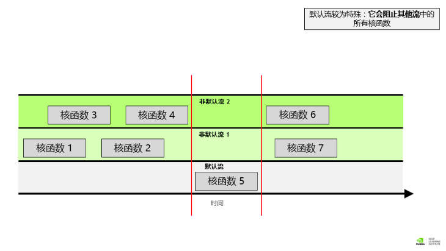
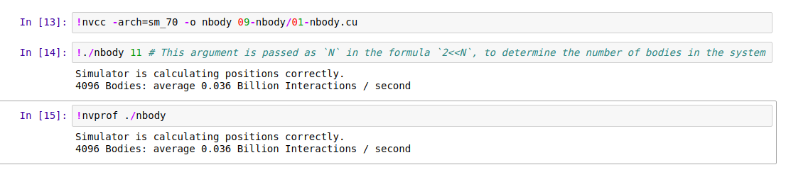

# GPU并行编程

##  __global__关键词

**global**关键字表明以下函数将在 GPU 上运行并可全局调用，而在此种情况下，则指由 CPU 或 GPU 调用。

- 通常，我们将在 CPU 上执行的代码称为**主机**代码，而将在 GPU 上运行的代码称为**设备**代码。
- 注意返回类型为 `void`。使用 `__global__` 关键字定义的函数需要返回 `void` 类型。

## GPUFunction<<<线程块数, 线程数>>>();

- 通常，当调用要在 GPU 上运行的函数时，我们将此种函数称为**已启动**的**核函数**。
- 启动核函数时，我们必须提供**执行配置**，即在向核函数传递任何预期参数之前使用 `<<< ... >>>` 语法完成的配置。
- cuda中会对线程分组，在核函数中定义线程块数与线程数，程序会把函数放到所有线程中执行一次，所以同样一份代码，一共会执行 **线程块数×线程数** 次

## Thread and Block Indices
- 每个线程在其线程块内部均会被分配一个索引，从 0 开始。此外，每个线程块也会被分配一个索引，并从 0 开始。正如线程组成线程块，线程块又会组成网格，而网格是 CUDA 线程层次结构中级别最高的实体。简言之，CUDA 核函数在由一个或多个线程块组成的网格中执行，且每个线程块中均包含相同数量的一个或多个线程。
- 线程块包含的线程具有数量限制：确切地说是 1024 个。为增加加速应用程序中的并行量，我们必须要能在多个线程块之间进行协调。

- CUDA **核函数可以访问**能够识别如下两种索引的特殊变量：正在执行核函数的线程（位于线程块内）索引和线程所在的线程块（位于网格内）索引。这两种变量分别为` threadIdx.x` 和` blockIdx.x`。

- CUDA 核函数可以访问给出块中线程数的特殊变量：`blockDim.x`。通过将此变量与 `blockIdx.x` 和 `threadIdx.x` 变量结合使用，并借助惯用表达式 `threadIdx.x + blockIdx.x * blockDim.x` 在包含多个线程的多个线程块之间组织并行执行，并行性将得以提升。

- **注意**：在使用cuda线程与相应数据对应时，如果线程数多于数据数，那么多的一部分线程因为无法得到数据可能永远阻塞等待数据，导致程序无法退出。所以，需要保证**线程数小于数据数**，

- 当线程数与数据数量无法做完美匹配时，可以通过以下方式轻松解决这种情况：

  - 编写执行配置，使其创建的线程数**超过**执行分配工作所需的线程数。
  - 将值作为参数传递到核函数 (`N`) 中，以表示要处理的数据集总大小或完成工作所需的总线程数。
  - 计算网格内的线程索引后（使用 `tid+bid*bdim`），请检查该索引是否超过 `N`，并且只在不超过的情况下执行与核函数相关的工作。

  以下是编写执行配置的惯用方法示例，适用于 `N` 和线程块中的线程数已知，但无法保证网格中的线程数和 `N` 之间完全匹配的情况。如此一来，便可确保网格中至少始终拥有 `N` 所需的线程数，且超出的线程数至多仅可相当于 1 个线程块的线程数量：

  ```cpp
  // Assume `N` is known
  int N = 100000;
  
  // Assume we have a desire to set `threads_per_block` exactly to `256`
  size_t threads_per_block = 256;
  
  // Ensure there are at least `N` threads in the grid, but only 1 block's worth extra
  size_t number_of_blocks = (N + threads_per_block - 1) / threads_per_block;
  
  some_kernel<<<number_of_blocks, threads_per_block>>>(N);
  ```

  由于上述执行配置致使网格中的线程数超过 `N`，因此需要注意 `some_kernel` 定义中的内容，以确保 `some_kernel` 在由其中一个 \”extra\” 线程执行时不会尝试访问超出范围的数据元素：

  ```cpp
  __global__ some_kernel(int N)
  {
    int idx = threadIdx.x + blockIdx.x * blockDim.x;
  
    if (idx < N) // Check to make sure `idx` maps to some value within `N`
    {
      // Only do work if it does
    }
  }
  ```

## cudaDeviceSynchronize()

- 与许多 C/C++ 代码不同，核函数启动方式为**异步**：CPU 代码将继续执行*而无需等待核函数完成启动*。
- 调用 CUDA 运行时提供的函数 `cudaDeviceSynchronize` 将导致主机 (CPU) 代码暂作等待，直至设备 (GPU) 代码执行完成，才能在 CPU 上恢复执行。
- CPU线程进程中必须调用****等待GPU中的代码完成执行才能得到其输出。

## cuda内存分配

- CUDA 的最新版本（版本 6 和更高版本）已能轻松分配可用于 CPU 主机和任意数量 GPU 设备的内存。

- 如要分配和释放内存，并获取可在主机和设备代码中引用的指针，请使用 `cudaMallocManaged` 和 `cudaFree` 取代对 `malloc` 和 `free` 的调用，如下例所示：

  ```cpp
  // CPU-only
  
  int N = 2<<20;
  size_t size = N * sizeof(int);
  
  int *a;
  a = (int *)malloc(size);
  
  // Use `a` in CPU-only program.
  
  free(a);
  ```

  ```cpp
  // Accelerated
  
  int N = 2<<20;
  size_t size = N * sizeof(int);
  
  int *a;
  // Note the address of `a` is passed as first argument.
  cudaMallocManaged(&a, size);
  
  // Use `a` on the CPU and/or on any GPU in the accelerated system.
  
  cudaFree(a);
  ```


## Data Sets Larger then the Grid

出于需要，一个网格中的线程数量可能会小于数据集的大小。请思考一下包含 8 个元素的数组和包含 4 个线程的网格（此处使用极小的规模以便于说明）。此网格中的每个线程将需使用 2次。如要实现此操作，一种常用方法便是在核函数中使用**网格跨度循环**。

在网格跨度循环中，每个线程将在网格内使用 `tid+bid*bdim` 计算自身唯一的索引，并对数组内该索引的元素执行相应运算，然后将网格中的线程数添加到索引并重复此操作，直至超出数组范围。

简而言之：四个线程有8个任务，那么正好每个线程需要执行两次任务。以线程2为例（下标从0开始），首先执行第2个任务；然后跨越一个grid size 4，2+4=6，执行第6号任务；重复这个过程，下次执行2+4*2=10号任务，10已经大于9，所以线程2的任务结束。对于0，1，3也是相同的操作。

CUDA 提供一个可给出网格中线程块数的特殊变量：`gridDim.x`。然后计算网格中的总线程数，即网格中的线程块数乘以每个线程块中的线程数：`gridDim.x * blockDim.x`。带着这样的想法来看看以下核函数中网格跨度循环的详细示例（这个代码因为放在不同的线程中执行得到不同的编号，所以仅仅一个循环就可以，如果时单处理器就需要两重循环）：

```cpp
__global void kernel(int *a, int N)
{
  int indexWithinTheGrid = threadIdx.x + blockIdx.x * blockDim.x;
  int gridStride = gridDim.x * blockDim.x;

  for (int i = indexWithinTheGrid; i < N; i += gridStride)
  {
    // do work on a[i];
  }
}
```


## Error Handling

- 与在任何应用程序中一样，加速 CUDA 代码中的错误处理同样至关重要。即便不是大多数，也有许多 CUDA 函数（例如，[内存管理函数](http://docs.nvidia.com/cuda/cuda-runtime-api/group__CUDART__MEMORY.html#group__CUDART__MEMORY)）会返回类型为 `cudaError_t` 的值，该值可用于检查调用函数时是否发生错误。

- 启动定义为返回 `void` 的核函数后，将不会返回类型为 `cudaError_t` 的值。为检查启动核函数时是否发生错误（例如，如果启动配置错误），CUDA 提供 `cudaGetLastError` 函数，该函数会返回类型为 `cudaError_t` 的值。

```cpp
/*
 * This launch should cause an error, but the kernel itself
 * cannot return it.
 */

someKernel<<<1, -1>>>();  // -1 is not a valid number of threads.

cudaError_t err;
err = cudaGetLastError(); // `cudaGetLastError` will return the error from above.
if (err != cudaSuccess)
{
  printf("Error: %s\n", cudaGetErrorString(err));
}
```

- 最后，为捕捉异步错误（例如，在异步核函数执行期间），请务必检查后续同步 CUDA 运行时 API 调用所返回的状态（例如 `cudaDeviceSynchronize`）；如果之前启动的其中一个核函数失败，则将返回错误。

```cpp
cudaError_t syncErr, asyncErr;

syncErr = cudaGetLastError();
asyncErr = cudaDeviceSynchronize();

/*
 * Print errors should they exist.
 */

if (syncErr != cudaSuccess) printf("Error: %s\n", cudaGetErrorString(syncErr));
if (asyncErr != cudaSuccess) printf("Error: %s\n", cudaGetErrorString(asyncErr));
```


## nvprof使用

`nvprof` 是指 NVIDIA 命令行分析器。该分析器附带于CUDA工具包中，能为加速应用程序分析提供强大功能。

`nvprof` 使用起来十分简单，最基本用法是向其传递使用 `nvcc` 编译的可执行文件的路径。随后 `nvprof` 会继续执行应用程序，并在此之后打印应用程序 GPU 活动的摘要输出、CUDA API 调用以及**统一内存**活动的相关信息。


## Streaming Multiprocessors and Querying the Device

运行 CUDA 应用程序的 GPU 具有称为**流多处理器**（或 **SM**）的处理单元。在核函数执行期间，将线程块提供给 SM 以供其执行。为支持 GPU 执行尽可能多的并行操作，您通常可以*选择线程块数量数倍于指定 GPU 上 SM 数量的网格大小*来提升性能。

### Programmatically Querying GPU Device Properties

由于 GPU 上的 SM 数量会因所用的特定 GPU 而异，因此为支持可移植性，您不得将 SM 数量硬编码到代码库中。相反，应该以编程方式获取此信息。

以下所示为在 CUDA C/C++ 中获取 C 结构的方法，该结构包含当前处于活动状态的 GPU 设备的多个属性，其中包括设备的 SM 数量：

```cpp
int deviceId;
cudaGetDevice(&deviceId);                  // `deviceId` now points to the id of the currently active GPU.

cudaDeviceProp props;
cudaGetDeviceProperties(&props, deviceId); // `props` now has many useful properties about
                                           // the active GPU device.
```

```cpp
int numberOfSMs; //获取sm处理器数量
cudaDeviceGetAttribute(&numberOfSMs, cudaDevAttrMultiProcessorCount, deviceId);

```


## Asynchronous Memory Prefetching

在主机到设备和设备到主机的内存传输过程中，我们使用一种技术来减少页错误和按需内存迁移成本，此强大技术称为**异步内存预取**。通过此技术，程序员可以在应用程序代码使用统一内存 (UM) 之前，在后台将其异步迁移至系统中的任何 CPU 或 GPU 设备。此举可以减少页错误和按需数据迁移所带来的成本，并进而提高 GPU 核函数和 CPU 函数的性能。

此外，预取往往会以更大的数据块来迁移数据，因此其迁移次数要低于按需迁移。此技术非常适用于以下情况：在运行时之前已知数据访问需求且数据访问并未采用稀疏模式。

CUDA 可通过 `cudaMemPrefetchAsync` 函数，轻松将托管内存异步预取到 GPU 设备或 CPU。以下所示为如何使用该函数将数据预取到当前处于活动状态的 GPU 设备，然后再预取到 CPU：

```cpp
int deviceId;
cudaGetDevice(&deviceId);                                         // The ID of the currently active GPU device.

cudaMemPrefetchAsync(pointerToSomeUMData, size, deviceId);        // Prefetch to GPU device.
cudaMemPrefetchAsync(pointerToSomeUMData, size, cudaCpuDeviceId); // Prefetch to host. `cudaCpuDeviceId` is a
                                                                  // built-in CUDA variable.
```

**注意**: 预存取函数只能在`cudaMallocManaged(&a, size);`之后，即分配内存之后使用，不然预存取不会产生任何效果。


这分代码避免了CPU与GPU的内存分配。

```cpp
#include <stdio.h>

void initWith(float num, float *a, int N)
{
  for(int i = 0; i < N; ++i)
  {
    a[i] = num;
  }
}

__global__
void addVectorsInto(float *result, float *a, float *b, int N)
{
  int index = threadIdx.x + blockIdx.x * blockDim.x;
  int stride = blockDim.x * gridDim.x;

  for(int i = index; i < N; i += stride)
  {
    result[i] = a[i] + b[i];
  }
}

void checkElementsAre(float target, float *vector, int N)
{
  for(int i = 0; i < N; i++)
  {
    if(vector[i] != target)
    {
      printf("FAIL: vector[%d] - %0.0f does not equal %0.0f\n", i, vector[i], target);
      exit(1);
    }
  }
  printf("Success! All values calculated correctly.\n");
}

int main()
{
  int deviceId;
  int numberOfSMs;

  cudaGetDevice(&deviceId);
  cudaDeviceGetAttribute(&numberOfSMs, cudaDevAttrMultiProcessorCount, deviceId);
  printf("Device ID: %d\tNumber of SMs: %d\n", deviceId, numberOfSMs);

  const int N = 2<<24;
  size_t size = N * sizeof(float);

  float *a;
  float *b;
  float *c;

  //首先分配内存
  cudaMallocManaged(&a, size);
  cudaMallocManaged(&b, size);
  cudaMallocManaged(&c, size);
    
  //预存到CPU中，方便后序的初始化，减少缺页错误
  cudaMemPrefetchAsync(a, size, cudaCpuDeviceId);
  cudaMemPrefetchAsync(b, size, cudaCpuDeviceId);
  cudaMemPrefetchAsync(c, size, cudaCpuDeviceId);
    
  //CPU中初始化数据
  initWith(3, a, N);
  initWith(4, b, N);
  initWith(0, c, N);
    
  //预存到GPU中，减少GPU中的缺页错误
  cudaMemPrefetchAsync(a, size, deviceId);
  cudaMemPrefetchAsync(b, size, deviceId);
  cudaMemPrefetchAsync(c, size, deviceId);

  size_t threadsPerBlock;
  size_t numberOfBlocks;

  threadsPerBlock = 256;
  numberOfBlocks = 32 * numberOfSMs;

  cudaError_t addVectorsErr;
  cudaError_t asyncErr;

  addVectorsInto<<<numberOfBlocks, threadsPerBlock>>>(c, a, b, N);

  addVectorsErr = cudaGetLastError();
  if(addVectorsErr != cudaSuccess) printf("Error: %s\n", cudaGetErrorString(addVectorsErr));

  asyncErr = cudaDeviceSynchronize();
  if(asyncErr != cudaSuccess) printf("Error: %s\n", cudaGetErrorString(asyncErr));

  /*
   * Prefetching can also be used to prevent CPU page faults.
   */

  cudaMemPrefetchAsync(c, size, cudaCpuDeviceId);
  checkElementsAre(7, c, N);

  cudaFree(a);
  cudaFree(b);
  cudaFree(c);
}

```


## Concurrent CUDA Streams

在 CUDA 编程中，**流**是按顺序执行的一系列命令。在 CUDA 应用程序中，核函数执行和一些内存传输均在 CUDA 流中进行。直至此时，您仍未正式使用 CUDA 流；但正如上次练习中 nvvp 时间轴所示，您的 CUDA 代码已在名为*默认流*的流中执行其核函数。

除默认流以外，CUDA 程序员还可创建并使用非默认 CUDA 流，此举可支持执行多个操作，例如在不同的流中并发执行多个核函数。多流的使用可以为您的加速应用程序带来另外一个层次的并行，并能提供更多应用程序优化机会。



**注意**：非默认流之间的核函数可以在时间上交叉执行，算是真正的并行，但是默认流的在执行核函数的时候会将非默认流的核函数阻断独占时间轴。


有关 CUDA 流行为的以下几项规则：

- 给定流中的操作会按序执行。
- 就不同非默认流中的操作而言，无法保证其会按彼此之间的任何特定顺序执行。
- 默认流会受到阻碍，并在其他所有流完成之后方可运行，但其亦会阻碍其他流的运行直至其自身已运行完毕。


### Creating, Utilizing, and Destroying Non-Default CUDA Streams

以下代码片段演示了如何创建、利用和销毁非默认 CUDA 流。请注意：如要在非默认 CUDA 流中启动 CUDA 核函数，必须将流作为执行配置的第 4 个可选参数进行传递。目前为止，您只使用了执行配置的前 2 个参数：

```cpp
cudaStream_t stream;       // CUDA streams are of type `cudaStream_t`.
cudaStreamCreate(&stream); // Note that a pointer must be passed to `cudaCreateStream`.

someKernel<<<number_of_blocks, threads_per_block, 0, stream>>>(); // `stream` is passed as 4th EC argument.

cudaStreamDestroy(stream); // Note that a value, not a pointer, is passed to `cudaDestroyStream`.
```

执行配置的第 3 个可选参数虽已超出本实验的学习范围，但仍值得一提。此参数允许程序员提供**共享内存**（目前不会涉及的高阶主题）的字节数，以便在此核函数启动时按块进行动态分配。按块分配给共享内存的默认字节数为 `0`，在本实验的余下练习中，您会将 `0` 作为此值进行传递以揭示极为重要的第 4 个参数：


## 技巧记录

线程块与线程数配置如下时，向量计算比较快

  threadsPerBlock = 512;
  numberOfBlocks = 8;


练习一的正确输出




```c
==326== NVPROF is profiling process 326, command: ./page-faults
==326== Profiling application: ./page-faults
==326== Profiling result:
No kernels were profiled.
            Type  Time(%)      Time     Calls       Avg       Min       Max  Name
      API calls:   99.64%  157.54ms         1  157.54ms  157.54ms  157.54ms  cudaMallocManaged
                    0.16%  253.98us        94  2.7010us     612ns  69.579us  cuDeviceGetAttribute
                    0.16%  248.18us         1  248.18us  248.18us  248.18us  cuDeviceTotalMem
                    0.03%  43.710us         1  43.710us  43.710us  43.710us  cudaFree
                    0.01%  17.238us         1  17.238us  17.238us  17.238us  cuDeviceGetName
                    0.00%  3.2830us         3  1.0940us     599ns  1.8030us  cuDeviceGetCount
                    0.00%  1.8200us         2     910ns     680ns  1.1400us  cuDeviceGet
```


# CV

NN的Python部署代码：

```python
import caffe
import cv2
import sys
import matplotlib.pyplot as plt
#import Image

def deploy(img_path):

    caffe.set_mode_gpu()
    MODEL_JOB_DIR = '/dli/data/digits/20180301-185638-e918'
    DATASET_JOB_DIR = '/dli/data/digits/20180222-165843-ada0'
    ARCHITECTURE = MODEL_JOB_DIR + '/deploy.prototxt'
    WEIGHTS = MODEL_JOB_DIR + '/snapshot_iter_735.caffemodel'
    
    # Initialize the Caffe model using the model trained in DIGITS.
    net = caffe.Classifier(ARCHITECTURE, WEIGHTS,
                           channel_swap=(2,1,0),
                           raw_scale=255,
                           image_dims=(256, 256))
                       
    # Create an input that the network expects. 
    input_image= caffe.io.load_image(img_path)
    test_image = cv2.resize(input_image, (256,256))
    mean_image = caffe.io.load_image(DATASET_JOB_DIR + '/mean.jpg')
    test_image = test_image-mean_image

 
    prediction = net.predict([test_image])
    
    #print("Input Image:")
    #plt.imshow(sys.argv[1])
    #plt.show()
    #Image.open(input_image).show()
    print(prediction)
    ##Create a useful output
    print("Output:")
    if prediction.argmax()==0:
        print "Sorry cat:( https://media.giphy.com/media/jb8aFEQk3tADS/giphy.gif"
    else:
        print "Welcome dog! https://www.flickr.com/photos/aidras/5379402670"
   

    
##Ignore this part    
if __name__ == '__main__':
    print(deploy(sys.argv[1]))
```


可以采取以下四种途径来**提高性能**。抽些时间来了解每种途径，最终将有助于提升您的模型性能。

1) **数据**- 足够巨大且多样的数据集，其代表模型应处的工作环境。数据加工本身就是一种艺术形式。

2) **超参数**- 更改学习率等类似选项就如同改变您的训练“风格”。寻找正确的超参数目前是一个通过试验来学习的手动过程。当您能够通过直觉判断出各种任务类型所适用的超参数时，您的模型性能便会提升。

3) **训练时间**- 增加训练次数可在一定程度上提高性能。某些时候，训练过多会导致过拟合（人类也会如此），所以您不能将其作为唯一的干预手段。 

4) **网络架构**- 我们将在下一节开始试验网络架构。我们将此列为最后一种途径是想打破一个谬论，即人们必须掌握网络架构才能利用深度学习解决问题。这一领域令人着迷且影响巨大，而您若想提升技能，则需研读数学知识。


选用的一个问题解决框架的方式如下所列：

- 确定他人是否已解决您的问题，若为此，则使用其模型
- 若为否，则确定他人是否已解决*类似*问题，若为此，则使用其网络和您本人数据
- 若为否，则确定您能否识别他人在解决您的问题时所存在的方案上的不足，并着力设计新网络
- 若为否，则使用现有解决方案和其他问题解决技术（如 python）来解决您的问题
- 无论方式为何，请继续试验并借助实验来提升您的技能组合


一些常见的输入-输出映射：

| 工作流程 | 输入                               | 输出                                                         |
| :------: | ---------------------------------- | :----------------------------------------------------------- |
| 图像分类 | 原始像素值                         | 一种向量，其中每个索引均对应于图像属于每个类别的概率         |
| 物体检测 | 原始像素值                         | 一种向量，带有图像中每个物体左上角和右下角的 (X,Y) 配对      |
| 图像分割 | 原始像素值                         | 分割为各个类的图像叠加，其中每个值代表该像素属于每一类别的概率 |
| 文本生成 | 每个“令牌”（词、字母等）的独有向量 | 表示最有可能出现的下一“令牌”的向量                           |
| 图像渲染 | 模糊图像的原始像素值               | 清晰图像的原始像素值                                         |