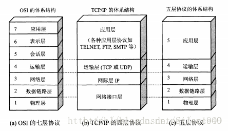
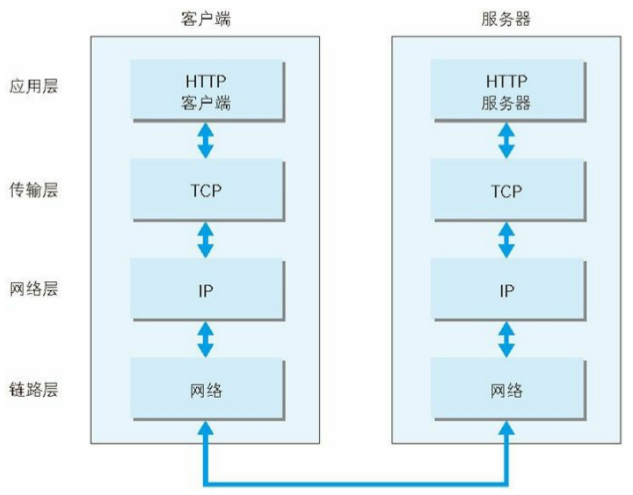
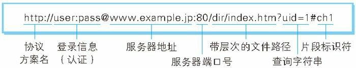

TCP/IP 协议族里重要的一点就是分层。TCP/IP 协议族按层次分别分为以下 4 层:

应用层、传输层、网络层和数据链路层。

应用层决定了向用户提供应用服务时通信的活动。
TCP/IP 协议族内预存了各类通用的应用服务。比如,FTP(File Transfer Protocol,文件传输协议)和 DNS(Domain Name System,域名系统)服务就是其中两类。HTTP 协议也处于该层。

传输层
传输层对上层应用层,提供处于网络连接中的两台计算机之间的数据传输。
在传输层有两个性质不同的协议:TCP(Transmission Control Protocol,传输控制协议)和 UDP(User Data Protocol,用户数据报协议)。

网络层(又名网络互连层)
网络层用来处理在网络上流动的数据包。数据包是网络传输的最小数据单位。该层规定了通过怎样的路径(所谓的传输路线)到达对方计算机,并把数据包传送给对方。与对方计算机之间通过多台计算机或网络设备进行传输时,网络层所起的作用就是在众多的选项内选择一条传输路线。

链路层(又名数据链路层,网络接口层)
用来处理连接网络的硬件部分。包括控制操作系统、硬件的设备驱动、NIC(Network Interface Card,网络适配器,即网卡),及光纤等物理可见部分(还包括连接器等一切传输媒介)。硬件上的范畴均在链路层的作用范围之内。

OSI 7层网络协议结构图

4,5,7层网络结构之间的关系

一个http的请求流图

浏览器发出一个请求后网络的工作层次图

URI 格式

- 使用 http: 或 https: 等协议方案名获取访问资源时要指定协议类型。不区分字母大小写,最后附一个冒号(:)。
  也可使用 data: 或 javascript: 这类指定数据或脚本程序的方案名。

- 登录信息(认证)：指定用户名和密码作为从服务器端获取资源时必要的登录信息(身份认证)。此项是可选项。

- 服务器地址：使用绝对 URI 必须指定待访问的服务器地址。地址可以是类似hackr.jp 这种 DNS 可解析的名称,或是 192.168.1.1 这类 IPv4 地址名,还可以是 [0:0:0:0:0:0:0:1] 这样用方括号括起来的 IPv6 地址名。

- 服务器端口号：指定服务器连接的网络端口号。此项也是可选项,若用户省略则自动使用默认端口号。
  带层次的文件路径：指定服务器上的文件路径来定位特指的资源。这与 UNIX 系统的文件
  目录结构相似。

- 查询字符串：针对已指定的文件路径内的资源,可以使用查询字符串传入任意参数。此项可选。

- 片段标识符：使用片段标识符通常可标记出已获取资源中的子资源(文档内的某个位置)。但在 RFC 中并没有明确规定其使用方法。该项也为可选项。

HTTP 协议规定,请求从客户端发出,最后服务器端响应该请求并返回。换句话说,肯定是先从客户端开始建立通信的,服务器端在没有接收到请求之前不会发送响应。

