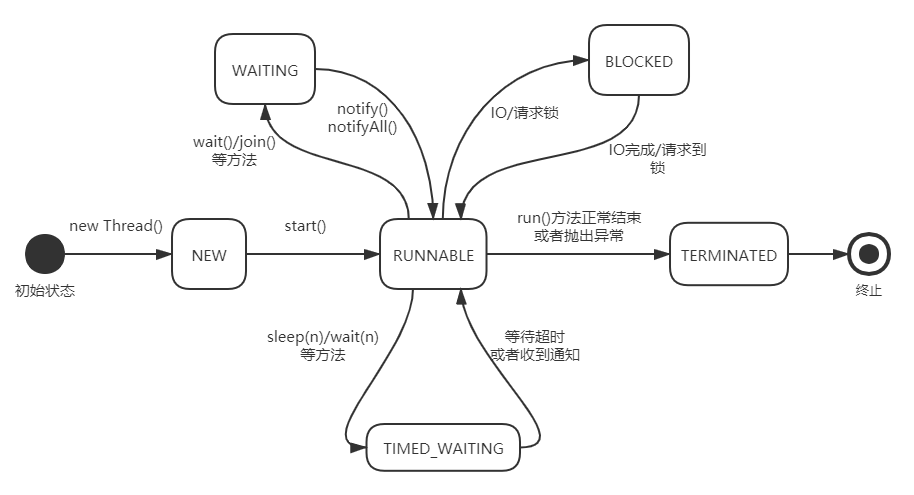
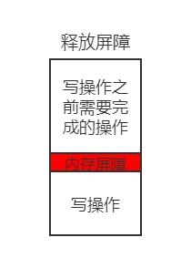

# 多线程基础及相关概念

## 线程的概念

线程可以理解为轻量级的进程，一个进程可以持有多个线程。进程是资源持有的单位，进程中的多个线程共享线程的资源。线程是CPU的调度单位。

Java中的线程具有以下特点：

- 线程属于一次性用品，一旦运行完毕，不可以再次调用start()函数。
- Java虚拟机会为每个线程分配调用栈（Call Stack）所需的内存空间。


## 线程的状态

**NEW**: 线程刚创建完成，在调用start方法前的状态。线程的生命周期中只会出现一次这个状态。

**RUNNABLE**：线程调用了start方法，准备就绪，等待CPU调度。

**BLOCKED**：线程被阻塞，可能是等待IO操作或者是请求锁。

**WAITING**：现在执行了某些方法，比如wait,join等，让线程陷入等待状态，等待通知。

**TIMED_WAITING**：与WAITING一样，WAITING可能是无限制等待，TIMED_WAITING等待超过时间上限会返回。

**TERMINATED**：线程任务执行完毕。run方法执行完毕或者抛出异常线程都将进入这个状态。线程的生命周期中只会出现一次这个状态。


### 状态转换图



## Runnable还是Thread子类

使用Thread的子类创建线程是一种基于继承的技术，通过这种方式，创建一个线程就需要虚拟机为其分配调用栈空间、内核线程等资源，成本比较高。但由于其独立性比较高，线程之间的运行不会出现错误结果。

使用Runnable创建线程是一种组合技术，组合相对继承来讲有更低的耦合性，因此也就更加灵活，一般认为组合是优先选项。但使用Runnable时可能出现正确性问题，因为所有线程示例都使用了同一个Runnable实例，当Runnable的定义中存在共享变量时，多个线程的操作可能会导致数据产生不一致。


# Java线程的同步机制

## 可见性

在多线程环境下，一个线程对共享变量进行更新之后，后续访问该变量的线程可能无法立即读取到这个更新之后的结果，甚至永远得不到这个更新之后的结果。可见性就是一个线程对共享变量的更新结果对于其他访问的线程立即可见。

产生可见性问题的原因在于：计算机的缓存结构（寄存器，高速缓存，内存）之间，为了提高访问速度，存在相同的数据副本，一旦数据更新，在没有触发某些事件的情况下，数据没有做全局更新（缓存同步），所以导致后续的访问可能仍然是旧值。


## 有序性

有序性：即程序执行的顺序按照代码的先后顺序执行。

Java内存模型中的程序天然有序性可以总结为一句话：如果在本线程内观察，所有操作都是有序的；如果在一个线程中观察另一个线程，所有操作都是无序的。前半句是指“线程内表现为串行语义”，后半句是指“指令重排序”现象和“工作内存主主内存同步延迟”现象。

有序性的语意有几层，
1. 最常见的就是保证多线程运行的串行顺序
2. 防止重排序引起的问题
3. 程序运行的先后顺序。比方JVM定义的一些Happens-before规则


## 原子性

原子性是指针对共享变量的操作，该操作对于线程来讲，要么是一次性做完，要么就像是什么都没有发生一样。


## 重排序

重排序是指编译器可能改变两个操作的先后顺序；处理器可能不是完全依照程序的目标代码所指定的顺序执行执行。另外，一个处理器上执行的多个操作，从其他处理器的角度来看，其顺序可能与目标代码所指定的顺序不一致。

**重排序是对内存访问相关操作所做的一种优化，可以在不影响单线程程序正确性的情况下提升程序的性能**


## 内部锁：synchronize关键词

Java平台中的任何一个对象都有唯一一个与之关联的锁，这种锁被称为监视器(Monitor)或者内部锁(Intrinsic Lock)。内部锁是一种互斥锁，能够保障原子性、有序性、可见性。

**内部锁的使用不会导致锁的泄露**(申请了锁L却没有释放锁L)，因为Java编译器对内部锁编译为字节码的时候，对临界区可以抛出而代码有没有处理的异常进行了特殊处理，使得该临界区中的代码在任何情况下都能保证锁的释放。

### 同步方法

同步方法指用synchronize关键词修饰的方法，这样的方法能够保证任意时刻，都只有唯一一个进程进入该方法体。

```java
class Klass {
    private int cnt;
    public synchronized void inc() { //整个函数都为临界区
        cnt++;
    }
}
```


###　同步代码块

当某个代码块被synchronize修饰时，则称其为同步代码块，在修饰代码块时，必须为synchronize关键词提供一个对象用户获取锁与释放锁。

当同步代码块在实例方法中时，通常给synchronize传入this即可，让其使用当前对象上的锁。

```java
class Klass {
    private int cnt;
    public void inc() {
        //do something
        synchronized(this) {
            //临界区
            cnt++;
        }
        //do something
    }
}
```

当同步代码块在静态方法中时(没有当前对象)，我们可以给synchronize传入当前类的class，因为class本身也是类。

```java
class Klass {
    private static int cnt;
    public static void inc() {
        //do something
        synchronized(Klass.class) {
            //临界区
            cnt++;
        }
        //do something
    }
}
```


除了为synchronize传入当前类的class对象或者其当前实例，synchronize也可以被传入任何实例对象。但通常要求传递给synchronize关键词的对象要用final修饰。形如：`private final Object lock = new Object()`，因为在代码的执行过程当中，一旦锁的对象被修改，那么该代码块也就同步在了不同的锁上，从而没法保障原子性、有序性、可见性。最终使得数据在多个线程方法的情况下无法保证一致性和正确性。

使用任意对象锁对象：

```java
class Klass {
    private static int cnt;
    private final String lock = "a lock object"
    public static void inc() {
        //do something
        synchronized(lock) {
            //临界区
            cnt++;
        }
        //do something
    }
}
```


### 内部锁的调度

内部锁仅支持非公平调度。虚拟机为每个内部锁分配一个入口集合(Entry Set)，记录正在等待该锁的线程，该集合中线程的状态为BLOCKED，当锁被释放时，虚拟机从集合中随机选取一个线程调度。


## 显示锁：Lock接口

同内部锁一样，显示锁同为一种互斥锁，能够保障相应的原子性、有序性、可见性。不同的是，显示锁提供了更丰富的接口，支持更灵活的操作和对锁的相关信息进行监控。

Lock mutex = new ReentrantLock(boolean fair)


### 显示锁常用的接口

| 返回类型  |              方法名               |                             作用                             |
| :-------: | :-------------------------------: | :----------------------------------------------------------: |
|   void    |              lock()               |                            获取锁                            |
|   void    |        lockInterruptibly()        |                如果当前线程未被中断，则获取锁                |
| Condition |          newCondition()           |           返回绑定到此Lock实例上的新Condition实例            |
|  boolean  |             tryLock()             |      尝试获取锁，如果成功获取则返回true，否则返回false       |
|  boolean  | tryLock(long time, TimeUnit unit) | 尝试在指定时间内且当前线程没被中断的情况下获取锁，获取成功则返回true，否则返回false |
|   void    |             unlock()              |                            释放锁                            |


### 模板代码

显示锁的使用模板：

```java
private final Lock mutex = new ReentrantLock();
mutex.lock();
try {
    //临界区代码块
} finally {
    mutex.unlock(); //unlock总是放在finally块中，避免因为临界区中代码发生异常而导致锁泄露
}
```


使用tryLock()的模板：

```java
private final Lock mutex = new ReentrantLock();
if (mutex.tryLock()) {
    //成功获取锁
    try {
        //临界区代码块
    } finally {
        mutex.unlock(); //unlock总是放在finally块中，避免因为临界区中代码发生异常而导致锁泄露
    }
} else {
    //获取锁失败，执行其他操作
}


```


### 显示锁的调度

ReentranLock既支持非公平锁也支持公平锁调度，默认为非公平锁，但可以通过构造函数传入参数设置。公平锁的调度的公平性往往增加了线程暂停和唤醒的可能性，既上下文切换代价。

**公平锁的适用场景：**适合于锁被持有时间相对长或者线程申请锁的平均时间间隔较长的情况。避免出现饥饿现象。


## 读写锁

读写锁是一种改进型排他锁，允许多个线程同时进行读操作，但仅允许一个线程进行写操作，存在读操作时不可写，反之亦然。

### 读写锁的使用方法

```java
private final ReadWriteLock readWriteLock = new ReentrantReadWriteLock();
private final Lock rlock = readWriteLock.readLock();
private final Lock wlock = readWriteLock.writeLock();

public void reader() {
    rlock.lock();
    try {
        //read
    } finally {
        rlock.unlock();
    }
}

public void writer() {
    wlock.lock();
    try {
        //write
    } finally {
        wlock.unlock();
    }
}
```

### 读写锁使用场景

- 只读操作比写操作要频繁
- 读线程持有锁的时间比较长


## 内部锁与显示锁的比较

1. **调度公平性**：显示锁默认为非公平锁，但可以通过传入参数设置为公平锁。

2. **锁的性能**：设置为公平调度的显示锁，其背后存在更多的线程上下文切换开销，性能不如非公平锁、内部锁。

3. **使用便捷性**：内部锁的申请与释放只能在一个方法上或者方法内部进行，简单易用，不存在锁泄露的问题；显   示锁使用更加灵活，可以跨方法申请与释放锁，但过程需要程序员自己把控，使用不好存在锁泄露的可能性。


## 内存屏障

内存屏障(Memery Barrier/Fence)是被插入到两个指令序列之间使用的，其作用是进制编译器、处理器对指令重排序，从而保证有序性。内存屏障在两个指令之间就如一个屏障一样隔绝两条指令。


### 内存屏障的分类

#### 按可见性保障划分

- 加载屏障(Load Barrier)：作用为从内存中加载数据刷新处理器缓存

- 存储屏障(Story Barrier)：作用为将处理器缓存中的数据冲刷到内存。

#### 按有序性保障划分

- 获取屏障(Aquire Barrier)

  获取屏障的使用方式是在一个**读操作之后**插入内存屏障，其作用是禁止该读操作与**其后面的任何读写**操作进行重排序。**保证操作所访问的数据是最新的**

  

- 释放屏障(Release Barrier)

  释放屏障的使用方式是在一个**写操作之前**插入内存屏障，其作用是禁止该读操作与**其前面的任何读写**操作进行重排序。**保证对数据的操作都结束之后，才会进行写入操作**

  

### 内存屏障对synchronize的保障

从下图可以看出：

- 在进入synchronize代码块时，系统为了保证临界区访问到的是相对较新的数据，使用了**加载屏障**来更新数据，并使用**获取屏障**来防止代码重拍下保证只有在数据加载完毕之后才能进行相关的数据操纵。
- 退出临界区时，内存屏障做了进入临界区的相反操纵，首先用**释放屏障**隔绝前面访问数据的代码与后面写入数据到内存的代码（**存储屏障**），保证退出临界区后，其他进程能从内存中得到修改后的数据。


### 内存屏障对volatile的保障

volatile修饰的变量一般作为通知信息的变量，在多线程环境下，如何保证通知变量在逻辑上的正确性（防止被重排序）以及变量的值一定是最新的值（可见性），通过内存屏障的配合使用，能达成相应目标。


内存屏障对**写volatile变量**的保护：

**写volatile变量操作与该操作之前的任何读、写操作不会被重排序。**


内存屏障对**读volatile变量**的保护：

**读volatile变量操作与该操作之后的任何读、写操作不会被重排序。**


## volatile关键词

volatile字面意思即为**易变的**，在多线程环境下，虚拟机可以保障使用volatile修饰的变量可见性，顺序性和long/double读写操作的原子性（64为虚拟机下，double/long不用volatile已经可以得到原子性保证）。

**注意**：volatile仅仅保障对其修饰变量的读写操作本身的原子性，并不表示对volatile变量的整个复制操作一定具有原子性。如果是对于引用类型变量的修饰，volatile关键词只是保证线程能够读取到一个指向对象的相对新的内存地址（引用），但对这个地址指向对象实例的值本身是否较新并没有保证。

例如：表达式`volatileVar = sharedVar+1`，sharedVar为共享变量，在表达式赋值的同时，可能有其他线程修改了该变量的子，也就失去了原子性。


### volatile的开销

volatile修饰的变量的开销介于普通变量与加锁变量之间。因为volatile变量没有锁，不存在上下文切换过程，所以比加锁的操纵更快；但因为volatile需要通过内存屏障保证变量的可见性与有序性，导致编译器对指令的优化不及普通变量，所以其性能低于普通变量。


### volatile的适用场景

- 使用volatile修饰的变量作状态标志
- 使用volatile变量替换锁：利用volatile变量的读写操纵具有原子性，可以把一组volatile变量封装成一个对象，那么对这些变量的更新操作就能通过新建一个对象，并替换掉就对象的引用来实现。这个过程中保证了原子性和可见性，从而避免了锁的使用。


## 单例模式

单例模式保证在同一个运行时环境下，一个单例类只存在唯一对象实例。


下面看看单例模式常见的实现方式：

### 加锁方式

```java
class Singleton {
    private static Singleton instance = null;
    private Singleton() {
        //定义私有构造函数禁止外部调用产生新实例
    }

    /**
     * 定义synchronized修饰的公开方法，保证在多线程环境下，
     * 所有需要该类对象的代码通过调用这个函数取得正确的对象实例
     */
    public synchronized Singleton getInstance() {
        if (instance == null) { //如果首次被调用，创建对象
            instance = new Singleton();
        }
        //返回实例
        return instance;
    }
}
```

这个实现可以保证线程安全，但有一个缺点在于，每次拿取实例都需要申请和释放锁，需要较大开销。为了避免这种开销，人们提出了一种新的方法（双重检查锁定），在要进入临界区前先判断实例是不是为null，为null才需要进入临界区生成对象，否则直接返回实例对象。

### 双重检查锁定

```java
class Singleton {
    private static Singleton instance = null;
    private Singleton() {
        //定义私有构造函数禁止外部调用产生新实例
    }

    /**
     * 定义synchronized修饰的公开方法，保证在多线程环境下，
     * 所有需要该类对象的代码通过调用这个函数取得正确的对象实例
     */
    public Singleton getInstance() {
        //如果为null，进入临界区生成对象
        if (instance == null) {         //#1
            synchronized(Singleton.class) {
                //进入临界区之后再次做判读，因为存在情况：
                //线程A，B都进入#1的if，此时，线程A进入临界区创建实例并返回，
                //线程B进入临界区不做判断的话，直接执行new，会再次产生一个对象，
                //破坏了模式
                if (instance == null) { //#2
                    instance = new Singleton();
                }
            }
        }
        //返回实例
        return instance;
    }
}
```


双重检查锁定方法避免了频繁的请求锁、释放锁操作。但是因为`#1`判断语句，**可能导致用户拿到的是一个为初始化的对象**。

我们看看一个new一个对象的过程，当执行`ObjectA  objA = new ObjectA()`时，实际上分为一下三个子步骤：

- 步骤一：`objRef = allocate(ObjectA.class);` 分配对象所需空间
- 步骤二：`invokeConstructor(objRef);` 调用构造函数初始化对象
- 步骤三：`objA = objRef;` 将对象引用写入变量objA

由于重排序的原因，步骤二和步骤三的顺序可能被交换，导致用户虽然拿到了一个为对象，但对象还没来得及初始化。该现象发生的时间点在：线程A进入临界区执行`instance = new Singleton();`，指令被重排序先执行了步骤三，还没来得及执行步骤二；这时线程B进入函数执行第一个判断语句`#1`，instance并不为空，直接返回对象，是未初始化的对象。

解决方法是对instance变量用volatile修饰，下面是正确的双重检查锁定单例模式：

### 正确的双重检查锁定

```java
class Singleton {
    //防止重排序
    private static volatile Singleton instance = null;
    private Singleton() {
        //定义私有构造函数禁止外部调用产生新实例
    }

    /**
     * 定义synchronized修饰的公开方法，保证在多线程环境下，
     * 所有需要该类对象的代码通过调用这个函数取得正确的对象实例
     */
    public Singleton getInstance() {
        //如果为null，进入临界区生成对象
        if (instance == null) {         //#1
            synchronized(Singleton.class) {
                //进入临界区之后再次做判读，因为存在情况：
                //线程A，B都进入#1的if，此时，线程A进入临界区创建实例并返回，
                //线程B进入临界区不做判断的话，直接执行new，会再次产生一个对象，
                //破坏了模式
                if (instance == null) { //#2
                    instance = new Singleton();
                }
            }
        }
        //返回实例
        return instance;
    }
}
```


### 使用静态变量实现单例模式

```java
class Singleton {
    private static Singleton instance = null;
    private Singleton() {}
    public static Singleton getInstance() {
        return instance;
    }
}
```


### 使用静态内部类实现的单例模式

```java
class Singleton {
    private Singleton() {}
    static class InstanceHolder {
        final static Singleton instance = new Singleton();
    }
    public static Singleton getInstance() {
        return InstanceHolder.instance;
    }
}
```


## CAS与原子变量

CAS(Compare And Swap)是对一种处理器指令的称呼，对于一些比较简单的原子操作，选择CAS来处理具有比加锁更好的性能。CAS能够将read-modify-write和check-and-act之类的操作转换为原子操作。


### CAS背后的逻辑

```java
bool CAS(variable var, Object oldVal, Object newVal) {
	if (var == oldVal) { //check 检查变量值是否被其他线程修改过
        var.set(newVal); //act   更新变量值
        return true;     //更新成功
    }
    return false;        //更新失败
}
```


### 使用CAS实现一个原子自增操作

在使用CAS时，需要注意两点：

- CAS仅仅保障共享变量更新操作的原子性，它并不保障可见性，所以使用CAS的变量需要使用volatile修饰。
- 对变量的更新操作必须放在一个循环中。因为在一次值更新过程中，发现原有的值已经被其他线程修改过，导致这次更新失败，必须下次再来，直到更新成功。

```java
class CASBasedCounter {
    private volatile long count; //一定要使用volatile修饰
    private final AtomicLongFieldUpdater<CASBasedCounter> fieldUpdater;

    public CASBasedCounter() throws SecurityException, NoSuchFieldException {
        //告诉需要更新的变量名字, 底层代码实现通过名字找到变量所在的内存偏移
        fieldUpdater = AtomicLongFieldUpdater.newUpdater(CASBasedCounter.class, "count");
    }

    public long vaule() {
        return count;
    }

    public void increment() {
        long oldValue, newValue;
        //更新值需要放到循环中处理
        do {
            oldValue = count;       // 读取共享变量当前值
            newValue = oldValue + 1;// 计算共享变量的新值
        } while (/* 调用CAS来更新共享变量的值 */!compareAndSwap(oldValue, newValue));
    }

    //该方法是个实例方法，且共享变量count是当前类的实例变量，因此这里我们没有必要在方法参数中声明一个表示共享变量的参数
    private boolean compareAndSwap(long oldValue, long newValue) {
        //调用系统实现的CAS, CAS最底层的代码为本地方法实现
        boolean isOK = fieldUpdater.compareAndSet(this, oldValue, newValue);
        return isOK;
    }
}
```


### CAS中的ABA问题

在CAS对变量进行更新的时候可能出现这样一种问题：假如有三个线程TA,TB,TC，变量的初始值为A，线程TA要将Ａ值修改B值，在TA读了A值还没来得及修改成Ｂ值时，线程TB抢先把Ａ值修改为其他值，然后TC又把其他值修改回Ａ值。在这个场景下，TA误认为A值还是原理的A值，可以进行操作，但实际上A是经过修改过后的值。

针对这种问题，设计者为变量引入了一个修订号（也称时间戳），变量每被修改一次，修订号就增加1，这样就能清楚的判定变量是否被修改过。AtomicStampedReference类就是基于这种思想的一个实现类。


### 原子变量类

原子变量类是基于CAS实现的能够保证对共享变量进行read-modify-write更新操作原子性和可见性的一组工具类。原子变量一共有12个可分为四组，具体如下：

|     分组     |                              类                              |
| :----------: | :----------------------------------------------------------: |
| 基础数据类型 |            AtomicInteger/AtomicLong/AtomicBoolean            |
|    数组型    |   AtomicIntegerArray/AtomicLongArray/AtomicReferenceArray    |
|  字段更新器  | AtomicIntegerFeildUpdater/AtomicLongFeildUpdater/AtomicReferenceFeildUpdater |
|    引用型    | AtomicReference/AtomicStampedReference/AtomicMarkableReference |


## 对象的初始化安全：static与final

一个类被Java虚拟机加载之后，该类的所有静态变量值仍然都是其默认值（数值类全为0，引用类全为null，布尔类全为false），直到有个线程初次访问了该类的任意一个静态变量才使得这个类被初始化-类的静态代码块`static {}`被执行，类的所有静态变量被赋予初始值。


**static**关键词能够保证一个线程即使在未使用同步机制的情况下也总是可以读到一个类的静态变量初始化之后的值，而非默认值（包括引用类型变量，保证所引用的对象已经初始化完毕）。但这种可见性的保障仅限于线程初始读取该变量的值。后续如果有对变量进行更改，仍然需要同步机制。


**final**修饰的变量保证在其他线程中访问这些变量时，无论是简单变量还是引用变量，都是初始化之后的值（一种有序性保障）。


# 线程间的协作

多线程编程中，不同的线程之间往往需要相互协作共同完成一个任务，不同的线程之间如何进行协作，Java提供了相关的处理机制。


## wait

一个线程因其执行目标操作所需要的保护条件未满足而被暂停的过程就被称为等待（**wait**）。执行Object.wait()后，其执行线程被暂停，生命周期的状态转换为WAITING。

### 使用wait的模板代码

在执行wait()的对象与临界区加锁的对象为同一对象时（**必须满足此条件，否则会报`java.lang.IllegalMonitorStateException`异常**），可以根据需求将wait()放在代码中的任何位置，以达到暂停线程的目的。


通常情况下，使用wait函数时候的代码形式如下：

```java
synchronize (someObject) {
    while (保护条件不成立) {
        someObject.wait(); //让线程等待
    }
    doActions();  //条件已经满足，执行后续操作
}
```

对于以上模板代码：

1. **线程只有在持有一个对象内部锁的情况下，才能够调用这个对象的wait()方法**，也就是synchronize中的对象与wait所属的对象必须为同一对象，在模板代码中表现为第一行的someObject与第三行的someObject必须相同，否则虚拟机会报`java.lang.IllegalMonitorStateException`异常。Object.wait()总是在临界区以内。
2. 同一对象的同一个方法可以被多个线程执行，因此在**一个对象上可能存在多个等待线程**（对个线程调用的该对象上的wait方法）。
3. **wait方法会以原子操作模式暂停当前执行线程并释放当前对象的内部锁**，此时wait方法并没有返回。
4. 被唤醒的线程需要在再次获取内部锁的情况下（暂停线程时释放了内部锁），才能继续执行wait方法中剩余的指令，直到wait方法返回。
5. **保护条件的判断与wait方法总是应该放在临界区的一个循环中**。因为存在这样的情况：在线程被唤醒后，可能存在其他线程修改了保护条件再次不成立，因此，通过循环在wait方法返回后再次判断条件，成立的情况下才继续执行后面的doActions，保证程序的正确性。


### wait方法的背后的逻辑

```java
public void wait() {
    if (!Thread.holdsLock(this)) //若果线程没有持有对象内部锁调用wait,抛出异常
        throws new IllegalMonitorStateException();

    if (当前对象不在等待集中)
        addWaitSet(Thread.concurrentThread());//将当前线程假如等待集

    //原子操作
    atomic {
        releaseLock(this); //释放当前对象内部锁
        block(Thread.concurrentThread());//暂且当前线程
    }

    aquireLock(this); //再次申请当前对象内部锁
    removeFromWaitSet(Thread.concurrentThread());//将线程从当前对象等待集中移除
}
```


wait方法流程图


## notify/notifyAll

一个线程更新了系统的状态，使得其他线程所需要的保护条件得以满足的时候唤醒哪些被暂停线程的过程就被称为通知（**notify**）

- **notify()**唤醒相应对象上等待的**任意一个线程**。
- **notifyAll()**唤醒相应对象上等待的**所有线程**。
- **等待线程和通知线程必须调用同一个对象wait系列方法、notify系列方法**才能正确实现等待与通知。


### 使用notify的模板代码

```java
synchronize (someObject) {
    updateState();       //更新等待线程涉及的共享变量
    someObject.notify(); //唤醒其他线程
}
```

1. **线程只有在持有一个对象内部锁的情况下才能够调用该对象的notify方法**。
2. 由于”线程只有在持有一个对象内部锁的情况下才能够调用该对象的notify方法“，所以要求Object.wait()暂停其执行线程的同时，必须释放相应的内部锁，否则线程无法执行通知操作。
3. notify本身不会释放线程持有的对象内部锁，因此线程在执行完notify之后应保证释放了对象的内部锁。


## wait/notify可能存在的问题

保护条件、同步对象、wait、notifyAll之间的关系结构图。


- 过早唤醒：当多个线程同步在一个对象上，且通知线程使用了notifyAll发出通知时，可能发生过早唤醒的问题。因为notifyAll一次性通知了所有的等待线程，线程唤醒之后，如果保护条件满足，则可以正常向下执行。但如果被唤醒的线程使用的保护条件并不满足的话，该线程仍然需要继续等待条件满足。

  如上图：W1，W2，W3等待在同步对象someObject上，W1，W2使用相同`保护条件1`，W3使用`保护条件2`，N1更新能`保护条件1`，且通知所有等待线程。当N1发出通知值，W1，W2，W3均被唤醒，但只有W1，W2的保护条件成立，可以正常向后执行；当W3的保护条件并不成立，需要继续等待。

- 信号丢失：线程执行wait方法时，没有对共享条件进行检测，在通知线程已经发出了通知且共享条件已经满足的情况下仍然执行了wait方法。这种情况下线程将无休止等待，知道收到下一次通知。对于这种场景，只要将对保护条件的判读和wait方法放在一个循环语句中就可以避免信号丢失的问题。

  信号丢失的另一个场景是本该调用notifyAll的地方却调用了notify，导致通知信号没法通知所有等待线程。这种是代码的错误，编程的时候需要提高注意。

- 欺骗性唤醒：等待线程可能在没有任何其他线程执行notify、notifyAll方法的情况下被唤醒。出现这种问题的概率极低，同时操作系统也允许这样的错误出现。同样，将将对保护条件的判读和wait方法放在一个循环语句中就可以避免。


## wait/notify开销

wait与notify都是在临界区中运行，所以至少存在一次锁的申请与释放，而锁的申请与释放可能导致上下文的切换。无论是锁的申请与释放还是上下文切换都存在开销。

另外，过早唤醒会导致额外的上下文切换，因为过早唤醒的线程仍然要继续等待，即再次经历被暂停与唤醒的过程。因此，在保证程序正确性的前提下，使用notify替换notifyAll能减少上下文次数，从而降低开销。


## wait/notify示例

### 单缓冲区生产者-单消费者（两个线程交替执行）

思想为启动两个线程，设置一个状态变量标志当前任务应该就那个线程来完成，线程在开始任务前检查标志变量，判断是不是该它运行，如果是，则运行，然后修改状态变量，发送通知；否则，暂停线程，等待通知。

```java
public class Test {
    private static volatile String order = "A"; //共享状态变量
    private static Runnable runnable = new Runnable() {
        @Override
        public void run() {
            while (true) {
                synchronized (this) {
                    if (!Thread.currentThread().getName().equals(order)) {
                        try {
                            wait(); //等待通知
                        } catch (InterruptedException e) {
                            e.printStackTrace();
                        }
                    }
                    //做任务
                    System.out.println(Thread.currentThread().getName() + " is working");
                    
                    //更新状态变量
                    order = Thread.currentThread().getName().equals("A") ? "B" : "A";
                    notify();//通知线程
                }
            }
        }
    };

    public static void main(String argv[]) throws Exception {
        //启动两个线程
        new Thread(runnable, "A").start();
        new Thread(runnable, "B").start();
    }
}

```


### 单缓冲区生产者-多消费者

在下面代码中，由于`consumer`与`producer`中的`this`指向的是不同的对象，因为只有通知与等待线程是同步在同一个对象上才生效，所以单独定义了`producerLock`对象作为锁。

```java
public class Test {
    private static volatile String product = null; //共享状态变量
    private static final Object producerLock = new Object(); //设置锁
    private static Runnable consumer = () -> {
        while (true) {
            synchronized (producerLock) {
                while (product == null) { //没有可用产品，等待
                    try {
                        producerLock.wait();
                    } catch (InterruptedException e) {
                        e.printStackTrace();
                    }
                }

                //产生了新的产品，消费掉
                System.out.println(" -> " + Thread.currentThread().getName() + " consumes " + product);
                product = null;
                producerLock.notify();//通知生成消费
            }
        }
    };

    private static Runnable producer = () -> {
        for (int i = 1; i <= 10; i++) {
            synchronized (producerLock) {
                while (product != null) { //产品还没有被消费
                    try {
                        producerLock.wait();
                    } catch (InterruptedException e) {
                        e.printStackTrace();
                    }
                }

                product = "product" + i; // 产品被消费，重新生产
                System.out.print("new " + product);
                producerLock.notifyAll(); //通知线程消费
            }
        }
    };

    public static void main(String argv[]) {
        //启动一个消费者线程, 使用notifyAll通知消费
        new Thread(producer, "B").start();

        for (int i = 1; i <= 3; i++) //启动五个消费线程
            new Thread(consumer, "consumer" + i).start();
    }
}
```


### join通过wait的实现

`void join(long millis)`是最基础的实现，`void join()`即`join(0)`

```java
public final synchronized void join(long millis) throws InterruptedException {
        long base = System.currentTimeMillis();//获取当前时间
        long now = 0;

        if (millis < 0) {  //不允许参数为负值
            throw new IllegalArgumentException("timeout value is negative");
        }

        if (millis == 0) { //如果参数为0
            while (isAlive()) {
                wait(0);//暂停当前线程，无限等待，直到目标线程退出
            }
        } else {
            while (isAlive()) {
                long delay = millis - now; //计算需要等待的时间上限
                if (delay <= 0) {
                    break; //已经超时，返回
                }
                wait(delay); //等待还剩下的时间
                now = System.currentTimeMillis() - base; //超时后更新时间
            }
        }
    }
```


### CountdownLatch简单实现

```java
class MyCountdownLatch {
    private volatile int count;  //设置计数器
    public MyCountdownLatch(int n) {
        count = n;  //初始化计数器
    }

    public synchronized void countdown() {
        count--;    //向下计数
        if (count == 0) {
            notifyAll();//下降到0，发出通知
        }
    }

    public synchronized void await() {
        while (count > 0) {
            try {
                wait(); //当计数器大0时，等待
            } catch (InterruptedException e) {
                e.printStackTrace();
            }
        }
    }
}
```


## join

Thread.join()可以使当前线程等待目标线程结束之后再继续运行，join的另一个版本允许指定一个等待时间，如果目标线程没有在指定时间内终止，那么当前线程也会继续运行。


## 条件变量

wait/notify过于底层，并且存在过早唤醒的问题以及wait无法区分其返回是由于收到了notify通知还是等待超时。JDK1.5之后，`java.util.concurent.locks.Condition`接口为解决过早唤醒的问题提供了支持，并能区分唤醒是由于线程的通知还是等待超时。

Condition接口定义了await方法、signal方法和signalAll方法分别相当于Object.wait、Object.notify、Object.notifyAll方法。


### 条件变量的使用模板

```java
class ConditionUsage {
    private final Lock lock = new ReentranLock();  //创建同步对象
    //创建保护条件，等待线程加入到condition的等待集中，而不是lock
    private final Condition condition = lock.newCondition();

    public void useAwait() throws InterruptedException {
        lock.lock(); //申请锁
        try {
            while (保护条件不成立) {
                condition.await(); //等待条件成立
            }
            doActions();//执行相关操作
        } finally {
            lock.unlock(); //释放锁
        }
    }

    public void useSignal() throws InterruptedException {
        lock.lock(); //申请锁
        try {
            updateState();//更新共享变量
            condition.signal();//通知等待线程
        } finally {
            lock.unlock(); //释放锁
        }
    }
}
```

`lock.newCondition()`的返回方法就是一个Condition实例，因此调用任意一个显示锁实例的newCondition方法可以创建一个相应的Condition接口，Condition.await/signal方法也要求执行线程持有创建该Condition实例的显示锁。Condition实例也称为条件变量或者条件队列，每个Condition实例内部都维护了一个用于存储等待线程的队列。**使用不同保护条件的等待线程调用不同条件变量的await方法来实现其等待，放入不同条件变量下的等待队列**。

可见，条件变量的使用模式与wait/notify一致。区别在于wait/notify使用内部锁，而条件变量使用显示锁，另外，wait/notify所有的线程无论共享条件是什么，通通同步在同一个对象上，也正是这一点导致了过早唤醒的问题。

- 过早唤醒的解决：**条件变量通过让使用不同保护条件的等待线程调用不同条件变量的await方法来实现其等待，并让通知线程在更新了共享变量之后，仅调用涉及了这些共享变量保护条件所对应条件变量的signal/signalAll方法**，避免了产生过早唤醒的问题。
- 区分超时还是唤醒：`Condition.awaitUntil(Date deadline)`可以用来实现带时间限制的等待，deadline参数表示等待的最后期限，超过了这个时间点就表示超时。`awaitUntil`的返回值为`true`时，表示等待尚未达到最后期限并收到了其他线程的通知；返回值为`false`时，表示超时返回。


**注意：由于条件变量的使用可以避免过早唤醒的问题，因此，其导致的上下文切换次数要比wait/notify更少**


## await/signal示例
### 单生产者-多消费者（无过早唤醒问题）
```java
public class Client {
    static Lock lock = new ReentrantLock(); //同步锁
    //使用两个不同的条件变量分别用于等待和通知生产者与消费者，避免过早唤醒问题
    static Condition consume = lock.newCondition(); //条件变量，等待和通知消费者
    static Condition produce = lock.newCondition(); //条件变量，等待和通知生产者
    static volatile String product = null;
	//消费者逻辑
    static Runnable consumer = () -> {
        //不断消费产品
        while (true) {
            lock.lock(); //获取锁
            try {
                //如果没有产品可以消费，等待在条件变量consume上
                while (product == null) {
                    consume.await();
                }
                System.out.println(" -> " + Thread.currentThread().getName() + " consumes " + product);
                product = null;   //消费掉产品
                produce.signal(); //告诉producer产品已经被消费
            } catch (InterruptedException e) {
                e.printStackTrace();
            } finally {
                lock.unlock(); //释放锁
            }
        }
    };
	
    //生产者逻辑
    static Runnable producer = () -> {
        //生产10000个产品给三个消费者去消费
        for (int i = 1; i <= 10000; i++) {
            lock.lock(); //获取锁
            try {
                //如果产品没有没消费，那么在条件变量produce上等待
                while (product != null) {
                    produce.await();
                }
                //产品被消费掉，生产新的产品
                product = "product" + i;
                System.out.print("new " + product);
                //通知所有等待在条件变量consume上的消费者
                consume.signalAll();
            } catch (InterruptedException e) {
                e.printStackTrace();
            } finally {
                lock.unlock(); //释放锁
            }
        }
    };

    public static void main(String argv[]) {
        //创建3个消费者
        for (int i = 1; i <= 3; i++)
            new Thread(consumer, "consumer" + i).start();
		//创建一个生产者
        new Thread(producer, "producer").start();
    }
}

```


## CountdownLatch

`CountdownLatch`可以用来实现一个（或者多个）线程等待其他线程完成一组特定的操作之后才继续运行。比如一个线程等待其他线程完成N个步骤，或者一个线程等待其他N个线程运行完毕。


当然我们也可以通过条件变量达成上述目的，但实现起来比较复杂，而CountdownLatch已经为我们封装好了整个流程，并且用户不需要使用加锁也能实现线程安全的操作。


在创建一个CountdownLatch对象时，我们需要制定一个计数器初值，CountdownLatch对象会维护整个计数器变量，每当对象的countdown方法被调用一次，计数器的值减少一。当且仅当计数器的值减到0时，CountdownLatch对象的await方法会返回，否则会一直等待计数器减为0。另外，为了避免因为代码错误，导致逻辑上没有时计数器能减到0的条件，CountdownLatch也提供了

`public boolean await(long timeout, Timeunit unit) throws interruptedException`

方法，当等待时间超过指定时长时，函数也会返回。


**CountdownLatch的使用时一次性的，一个实例只能实现一次等待和唤醒。CountdownLatch的内部计数器值减为0之后就保持不变，后续执行countDown方法并不会有任何异常抛出，执行await方法的线程也不会被暂停**


## CyclicBarrier（栅栏）

如果在代码中有这样一种需求：多个线程或者任务约定一个集合点，先到达该集合点的线程或者任务必须等待没有到达的线程或其他任务，只有当所有线程或任务都到达集合点之后，大家才能继续向后运行处理后续任务。那么使用CyclicBarrier能很好的解决这个问题，Cyclic也就表示该类的对象实例是可以反复使用的。


使用CyclicBarrier实现等待的线程被称为参与方（Party），参与方调用CyclicBarrier.await方法就可以实现等待。CyclicBarrier对象内部维护了一个显示锁，并且CyclicBarrier对象总是能够区分执行await方法的最后一个线程。

> 实际上，CyclicBarrier内部使用了一个条件变量trip来实现等待与通知，同时维持了一个parties计数器。每当一个线程执行CyclicBarrier.await方法都会使得该计数器的值减一，当最后一个线程执行await方法时，parties的值变为0。这时，CyclicBarrier会先执行一个用户自定义的方法barrierAction.run，然后再执行trip.signalAll方法唤醒前面所有的线程；紧接着，恢复parties计数器的值，开始下一个工作周期。


**假定一同N个线程，前面先到集合点的N-1个线程执行await方法都会导致线程等待，当第N个线程执行await方法时，该线程并不会被暂停，二是起了通知的作用，唤醒所有等待线程可以开始新一轮工作**


### CyclicBarrier的使用例子

假定有一天4个学生组队出去玩铁人三项，但是由于每个人的速度不同，约定没完成一个项目之后，先到的人等待后面的人，知道所有的人都到齐之后才能继续开始下一个项目，知道所有项目完成。以下是模拟代码。

```java
public class Main {
    static int N = 4;
    static List<String> activities = new ArrayList<>();
    static CyclicBarrier allDone = new CyclicBarrier(N, () -> {
        System.out.println("all come together");
    });


    public static void main(String[] args) {
        //设置三项运动
        activities.add("running");
        activities.add("swimming");
        activities.add("biking");

        //N个人陆续出发
        for (int i = 0; i < N; i++) {
            new Thread(() -> {
                //按顺序完成各项运动
                for (String activitie : activities) {
                    try {
                        //每个人使用时间不同
                        Thread.sleep((long) (Math.random() * 5000));
                        System.out.println(Thread.currentThread().getName() + " finish " + activitie);
                        //先完成的必须等待其他人，等所有人都到齐后才能开始下一项运动
                        allDone.await();
                    } catch (InterruptedException | BrokenBarrierException e) {
                        e.printStackTrace();
                    }
                }
            }, "student" + i).start();
        }
    }
}
```


## 生产者消费者模式

在Java中，使用java提供的阻塞队列可以非常轻易的实现生产者消费者模式。

**通过阻塞队列，当队列中有元素可以消费时，消费者可以顺利的从中取出元素，如果队列暂时为空，那么消费在取元素的时候将会被阻塞；对生产者而言也一样，如果队列还能容纳更多的元素，那么生产者可以顺利向队列中放入元素，如果队列没有空间容纳时，将阻塞生产者的放入操作。**


**阻塞队列也提供非阻塞的操作方法offer和poll，offer向队列中存入元素时如果队列已满，返回false，成功则返回true；poll从队列中取出元素时如果队列为空则返回null，否则返回取出的元素**


### 阻塞队列分类

按空间大小划分有：

- **有界队列(Bounded Queue)**。有界队列的容量在使用前有用户指定容量大小
- **无界队列(Unbounded Queue)**。无界队列的容量大小为`Integer.MAX_VALUE`


按数据结构划分有：

- **ArrayBlockingQueue**。**ArrayBlockingQueue**内部使用数组来存储数据，数组的空间是预先分配的，所以在工作期间不存在存储空间的申请与释放，没有垃圾回收的负担。但由于消费者的`take`和生产者`put`的操作都是使用同一个锁，在高并发情况下由于频繁的锁申请与释放会导致较多的上下文切换

- **LinkedBlockingQueue**。**LinkedBlockingQueue**内部使用链表来存储数组，存储数据没有容量的上限，并且消费者的`take`和生产者`put`的操作同步在不同的锁上（putLock和takeLock），所以相对数组实现的队列，有更少的上下文切换；但由于每次加入和取出数据都有链表节点对象的申请与释放，需要消耗时间，同时也会增加垃圾回收的负担。另外**LinkedBlockingQueue**使用了一个**AtomicInteger**来维持队列的`size`，而生产与消费过程对这个变量的更新也会产生额外开销。

- **SynchronousQueue**。**SynchronousQueue**没有存储元素的空间，但实际上可以看成是只有一个存储的特殊队列。生产者执行`synchronousQueue.put(E)`时如果没有消费线程执行`synchronousQueue.take`消费，那么生产者线程将会被阻塞，知道消费者线程消费；类似的，如果消费者线程执行执行`synchronousQueue.take`时，生产者没有生产数据，消费者会被暂停直到生产者生产了数据。


### 队列的选用原则

1. 如果线程的并发度较高，优先选择**LinkedBlockingQueue**
2. 如果线程的并发度一般，一般选择**ArrayBlockingQueue**
3. 如果生产者与消费者的生产能力与消费能力相当，选择**SynchronousQueue**


## semaphore（信号量）

信号量的定义参考操作系统教程。下面给出了一个java信号量的简单用法。

- 创建信号量对象时，需要指定一个数值给构造函数Semaphore(N)，设置这个信号量有多少个初始资源可分配。另外还有第二个版本的构造函数Semaphore(int N, boolean fair), fair参数设置信号量使用公平锁还是非公平锁，默认采用非公平锁。
- 信号量的获取资源acquire()方法与释放资源release()方法在同一个线程中或者不同的线程中，总是要配对使用。否则会造成死锁或者某些线程永无希望的等待。acquire方法会使信号量中的资源数减一，到0后调用的线程会被阻塞；release方法会使信号量中的资源加一。
- 当设置信号量的资源为1时，信号量相当于是一个互斥锁。


下面这个例子实现了一个缓冲区大小为10，“单生产者-多消费者”的模式。

```java
public class Main {
    static int N = 10;
    static Semaphore produce = new Semaphore(N);
    static Semaphore consume = new Semaphore(0);
    static final Queue<String> container = new ArrayDeque<>();

    public static void main(String[] args) {
        new Thread(() -> {
            for (int i = 1; i <= 10; i++) {
                try {
                    produce.acquire();//检查是容器有可用空间
                    synchronized (container) {//互斥操作，放入产品到容器
                        System.out.println(Thread.currentThread().getName() + "  pruduce: product" + i);
                        container.offer("product" + i);
                    }
                    consume.release();//通知消费线程，生产了新的产品
                } catch (InterruptedException e) {
                    e.printStackTrace();
                }
            }
        }, "producer").start();

        Runnable runnable = () -> {
            while (true) {
                try {
                    consume.acquire();//检查是否有产品可以消费
                    synchronized (container) {//互斥操作，从容器中取出产品
                        System.out.println(Thread.currentThread().getName() + " consumes " + container.poll());
                    }
                    produce.release();//通知消费者可以生产
                } catch (InterruptedException e) {
                    e.printStackTrace();
                }
            }
        };

        new Thread(runnable, "consumer1").start();
        new Thread(runnable, "consumer2").start();
        new Thread(runnable, "consumer3").start();
    }
}
```


## 线程之间的管道通信

在两个线程之间，相互的输入输出通过管道相对使用共享变量，可以更简单便捷的实现效果。Java提供的`PipedOutputStream`与`PipedInputStream`可以用来建立管道连接。


**`PipedInputStream`**有以下形式的构造函数，默认缓冲区大小(DEFAULT_PIPE_SIZE)=1024


1. `PipedInputStream()`：创建一个 `PipedInputStream` ，暂时不需要连接。
2. `PipedInputStream(int pipeSize)`：创建一个 `PipedInputStream` ，暂时不需要连接，并且指定管道缓冲区大小为pipeSize
3. `PipedInputStream(PipedOutputStream src)`：创建一个 `PipedInputStream` ，连接到src的输出作为输入源。
4. `PipedInputStream(PipedOutputStream src, int pipeSize)`：创建一个 `PipedInputStream` ，连接到src的输出作为输入源，并指定缓冲区大小为pipeSize


**`PipedOutputStream`**的构造函数与`PipedOutputStream`一样，区别在于连接输出源接受一个可以接收输入数据的`PipedInputStream`对象。


### 一个线程的输出作为另外一个线程的输出
设定两个线程，一个线程专门作为输入线程接收用户的输入；一个线程专门作为工作线程将，处理任务（字符串转为大写）。输入线程从标准输入接收数据之后，通过管道把数据输入到工作线程，工作线程，工作线程处理完毕之后将结果输出到标准输出。

```java
public class Main {
    public static void main(String[] args) throws IOException {
        //定义管道输入流
        PipedOutputStream pout = new PipedOutputStream();
        //定义管道输出流
        PipedInputStream pin = new PipedInputStream(pout);//将pout的输出与pin的输入连接到一起
        PrintWriter writer = new PrintWriter(pout);
    
        new Thread(() ->{//工作线程
            Scanner scanner = new Scanner(pin);//从管道接收输入
            while (true) {
                String str = scanner.nextLine();
                //转为大写输出到stdio
                System.out.println(str.toUpperCase());
            }
        }).start();

        new Thread(() ->{//输入线程
            Scanner scanner = new Scanner(System.in);//从stdin接收输入
            while (true) {
                String str = scanner.nextLine();
                writer.write(str + "\n");//将数据写入管道到工作线程
                writer.flush();
            }
        }).start();
    }
}
```


### 一个线程的输入从另外一个线程的输出来

开两个线程，一个工作线程专门生成数据，将数据通过管道输出到处理IO的线程，IO线程从管道读取数据，输出到stdout。

```java
public class Main {
    public static void main(String[] args) throws IOException {
        //定义管道输出流
        PipedInputStream pin = new PipedInputStream();
        //定义管道输入流
        PipedOutputStream pout = new PipedOutputStream(pin);//将pin的输入与pout的输出连接到一起
        PrintWriter writer = new PrintWriter(pout);

        new Thread(() ->{//工作线程
            Scanner scanner = new Scanner(System.in);
            for (int i = 0; i < 1000000; i++) {
                writer.write("data" + i + "\n");//将数据写入管道到工作线程
                writer.flush();
            }
        }).start();

        new Thread(() ->{//输出线程
            Scanner scanner = new Scanner(pin);//从管道接收输入
            while (true) {
                String str = scanner.nextLine();
                System.out.println(str);
            }
        }).start();
    }
}
```


## 双缓冲与Exchanger

正如**Exchanger**其名，exchanger用来**交换两个线程的数据**，相当于内部维护了一个只有来两个参与方的`CyclicBarrier`，当第一个线程执行exchange(x)方法的时候，被阻塞，第二个线程执行exchange(y)方法的时候，Exchanger将这个两个线程的传入值交换，并通过exchange方法返回。

**当Exchanger的参与方法大于两个时，只要有任意两个线程调用了exchange方法，其实例就会交换这两个线程传入的数据**


下面看一个简单的的代码示例看看交换效果，三个线程分别持有值为`hello`，`world`，`china`，反复执行程序，会观察到任意时候只有三个单词中的两个输出。

```java
public class Main {
    public static void main(String[] args) throws IOException {
        Exchanger<String> exchanger = new Exchanger<>();

        new Thread(() -> {
            try {
                String t = exchanger.exchange("hello");
                System.out.println(t);
            } catch (InterruptedException e) {
                e.printStackTrace();
            }
        }).start();

        new Thread(() -> {
            try {
                String t = exchanger.exchange("world");
                System.out.println(t);
            } catch (InterruptedException e) {
                e.printStackTrace();
            }
        }).start();

        new Thread(() -> {
            try {
                String t = exchanger.exchange("china");
                System.out.println(t);
            } catch (InterruptedException e) {
                e.printStackTrace();
            }
        }).start();
    }
}
```


## 线程的中断机制

线程的中断机智也相当于是线程间的一种通信方式，当一个线程给另一个线程发送中断信息时，表示希望收到信息的线程能够停止其正在执行的工作，但收到信号的线程采取什么样的行动有该线程自己决定，可能停止当前任务，也可能忽略该信号。

每个线程内部维持一个标志变量表示线程是否被中断。当线程A调用线程B的interrupt方法时，线程B会将会将其标志变量置为false。`Thread.CurrentThread().isInterrupted()`获该表示变量的值，也可以通过`Thread..interrupted()`来获取并重置标志变量，即获取标志变量的值之后将其置为false。而调用一个线程的`interrupt()`方法相当于把该线程的标志变量置为`true`。

**如果发起线程给目标线程发送中断通知的那一刻，目标线程正在执行某些操作被暂停(BLOCKED/WAITED)，那么虚拟机会设置好线程的中断标志变量之后将该线程唤醒，从而使得线程被唤醒之后继续执行的代码得到响应中断的机会。**

能够响应中断的方法通常在执行阻塞操作前判断一下中断标志，如果中断标志为true，那么线程会抛出`InterruptedException`异常。惯例来讲，抛出`InterruptedException`异常的方法通常在抛出异常前将中断标志变量置为false。


## 线程停止

在多线程环境中，当用户取消一些操作或者在运行过程中出现一些错误，需要将线程暂停。在比较简单的环境下可以通过设置标志变量或者使用interrupt方法来达成停止线程的目的，但是在复杂的情况下，单独的使用某一种方法可能无法达成目的。


### 单独使用标志变量

在线程所执行的任务中不含有阻塞操作时，使用标志变量就达能目的；但如果有阻塞操作的存在，当通知线程修改标志变量通知目标线程停止时，目标线程正被阻塞，无法相应通知线程发出的通知。

- 单独使用标志变量可行模式

```java
() -> {
    while (!stop) {
        doNoneBlockingTask(); //任务不阻塞，可以立即完成任务并检查标志变量stop
    }
};
```


- 单独使用标志变量不可行模式

```java
() -> {
    while (!stop) {
        doBlockingTask(); //任务会阻塞，当stop置为true时，该线程可能被阻塞，无法检查标志变量
    }
};
```


### 单独使用中断

- 单独使用中断可行

```java
() -> {
    while (!Thread.currentThread().isInterrupted()) {
        doNoneBlockingTask(); //任务不阻塞，可以立即完成任务并检查中断标志
    }
}
```


- 单独使用中断不一定可行

```java
() -> {
    while (!Thread.currentThread().isInterrupted()) {
        System.out.println("i'm working");
        try {
            Thread.sleep(10);//阻塞操作
        } catch (InterruptedException e) {
            e.printStackTrace();//线程抛出异常之后继续运行
            //使用下面一行代码线程抛出异常之后再次中断自己，线程停止
            //Thread.currentThread().interrupt();
        }
    }
}
```

由于阻塞操作在收到中断时抛出`InterruptedException`异常，并重置中断标志变量为false，所以线程能否正确中断，取决于线程处理异常的方式：

- 不做任何处理：线程中断标志被清空，循环检查仍然为true，线程继续运行
- 重新中断自己：线程停止


### 正确的方式

同时考虑到线程在执行任务的时候可能会被阻塞或其中断标志变量可能会被清空。比较通用的方式是同时使用中断和表示变量：**先设置标志变量，然后个目标线程发送中断**

```java
private volatile boolean hasTask = true;
//目标工作线程(模式1)
Thread t = new Thread(() -> {
    try {
        while (hasTask) {
            task = tasks.take();//阻塞操作
        }
    } catch (InterruptedException e) {
        e.printStackTrace();//线程抛出异常之后就退出循环
    }
});

//目标工作线程(模式2)
Thread t = new Thread(() -> {
    while (hasTask && !Thread.currentThread().isInterrupted()) {
        System.out.println("i'm working");
        try {
            Thread.sleep(10);
        } catch (InterruptedException e) {
            e.printStackTrace();
        }
    }
});


//停止代码
void stop() {
    hasTask = false;
    t.interrupt();
}
```


# 保障线程安全的相关设计技术

## 无状态对象


## 不可变对象


## 线程局部变量


## 并发集合


# 线程的活性故障


# 线程管理


# 异步编程


# 多线程编程的硬件基础与Java内存模型


# 多线程程序的性能调校


