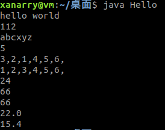

# java访问控制符的意义与控制范围

|               | 类内部 | 子类 | 本包 | 外部包 |
| :-----------: | :----: | :--: | :--: | :----: |
|  **public**   |   Y    |  Y   |  Y   |   Y    |
|  **default**  |   Y    |  Y   |  Y   |        |
| **protected** |   Y    |  Y   |      |        |
|  **private**  |   Y    |      |      |        |


# Java JNI的使用
JNI即Java Native Interface,Java本地接口，在某些需要高性能的场合如果Java无法满足需求的话，那么可以使用JNI用C/C++实现相关特性，编译成动态链接库之后（Windows的.dll,linux的.so文件）由Java调用。

JNI模式以函数为单位，为C语言与Java语言的交互提供了丰富的支持。其大致模式为：
1. 在类中（假定类名为`Hello`,文件名为`Hello.java`）用`native`关键词修饰用JNI实现的函数签名，无需为该函数提供函数体，因为实现在C语言中。
2. 用`javac`编译`Hello.java`文件生产class文件。
3. 用`javah Hello`为含有native修饰的方法生成`Hello.h`头文件，该文件中包含所有native函数有C语言写好的函数声明。
4. 自定义`Hello.c`文件，并在文件头使用#include引入`Hello.h`文件，然后通过JNI的规范，用C语言实现头文件中声明函数的函数体。


一个简单例子

## java代码

```java
import java.util.*;

public class Hello {
    static {
        System.load("/home/xanarry/桌面/libHello.so");
    }
    
    private int chn;
    private int eng;
    private int math;
    
    public Hello() {}
    public Hello(int c, int e, int m) {
        this.chn = c;
        this.eng = e;
        this.math = m;
    } 
    
    
    public int nsum() {
        return chn + eng + math;
    }
    //一下方法全部通过JNI C语言实现，有静态方法，有对象方法。
    public native int sum();
    public native double avg();
    public native double weightedScore(double chnW, double engW, double mathW);
    public static native void sayHello();
    public static native int  add(int a, int b);
    public static native String strcat(String str, String dst);
    public static native int  strlen(String str);
    public static native int[] sort(int[] ary);
    private native int fact(int n);
    
    public static void main(String agrv[]) {
 	//调用对应方法进行测试。
        sayHello();
        System.out.println(add(12, 100));
        System.out.println(strcat("abc", "xyz"));
        System.out.println(strlen("12345"));
        
        int[] ary = {3,2,1,4,5,6};
        int[] result = sort(ary);
        
        for (int i : ary) {
            System.out.print(i + ",");
        }
        System.out.println();
        
        for (int i : result) {
            System.out.print(i + ",");
        }
        System.out.println();
        
        Hello h = new Hello(11,22,33);
        System.out.println(h.fact(4));
        
        System.out.println(h.sum());
        System.out.println(h.avg());
        System.out.println(h.weightedScore(0.1, 0.2, 0.3));
        
    }
}
```


## 头文件

`javah Hello` 生产的头文件如下：

```c
/* DO NOT EDIT THIS FILE - it is machine generated */
#include <jni.h>
/* Header for class Hello */

#ifndef _Included_Hello
#define _Included_Hello
#ifdef __cplusplus
extern "C" {
#endif
/*
 * Class:     Hello
 * Method:    sum
 * Signature: ()I
 */
JNIEXPORT jint JNICALL Java_Hello_sum
  (JNIEnv *, jobject);

/*
 * Class:     Hello
 * Method:    avg
 * Signature: ()D
 */
JNIEXPORT jdouble JNICALL Java_Hello_avg
  (JNIEnv *, jobject);

/*
 * Class:     Hello
 * Method:    weightedScore
 * Signature: (DDD)D
 */
JNIEXPORT jdouble JNICALL Java_Hello_weightedScore
  (JNIEnv *, jobject, jdouble, jdouble, jdouble);

/*
 * Class:     Hello
 * Method:    sayHello
 * Signature: ()V
 */
JNIEXPORT void JNICALL Java_Hello_sayHello
  (JNIEnv *, jclass);

/*
 * Class:     Hello
 * Method:    add
 * Signature: (II)I
 */
JNIEXPORT jint JNICALL Java_Hello_add
  (JNIEnv *, jclass, jint, jint);

/*
 * Class:     Hello
 * Method:    strcat
 * Signature: (Ljava/lang/String;Ljava/lang/String;)Ljava/lang/String;
 */
JNIEXPORT jstring JNICALL Java_Hello_strcat
  (JNIEnv *, jclass, jstring, jstring);

/*
 * Class:     Hello
 * Method:    strlen
 * Signature: (Ljava/lang/String;)I
 */
JNIEXPORT jint JNICALL Java_Hello_strlen
  (JNIEnv *, jclass, jstring);

/*
 * Class:     Hello
 * Method:    sort
 * Signature: ([I)[I
 */
JNIEXPORT jintArray JNICALL Java_Hello_sort
  (JNIEnv *, jclass, jintArray);

/*
 * Class:     Hello
 * Method:    fact
 * Signature: (I)I
 */
JNIEXPORT jint JNICALL Java_Hello_fact
  (JNIEnv *, jobject, jint);

//这个函数是手动添加的，用来实现一个递归函数
jint fact(jint);
#ifdef __cplusplus
}
#endif
#endif

```


## 函数实现

`Hello.c`实现了头文件声明的函数

```c
#include "Hello.h"
#include <string.h>
#include <stdlib.h>

/*
 * Class:     Hello
 * Method:    sum
 * Signature: ()I
 */
JNIEXPORT jint JNICALL Java_Hello_sum (JNIEnv *env, jobject jobj) {
    jclass hello = (*env)->GetObjectClass(env, jobj);
    jfieldID chnID = (*env)->GetFieldID(env, hello, "chn", "I");
    jfieldID engID = (*env)->GetFieldID(env, hello, "eng", "I");
    jfieldID mathID = (*env)->GetFieldID(env, hello, "math", "I");
    
    jint chn =  (*env)->GetIntField(env, jobj, chnID);
    jint eng =  (*env)->GetIntField(env, jobj, engID);
    jint math = (*env)->GetIntField(env, jobj, mathID);
    
    return chn + eng + math;
}

/*
 * Class:     Hello
 * Method:    avg
 * Signature: ()D
 */
JNIEXPORT jdouble JNICALL Java_Hello_avg (JNIEnv *env, jobject jobj) {
    jclass hello = (*env)->GetObjectClass(env, jobj);
    jmethodID sum = (*env)->GetMethodID(env, hello, "nsum", "()I");
    if (sum == NULL) {
        return 0.0;
    }
    jint isum = (*env)->CallIntMethod(env, jobj, sum);
    return isum / 3.0;
}

/*
 * Class:     Hello
 * Method:    weightedScore
 * Signature: (DDD)D
 */
JNIEXPORT jdouble JNICALL Java_Hello_weightedScore (JNIEnv *env, jobject jobj, jdouble chnW, jdouble engW, jdouble mathW) {
    jclass hello = (*env)->GetObjectClass(env, jobj);
    jfieldID chnID = (*env)->GetFieldID(env, hello, "chn", "I");
    jfieldID engID = (*env)->GetFieldID(env, hello, "eng", "I");
    jfieldID mathID = (*env)->GetFieldID(env, hello, "math", "I");
    
    jint chn =  (*env)->GetIntField(env, jobj, chnID);
    jint eng =  (*env)->GetIntField(env, jobj, engID);
    jint math = (*env)->GetIntField(env, jobj, mathID);
    
    return chn * chnW + eng * engW + math * mathW;
}
  
  
/*
 * Class:     Hello
 * Method:    sayHello
 * Signature: ()V
 */
JNIEXPORT void JNICALL Java_Hello_sayHello (JNIEnv *env, jclass hello) {
    printf("hello world\n");
}


/*
 * Class:     Hello
 * Method:    add
 * Signature: (II)I
 */
JNIEXPORT jint JNICALL Java_Hello_add (JNIEnv * env, jclass hello, jint a, jint b) {
    return a + b;
}

/*
 * Class:     Hello
 * Method:    strcat
 * Signature: (Ljava/lang/String;Ljava/lang/String;)Ljava/lang/String;
 */
//拼接两个字符串，演示如何从java的String到C语言的String
JNIEXPORT jstring JNICALL Java_Hello_strcat (JNIEnv *env, jclass hello, jstring str, jstring dst) {
    //从javaString到C语言的String
    const char *cstr = (*env)->GetStringUTFChars(env, str, 0);
    const char *cdst = (*env)->GetStringUTFChars(env, dst, 0);
    int lena = strlen(cstr);
    int lenb = strlen(cdst);
    //printf("%d %s\n", lena, cstr);
    //printf("%d %s\n", lenb, cdst);
    char *newStr = (char *) malloc(sizeof(char) * (lena + lenb));
    memcpy(newStr, cstr, lena);
    memcpy(newStr + lena, cdst, lenb);
    newStr[lena + lenb] = '\0';
    //printf("%d %s\n", lenb + lenb, newStr);
    (*env)->ReleaseStringUTFChars(env, str, cstr);
    (*env)->ReleaseStringUTFChars(env, dst, cdst);
    //从C语言的string构造java的String
    return (*env)->NewStringUTF(env, newStr);
}

/*
 * Class:     Hello
 * Method:    strlen
 * Signature: (Ljava/lang/String;)I
 */
//求字符串长度
JNIEXPORT jint JNICALL Java_Hello_strlen (JNIEnv *env, jclass hello, jstring str) {
    return strlen((*env)->GetStringUTFChars(env, str, 0));
}

/*
 * Class:     Hello
 * Method:    sort
 * Signature: ([I)[I
 */

//对数组排序并返回，演示数组的使用
JNIEXPORT jintArray JNICALL Java_Hello_sort (JNIEnv *env, jclass hello, jintArray ary) {
    jsize len = (*env)->GetArrayLength(env, ary);
    //获取C语言能操作的数组
    jint  *array = (*env)->GetIntArrayElements(env, ary, 0);
    //选择排序
    for (int i = 0; i < len - 1; i++) {
        int k = i;
        for (int j = i + 1; j < len; j++) {
            k = (array[j] < array[k]) ? j : k;
        }
        if (k != i) {
            int tmp = array[k];
            array[k] = array[i];
            array[i] = tmp;
        }
    }
    //创建新的java数组
    jintArray result = (*env)->NewIntArray(env, len);
    if (result == NULL) {
        return NULL;
    }
    //为新开辟的数组赋值为有序的数组
    (*env)->SetIntArrayRegion(env, result, 0, len, array);
    return result;
}

/*
 * Class:     Hello
 * Method:    fact
 * Signature: (I)I
 */

//求阶乘
JNIEXPORT jint JNICALL Java_Hello_fact (JNIEnv *env, jobject jobj, jint n) {
    if (n < 0) {
        return 0;
    } else {
        return fact(n);//使用递归函数计算
    }
}

jint fact(jint n) {
    if (n <= 1) {
        return 1;
    }
    return n * fact(n - 1);
}

```


## 编译

编译该C文件为动态链接库

```shell
gcc --shared Hello.c -o libhello.so -fPIC -I /usr/lib/jvm/java-8-openjdk-amd64/include/ -I /usr/lib/jvm/java-8-openjdk-amd64/include/linux
```


## 错误解决

可能遇到的错误：

**`fatal error: jni.h`: 没有那个文件或目录**：GCC -I jdk的include目录
**`fatal error: jni_md.h`: 没有那个文件或目录**：GCC -I jdk的include目录中的Linux（Linux环境）目录，win32（Windows环境）目录
**Windows下可能有找不到宏`jlong`的定义的错误**：GCC加参数-Djlong="long long"


测试结果

