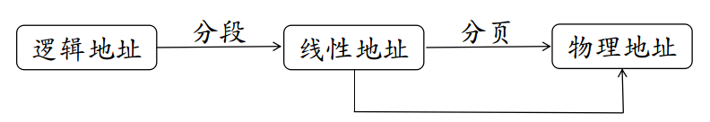
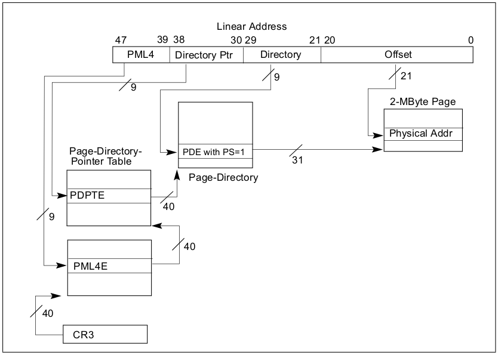

# Andrew NG ML

透彻理解svm

<https://sourcegraph.com/github.com/wggy/m2018/-/blob/prune/src/main/java/com/wggy/prune/info1113/Grid.java#L3:1>

# 


选择子确定描述符，描述符确定段基地址，段基地址与偏移之和就是线性地址。所以，虚拟地址空间中的由选择子和偏移两部分构成的二维虚拟地址，就是这样确定了线性地址空间中的一维线性地址。


如何访问段选择子与段基址，从而得出线性地址？



## CR2和CR3

控制寄存器CR2和CR3由分页管理机制使用。

CR2用于发生页异常时报告出错信息。当发生页异常时，处理器把引起页异常的线性地址保存在CR2中。

操作系统中的页异常处理程序可以检查CR2的内容，从而查出线性地址空间中的哪一页引起本次异常。

CR3用于保存页目录表的其始物理地址。由于目录是页对齐的，所以仅高20位有效，低12 位保留未用。

向CR3中装入一个新值时，低12位必须为0；但从CR3中取值时，低12位被忽略。

每当用MOV指令重置CR3的值时，会导致分页机制高速缓冲区的内容无效，用此方法，可以在启用分页机制之前，即把PG位置1之前，预先刷新分页机制的高速缓存。

CR3寄存器即使在CR0寄存器的PG位或PE位为0时也可装入，如在实模式下也可设置CR3，以便进行分页机制的初始化。

在任务切换时，CR3要被改变，但是如果新任务中CR3的值与原任务中CR3的值相同，那么处理器不刷新分页高速缓存，以便当任务共享也表时有较快的执行速度。


```c
#define virt_to_phys(address)   (__pa(address)) //虚拟地址转物理地址
#define phys_to_virt(address)   (__va(address)) //物理地址转虚拟地址
```


2M页页表结构图：



Each segment is represented by an 8-byte Segment Descriptor that describes the seg-
ment characteristics. Segment Descriptors are stored either in the Global Descriptor
Table (GDT) or in the Local Descriptor Table (LDT).


The address and size of the GDT in main memory are contained in the gdtr control register, 

gdtr保存了gdt表的基地址与长度


如果在C语言编写的动态链接库中需要在运行时加载共享库并运行其中的函数，在编译是要加上`-ldl`参数，不然在执行的时候会提示

> undefined symbol: dlopen
> undefined symbol: dlclose
> undefined symbol: dlsym