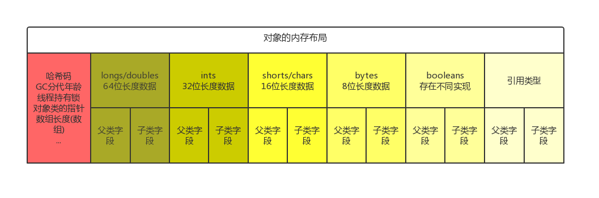
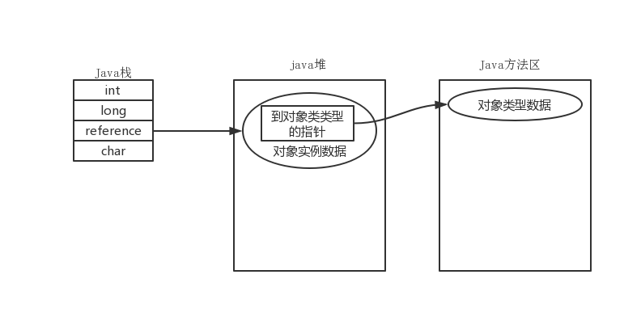

# 1.下载与编译jdk

## 1.1下载jdk

openjdk8下载地址: [http://download.java.net/openjdk/jdk8u40/ri/openjdk-8u40-src-b25-10_feb_2015.zip ](http://download.java.net/openjdk/jdk8u40/ri/openjdk-8u40-src-b25-10_feb_2015.zip) 

Java类实现代码所在目录：`openjdk/jdk/src/share/classes`


## 1.2编译环境配置

下载jdk并解压压缩包之后，根目录中有名为`README-builds.html`的文件，里面详细介绍了编译源码所需的条件与相关事项。

以Ubuntu 16.04为例：

1. 准备bootstrap-jdk

   按照文档中的编译要求，如果我们编译的的是jdk8，那么bootstrap-jkd的版本应该时jdk7。也就是说，jdk的主版本号需要减一才能作为bootstrap-jdk。如下为官方文档中的说明：

   > **Building JDK 8 requires use of a version of JDK 7 that is at Update 7 or newer. JDK 8 developers should not use JDK 8 as the boot JDK, to ensure that JDK 8 dependencies are not introduced into the parts of the system that are built with JDK 7.** 

   所以，在正式编译jdk之前，需要下载一个jdk7，下载之后将其解压到任何位置，后面配置`configure`指定bootstrap-jdk的目录为该解压目录。

   

2. 打开终端，进入jdk解压之后的根目录，可以看到`configure`文件

   终端中执行`bash configure`，检查编译环境是否满足要求，执行过程中会在`openjdk`目录中生成一些文件。指定bootstrap-jdk的目录使用`--with-boot-jdk=`参数，命令为：

   `bash configure --with-boot-jdk=/home/xanarry/Desktop/java-se-7u75-ri`

   如果环境OK的话，终端最后会输出如下结果：

   ```
   configure: creating /home/xanarry/Desktop/openjdk/build/linux-x86_64-normal-server-release/config.status
   config.status: creating /home/xanarry/Desktop/openjdk/build/linux-x86_64-normal-server-release/spec.gmk
   config.status: creating /home/xanarry/Desktop/openjdk/build/linux-x86_64-normal-server-release/hotspot-spec.gmk
   config.status: creating /home/xanarry/Desktop/openjdk/build/linux-x86_64-normal-server-release/bootcycle-spec.gmk
   config.status: creating /home/xanarry/Desktop/openjdk/build/linux-x86_64-normal-server-release/compare.sh
   config.status: creating /home/xanarry/Desktop/openjdk/build/linux-x86_64-normal-server-release/spec.sh
   config.status: creating /home/xanarry/Desktop/openjdk/build/linux-x86_64-normal-server-release/Makefile
   config.status: creating /home/xanarry/Desktop/openjdk/build/linux-x86_64-normal-server-release/config.h
   config.status: /home/xanarry/Desktop/openjdk/build/linux-x86_64-normal-server-release/config.h is unchanged
   
   ====================================================
   A new configuration has been successfully created in
   /home/xanarry/Desktop/openjdk/build/linux-x86_64-normal-server-release
   using default settings.
   
   Configuration summary:
   * Debug level:    release
   * JDK variant:    normal
   * JVM variants:   server
   * OpenJDK target: OS: linux, CPU architecture: x86, address length: 64
   
   Tools summary:
   * Boot JDK:       java version "1.8.0_201" Java(TM) SE Runtime Environment (build 1.8.0_201-b09) Java HotSpot(TM) 64-Bit Server VM (build 25.201-b09, mixed mode)  (at /opt/jdk1.8.0_201)
   * C Compiler:     gcc-5 (Ubuntu 5.4.0-6ubuntu1~16.04.11) 5.4.0 version 20160609 (at /usr/bin/gcc-5)
   * C++ Compiler:   g++-5 (Ubuntu 5.4.0-6ubuntu1~16.04.11) 5.4.0 version 20160609 (at /usr/bin/g++-5)
   
   Build performance summary:
   * Cores to use:   7
   * Memory limit:   15798 MB
   * ccache status:  installed, but disabled (version older than 3.1.4)
   
   WARNING: The result of this configuration has overridden an older
   configuration. You *should* run 'make clean' to make sure you get a
   proper build. Failure to do so might result in strange build problems.
   ```

   如果环境检查没有成功会提示一个`error:1`，不过没关系，会提示缺少哪些依赖库，依次安装上就行，直到检查成功。

   

## 1.3编译代码

在openjdk根目录下执行：`make` 即可。

**注意：**如果机器的内核版本大于等于4.x，那么会报错如下：

   ```
Building OpenJDK for target 'default' in configuration 'linux-x86_64-normal-server-release'
   
## Starting langtools
   
Compiling 2 files for BUILD_TOOLS
Compiling 32 properties into resource bundles
Compiling 781 files for BUILD_BOOTSTRAP_LANGTOOLS
Creating langtools/dist/bootstrap/lib/javac.jar
Updating langtools/dist/lib/src.zip
Compiling 784 files for BUILD_FULL_JAVAC
Creating langtools/dist/lib/classes.jar
   
## Finished langtools (build time 00:00:38)
   
## Starting hotspot
   
make[2]: warning: -jN forced in submake: disabling jobserver mode.
INFO: ENABLE_FULL_DEBUG_SYMBOLS=1
INFO: ALT_OBJCOPY=/usr/bin/objcopy
INFO: /usr/bin/objcopy cmd found so will create .debuginfo files.
INFO: STRIP_POLICY=min_strip
INFO: ZIP_DEBUGINFO_FILES=1
INFO: ENABLE_FULL_DEBUG_SYMBOLS=1
INFO: ALT_OBJCOPY=/usr/bin/objcopy
INFO: /usr/bin/objcopy cmd found so will create .debuginfo files.
INFO: STRIP_POLICY=min_strip
INFO: ZIP_DEBUGINFO_FILES=1
INFO: ENABLE_FULL_DEBUG_SYMBOLS=1
INFO: ALT_OBJCOPY=/usr/bin/objcopy
INFO: /usr/bin/objcopy cmd found so will create .debuginfo files.
INFO: STRIP_POLICY=min_strip
INFO: ZIP_DEBUGINFO_FILES=1
*** This OS is not supported: Linux ThinkPad 4.15.0-47-generic #50~16.04.1-Ubuntu SMP Fri Mar 15 16:06:21 UTC 2019 x86_64 x86_64 x86_64 GNU/Linux
/home/xanarry/Desktop/openjdk/hotspot/make/linux/Makefile:238: recipe for target 'check_os_version' failed
make[5]: *** [check_os_version] Error 1
/home/xanarry/Desktop/openjdk/hotspot/make/linux/Makefile:259: recipe for target 'linux_amd64_compiler2/debug' failed
make[4]: *** [linux_amd64_compiler2/debug] Error 2
make[3]: *** [generic_build2] Error 2
Makefile:230: recipe for target 'generic_build2' failed
make[2]: *** [product] Error 2
Makefile:177: recipe for target 'product' failed
HotspotWrapper.gmk:44: recipe for target '/home/xanarry/Desktop/openjdk/build/linux-x86_64-normal-server-release/hotspot/_hotspot.timestamp' failed
make[1]: *** [/home/xanarry/Desktop/openjdk/build/linux-x86_64-normal-server-release/hotspot/_hotspot.timestamp] Error 2
/home/xanarry/Desktop/openjdk//make/Main.gmk:108: recipe for target 'hotspot-only' failed
make: *** [hotspot-only] Erro
   ```

从错误中可以看出，在`openjdk/hotspot/make/linux/Makefile`第238行提示错误，是因为这个`Makefile`会检查内核版本是否为

`SUPPORTED_OS_VERSION = 2.4% 2.5% 2.6% 3%`

也就是要求内核版本小于4.x，所以在末尾加上“**4%**”即可

`SUPPORTED_OS_VERSION = 2.4% 2.5% 2.6% 3% 4%`

编译成功之后可以看到make最后的输出为：

   ```
## Finished jdk (build time 00:02:44)
   
----- Build times -------
Start 2019-04-07 12:42:33
End   2019-04-07 12:50:33
00:00:28 corba
00:04:02 hotspot
00:00:19 jaxp
00:00:27 jaxws
00:02:44 jdk
00:00:00 langtools
00:08:00 TOTAL
-------------------------
Finished building OpenJDK for target 'default'
   ```

## 1.4编译结果

编译的结果会保存到openjdk根目录中的`openjdk/build `目录下，以下是我本次的编译结果，diz文件包含了调试信息。


java的版本输出：


# 2.java内存区域与内存溢出异常

## 2.1 jvm内存


java虚拟机运行时数据区


**程序计数器**：一块较小的内存，记录java程序字节码当前执行到的位置。程序计数器仅仅对java方法有效，当程序执行到native方法时，计数器将被置为空（undefined）。


**堆**：几乎所有运行时所有的对象实例以及数组都在堆上分配，java堆在虚拟机启动时候创建，是虚拟机所管理的最大的一块空间，也是垃圾回收器管理的主要区域。从垃圾回收的角度来看，可以被分为：新生代和老年代，新生代更细致为**Eden空间（占80%）、From Survivor空间（占10%）、To Survivor空间（占10%）**。java堆可以处于物理上不连续的空间，只要逻辑上是连续的即可。


**虚拟机栈**：虚拟机执行java方法所使用的栈，主要存储局部变量，操作数栈，方法入口信息，函数调用等信息。该区域会发生两种异常一种是线程请求的栈深度超过了所允许的深度（例如程序进入了死递归），抛出StackOverflow异常；另一种是OutOfMemoryError异常，即程序在扩展过程中无法请求到足够的内存。


**本地方法栈**：与虚拟机栈一样，保存本地方法在执行过程中的局部变量，操作数，维持函数调用信息等。

*注意*：由于Java虚拟机规范并没有对本地方栈做具体要求，所以有的虚拟机实现直接将虚拟机栈和本地方法栈合并到了一起。


**方法区(非堆区/永久代)**：与java堆一样，是各个线程共享的内存区域，他用于存储已被虚拟机加载的类信息，常量，静态变量，字段描述，方发描述及时编译器编译后的代码等数据。该区域别名也叫非堆（Non-Heap），与java堆区别开来。许多开发者也称其为永久代（permanent generation）。该区域在内存无法分配时会抛出OutOfMemoryError异常。   同时，方法区还包括运行时常量池（Runtime Constant Pool）。


**直接内存**：该区域不属于jvm内存结构的组成，而是直接操作系统的，用于实现NIO的缓冲，这种模型避免了在Java堆中与native堆中复制对象。


java内存模型：


**整个JVM内存大小=年轻代大小 + 年老代大小 + 持久代大小**


控制该区域容量的相关参数：

| 参数名 |                             作用                             |
| :----: | :----------------------------------------------------------: |
|  -Xss  |                    设置每个线程的堆栈大小                    |
|  -Xmx  |                    设置JVM最大可用内存为                     |
|  -Xms  | 设置堆的最小容量，虚拟机启动后就分配这个值。当最小堆占满后，会尝试进行GC， |
|  -Xmn  |                        设置新生代大小                        |


各个参数控制的内存区域：


## 2.2 Java对象

### 对象的创建过程

当jvm遇到一条`new`指令是，创建一个对象的过程如下：

```flow
st=>start: 开始
e=>end: 创建完成
op1=>operation: 检查目标类是否在常量池中存在符号引用，并且检查这个符号引用代表的类是否被正确加载、解析、初始化。
op2=>operation: 为新的对象分配内存空间，对象所需内存在类加载完成之后便可完全确定。
op3=>operation: 将所分配的内存空间内存全部置为0.
op4=>operation: 为该对象生成相应的头部信息(包括所属类的元数据信息，哈希码，GC分代年龄等)。
op4=>operation: 执行该对象的构造方法。
st->op1->op2->op3->op4->e
```

为对象分配内存分为两种类型：

1. 直接在堆中分配：因为所有线程都在堆中分配内存，所以在分配过程中存在线程之间的竞争关系，为了保障线程安全，直接在堆中分配内存时，需要对分配过程加锁，代价是性能的降低。
2. 在线程的TLAB(线程局部分配缓冲区)中分配：为了避免直接在堆中分配内存导致线程的竟态，jvm预先在堆中为每个进程分配一块线程独享的空间，称之为TLAB(**T**hread **L**ocal **A**llocation **B**uffer)。线程需要空间时，首先在该线程的TLAB上分配，只有当TLAB空间不足时，虚拟机再通过加锁扩大该空间。

### 对象的内存布局

对象最前端存放的是对象头部，在32为虚拟机和64为虚拟机中的长度分别为32位和64位，接下来按字段的大小依次往后排列，相同字段大小的情况下，从父类继承来的属性放在前面，子类的字段放在后面。最后存放引用类型。大致的布局如下图。



**要点**：jvm要求对象的起始地址必须是8字节的倍数，所以对象的大小必须是8字节的倍数，为了满足这个要求，jvm会在上图的布局中的适当位置添加一些填充，以满足字节对齐。


### 对象的访问

**虚拟机栈上并不存放对象，而是存放的对象的引用**，对象存放在堆空间中。




# 3.垃圾收集器与内存分配策略


## 内存的分配与回收策略

## 可达性分析算法


## Java中的引用类型


## 对象何时才被判定真正死亡


## 方法区的回收


## 垃圾回收算法


### 标记-清除算法


### 标记-整理算法


### 复制算法


## 安全点与安全区


对象的分配主要新生代的Eden区；如果启动了线程的本地分配缓冲区(TLAB)，那么对象的内存分配则在TLAB中进行；少数情况下也会直接在老年代中分配。具体分配规则与jvm中的垃圾回收器组合和虚拟机的内存参数配置相关。

GC的类型：

1. Minor GC：(新生代的GC)，当Eden区中没有足够的空间分配时候，虚拟机将发起一次Minor GC。该GC比较频频，速度也笔记快。
2. Full/Major GC：(老年代GC)，Major GC的速度一般比Minor GC的速度慢10倍以上。

什么样的对象才会放入老年代：

1. 体积比较大的对象：新生代采用复制算法回收垃圾，如果直接在新生代中分配很大的对象，那么在回收过程中会产生大量的内存复制，导致效率底下，所以如果虚拟机遇到分配大对象会直接在老年代中分配内存。对于Serial/CMS回收器，还提供了PretenureSizeThreshold参数来设置体积大于该值对象直接在老年代中分配，该参数对Parallel Scavenge回收器无效。
2. 长期存活的对象将进入老年代：虚拟机为每个对象设置了一个年龄计算器age，如果对象从Eden中经过第一次Minor GC并存活到Survivor中，age设置为1，此后，对象在Survivor中没熬过一次Minor GC，age加1，当age大于(不包括等于)某一个阈值时，对象将被移入老年代。
3. 为了更好的适应内存情况，如果Survivor空间中相同年龄的所有对象大小之和大于Survivor空间的一半时，年龄大于等于该值的对象就可以直接进入老年代。


虚拟机如何担保内存的分配：

在发生Minor GC前，虚拟机会检查老年代最大可用连续空间是否大于新生代所有对象占用空间之和， 如果这个条件成立，那么进行Minor GC是绝对安全的(Survivor空间也不厚，需要移动新生代的对象到老年代)；  如果不成立则检查是否允许担保失败：如果允许，那么检查历老年代的连续可用空间是否大于次移入老年代的对象平均大小，  如果大于，将尝试进行一次Minor GC，虽然有风险；  如果小于，或者不允许冒险的情况下，那么，将会触发一次Major/Full GC。


#  4.虚拟机性能监控与故障处理工具


# 5.调优方案与实战


# 6.类文件结构


# 7.虚拟机类加载机制


# 8.虚拟机字节码与执行引擎


# 9.类加载及执行子系统的案例与实战


# 10.编译期（早期）优化

# 11.运行时（晚期）优化

# 12.Java内存模型与线程

# 13.线程安全与锁优化