# 自我介绍

姓名，学校，学历，毕业时间，实习经历，项目经历，竞赛经历，可实习时间。

不要描述细节，但要说清楚是什么，有什么，自我介绍有可能被打断，重点前面说。

**邮件标题：**应聘职位+学校+姓名+手机号

**利用初面官通过复面。**在初面快结束时，建议询问面试官自己的不足，针对这些不足如何提高，以及自己最得意的项目有哪些不足，如何改进，拿着这些建议和准备去参加复面会更容易通过。


# ------------------------------------------

# 计算机网络

## 三次握手与四次握手

连接阶段与释放阶段的示意图：

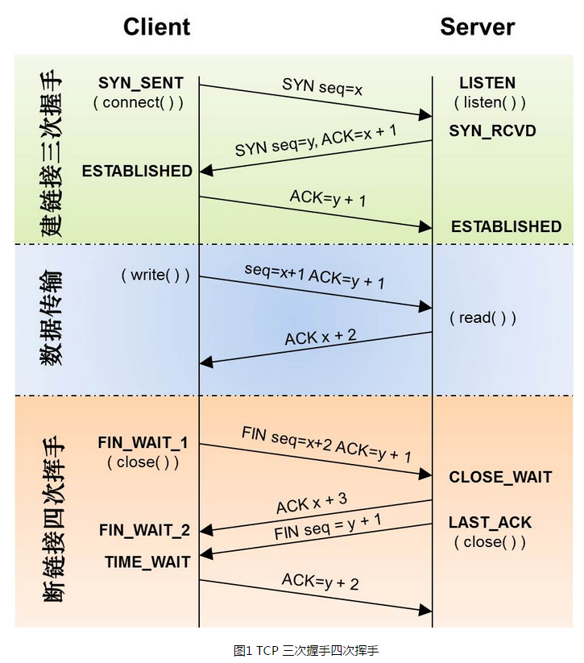

### 三次握手

建立连接的流程：

1. 第一次握手：建立连接。客户端发送连接请求报文段，将SYN位置为1，Sequence Number为x；然后，客户端进入SYN_SEND状态，等待服务器的确认。
2. 第二次握手：服务器收到SYN报文段。服务器收到客户端的SYN报文段，需要对这个SYN报文段进行确认，设置Acknowledgment Number为x+1(Sequence Number+1)；同时，自己自己还要发送SYN请求信息，将SYN位置为1，Sequence Number为y；服务器端将上述所有信息放到一个报文段（即SYN+ACK报文段）中，一并发送给客户端，此时服务器进入SYN_RECV状态。
3. 第三次握手：客户端收到服务器的SYN+ACK报文段。然后将Acknowledgment Number设置为y+1，向服务器发送ACK报文段，这个报文段发送完毕以后，客户端和服务器端都进入ESTABLISHED状态，完成TCP三次握手。


为什么需要第三次握手：**为了防止已失效（长时间没有到达服务器的第一次握手包）的连接请求报文段突然又传送到了服务端，因而产生错误**。

所谓”已经失效的连接请求报文段”是这样产生的

> ​	client发出的第一个连接请求报文段并没有丢失，而是在某个网络结点长时间的滞留了，于是client重新与server建立了连接，以致延误到client新建的连接释放以后的某个时间才到达server。本来这是一个早已失效的报文段。但server收到此失效的连接请求报文段后，就误认为是client再次发出的一个新的连接请求。于是就向client发出确认报文段，同意建立连接。假设不采用“三次握手”，那么只要server发出确认，新的连接就建立了。
>
> ​	由于现在client并没有发出建立连接的请求，因此不会理睬server的确认，也不会向server发送数据。但server却以为新的运输连接已经建立，并一直等待client发来数据。这样，server的很多资源就白白浪费掉了。采用“三次握手”的办法可以防止上述现象发生。例如刚才那种情况，client不会向server的确认发出确认。server由于收不到确认，就知道client并没有要求建立连接。”


**只有第三次握手的过程中可以捎带数据，因为只要第三次握手成功，一定建立了连接，可以进行数据交换。即使失败了，对客户端和服务器也没有影响。如果在前两次握手就进行捎带数据的操作的话，会增加网络两端的处理压力，并不能保证数据因为连接的成功建立而得到使用。**


### 四次握手

断开连接的过程：

1. 第一次握手：主机1（可以使客户端，也可以是服务器端），设置Sequence Number和Acknowledgment Number，向主机2发送一个FIN报文段；此时，主机1进入FIN_WAIT_1状态；这表示主机1没有数据要发送给主机2了；
2. 第二次握手：主机2收到了主机1发送的FIN报文段，向主机1回一个ACK报文段，Acknowledgment Number为Sequence Number加1；主机1进入FIN_WAIT_2状态；主机2告诉主机1，我“同意”你的关闭请求；
3. 第三次握手：主机2向主机1发送FIN报文段，请求关闭连接，同时主机2进入LAST_ACK状态；
4. 第四次握手：主机1收到主机2发送的FIN报文段，向主机2发送ACK报文段，然后主机1进入TIME_WAIT状态；主机2收到主机1的ACK报文段以后，就关闭连接；此时，主机1等待2MSL后依然没有收到回复，则证明Server端已正常关闭，那好，主机1也可以关闭连接了。


为什么需要第四次握手：TCP是全双工模式，这就意味着，*当主机1发出FIN报文段时，只是表示主机1已经没有数据要发送了*，主机1告诉主机2，它的数据已经全部发送完毕了；但是，这个时候主机1还是可以接受来自主机2的数据；当主机2返回ACK报文段时，表示它已经知道主机1没有数据发送了，但是主机2还是可以发送数据到主机1的；*当主机2也发送了FIN报文段时，这个时候就表示主机2也没有数据要发送了*，就会告诉主机1，我也没有数据要发送了，之后彼此就会愉快的中断这次TCP连接。


**MSL（Maximum Segment Life），这是TCP 对TCP Segment 生存时间的限制。**

为什么主机A需要在TIME-WAIT状态下等待2MSL：

**第一：为了保证A发送的最后一个ACK报文能够顺利到达B，因为这个ACK报文可能丢失，因而使得处于LAST-ACK状态的B收不到这个确认，这是B给A超时重传一个FIN-ACK报文，而A就在2MSL内收到这个重传报文。接着A重传一次ACK确认，并重启2MSL计时器。最后A,B都进入CLOSED状态。  如果A在TIME-WAIT状态不等待一段时间，而是发完最后一个ACK之后就立即释放连接，那么就无法收到因数据丢失B重传的FIN-ACK报文，因此也不会在重新发一次确认报文。这样，B就无法正常进入CLOSED状态。**

第二：防止产生三次握手提到的“已经失效的连接请求报文段”出现在本连接中。A在发送完最后一个ACK之后，再经过2MSL，可以使本连接持续时间内所产生的所有报文段都从网络中消失，从而杜绝这种情况的产生。


## 流量控制原理

- 目的是接收方**通过TCP头窗口字段告知发送方本方可接收的最大数据量**，用以解决发送速率过快导致接收方不能接收的问题。所以**流量控制是点对点控制**。
- TCP是双工协议，双方可以同时通信，所以发送方接收方各自维护一个发送窗和接收窗。
  - 发送窗：用来限制发送方可以发送的数据大小，其中发送窗口的大小由接收端返回的TCP报文段中窗口字段来控制，接收方通过此字段告知发送方自己的缓冲（受系统、硬件等限制）大小。
  - 接收窗：用来标记可以接收的数据大小。
- TCP是流数据，发送出去的数据流可以被分为以下四部分：已发送且被确认部分 | 已发送未被确认部分 | 未发送但可发送部分 | 不可发送部分，其中发送窗 = 已发送未确认部分 + 未发但可发送部分。接收到的数据流可分为：已接收 | 未接收但准备接收 | 未接收不准备接收。接收窗 = 未接收但准备接收部分。
- 发送窗内数据只有当接收到接收端某段发送数据的ACK响应时才移动发送窗，左边缘紧贴刚被确认的数据。接收窗也只有接收到数据且最左侧连续时才移动接收窗口。


## 拥塞控制原理

- 拥塞控制目的是防止数据被过多注网络中导致网络资源（路由器、交换机等）过载。因为拥塞控制涉及网络链路全局，所以**属于全局控制**。控制拥塞使用拥塞窗口。

- TCP拥塞控制算法：
  - 慢开始 ：先试探网络拥塞程度再逐渐增大拥塞窗口。每次收到确认后拥塞窗口翻倍，直到达到阀值ssthresh，这部分是慢开始过程。
  - 拥塞避免：达到阀值后每次以一个MSS为单位增长拥塞窗口大小，使数据线性增加直到发生拥塞（超时未收到确认）。此时将阀值ssthresh减为原先一半，这个过程为拥塞避免。
  - 快速重传 & 快速恢复：略。
  - 最终拥塞窗口会收敛于稳定值。
  
  
  
  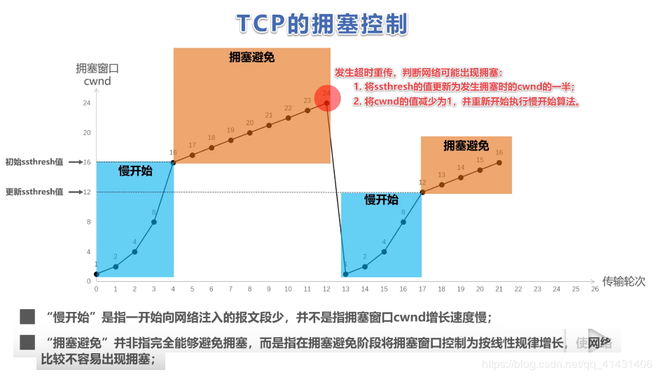


加入快重传与快恢复的拥塞控制：

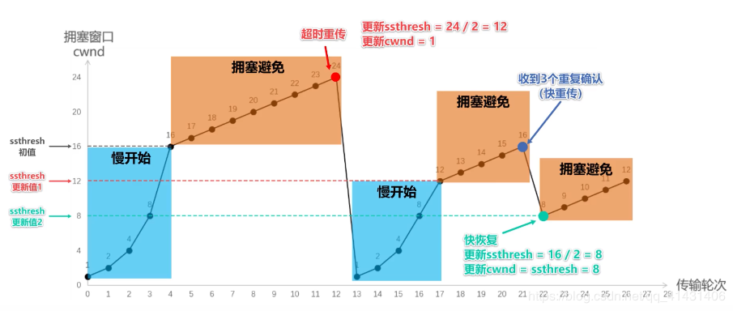

如何区分流量控制和拥塞控制？

- 流量控制属于通信双方协商；拥塞控制涉及通信链路全局。
- 流量控制需要通信双方各维护一个发送窗、一个接收窗，对任意一方，接收窗大小由自身决定，发送窗大小由接收方响应的TCP报文段中窗口值确定；拥塞控制的拥塞窗口大小变化由试探性发送一定数据量数据探查网络状况后而自适应调整。
- 实际最终发送窗口 = min{流控发送窗口，拥塞窗口}。


## TCP和UDP的区别

### UDP的特点

- **面向无连接**：首先 UDP 是不需要和 TCP一样在发送数据前进行三次握手建立连接的，想发数据就可以开始发送了。并且也只是数据报文的搬运工，不会对数据报文进行任何拆分和拼接操作。

  具体来说就是：

  在发送端，应用层将数据传递给传输层的 UDP 协议，UDP 只会给数据增加一个 UDP 头标识下是 UDP 协议，然后就传递给网络层了

  在接收端，网络层将数据传递给传输层，UDP 只去除 IP 报文头就传递给应用层，不会任何拼接操作

- **有单播，多播，广播的功能**：UDP 不止支持一对一的传输方式，同样支持一对多，多对多，多对一的方式，也就是说 UDP 提供了单播，多播，广播的功能。

- **UDP是面向报文的**：发送方的UDP对应用程序交下来的报文，在添加首部后就向下交付IP层。UDP对应用层交下来的报文，既不合并，也不拆分，而是保留这些报文的边界。因此，应用程序必须选择合适大小的报文

- **不可靠性**：首先不可靠性体现在无连接上，通信都不需要建立连接，想发就发，这样的情况肯定不可靠。并且收到什么数据就传递什么数据，并且也不会备份数据，发送数据也不会关心对方是否已经正确接收到数据了。再者网络环境时好时坏，但是 UDP 因为没有拥塞控制，一直会以恒定的速度发送数据。即使网络条件不好，也不会对发送速率进行调整。这样实现的弊端就是在网络条件不好的情况下可能会导致丢包，但是优点也很明显，在某些实时性要求高的场景（比如电话会议）就需要使用 UDP 而不是 TCP。


### TCP协议的特点

- **面向连接**：面向连接，是指发送数据之前必须在两端建立连接。建立连接的方法是“三次握手”，这样能建立可靠的连接。建立连接，是为数据的可靠传输打下了基础。

- **仅支持单播传输**：每条TCP传输连接只能有两个端点，只能进行点对点的数据传输，不支持多播和广播传输方式。

- **面向字节流**：TCP不像UDP一样那样一个个报文独立地传输，而是在不保留报文边界的情况下以字节流方式进行传输。

- **可靠传输**：对于可靠传输，判断丢包，误码靠的是TCP的段编号以及确认号。TCP为了保证报文传输的可靠，就给每个包一个序号，同时序号也保证了传送到接收端实体的包的按序接收。然后接收端实体对已成功收到的字节发回一个相应的确认(ACK)；如果发送端实体在合理的往返时延(RTT)内未收到确认，那么对应的数据（假设丢失了）将会被重传。

- **提供拥塞控制**：当网络出现拥塞的时候，TCP能够减小向网络注入数据的速率和数量，缓解拥塞

- **提供全双工通信**：TCP允许通信双方的应用程序在任何时候都能发送数据，因为TCP连接的两端都设有缓存，用来临时存放双向通信的数据。当然，TCP可以立即发送一个数据段，也可以缓存一段时间以便一次发送更多的数据段（最大的数据段大小取决于MSS）


###  对比

| 特征         | UDP                                        | TCP                                    |
| :----------- | :----------------------------------------- | :------------------------------------- |
| 是否连接     | 无连接                                     | 面向连接                               |
| 是否可靠     | 不可靠传输，不使用流量控制和拥塞控制       | 可靠传输，使用流量控制和拥塞控制       |
| 连接对象个数 | 支持一对一，一对多，多对一和多对多交互通信 | 只能是一对一通信                       |
| 传输方式     | 面向报文                                   | 面向字节流                             |
| 首部开销     | 首部开销小，仅8字节                        | 首部最小20字节，最大60字节             |
| 适用场景     | 适用于实时应用（IP电话、视频会议、直播等） | 适用于要求可靠传输的应用，例如文件传输 |


参考：https://blog.fundebug.com/2019/03/22/differences-of-tcp-and-udp/


## TCP如何保障可靠性

### 确认机制

当消息接收方接收到消息之后，返回一个对应的 ACK，发送方就知道这个消息已经处理完成。否则认为这个消息在网络中丢失。

在这种机制下， 数据包可能发生乱序、重传等情况。协议通过滑动窗口来解决这个问题：每当按顺序收到数据包之后，给发送方确认最后一个包；  如果发生乱序，那么直到最大编号之前的所有数据包都已经接收到，就回复最后一个数据包的的确认；  如果收到重复的包，直接丢弃。

### 超时重传

消息超时也就是说没有在等待时间内收到对方的 ACK 消息。这个时候，为了保证消息对方能够正确收到，我们需要将这个消息进行重新传输，如果尝试成功，则继续发送接下来的包。若尝试几次均失败，那么 TCP 会强行断开连接，发送 RST 信息。并告知应用程序连接错误。


## IP层的分包机制

物理网络在传输数据的时候，有最大传输单元（MTU）的限制，数据包大于这个值的时候，需要对数据进行分片处理，每个分片记录了一个IP包的ID，另外也记录了该分片在数据包中的偏移，方便接收方收到数据之后进行重组。


## HTTPS，SSL握手的过程

HTTP 主要有这些不足,例举如下。

- 通信使用明文(不加密),内容可能会被窃听
- 不验证通信方的身份,因此有可能遭遇伪装
- 无法证明报文的完整性,所以有可能已遭篡改


HTTP 协议中没有加密机制,但可以通过和 SSL(Secure Socket Layer,安全套接层)或TLS(Transport Layer Security,安全层传输协议)的组合使用,加密 HTTP 的通信内容。用 SSL 建立安全通信线路之后,就可以在这条线路上进行 HTTP通信了。**与 SSL 组合使用的 HTTP 被称为 HTTPS**(HTTP Secure,超文本传输安全协议)或 HTTP over SSL


通常,HTTP 直接和 TCP 通信。当使用 SSL 时,则演变成先和 SSL 通信,再由 SSL 和 TCP 通信了。简言之,所谓 HTTPS,其实就是身披SSL 协议这层外壳的 HTTP。

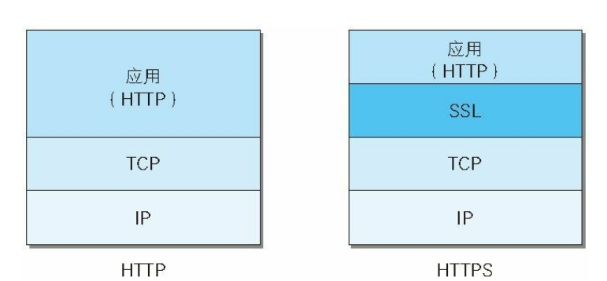


### HTTPS加密机制
HTTPS 采用对称加密和非对称加密两者并用的混合加密机制。若密钥能够实现安全交换,那么有可能会考虑仅使用非对称密钥加密来通信。但是非对称加密与对称加密相比,其处理速度要慢。

所以应充分利用两者各自的优势,将多种方法组合起来用于通
信。在交换对称密钥环节使用非对称加密方式,之后的建立通信交换报文阶段则使用对称加密方式。


### HTTPS通信过程

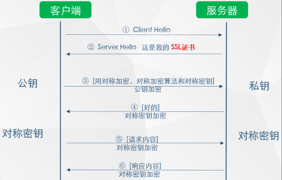

如上图所示：

1. Client向Server发起建立连接的请求，并在请求信息中告知自己支持的各种支持的加密算法、协议版本以及压缩算法。目的是通知 Server 在所给的算法中选择一种，以便于之后通信的加解密。
2. Server选择一种加密算法，将该信息和SSL证书（包含Server的域名、公钥等信息）发送给Client。
3. Client收到证书之后，使用内置证书颁发机构的公钥来验证证书中的签名（证书信息的哈希经过CA机构私钥加密有的信息），如果验证通过，说明Server是可靠的。之后，Client生成一个随机对称秘钥（仅本次通信有效），使用Sever的公钥加密发送给Server。
4. Server给Client发送一个确认消息。之后，Client与Server就可以使用对称秘钥进行加密通信了


申请证书的过程如下：

> 服务端向 CA 申请自己的 HTTPS 证书， CA 审核通过后，就会将服务端的域名、公钥、证书的有效期等信息写到证书里。 同时 CA 会对证书里的信息做一个哈希获得一个哈希值， 用自己的秘钥对这个哈希值进行加密获得一个加密串， 并把加密串也写到证书里。这一过程称之为签名。 （签名就是证明这证书的确是 CA 发的，CA 为证书进行背书。）
>
> 
>
>  现在，当我们访问网站后收到一个证书时， 首先用 CA 的公钥对加密串进行解密，得到加密前的哈希值。 再对证书本身的数据做一个哈希，如果这两个哈希值是一致的说明证书有效。 同时还要注意证书是否在有效期内。 通过以上校验，我们就可以认为这的确是我们期望的服务端下发的证书。


## HTTP的持久连接

在HTTP1.0中，每请求一个资源都进行一次连接的建立与释放，比如请求的一个页面中有大量图片，那么请求每张图片的时候都有连接的建立过程，这样导致大量的开销。

HTTP1.1提出了持久连接(HTTP Persistent Connections,也称为 HTTP keep-alive 或HTTP connection reuse)的方法。且所**有的HTTP1.1连接默认都是持久连接。持久连接的特点是，只要任意一端没有明确提出断开连接，则保持 TCP 连接状态**。持久连接的好处在于减少了 TCP 连接的重复建立和断开所造成的额外开销,减轻了服务器端的负载。另外,减少开销的那部分时间,使HTTP 请求和响应能够更早地结束,这样 Web 页面的显示速度也就相应提高了。


## Range指定下载范围

如果需要指定下载的实体范围，使用Range字段，**如果服务器端无法响应范围请求,则会返回状态码 200 OK 和完整的实体内容。**

执行范围请求时,会用到首部字段 Range 来指定资源的 byte 范围。
byte 范围的指定形式如下。
5001~10 000 字节：`Range: bytes=5001-10000`
从 5001 字节之后全部的：`Range: bytes=5001-`
从一开始到 3000 字节和 5000~7000 字节的多重范围：`Range: bytes=-3000, 5000-7000`
针对范围请求,响应会返回状态码为 206 Partial Content 的响应报文。另外,对于多重范围的范围请求,响应会在首部字段 Content-Type 标明 multipart/byteranges 后返回响应报文


## HTTP状态码

状态码的类别

|   状态码   |   类别   |   原因   |
| ---- | ---- | ---- |
|1XX | Informational(信息性状态码) |接收的请求正在处理|
|2XX | Success(成功状态码) |请求正常处理完毕|
|3XX | Redirection(重定向状态码) |需要进行附加操作以完成请求|
|4XX | Client Error(客户端错误状态码) |服务器无法处理客户端发出请求|
|5XX | Server Error(服务器错误状态码)| 服务器处理请求出错|

### 成功状态码2XX

- 200 OK
- 204 No Content
- 206 Partial Content


### 重定向3XX

- 301 Moved Permanently
- 302 Found
- 303 See Other
- 304 Not Modified 资源已找到但不符合要求

当 301、302、303 响应状态码返回时,几乎所有的浏览器都会把
POST 改成 GET,并删除请求报文内的主体,之后请求会自动再次
发送。
301、302 标准是禁止将 POST 方法改变成 GET 方法的,但实际使用时大家都会这么做。


### 客户端错误码4XX

- 400 Bad Request 该状态码表示请求报文中存在语法错误。当错误发生时,需修改请求的内容后再次发送请求。
- 401 Unauthorized 该状态码表示发送的请求需要有通过 HTTP 认证(BASIC 认证、DIGEST 认证)的认证信息。
- 403 Forbidden 该状态码表明对请求资源的访问被服务器拒绝了。服务器端没有必要给出拒绝的详细理由,但如果想作说明的话,可以在实体的主体部分对原因进行描述。
- 404 Not Found 该状态码表明服务器上无法找到请求的资源。除此之外,也可以在服务器端拒绝请求且不想说明理由时使用。


### 服务器错误5XX 

- 500 Internal Server Error 该状态码表明服务器端在执行请求时发生了错误。也有可能是 Web应用存在的 bug 或某些临时的故障。
- 502 Bad Gateway 这个问题是由后端电脑之间不良的 IP 通讯造成的， 可能包括正在尝试访问的网站的 Web 服务器
- 503 Service Unavailable 该状态码表明服务器暂时处于超负载或正在进行停机维护,现在无法处理请求。


**不少返回的状态码响应都是错误的,但是用户可能察觉不到这点。比如 Web 应用程序内部发生错误,状态码依然返回 200 OK,这种情况也经常遇到。**


## WEB代理

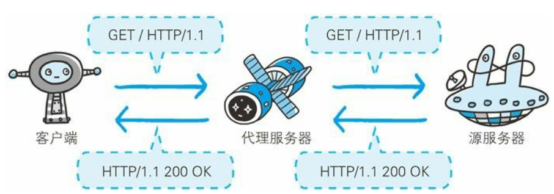

代理服务器的基本行为就是接收客户端发送的请求后转发给其他服务器。代理不改变请求 URI,会直接发送给前方持有资源的目标服务器。


使用代理服务器的理由有:利用缓存技术(稍后讲解)减少网络带宽的流量,组织内部针对特定网站的访问控制,以获取访问日志为主要目的,等等。

代理有多种使用方法,按两种基准分类。一种是是否使用缓存,另一种是是否会修改报文。

- 缓存代理：代理转发响应时,缓存代理(Caching Proxy)会预先将资源的副本(缓存)保存在代理服务器上。当代理再次接收到对相同资源的请求时,就可以不从源服务器那里获取资源,而是将之前缓存的资源作为响应返回。
- 透明代理：转发请求或响应时,不对报文做任何加工的代理类型被称为透明代理(Transparent Proxy)。反之,对报文内容进行加工的代理被称为非透明代理。


## HTTP请求首部为什么要有HOST

首部字段 **Host(存放的就是访问网站的域名)** 和以单台服务器分配多个域名的虚拟主机的工作机制有很密切的关联,这是首部字段 Host 必须存在的意义。当数据包到达主机的时候，通过IP地址路由，这是一个主机上的多个服务器都是同一个IP地址，**HOST存放的域名就是分发请求的依据**。


## Cookie与Session

由于HTTP协议本身是无状态的，所以在用户的方法过程中如果需要跟踪其活动状态，那么就需要使用Cookie或者是Session

### Cookie

Cookie存放到客户本地，server在设置Cookie时，会在相应头中设置`Set-Cookie`字段，保存用户相关的信息，一旦 Cookie 从服务器端发送至客户端,**服务器端就不可以显式删除 Cookie 的方法。但可通过覆盖已过期的 Cookie,实现对客户端 Cookie 的实质性删除操作**。

Cookie 的 HttpOnly 属性是 Cookie 的扩展功能,它使 JavaScript 的 document.cookie 就无法读取 Cookie。其主要目的为防止跨站脚本攻击(Cross-sitescripting,XSS)对 Cookie 的信息窃取。发送指定 HttpOnly 属性的 Cookie 的方法如：
`Set-Cookie: name=value; HttpOnly`

### Session

Session与Cookie不同的区别在于，Cookie的数据存放在客户端，而Session的数据存放在服务器，但实际上Session也要使用Cookie辅助访问，Session在服务器中以字典的形式组织，在访问对应数据的时候需要使用Cookie提交上来的SessionID检索目标Session。


两者的优缺点：

Cookie 保存在客户端，容易篡改，但不会给服务造成存储压力，**不存在重启服务丢失**的情况 。
Session 保存在服务端，连接较大的话会给服务端带来压力，但分布式的情况下可以放在数据库中，且有如下优点

1. 简单且高性能
2. 支持分布式与集群
3. 支持服务器断电和重启

分布式环境下的缺点是：需要额外的工作检查和维护session过期，手动维护cookie；处于效率考虑且不适合有频繁的session数据存取。


#### GET 和 POST 的区别

- GET在浏览器回退时是无害的，而POST会再次提交请求。 
- GET产生的URL地址可以被保存书签，而POST不可以。 
- GET请求会被浏览器主动cache，而POST不会，除非手动设置。 
- GET请求只能进行url编码，而POST支持多种编码方式。 
- GET请求参数会被完整保留在浏览器历史记录里，而POST中的参数不会被保留。 
- GET请求在URL中传送的参数是有长度限制的，而POST么有。 
- 对参数的数据类型，GET只接受ASCII字符，而POST没有限制。 
- GET比POST更不安全，因为参数直接暴露在URL上，所以不能用来传递敏感信息。 
- GET参数通过URL传递，POST放在Request body中。

# ------------------------------------------

# Java编程及虚拟机

## java7和java8的区别

java8的新特性：

- 支持lambda表达式
- 新增了Stream API
- 接口增加了方法的默认实现和静态方法，定义时必须使用default、static关键词修饰，且必须实现。
- 新增optional类，处理空指针

数据结构上的区别：

- java7的ConcurrentHashMap使用的是`数组+链表`的结构，将哈希的槽分为多个segment加锁来降低并发时线程的争用，java8使用的是`数组+红黑树+链表`的结构，为每个哈希槽加锁，提升了并发能力。
- 


## JVM垃圾回收

### GC Root？？why

在java语言里，可作为GC Roots的对象包括下面几种：

1. **虚拟机栈（栈帧中的本地变量表）中的引用的对象**；因为程序在运行的过程中栈中的内容在不断新建与撤销，以被撤销对象为起点，所有关联的对象都在执行栈被撤销后，都应该被清理。

2. **方法区中类静态常量引用的对象**；静态变量由其类引用。这一事实使它们实际上是GC根。类本身可以被垃圾收集，这将删除所有被引用的静态变量。

3. **方法区中常量引用的对象**；

4. **本地方法栈中JNI（一般说的Native方法）的引用的对象**。JNI引用是本机代码作为JNI调用的一部分创建的Java对象。**这样创建的对象被特殊对待，因为JVM不知道它是否被本机代码引用**。这些对象表示一种非常特殊的GC根形式。


### 垃圾回收算法

#### 标记－清除算法（Mark-Sweep）

是最基础的垃圾收集算法，后续的收集算法都是基于它的思路并对其不足进行改进而得到的。顾名思义，算法分成“标记”、“清除”两个阶段：首先标记出所有需要回收的对象，在标记完成后统一回收所有被标记的对象，标记过程在前一节讲述对象标记判定时已经讲过了。

标记－清除算法的不足主要有以下两点：

- **空间问题**，标记清除之后会产生大量不连续的**内存碎片**，空间碎片太多可能会导致以后在程序运行过程中需要**分配较大对象时，无法找到足够的连续内存而不得不触发另一次垃圾收集动作**。
- **效率问题**，因为内存碎片的存在，操作会变得更加费时，因为**查找下一个可用空闲块**已不再是一个简单操作。

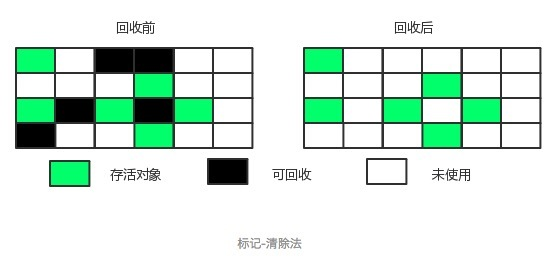


#### 复制算法（Copying）

为了解决标记-清除算法的效率问题，一种称为**“复制”（Copying）**的收集算法出现了，思想为：它**将可用内存按容量分成大小相等的两块**，每次只使用其中的一块。**当这一块内存用完，就将还存活着的对象复制到另一块上面**，然后再把已使用过的内存空间一次清理掉。

这样做使得**每次都是对整个半区进行内存回收**，内存分配时也就**不用考虑内存碎片**等复杂情况，只要**移动堆顶指针，按顺序分配内存**即可，实现简单，运行高效。只是这种算法的代价是**将内存缩小为原来的一半**，代价可能过高了。另外，如果存活对象太多，那么每次复制就比较耗费时间，所以适合**对象的存活率低的场景**。复制算法的执行过程如下图所示：

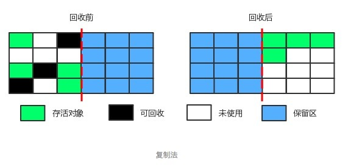


#### 标记－整理算法（Mark-Compact）

**复制算法在对象存活率较高时要进行较多的复制操作，效率将会变低**。更关键的是：如果不想浪费50%的空间，就需要有额外的空间进行分配担保，以应对被使用的内存中所有对象都100%存活的极端情况，所以在**老年代一般不能直接选用复制算法**。

根据老年代的特点，**标记－整理（Mark-Compact）**算法被提出来，主要思想为：此算法的标记过程与**标记－清除**算法一样，但后续步骤不是直接对可回收对象进行清理，而是**让所有存活的对象都向一端移动，然后直接清理掉边界以外的内存。**具体示意图如下所示：

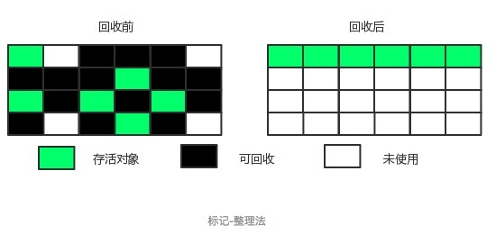


### CMS与G1垃圾回收器


**CMS（Concurrent Mark Sweep）收集器是一种以获取最短回收停顿时间为目标的收集器**。这是因为CMS收集器工作时，GC工作线程与用户线程可以`并发`执行，以此来达到降低收集停顿时间的目的。CMS主要适用于对响应时间的侧重性大于吞吐量的场景。**仅针对老年代（Tenured Generation）的回收**。

其优缺点主要因为以下两个原因：

1. 没有采取compact（整理）操作，而是简单的mark and sweep，同时维护了一个free list来管理内存空间，所以也产生了大量的内存碎片。
2. mark and sweep分为多个阶段，其中大部分的阶段的GC线程是和用户线程并发执行，默认的GC线程数为物理CPU核心数的1/4。

CMS收集器仅作用于**老年代**的收集，是基于`标记-清除算法`的，它的运作过程分为4个步骤：

- 初始标记（CMS initial mark）**初始标记仅仅只是标记一下GC Roots能直接关联到的对象，速度很快**
- 并发标记（CMS concurrent mark）**并发标记阶段就是进行GC Roots Tracing的过程**
- 重新标记（CMS remark）**重新标记阶段则是为了修正并发标记期间因用户程序继续运作而导致标记产生变动的那一部分对象的标记记录，这个阶段的停顿时间一般会比初始阶段稍长一些，但远比并发标记的时间短。**
- 并发清除（CMS concurrent sweep）

其中，`初始标记`、`重新标记`这两个步骤仍然需要Stop-the-world。而

> CMS以流水线方式拆分了收集周期，将耗时长的操作单元保持与应用线程并发执行。只将那些必需STW才能执行的操作单元单独拎出来，控制这些单元在恰当的时机运行，并能保证仅需短暂的时间就可以完成。这样，在整个收集周期内，只有**两次短暂的暂停（初始标记和重新标记）**，**达到了近似并发的目的**。

CMS收集器**优点**：并发收集、低停顿。

CMS收集器**缺点**：

- CMS收集器对CPU资源非常敏感。
- CMS收集器无法处理浮动垃圾（Floating Garbage）。
- CMS收集器是基于标记-清除算法，该算法的缺点都有。

CMS收集器之所以能够做到并发，根本原因在于**采用基于“标记-清除”的算法并对算法过程进行了细粒度的分解**。前面篇章介绍过标记-清除算法将产生大量的内存碎片这对新生代来说是难以接受的，因此新生代的收集器并未提供CMS版本。


G1收集器（或者垃圾优先收集器）的设计初衷是为了尽量缩短处理超大堆时产生的停顿。在回收的时候将对象从一个小堆区复制到另一个小堆区，这意味着G1在回收垃圾的时候同时完成了堆的部分内存压缩，相对于CMS的优势而言就是内存碎片的产生率大大降低。


参考：https://juejin.im/post/5dad5621f265da5bab5bda33

垃圾回收器文档：https://crowhawk.github.io/2017/08/15/jvm_3/


### Serial收集器（复制算法)
Serial收集器是最基本、最悠久的收集器。这是新生代单线程收集器。这里的“单线程”的意义，既是指它只会使用一个CPU和一条收集线程去完成垃圾收集工作，更重要的是在它进行垃圾收集时，必须暂停所有用户线程。

虽然Serial收集器单线程的特点造成用户体验很差，但是它也有巨大的优点点，简单而高效。尤其对于限定单个CPU的环境来说，Serial收集器由于没有线程交互的开销，专心做垃圾收集可以获得最高的单线程手机效率。目前Serial收集器仍是桌面级Client模式下虚拟机的默认新生代收集器。

简而言之，缺点是会造成停顿，优点是简单高效，适合桌面级Client模式。


### 新生代垃圾回收器和老生代垃圾回收器都有哪些？？？

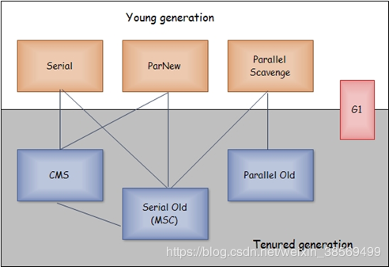


### 新生代垃圾回收机制（Minor GC）

新生代分为Eden和两个Survivor区，比例为8:1:1，对象在被创建时，内存首先是在年轻代进行分配（注意，大对象可以直接在老年代分配）。当年轻代需要回收时会触发Minor GC(也称作Young GC)。

当GC线程启动时，会通过可达性分析法把Eden区和From Space区的存活对象复制到To Space区，然后把Eden Space和From Space区的对象释放掉。当GC轮训扫描To Space区一定次数（15次）后，把依然存活的对象复制到老年代，然后释放To Space区的对象。对于新生代的垃圾回收也叫Minor GC。

> 执行Minor GC的时候，JVM会检查老年代中**最大连续可用空间是否大于了当前新生代所有对象的总大小**(空间担保，确保100%的对象存活的情况也ok)。
>
> 如果大于，则直接执行Minor GC（这个时候执行是没有风险的）。
>
> 如果小于了，JVM会检查是否开启了空间分配担保机制，如果没有开启则直接改为执行Full GC。
>
> 如果开启了，则JVM会检查老年代中最大连续可用空间是否大于了历次晋升到老年代中的平均大小，如果小于则执行改为执行Full GC。 
>
> 如果大于则会执行Minor GC，如果Minor GC执行失败则会执行Full GC


### 老年代垃圾回收机制（Full GC）

老年代用于存放在年轻代中经多次垃圾回收仍然存活的对象，可以理解为比较老一点的对象，例如缓存对象；新建的对象也有可能在老年代上直接分配内存，这主要有两种情况：一种为大对象，另一种为大的数组。

老年代一般使用的算法是*标记-整理算法*


### 永久代的垃圾回收

关于方法区即永久代的回收，永久代的回收有两种：常量池中的常量，无用的类信息，常量的回收很简单，没有引用了就可以被回收。对于无用的类进行回收，必须保证3点：
1. 类的所有实例都已经被回收。
2. 加载类的ClassLoader已经被回收。
3. 类对象的Class对象没有被引用（即没有通过反射引用该类的地方）。永久代的回收并不是必须的，可以通过参数来设置是否对类进行回收。


### Minor GC触发条件

对象内存的分配在Eden区域，当Eden区满时，触发Minor GC。

### Full GC触发条件

1. **调用System.gc时，系统建议执行Full GC，但是不必然执行**
2. 老年代空间不足
3. 方法区空间不足
4. 通过Minor GC后进入老年代的平均大小大于老年代的可用内存
5. 由Eden区、From Space区向To Space区复制时，对象大小大于To Space可用内存，则把该对象转存到老年代，且老年代的可用内存小于该对象大小。

**Full GC的速度一般比Minor GC的速度慢10倍以上。**


### 频繁产生Full GC的原因

- 内存泄露，容器对象中的数据越来越多，占用太多空间导致老年代可用空间不够
- 老年代或者新生代本身空间分配不合理，导致对象分配时空间不足
- 代码中显式调用了System.gc()
- 代码中频繁分配了大对象

问题排查：

1. 通过工具获取java进程的运行时状态，查看垃圾回收日志。
2. 将运行时数据dump到本地文件
3. 使用工具，比如visualVM，分析dump文件，检查什么对象占用的内存空间有异常
4. 根据分析结果，可能是内存参数配置不对，或者是代码中存在内存泄露的问题，找出方案解除问题


## 什么情况会造成内存泄漏

什么是内存泄露：对象已经没有被应用程序使用，但是却不能被垃圾回收器回收，因为还在被引用着。

原因：长生命周期的对象持有短生命周期对象的引用就很可能发生内存泄漏，尽管短生命周期对象已经不再需要，但是**因为长生命周期持有它的引用而导致不能被回收，这就是Java中内存泄漏的发生场景**。


泄露的场景：

- **静态容器的使用**：静态容器对象存在与整个应用程序的声明周期，同时容器中肯能存在大量的对象已经没有被使用，但却被容器对象引用，导致无法被回收。
- **连接或打开文件**：数据库连接、网络连接、打开文件等对象，在没有被显式关闭之前不会被回收，会导致内存泄露。


## 如何排查OOM异常原因

产生OutOfMemoryError错误的原因包括：

1. `java.lang.OutOfMemoryError: Java heap space`
2. `java.lang.OutOfMemoryError: PermGen space`
3. `java.lang.OutOfMemoryError: unable to create new native thread`
4. `java.lang.OutOfMemoryError：GC overhead limit exceeded`


第1种异常，表示Java堆空间不够，当应用程序申请更多的内存，而Java堆内存已经无法满足应用程序对内存的需要，将抛出这种异常。

可能原因：

1. 不良代码导致内存泄露，使得越来越多的对象进入堆空间且不能被垃圾收集器回收。
2. 内存空间的配置在当前环境下不合理，导致无法容纳所需对象。
3. 代码中存在死循环不断申请内存，或者是无限递归导致栈空间不足。


第2种异常，表示Java永久带（方法区）空间不够，永久带用于存放类的字节码和长常量池，类的字节码加载后存放在这个区域，这和存放对象实例的堆区是不同的，大多数JVM的实现都不会对永久带进行垃圾回收，因此，只要类加载的过多就会出现这个问题。一般的应用程序都不会产生这个错误，然而，对于Web服务器来讲，会产生有大量的JSP，JSP在运行时被动态的编译成Java Servlet类，然后加载到方法区，因此，太多的JSP的Web工程可能产生这个异常。

可能原因：

1. 使用CGLib生成了大量的代理类，导致方法区被撑爆
2. 程序生命周期中有大量动态加载的类


第3种异常，本质原因是创建了太多的线程，而能创建的线程数是有限制的，导致了这种异常的发生。

可能原因：

1. 多线程环境下创建了大量线程


第4种异常，是在并行或者并发回收器在GC回收时间过长、超过98%的时间用来做GC并且回收了不到2%的堆内存，然后抛出这种异常进行提前预警，用来避免内存过小造成应用不能正常工作。


### 获取dump文件的方法

要dump堆的内存镜像，可以采用如下两种方式：

- 设置JVM参数`-XX:+HeapDumpOnOutOfMemoryError`，设定当发生OOM时自动dump出堆信息。不过该方法需要JDK5以上版本。
- 使用JDK自带的jmap命令。`jmap -dump:format=b,file=heap.bin <pid>` 其中pid可以通过jps获取。

dump堆内存信息后，需要对dump出的文件进行分析，从而找到OOM的原因。常用的工具有：jvisualvm


## 如何排查CPU使用率原因

使用工具查看是不是java的频繁GC导致的高CPU消耗，如果是，那么从空间的分配和排查内存问题的角度入手。

如果没有内存问题，在Linux环境下（`jps -v`可以直接查看所有java进程，但没有资源消耗情况）

1. 首先使用`ps -ef | grep java`找到所有java的进程（使用jps -v更好，找到目标进程），根据输出信息找到CPU时间消耗最多的目标进程id。
2. 拿到进程pid之后，使用`top -H -p pid`查看该进程下的所有线程资源消耗情况，找出消耗最大的线程tid（十进制）。
3. 使用`jstack -l pid`输出java线程的栈信息，搜索线程tid，找出是什么线程在占用cpu
4. 检查对应代码逻辑，是否存在函数的无限递归或者是死循环。


## 虚拟机中的四种内存屏障

### 可见性（加载/存储屏障）

- 加载屏障(Load Barrier)：作用为从内存中加载数据刷新处理器缓存

- 存储屏障(Story Barrier)：作用为将处理器缓存中的数据冲刷到内存。

### 有序性（获取/释放屏障）

- 获取屏障(Aquire Barrier)：`读|读写`

  获取屏障的使用方式是在一个**读操作之后**插入内存屏障，其作用是禁止该读操作与**其后面的任何读写**操作进行重排序。**保证操作所访问的数据是最新的**

  

- 释放屏障(Release Barrier)：`读写|写`

  释放屏障的使用方式是在一个**写操作之前**插入内存屏障，其作用是禁止该读操作与**其前面的任何读写**操作进行重排序。**保证对数据的操作都结束之后，才会进行写入操作**

  


## volatile如何保证内存可见性

volatile修饰的变量一般作为通知信息的变量，在多线程环境下，如何保证通知变量在逻辑上的正确性（防止被重排序）以及变量的值一定是最新的值（可见性），通过内存屏障的配合使用，能达成相应目标。


### 内存屏障对**写volatile变量**的保护

（**先禁止写操作与前面的读写重排序，然后将变量数据更新到内存**）

**写volatile变量操作与该操作之前的任何读、写操作不会被重排序。**


### 内存屏障对**读volatile变量**的保护

（**先将数据从内存加载到缓存，然后禁止后面的读写与更新变量的操作重排序**）

**读volatile变量操作与该操作之后的任何读、写操作不会被重排序。**


### volatile的开销

volatile修饰的变量的**开销介于普通变量与加锁变量之间**。因为volatile变量没有锁，不存在上下文切换过程，所以比加锁的操纵更快；但因为volatile需要通过内存屏障保证变量的可见性与有序性，导致编译器对指令的优化不及普通变量，所以其性能低于普通变量。


### volatile的适用场景

- 使用volatile修饰的变量作状态标志
- 使用volatile变量替换锁：利用volatile变量的读写操纵具有原子性，可以把一组volatile变量封装成一个对象，那么对这些变量的更新操作就能通过新建一个对象，并替换掉就对象的引用来实现。这个过程中保证了原子性和可见性，从而避免了锁的使用。


## Java内存模型??

java内存模型定义了final，volatile和synchronized关键词的行为并保证正确同步的java程序能够正确运行在不同架构的处理器上。java内存模型从以下几个方法解答了线程安全性问题：

原子性问题

可见性问题

重排序问题


## synchronized与lock的区别

### 内部锁synchronized

**synchronized保障原子性、一致性和可见性**

加锁对象：synchronized作用与实例方法或者一个作用域是，默认使用上下文中的this对象作为加锁对象；作用与静态方法时加锁对象为当前类的Class对象。此外也可以通过为其指定一个加锁对象。

**内部锁仅支持非公平调度**。虚拟机为每个内部锁分配一个入口集合(Entry Set)，记录正在等待该锁的线程，该集合中线程的状态为BLOCKED，当锁被释放时，虚拟机从集合中随机选取一个线程调度。

内部锁的使用比较简单，请求与释放锁都由系统自动完成，即使产生了异常，也能释放锁，不易出错；一般使用在一个函数或者局部代码块中，不能跨方法、跨作用域使用。


**实现机制：**

synchronized原始采用的是CPU悲观锁机制，即线程获得的是独占锁。独占锁意味着其他线程只能依靠阻塞来等待线程释放锁。而在CPU转换线程阻塞时会引起线程上下文切换，当有很多线程竞争锁的时候，会引起CPU频繁的上下文切换导致效率很低；


### 显示锁lock接口

Lock接口通常使用ReentrantLock的实例，加锁对象为该实例本身，默认为非公平锁，也可以通过实例化参数设置为公平锁。

显示锁提供更更丰富的接口和更灵活的使用方式，加锁与释放锁都需要用户显示操作，可以在不同的地方进行请求与释放的操作，因此更容易出错。

**公平锁的适用场景：**适合于锁被持有时间相对长或者线程申请锁的平均时间间隔较长的情况。避免出现饥饿现象。


**实现机制：**

而Lock用的是乐观锁方式。所谓乐观锁就是，**每次不加锁而是假设没有冲突而去完成某项操作，如果因为冲突失败就重试，直到成功为止。**乐观锁实现的机制就是CAS操作（Compare and Swap）。我们可以进一步研究ReentrantLock的源代码，会发现其中比较重要的获得锁的一个方法是compareAndSetState。这里其实就是调用的CPU提供的特殊指令(cmpxchg)。


## 线程的状态

**NEW**: 线程刚创建完成，在调用start方法前的状态。线程的生命周期中只会出现一次这个状态。

**RUNNABLE**：线程调用了start方法，准备就绪，等待CPU调度。

**BLOCKED**：线程被阻塞，可能是等待IO操作或者是请求锁。

**WAITING**：现在执行了某些方法，比如wait,join等，让线程陷入等待状态，等待通知。

**TIMED_WAITING**：与WAITING一样，WAITING可能是无限制等待，TIMED_WAITING等待超过时间上限会返回。

**TERMINATED**：线程任务执行完毕。run方法执行完毕或者抛出异常线程都将进入这个状态。线程的生命周期中只会出现一次这个状态。


## sleep和wait的区别与yield

1. sleep是单个线程自己的状态控制，睡眠一段时间自动醒来，wait是多个线程通信的一种方式，只有在收到notify信息后才会继续执行。
2. 在同步块中，**sleep方法不会释放锁，wait方法会释放锁等待其他线程通知**
3. **sleep必须捕获异常，而wait，notify和notifyAll不需要捕获异常**
4. sleep可以直接使用，**wait只能在sychronized块中调用**。
5. sleep是线程方法，wait是每个对象都有的方法。


sleep与Wait的区别：**sleep是线程方法，wait是object方法**

它们的区别主要考虑两点：1.cpu是否继续执行、2.锁是否释放掉。

sleep ：**释放cpu资源，不释放锁资源，**如果线程进入sleep的话，释放cpu资源，如果外层包有Synchronize，那么此锁并没有释放掉。

wait：**释放cpu资源，也释放锁资源，**一般用于锁机制中 肯定是要释放掉锁的，因为notify并不会立即调起此线程，因此cpu是不会为其分配时间片的，也就是说wait 线程进入等待池，cpu不分时间片给它，锁释放掉。

**(wait用于锁机制，sleep不是，这就是为啥sleep不释放锁，wait释放锁的原因，sleep是线程的方法，跟锁没半毛钱关系，wait，notify, notifyall 都是Object对象的方法，是一起使用的，用于锁机制)**

 

yield：**让出CPU调度**，Thread类的方法，类似sleep只是**不能由用户指定暂停多长时间 ，**并且yield()方法**只能让同优先级的线程**有执行的机会。 yield()只是使当前线程重新回到可执行状态，所以执行yield()的线程有可能在进入**到可执行状态后**马上又被执行。调用yield方法只是一个建议，告诉线程调度器我的工作已经做的差不多了，可以让别的相同优先级的线程使用CPU了，没有任何机制保证采纳。


## 多读少写场景应对
`CopyOnWriteArrayList`这个容器适用于多读少写，该容器读写并不是在同一个对象上。在写时会大面积复制数组，所以写的性能差，在写完成后将读的引用改为执行写的对象

选择使用锁的使用应该使用**读写锁**


## 反射的原理

反射就是指程序在运行时能够动态的获取到一个类的类型信息的一种操作。很多框架提供的一些特性都是靠反射实现的，这也是为什么各类框架都不允许你覆盖掉默认的无参构造器的原因，因为框架需要以反射机制利用无参构造器创建实例。


每一种类类型都会在初次使用时被加载进虚拟机内存的方法区中，保存为一个Class对象，其中包含类中定义的属性字段，方法字节码等信息。Java 中使用类 java.lang.Class 来指向一个类型信息，通过这个 Class 对象，我们就可以得到该类的所有内部信息。而获取一个 Class 对象的方法主要有以下三种。

- `类名.class`：获取Class对象不会导致类的初始化
- `实例.getClass()`
- `Class.forName()`方法：传入一个类全名，该方法会返回方法区代表这个类型的 Class 对象，如果这个类还没有被加载进方法区，forName 会先进行类加载。


拿到了某个类的Class对象之后，通过反射就能获取到类的属性，方法，父类，接口等信息。也可以生成该类的实例（有默认构造方法的前提下），调用该类对象的方法获访问属性（即使是私有方法或者属性，都可以在修改访问权限之后再访问）。


## 写过注解没，知道注解原理吗？

注解定定义与接口类似，定义注解如下：

```java
public @interface TestAnnotation {
	int intv();
    String strv();
}
```

注解是一系列元数据，它提供数据用来解释程序代码，但是注解并非是所解释的代码本身的一部分。注解对于代码的运行效果没有直接影响。

注解通过反射获取。首先可以通过 Class 对象的 isAnnotationPresent() 方法判断它是否应用了某个注解，并可以提取注解中的内容应用到代码中。


## Java 的八种基本数据类型

| 基本类型 | boolean          | byte | char(Unicode) | short | int  | float | long | double |
| -------- | ---------------- | ---- | ------------- | ----- | ---- | ----- | ---- | ------ |
| 位数     | 虚拟机无明确大小 | 8位  | 16位          | 16位  | 32位 | 32位  | 64位 | 64位   |


## Java对象equals和hashCode方法

java代码中，如果两个对象equal的话，那么一定要求这两个对象hashCode方法返回的值相同。否则，在使用hash相关的容器时，将会导致相同的元素，散布在不同的哈希槽中，导致某系错误的产生。

因为在使用哈希容器时，容器首先根据对象的哈希值找到对象应属于的槽，在同一个槽中，进一步比较两个对象的是否equal。

原则：

**equal的对象哈希值必须相同**

**哈希值相同的元素不一定equal**


## JUC包下的内容（计数器，循环栅栏，信号量）？？？


## Java代理

代理模式是常用的java设计模式，他的特征是代理类与委托类有同样的接口，代理类主要负责为委托类预处理消息、过滤消息、把消息转发给委托类，以及事后处理消息等。代理类与委托类之间通常会存在关联关系，一个代理类的对象与一个委托类的对象关联，代理类的对象本身并不真正实现服务，而是通过调用委托类的对象的相关方法，来提供特定的服务。

### 静态代理

静态代理在使用时,需要定义接口或者父类,被代理对象与代理对象一起实现相同的接口或者是继承相同父类.

> 一个接口inter：接口中声明被代理的是什么样的方法。
>
> 一个代理对象proxy：实现接口inter，并持有obj的一个引用，在接口方法中调用obj对象的同名方法。
>
> 一个被代理对象obj：实现接口inter，定义真正需要被使用（被代理）的方法。

优缺点：

- 优点：可以做到在不修改目标对象的功能前提下,对目标功能扩展.
- 缺点：因为代理对象需要与被代理对象实现一样的接口，所以会有较多的类。同时，一旦接口增加方法，目标对象与代理对象都要维护。


### 动态代理

Java动态代理的优势是实现无侵入式的代码扩展，也就是方法的增强；让你可以在不用修改源码的情况下，增强一些方法；在方法的前后你可以做你任何想做的事情（甚至不去执行这个方法就可以）。AOP可以算作是代理模式的一个典型应用。

使用动态代理代理对象不需要实现接口。被代理的类在程序运行时，通过反射机制动态生成。

```java
interface Work { //代理接口
    void doSomething();
    void getMoney();
}
//使用反射，使用更加灵活的动态代理方法
class DynamicProxyHandler implements InvocationHandler {
    private Object proxied; //持有一个被代理的对象
    DynamicProxyHandler(Object proxied) {
        this.proxied = proxied;
    }

    
    /*
     * proxy:  代理对象
     * method: 被调用的方法
     * args:   被调用方法的参数列表
     */
    @Override
    public Object invoke(Object proxy, Method method, Object[] args) 
        throws Throwable {
        // 定义代理方式
        System.out.println(proxy.getClass());
        System.out.println("before " + method);
        return method.invoke(proxied, args); //执行被代理对象的方法
    }
}

class PRT {
    public static void main(String[] args) throws Exception {
        //使用动态代理，
        Work proxy = (Work) Proxy.newProxyInstance(
            	Work.class.getClassLoader(), //一个类加载器
                new Class[] {Work.class},    //希望该代理实现的接口，可以实现多个接口
                new DynamicProxyHandler(new Worker())); //被代理的对象
        proxy.doSomething();
    }
}
```


### cglib动态代理

上面的静态代理和动态代理模式都是要求目标对象是实现一个接口的目标对象，但是有时候目标对象只是一个单独的对象，并没有实现任何的接口，这个时候就可以使用以目标对象子类的方式类实现代理,这种方法就叫做：Cglib代理

Cglib代理也叫作子类代理，它是在内存中构建一个增强子类对象从而实现对目标对象功能的扩展。

- JDK的动态代理有一个限制,就是使用动态代理的对象必须实现一个或多个接口,如果想代理没有实现接口的类,就可以使用Cglib实现.
- Cglib是一个强大的高性能的代码生成包,它可以在运行期扩展java类与实现java接口.它广泛的被许多AOP的框架使用,例如Spring AOP和synaop,为他们提供方法的interception(拦截)
- Cglib包的底层是通过使用一个小而块的字节码处理框架ASM来转换字节码并生成新的类.不鼓励直接使用ASM,因为它要求你必须对JVM内部结构包括class文件的格式和指令集都很熟悉.


## Java的NIO与IO？？？


## Daemon线程及其意义

Java有两种Thread：守护线程、非守护线程

**用户线程：**非守护线程包括常规的用户线程或诸如用于处理GUI事件的事件调度线程，[Java](http://lib.csdn.net/base/javaee)虚拟机在它所有非守护线程已经离开后自动离开。

**守护线程：**守护线程则是用来服务用户线程的，比如说GC线程。如果没有其他用户线程在运行，那么就没有可服务对象，也就没有理由继续下去。（[操作系统](http://lib.csdn.net/base/operatingsystem)里面是没有所谓的守护线程的概念，只有守护进程一说，但是Java语言机制是构建在JVM的基础之上的，意思是Java平台把操作系统的底层给屏蔽起来，所以它可以在它自己的虚拟的平台里面构造出对 自己有利的机制，而语言或者说平台的设计者多多少少是受到Unix思想的影响，而守护线程机制又是对JVM这样的平台凑合，于是守护线程应运而生）;

守护线程使用的情况较少，但并非无用，举例来说，JVM的垃圾回收、内存管理等线程都是守护线程。还有就是在做[数据库](http://lib.csdn.net/base/mysql)应用时候，使用的数据库连接池，连接池本身也包含着很多后台线程，监控连接个数、超时时间、状态等等。

**守护线程与用户线程的唯一区别是**：其实User Thread线程和Daemon Thread守护线程本质上来说去没啥区别的，唯一的区别之处就在虚拟机的离开，**当JVM中所有的线程都是守护线程的时候，JVM就可以退出了**（如果User Thread全部撤离，那么Daemon Thread也就没啥线程好服务的了，所以虚拟机也就退出了）；如果还有一个或以上的非守护线程则不会退出。（以上是针对正常退出，调用System.exit则必定会退出）。

举个例子：就像天上人间的保安 （守护线程），里面有牌位姑娘（非守护线程），他们是可以同时干着各自的活儿，但是 姑娘们要是都被JC带走了，那么门口的保安也就没有存在的意义了。


## Java多线程之间的通讯和协作

wait/notify

synchronized加共享变量

Lock

阻塞队列

信号量

管道

join


## 线程阻塞和等待的区别

**BLOCKED**：线程被阻塞，可能是等待IO操作或者是请求锁。

**WAITING**：现在执行了某些方法，比如wait,join等，让线程陷入等待状态，等待通知。


## Java锁有哪些种类，以及区别

### 公平锁/非公平锁
这个是在ReentrankLock中实现的，synchronized没有，是用一个队列实现的，在公平锁好理解，就是先进这个队列的，也先出队列获得资源，而非公平锁的话，则是还没有进队列之前可以与队列中的线程竞争尝试获得锁，如果获取失败，则进队列，此时也是要乖乖等前面出队才行

### 可重入锁
可重入锁，也叫做递归锁。如果一个线程获得过该锁，可以再次获得。主要是用途就是在递归方面，还有就是防止死锁，比如在一个同步方法块中调用了另一个相同锁对象的同步方法块

### 独享锁/共享锁
共享锁可以由多个线程获取使用，而独享锁只能由一个线程获取。
对ReentrantReadWriteLock其读锁是共享锁，其写锁是独占锁
读锁的共享锁可保证并发读是非常高效的，读写，写读，写写的过程是互斥的。其中获得写锁的线程还能同时获得读锁，然后通过释放写锁来降级。读锁则不能升级

### 互斥锁/读写锁
 上面讲的独享锁/共享锁就是一种广义的说法，互斥锁/读写锁就是具体的实现。
 互斥锁在Java中的具体实现就是ReentrantLock
 读写锁在Java中的具体实现就是ReadWriteLock


### 乐观锁/悲观锁

**悲观锁与乐观锁是两种概念上的锁，并不是实际的锁**

**悲观锁**：假定会发生并发冲突，屏蔽一切可能违反数据完整性的操作。

悲观锁（Pessimistic Lock），顾名思义，就是很悲观，每次去拿数据的时候都认为别人会修改，所以每次在拿数据的时候都会上锁，这样别人想拿这个数据就会block直到它拿到锁。


**乐观锁**：假设不会发生并发冲突，只在提交操作时检查是否违反数据完整性。

乐观锁（Optimistic Lock），顾名思义，就是很乐观，每次去拿数据的时候都认为别人不会修改，所以不会上锁，但是在提交更新的时候会判断一下在此期间别人有没有去更新这个数据。**乐观锁适用于读多写少（CAS可以较轻易的拿到锁）的应用场景，这样可以提高吞吐量。**


### 偏向锁/轻量级锁/重量级锁
偏向锁指的是当前只有这个线程获得，没有发生争抢，此时将方法头的markword设置成0，然后每次过来都cas一下就好，不用重复的获取锁

轻量级锁：在偏向锁的基础上，有线程来争抢，此时膨胀为轻量级锁，多个线程获取锁时用cas自旋获取，而不是阻塞状态

重量级锁：轻量级锁自旋一定次数后，膨胀为重量级锁，其他线程阻塞，当获取锁线程释放锁后唤醒其他线程。（线程阻塞和唤醒比上下文切换的时间影响大的多，涉及到用户态和内核态的切换）
 自旋锁：在没有获取锁的时候，不挂起而是不断轮询锁的状态


## 悲观锁乐观锁的实现方式？？？

乐观锁的实现使用CAS

悲观锁的实现使用synchronized或者ReentrantLock


> CAS 是怎么实现线程安全的？

线程在读取数据时不进行加锁，在准备写回数据时，先去查询原值，操作的时候比较原值是否修改，若未被其他线程修改则写回，若已被修改，则重新执行读取流程。


synchronized 应用在方法上时，在字节码中是通过方法的 ACC_SYNCHRONIZED 标志来实现的。

synchronized 应用在同步块上时，在字节码中是通过 monitorenter 和 monitorexit 实现的。

https://mp.weixin.qq.com/s/WtAdXvaRuBZ-SXayIKu1mA


## 设计模式，举例说说在jdk源码

### 单例模式

单例模式有很多种写法，大部分写法都或多或少有一些不足。下面将分别对这几种写法进行介绍。

#### 1、饿汉模式

```java
public class Singleton{
    private static Singleton instance = new Singleton();
    private Singleton(){}
    public static Singleton newInstance(){
        return instance;
    }
}
```

- 从代码中我们看到，类的构造函数定义为private的，保证其他类不能实例化此类，然后提供了一个静态实例并返回给调用者。饿汉模式是最简单的一种实现方式，**饿汉模式在类加载的时候就对实例进行创建，实例在整个程序周期都存在**。
- 它的**好处**是只**在类加载的时候创建一次实例**，不会存在多个线程创建多个实例的情况，**避免了多线程同步的问题**。
- 它的**缺点**也很明显，即使这个单例没有用到也会被创建，而且在类加载之后就被创建，**内存就被浪费**了。
-  这种实现方式**适合**单例**占用内存比较小**，在初始化时就会被用到的情况。但是，如果单例占用的内存比较大，或单例只是在某个特定场景下才会用到，使用饿汉模式就不合适了，这时候就需要用到懒汉模式进行延迟加载。

 

#### 2、懒汉模式

```java
public class Singleton{
    private static Singleton instance = null;
    private Singleton(){}
    public static synchronized Singleton newInstance(){
        if(null == instance){  // Single Checked
            instance = new Singleton();
        }
        return instance;
    }
}
```

- **好处：懒汉模式中单例是在需要的时候才去创建的**，如果单例已经创建，再次调用获取接口将不会重新创建新的对象，而是直接返回之前创建的对象。
- **适用于：**如果某个单例使用的次数少，并且创建单例消耗的资源较多，那么就需要实现单例的按需创建，这个时候使用懒汉模式就是一个不错的选择。


#### 3、双重校验锁【推荐】

- 加锁的懒汉模式看起来即解决了线程并发问题，又实现了延迟加载，然而它存在着性能问题，依然不够完美。
- synchronized修饰的同步方法比一般方法要慢很多，如果多次调用getInstance()，累积的性能损耗就比较大了。
- 因此就有了双重校验锁，先看下它的实现代码。

```java
public class Singleton {
    private static Singleton instance = null;
    private Singleton(){}
    public static Singleton getInstance() {
        if (instance == null) {   // Single Checked
            synchronized (Singleton.class) {
                if (instance == null) { // Double checked
                    instance = new Singleton();
                }
            }
        }
        return instance;
    }
}
```

- 可以看到上面在同步代码块外多了一层instance为空的判断。由于单例对象只需要创建一次，如果后面再次调用getInstance()只需要直接返回单例对象。
- 因此，大部分情况下，调用getInstance()都不会执行到同步代码块，从而提高了程序性能。
- 不过还需要考虑一种情况，假如两个线程A、B，A执行了if (instance == null)语句，它会认为单例对象没有创建，此时线程切到B也执行了同样的语句，B也认为单例对象没有创建，然后两个线程依次执行同步代码块，并分别创建了一个单例对象。为了解决这个问题，还需要在同步代码块中增加if (instance == null)语句，也就是上面看到的代码中的校验2。
- 双检锁隐患：

> 我们看到双重校验锁即实现了延迟加载，又解决了线程并发问题，同时还解决了执行效率问题，是否真的就万无一失了呢？

 

- 这里要提到**Java中的指令重排优化**。所谓**指令重排优化是指在不改变原语义的情况下，通过调整指令的执行顺序让程序运行的更快**。
- JVM中并没有规定编译器优化相关的内容，也就是说**JVM可以自由的进行指令重排序的优化**。
- 这个问题的关键就在于**由于指令重排优化的存在，导致初始化Singleton*和*将对象地址赋给instance字段*的顺序是不确定的。***
- 在某个线程创建单例对象时，在构造方法被调用之前，就为该对象分配了内存空间并将对象的字段设置为默认值。
- 此时就可以将分配的内存地址赋值给instance字段了，然而该对象可能还没有初始化。若紧接着另外一个线程来调用getInstance，取到的就是状态不正确的对象，程序就会出错。

- **在JDK1.5及之后版本增加了volatile关键字**，volatile的一个语义是禁止指令重排序优化，也就保证了instance变量被赋值的时候对象已经是初始化过的，从而避免了上面说到的问题。

- 代码如下：

  ```java
  public class Singleton {
      private static volatile Singleton instance = null;
      private Singleton(){}
      public static Singleton getInstance() {
          if (instance == null) { // Single Checked
              synchronized (Singleton.class) {
                  if (instance == null) { // Double checked
                      instance = new Singleton();
                  }
              }
          }
          return instance;
      }
  }
  ```


#### 4、静态内部类【推荐】

- 除了上面的三种方式，还有另外一种实现单例的方式，通过静态内部类来实现。

- 首先看一下它的实现代码：

  ```java
  public class Singleton{
      private static class SingletonHolder{
          public static Singleton instance = new Singleton();
      }
      private Singleton(){}
      public static Singleton newInstance(){
          return SingletonHolder.instance;
      }
  }
  ```
  
   
  
-  这种方式同样利用了**类加载机制**来保证只创建一个instance实例。它与饿汉模式一样，也是利用了类加载机制，因此不存在多线程并发的问题。

- 不一样的是，它是在内部类里面去创建对象实例。

- 这样的话，只要应用中不使用内部类，JVM就不会去加载这个单例类，也就不会创建单例对象，从而实现懒汉式的延迟加载。也就是说这种方式**可以同时保证延迟加载和线程安全**。


### 模板模式

在模板模式（Template Pattern）中，一个抽象类公开定义了执行它的方法的方式/模板。它的子类可以按需要重写方法实现，但调用将以抽象类中定义的方式进行。即：定义一个操作中的算法的骨架，而将一些步骤延迟到子类中。模板方法使得子类可以不改变一个算法的结构即可重定义该算法的某些特定步骤。

比如java中的基类继承和接口方法的设计都是属于模板模式


### 责任链模式


### 工厂模式

工厂模式将创建对象的工作转移到了工厂类，通过这样的途径，使用户通过工厂方法拿到的对象就是已经定制好的对象。

工厂模式中，类分为两类：

- 产品类：工厂模式需要定义一个接口或者基类对工厂生产的对象做一个抽象，和一系列具体的产品类。工厂类的生产方法返回这种类型的对象。
- 工厂类：工厂类可以是实现一个工厂接口，或者是直接定义相关的对象生产方法，该方法的返回类型就是所生产对象的基类。


工厂模式可以降低代码重复，如果创建对象B的过程都很复杂，需要一定的代码量，而且很多地方都要用到，那么就会有很多的重复代码。我们可以这些创建对象B的代码放到工厂里统一管理。既减少了重复代码，也方便以后对B的创建过程的修改维护。

因为工厂管理了对象的创建逻辑，使用者并不需要知道具体的创建过程，只管使用即可，减少了使用者因为创建逻辑导致的错误


### 代理模式

参考“java代理”这一节


## 多线程的锁优化

- 锁消除（通过推断，如果得出一个加锁区域不会被多个线程同时执行的情况，那么把这个区域的锁移除以提升效率）
- 锁粗化（扩大封锁的粒度，但会降低并发度）
- 偏向锁（有点代码局部性原理的感觉，意思是这个锁会偏向于首先获得它的线程，如果在接下来的执行过程中，该锁没有被其他的线程获取，则持有偏向锁的线程将永远不需要再进行同步）
- 适应性锁与自旋锁（使用忙等来降低上下文切换带来的开销）


## 死锁产生的必要条件

- 资源互斥
- 资源不可抢夺
- 持有资源并请求其他资源（使用粗化锁，一次性给足全部资源）
- 循环等待（给所有资源全局唯一编号，所有线程按顺序请求资源）


## 线程池

线程池内部预先创建一定数量的工作线程，客户端有任务时并不是从线程池中取出一个线程，而是将任务提交到线程池，线程池将这些任务缓存到一个队列，然后从中取出任务相继执行。

### 线程池参数

线程池有三个参数：

- 当前线程池大小：线程池中实际的工作线程数量
- 最大线程池大小：线程池中允许的工作线程的数量上限
- 核心线程池大小：表示一个不大于最大线程池大小的工作线程数量上限（相当于池中的默认工作线程数/也就是任务需要排队的临界值）

三种关系满足以：

​	`当前线程池大小<核心线程池大小<最大线程池大小`  或者 `核心线程池大小<=当前线程池大小<=最大线程池大小`


### 线程池参数的特性

1. 如果此时线程池中的数量小于corePoolSize，即使线程池中的线程都处于空闲状态，也要创建新的线程来处理被添加的任务。

2. 如果此时线程池中的数量等于corePoolSize，但是缓冲队列 workQueue未满，那么任务被放入缓冲队列。

3. 如果此时线程池中的数量大于corePoolSize，缓冲队列workQueue满，并且线程池中的数量小于maximumPoolSize，建新的线程来处理被添加的任务。

4. 如果此时线程池中的数量大于corePoolSize，缓冲队列workQueue满，并且线程池中的数量等于maximumPoolSize，那么通过 handler所指定的策略来处理此任务。也就是：处理任务的优先级为：核心线程corePoolSize、任务队列workQueue、最大线程maximumPoolSize，如果三者都满了，使用handler处理被拒绝的任务。  

5. **当线程池中的线程数量大于 corePoolSize时，如果某线程空闲时间超过keepAliveTime，线程将被终止。这样，线程池可以动态的调整池中的线程数**。

Java Executor框架就是线程池的实现，该框架中提供了多种可供选择的不同线程池实现。

### 线程池的优点

第一：**降低资源消耗**。通过重复利用已创建的线程降低线程创建和销毁造成的消耗。

第二：**提高响应速度**。当任务到达时，任务可以不需要的等到线程创建就能立即执行。

第三：**提高线程的可管理性**。线程是稀缺资源，如果无限制的创建，不仅会消耗系统资源，还会降低系统的稳定性，使用线程池可以进行统一的分配，调优和监控。

第四：**让使用者更专注于业务本身**。避免了代码中显式的创建线程。


### 线程池的拒绝策略

RejectedExecutionHandler提供了四种方式来处理任务拒绝策略

1、直接丢弃，不抛出异常。（DiscardPolicy）适用于要求不严格的场景

2、丢弃队列中最老的任务(DiscardOldestPolicy)。

3、抛异常(AbortPolicy)（**默认**）

4、将任务分给调用线程来执行(CallerRunsPolicy)。（调用线程直接调用任务的run方法）

在创建线程池的时候使用ThreadPoolExecutor，在构造函数中可以指定（核心数，最大数，超时时间，等待队列，拒绝策略，线程工厂），不要直接使用Executor，或者将最大数设置为整数最大值，或者使用无限队列，否则可能导致OOM

除了以上几种策略，也可以通过实现RejectedExecutionHandler 接口自定义拒绝策略，然后在创建线程池的时候传入自定义的策略。


### 线程池的使用

#### 提交任务

可以使用execute提交的任务，但是execute方法没有返回值，所以无法判断任务知否被线程池执行成功。

也可以使用submit 方法来提交任务，它会返回一个future,那么我们可以通过这个future来判断任务是否执行成功，通过future的get方法来获取返回值，get方法会阻塞住直到任务完成，而使用get(long timeout, TimeUnit unit)方法则会阻塞一段时间后立即返回，这时有可能任务没有执行完。


#### 关闭线程池

使用线程池的shutdown()或shutdownNow()方法可以关闭线程池，但是它们的实现原理不同，

- shutdown()：*已经提交*的任务会继续执行，而*新提交*的任务会像线程池饱和时一样被拒绝掉。shutdown方法返回时，线程池中可能还有正在工作的线程。
- shutdownNow()：使用该方法的时候，*正在执行*的任务会被暂停，*已提交还没运行*的任务将不会被执行，最后**返回的是已经提交但还没有被执行的任务列表**。shutdownNow()内部会调用工作者线程的interrupt方法来停止正在执行的任务，因此，某些无法响应中断的线程可能永远也不会停止。所以只有在关闭线程池的时候保证我们已经提交的任务都已经执行完毕且没有新的任务提交，那么执行该方法就是安全的。


### 线程池的配置

要想合理的配置线程池，就必须首先分析任务特性，可以从以下几个角度来进行分析：

1. 任务的性质：CPU密集型、IO密集型、混合型任务。
2. 任务的优先级：高，中和低。
3. 任务的执行时间：长，中和短。
4. 任务的依赖性：是否依赖其他系统资源，如数据库连接。

任务性质不同的任务可以用不同规模的线程池分开处理。

- CPU密集型任务配置尽可能少的线程数量，如配置Ncpu+1个线程的线程池。
- IO密集型任务则由于需要等待IO操作，线程并不是一直在执行任务，则配置尽可能多的线程，如2*Ncpu。
- 混合型的任务，如果可以拆分，则将其拆分成一个CPU密集型任务和一个IO密集型任务，只要这两个任务执行的时间相差不是太大，那么分解后执行的吞吐率要高于串行执行的吞吐率，如果这两个任务执行时间相差太大，则没必要进行分解。我们可以通过Runtime.getRuntime().availableProcessors()方法获得当前设备的CPU个数。

优先级不同的任务可以使用优先级队列PriorityBlockingQueue来处理。它可以让优先级高的任务先得到执行，需要注意的是如果一直有优先级高的任务提交到队列里，那么优先级低的任务可能永远不能执行。

执行时间不同的任务可以交给不同规模的线程池来处理，或者也可以使用优先级队列，让执行时间短的任务先执行。

依赖数据库连接池的任务，因为线程提交SQL后需要等待数据库返回结果，如果等待的时间越长CPU空闲时间就越长，那么线程数应该设置越大，这样才能更好的利用CPU。

**建议使用有界队列**，有界队列能增加系统的稳定性和预警能力，可以根据需要设大一点，比如几千。有一次我们组使用的后台任务线程池的队列和线程池全满了，不断的抛出抛弃任务的异常，通过排查发现是数据库出现了问题，导致执行SQL变得非常缓慢，因为后台任务线程池里的任务全是需要向数据库查询和插入数据的，所以导致线程池里的工作线程全部阻塞住，任务积压在线程池里。如果当时我们设置成无界队列，线程池的队列就会越来越多，有可能会撑满内存，导致整个系统不可用，而不只是后台任务出现问题。当然我们的系统所有的任务是用的单独的服务器部署的，而我们使用不同规模的线程池跑不同类型的任务，但是出现这样问题时也会影响到其他任务。


### 阻塞队列分类

按空间大小划分有：

- **有界队列(Bounded Queue)**。有界队列的容量在使用前有用户指定容量大小
- **无界队列(Unbounded Queue)**。无界队列的容量大小为`Integer.MAX_VALUE`


按数据结构划分有：

- **ArrayBlockingQueue**。内部使用数组来存储数据，数组的空间是预先分配的，所以在**工作期间不存在存储空间的申请与释放**，没有垃圾回收的负担。但由于**消费者的`take`和生产者`put`的操作都是使用同一个锁**，在高并发情况下由于频繁的锁申请与释放会导致较多的上下文切换

- **LinkedBlockingQueue**。内部使用链表来存储数组，存储数据没有容量的上限，并且**消费者的`take`和生产者`put`的操作同步在不同的锁上（putLock和takeLock），所以相对数组实现的队列，有更少的上下文切换**；但由于每次加入和取出数据都有链表节点对象的申请与释放，需要消耗时间，同时也会增加垃圾回收的负担。另外**LinkedBlockingQueue**使用了一个**AtomicInteger**来维持队列的`size`，而生产与消费过程对这个变量的更新也会产生额外开销。

- **SynchronousQueue**。没有存储元素的空间，但实际上可以看成是只有一个存储的特殊队列。生产者执行`synchronousQueue.put(E)`时如果没有消费线程执行`synchronousQueue.take`消费，那么生产者线程将会被阻塞，知道消费者线程消费；类似的，如果消费者线程执行执行`synchronousQueue.take`时，生产者没有生产数据，消费者会被暂停直到生产者生产了数据。


### 队列的选用原则

1. 如果线程的并发度较高，优先选择**LinkedBlockingQueue**
2. 如果线程的并发度一般，一般选择**ArrayBlockingQueue**
3. 如果生产者与消费者的生产能力与消费能力相当，选择**SynchronousQueue**


## ThreadLocal？？？？？？？？？？

### ThreadLocal的使用场景


## java深拷贝浅拷贝

### 浅拷贝

被复制对象的所有变量都含有与原来的对象相同的值，而所有的对其他对象的引用仍然指向原来的对象。换言之，浅复制仅仅复制所考虑的对象，而不复制它所引用的对象。（**值层面上的复制，引用或者基本类型的值**）

### 深拷贝

被复制对象的所有变量都含有与原来的对象相同的值，除去那些引用其他对象的变量。那些引用其他对象的变量将指向被复制过的新对象，而不再是原有的那些被引用的对象。换言之，深复制把要复制的对象所引用的对象都复制了一遍。（**复制基本类型的值，对于引用类型，从新复制一份新的对象，使得原始对象和拷贝对象引用的属性指向不同的对象**）

### 序列化

可以通过序列化的方式来实现对象的深拷贝，其过程为先将对象序列化到文件，在将其从文件反序列化出来。这个过程需要对磁盘做一次写和读的操作。


## Java类加载机制

Java虚拟机把描述类的数据从Class文件加载到内存，并对数据进行校验、转换解析和初始化，最终形成可以被虚拟机直接使用的Java类型，这就是虚拟机的加载机制。* Class文件由类装载器装载后，在JVM中将形成一份描述Class结构的元信息对象，通过该元信息对象可以获知Class的结构信息：如构造函数，属性和方法等，Java允许用户借由这个Class相关的元信息对象间接调用Class对象的功能,这里就是我们经常能见到的Class类。


### 类与类加载器

对于任何一个类，都需要由加载它的类加载器和这个类来确立其在JVM中的唯一性。也就是说，两个类来源于同一个Class文件，并且被同一个类加载器加载，这两个类才相等。


- **Bootstrap ClassLoader (启动类加载器)**：负责加载JAVA_HOME\lib目录中并且能被虚拟机识别的类库到JVM内存中，如果名称不符合的类库即使放在lib目录中也不会被加载。该类加载器无法被Java程序直接引用。

- **Extension ClassLoader (扩展类加载器)**：该加载器主要是负责加载JAVA_HOME\lib\，该加载器可以被开发者直接使用。

- **Application ClassLoader (应用程序类加载器)**：该类加载器也称为系统类加载器，它负责加载用户类路径（Classpath）上所指定的类库，开发者可以直接使用该类加载器，如果应用程序中没有自定义过自己的类加载器，一般情况下这个就是程序中默认的类加载器。

  


类加载器层次关系：

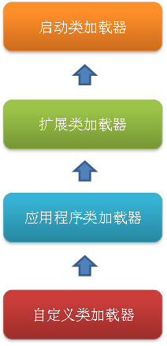

如上图所示的类加载器之间的这种层次关系，就称为类加载器的双亲委派模型（Parent Delegation Model）。该模型**要求除了顶层的启动类加载器外，其余的类加载器都应当有自己的父类加载器**。子类加载器和父类加载器不是以继承（Inheritance）的关系来实现，而是通过组合（Composition）关系来复用父加载器的代码。

双亲委派模型的工作过程为：在类加载的时候，系统会首先判断当前类是否被加载过。已经被加载的类会直接返回，否则才会尝试加载。加载的时候，首先会把该请求委派该父类加载器的 `loadClass()` 处理，因此所有的请求最终都应该传送到顶层的启动类加载器 `BootstrapClassLoader` 中。当父类加载器无法处理时，才由自己来处理。当父类加载器为null时，会使用启动类加载器 `BootstrapClassLoader` 作为父类加载器。

使用这种模型来组织类加载器之间的关系的好处是Java类随着它的类加载器一起具备了一种带有优先级的层次关系。例如java.lang.Object类，无论哪个类加载器去加载该类，最终都是由启动类加载器进行加载，因此Object类在程序的各种类加载器环境中都是同一个类。否则的话，如果不使用该模型的话，如果用户自定义一个java.lang.Object类且存放在classpath中，那么系统中将会出现多个Object类，应用程序也会变得很混乱。如果我们自定义一个rt.jar中已有类的同名Java类，会发现JVM可以正常编译，但该类永远无法被加载运行。


###  什么时候需要自己实现类加载器

当JDK提供的类加载器实现无法满足我们的需求时，才需要自己实现类加载器。

现有应用场景：OSGi、代码热部署等领域。

另外，根据上述类加载器的作用，可能有以下几个场景需要自己实现类加载器

- 当需要在自定义的目录中查找class文件时（或网络获取）
- class被类加载器加载前的加解密（代码加密领域）

**tomcat就实现了自己的类加载器，因为需要加载的jsp编译的class文件并没有在系统定义的类加载器的搜索路径中**


## 类的生命周期

### 类加载流程

一个类的完整生命周期如下：


使用类的三个准备步骤：

1. **加载**，由类加载器执行，根据类名查找字节码，根据字节码在内存中生成一个代表该类的 Class 对象
2. **链接**，在链接阶段将**验证**类中的字节码，为静态域**分配存储空间**，如果必须的话，将解析这个类创建的对其他类的所有引用。（**static final变量在分配存储空间时直接给值，static变量仅分配空间，在初始化阶段赋值**）
3. **初始化**，执行静态初始化器和静态代码块。如果该类有超类，则对其初始化。


### 类卸载

卸载类即该类的Class对象被GC。

卸载类需要满足3个要求:

1. 该类的所有的实例对象都已被GC，也就是说堆不存在该类的实例对象。
2. 该类没有在其他任何地方被引用
3. 该类的类加载器的实例已被GC

所以，在JVM生命周期类，由jvm自带的类加载器加载的类是不会被卸载的。但是由我们自定义的类加载器加载的类是可能被卸载的。


## Java集合框架

### Java基本类型对应对象的缓存

对常用的数值类型进行缓存之后，即使某个数字被弃用，那么该对象也不符合垃圾回收器的条件，因为始终cache中始终有指向该数值对象的应用。

各个对象缓存范围如下：

| 类型     | Boolean | Byte   | Character | Short       | Integer     | Long        | Float | Double |
| -------- | ------- | ------ | --------- | ----------- | ----------- | ----------- | ----- | ------ |
| 缓存范围 | 全缓存  | 全缓存 | [0, 127]  | [-128, 127] | [-128, 127] | [-128, 127] | 无    | 无     |

**当非使用显示的new对象时，系统就会使用缓存中的对象**，比如使用Integer，如下写法就不会产生新的对象：

```java
Integer i = 123;
Integer j = Integer.valueOf(123)
//j == i为true。i,j都是使用的缓存中的123
```

另外，虚拟机在server模式下，使用-XX:AutoBoxCacheMax=NNN参数即可将Integer的自动缓存区间设置为[-128,NNN]。注意区间的下界固定在-128不可配置。 


### ArrayList与Vector对比

|              | ArrayList   | Vector    |
| ------------ | ----------- | --------- |
| 初始长度     | 10          | 10        |
| 扩容倍数     | 扩容到1.5倍 | 扩容到2倍 |
| 是否线程安全 | 非线程安全  | 线程安全  |

两者的扩容方式都是：**创建一个新容量的数组，然后将旧数组的数据复制到新数组，最后将引用指向这个新数组，原数组被抛弃**


### HashMap和HashTable的区别

HashTable的方法是synchronized修饰的，而 HashMap 不是，在多个线程访问 Hashtable 时，不需要自己为它的方法实现同步，而 HashMap 就必须为之提供外同步

HashMap允许将 null 作为一个 entry 的 key 或者 value，而 Hashtable 不允许

HashTable内部的结构为**数组+连接**的形式，HashMap的内部结构是**数组+链表/红黑树**的形式

HashMap重新计算了哈希值`Objects.hashCode(key) ^ Objects.hashCode(value);`，HashTable使用的就是原始的哈希。


> The <tt>HashMap</tt>class is roughly equivalent to <tt>Hashtable</tt>, except that it is unsynchronized and permits nulls


### 为什么HashMap不是线程安全的，有什么问题

在JDK8中，当链表长度达到8，会转化成红黑树，以提升它的查询、插入效率。

Java的HashMap是非线程安全的。多线程下应该用ConcurrentHashMap。

多线程下[HashMap]的问题（这里主要说死循环问题）：
1、多线程put操作后，get操作导致死循环。
2、多线程put非NULL元素后，get操作得到NULL值。
3、多线程put操作，导致元素丢失。

1、为何出现死循环？
HashMap是采用链表解决Hash冲突，因为是链表结构，那么就很容易形成闭合的链路，这样在循环的时候只要有线程对这个HashMap进行get操作就会产生死循环。
在单线程情况下，只有一个线程对HashMap的数据结构进行操作，是不可能产生闭合的回路的。
那就只有在多线程并发的情况下才会出现这种情况，那就是在put操作的时候，如果size>initialCapacity*loadFactor，那么这时候HashMap就会进行rehash操作，随之HashMap的结构就会发生翻天覆地的变化。很有可能就是在两个线程在这个时候同时触发了rehash操作，产生了闭合的回路。


#### 证明HashMap不安全的一段代码

```java
public static void main(String[] args) {
    final Map<Integer, String> map = new HashMap<>();

    final Integer targetKey = 0b1111_1111_1111_1111; // 65 535
    final String targetValue = "v";
    map.put(targetKey, targetValue);

    new Thread(() -> {//不断向map中写入数据
        IntStream.range(0, targetKey).forEach(key -> map.put(key, "someValue"));
    }).start();

    while (true) {//不断从map中读取数据，当正好遇到map扩容的时候，读到的数据将会是null,抛出异常
        if (!targetValue.equals(map.get(targetKey))) {
            throw new RuntimeException("HashMap is not thread safe.");
        }
    }
}
```


## Java如何实现多态的，接口和虚函数怎么调用

### 动态绑定

运行时根据具体对象的类型进行绑定。若一种语言实现了后期绑定，同时必须提供一些机制，可在运行期间判断对象的类型，并分别调用适当的方法。也就是说，编译器此时依然不知道对象的类型，但方法调用机制能自己去调查，找到正确的方法主体。不同的语言对后期绑定的实现方法是有所区别的。但我们至少可以这样认为：它们都要在对象中安插某些特殊类型的信息。

动态绑定的过程：
 虚拟机提取对象的实际类型的方法表；
 虚拟机在表中所有存在与父类的方法；
 调用方法。

转型后只能调用父类中的同名方法，因为被子类重写，那么就调用被重写后的方法，这种可被重写的方法也称为虚方法。

**运行时（动态）绑定针对的范畴只是对象的方法，访问属性的时候，访问的是声明对象类的属性，而不是实际对象的属性。**

**动态绑定仅针对方法|动态绑定仅针对方法|动态绑定仅针对方法**。


### 静态绑定

静态绑定是指：在编译期，加载类的时候，就已经确定的类和方法的引用关系。这些引用关系存放于方法区，方法区中有：类信息，静态变量，常量池，以及编译期间产生的一些数据。

**静态绑定是对一些在程序运行前已经确定对应关系的类和方法的预加载**，静态绑定包括的内容的不仅仅是方法表，还有private，static，final修饰的属性和方法，其中的private不能被继承也不能被重写，在查看源码时，我们可以发现private是被final关键字修饰的，因此private修饰的方法也会被静态绑定；被static修饰的方法和属性是属于类的，它们存放在JVM方法区中，被该类的所有对象所共享。

**重载就是使用的静态绑定，因为重载函数在运行前编译器就能根据传入参数的类型确定具体的方法。**


## Object类的源码

Object类是所有java类的基类，该类中定义的方法均为native方法，也就是通过本地C语言实现的。

Object类中有以下方法：

1．**clone方法**：保护方法，实现对象的浅复制，只有实现了Cloneable接口才可以调用该方法，否则抛出CloneNotSupportedException异常。

2．**getClass方法**：final方法，获得运行时类型。

3．**toString方法**：该方法用得比较多，一般子类都有覆盖。

4．**finalize方法**：该方法用于释放资源。因为无法确定该方法什么时候被调用，很少使用。

5．**equals方法**：该方法是非常重要的一个方法。一般equals和==是不一样的，但是在Object中两者是一样的。子类一般都要重写这个方法。

6．**hashCode方法**：该方法用于哈希查找，重写了equals方法一般都要重写hashCode方法。这个方法在一些具有哈希功能的Collection中用到。**在Object中，hashCode返回的是对象所在的内存地址**

**一般必须满足`obj1.equals(obj2)==true`。可以推出`obj1.hash- Code()==obj2.hashCode()`，但是hashCode相等不一定就满足equals。不过为了提高效率，应该尽量使上面两个条件接近等价。**

7．**wait方法**：wait方法就是使当前线程等待该对象的锁，当前线程必须是该对象的拥有者，也就是具有该对象的锁。wait()方法一直等待，直到获得锁或者被中断。wait(long timeout)设定一个超时间隔，如果在规定时间内没有获得锁就返回。

    调用该方法后当前线程进入睡眠状态，直到以下事件发生。
    
    （1）其他线程调用了该对象的notify方法。
    
    （2）其他线程调用了该对象的notifyAll方法。
    
    （3）其他线程调用了interrupt中断该线程。
    
    （4）时间间隔到了。
    
    此时该线程就可以被调度了，如果是被中断的话就抛出一个InterruptedException异常。

8．**notify方法**：该方法唤醒在该对象上等待的某个线程。

9．**notifyAll方法**：该方法唤醒在该对象上等待的所有线程。


## 惊群问题

### 惊群效应是什么

惊群效应（thundering herd）是指多进程（多线程）在同时阻塞等待同一个事件的时候（休眠状态），如果等待的这个事件发生，那么他就会唤醒等待的所有进程（或者线程），但是最终却只能有一个进程（线程）获得这个时间的“控制权”，对该事件进行处理，而其他进程（线程）获取“控制权”失败，只能重新进入休眠状态，这种现象和性能浪费就叫做惊群效应。

### 惊群效应消耗了什么

Linux 内核对用户进程（线程）频繁地做无效的调度、上下文切换等使系统性能大打折扣。上下文切换（context switch）过高会导致 CPU 像个搬运工，频繁地在寄存器和运行队列之间奔波，更多的时间花在了进程（线程）切换，而不是在真正工作的进程（线程）上面。直接的消耗包括 CPU 寄存器要保存和加载（例如程序计数器）、系统调度器的代码需要执行。间接的消耗在于多核 cache 之间的共享数据。


## 常见的并发模型有哪些？？？


## ConcurrentHashMap问细节put的过程？？？


## 设计一个秒杀系统逻辑和架构

**前端**

1. 页面能静态化的尽可能静态化；将js、css压缩，并使用CDN做静态内容分发。减少业务服务器的网络传输压力
2. 在页面设置锁定操作，一旦用户参与了秒杀活动，锁定操作界面，防止用户重复提交。

**限流**

对于秒杀活动，相当多的用户实际上是拿不到秒杀奖品的，可以随机性的过滤掉一部分用户的请求，降低需要处理实际业务的请求量。

**请求分流**

在有大量业务请求爆发的情况下，一定有集群服务的支持，需要使用**反向代理**将请求均匀的分发到处理服务器上。

**单独配置**

为本次秒杀活动独立分配机器，同时隔离开其他业务，提升秒杀服务的服务能力，同时也不影响常规业务的正常运转。

**削峰**

使用消息队列缓存瞬时的高请求量，使得系统可以在自己处理能力范围内，将所有的请求处理完毕。

**使用缓存**

由于用于数据和秒杀奖品的数据都存放在数据库，如果每次请求都访问数据库，那么数据库的IO操作将成为性能的瓶颈，因此可以部署大内存的机器在数据库和处理业务的机器之间做缓存机器。

**数据预热**

避免业务开始之前对数据进行预热，提升请求数据的命中率


## nginx的原理（多进程单线程多路复用）


# ------------------------------------------

# Java Web


## AOP(面向切面编程)的原理

AOP：面向切面编程，就是典型的代理模式的体现。

采用动态代理技术可以实现AOP，利用截取方法的方式，对该方法进行功能增强，在不修改原有代码的情况下丰富其功能。通过AOP可以非常方便的在不影响原有代码的基础上把将程序中的交叉业务逻辑（比如安全，日志，事务等），封装成一个切面，然后注入到目标对象（具体业务逻辑）中去。


### Spring切面的五种类型通知

- **before**：前置通知，在一个方法执行前被调用。
- **after:** 在方法执行之后调用的通知，无论方法执行是否成功。
- **after-returning:** 仅当方法成功完成后执行的通知。
- **after-throwing:** 在方法抛出异常退出时执行的通知。
- **around:** 在方法执行之前和之后调用的通知。


## IOC(依赖注入/控制反转)的原理

IOC：控制反转也叫依赖注入。利用了工厂模式

将对象交给容器管理，你只需要在spring配置文件总配置相应的bean，以及设置相关的属性，让spring容器来生成类的实例对象以及管理对象。在spring容器启动的时候，spring会把你在配置文件中配置的bean都初始化好，然后在你需要调用的时候，就把它已经初始化好的那些bean分配给你需要调用这些bean的类（假设这个类名是A），分配的方法就是调用A的setter方法来注入，而不需要你在A里面new这些bean了。


依赖注入，是IOC的一个方面，是个通常的概念，它有多种解释。这概念是说**你不用创建对象，而只需要描述它如何被创建**。你不在代码里直接组装你的组件和服务，但是要在配置文件里描述哪些组件需要哪些服务，之后一个容器（IOC容器）负责把他们组装起来。

### 依赖注入方式

- **构造器依赖注入：**构造器依赖注入通过容器触发一个类的构造器来实现的，该类有一系列参数，每个参数代表一个对其他类的依赖。
- **Setter方法注入：**Setter方法注入是容器通过调用无参构造器或无参static工厂 方法实例化bean之后，调用该bean的setter方法，即实现了基于setter的依赖注入。

两种依赖方式都可以使用，构造器注入和Setter方法注入。最好的解决方案是用构造器参数实现强制依赖，setter方法实现可选依赖。


**Spring框架中的单例bean不是线程安全的**：

**Spring框架**并没有对**单例bean**进行任何多**线程**的封装处理。 关于**单例bean**的**线程安全**和并发问题需要开发者自行去搞定。 如果你的**bean**有多种状态的话（比如View Model 对象），就需要自行保证**线程安全**。


## springbean的生命周期？？？


### Spring框架支持的作用域

- **singleton :** bean在每个Spring ioc 容器中只有一个实例。
- **prototype**：一个bean的定义可以有多个实例。
- **request**：每次http请求都会创建一个bean，该作用域仅在基于web的Spring ApplicationContext情形下有效。
- **session**：在一个HTTP Session中，一个bean定义对应一个实例。该作用域仅在基于web的Spring ApplicationContext情形下有效。
- **global-session**：在一个全局的HTTP Session中，一个bean定义对应一个实例。该作用域仅在基于web的Spring ApplicationContext情形下有效。

缺省的Spring bean 的作用域是Singleton.


## Spring MVC请求流程

springMVC框架是一个基于请求驱动的web框架，并且使用了**前端控制器**模型来进行设计，再根据**请求映射规则**分发给相应的页面控制器进行处理

### 一、整体流程


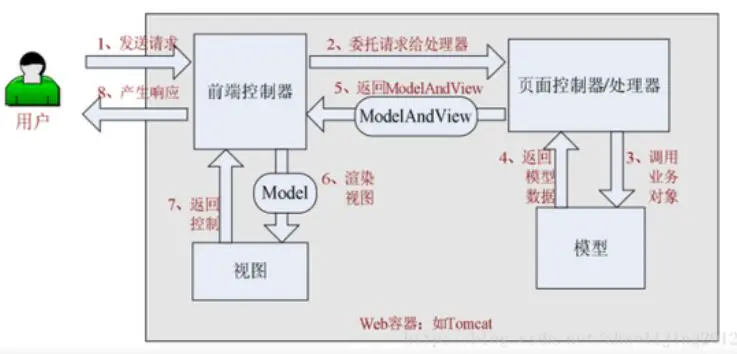


**具体步骤：**

1. 首先用户发送请求到前端控制器（DispatchServlet），前端控制器根据请求URL来决定选择哪一个页面控制器进行处理并把请求委托给它。
2. 页面控制器接收到请求之后，进行功能处理，首先需要收集和绑定参数到一个对象，这个对象在spring web mcv中叫命令对象，并进行验证，然后将命令对象委托给业务对象处理，处理完毕返回一个ModelAndView（模型数据和逻辑视图）对象。
3. 前端控制器回收控制权，然后根据返回的逻辑视图名，选着相应的视图进行渲染，并且把模型数据传入以便视图渲染。
4. 前端控制器再次回收控制权，将响应返回给用户。

### 二、核心流程


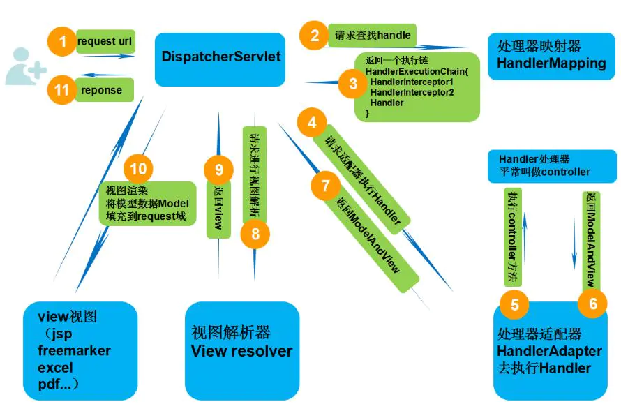


**具体步骤：**

1. 发送请求到前端控制器（DispatcherServlet）；
2. 前端控制器请求处理器映射器（HandlerMapping）查找handler（可根据xml或注解查找）；
3. 处理映射器向前端控制器返回handler，HandlerMapping会把请求映射成HandlerExecutionChain对象（包含一个Handler处理器（页面控制器）对象，多个HandlerInterceptor拦截器对象），通过这种策略模式，很容易添加新的映射策略；
4. 前端控制器调用处理适配器去执行handler；
5. 处理器适配器HandlerAdapter将会根据适配的结果去执行Handler；
6. Handler执行完成给适配器返回ModelAndView；
7. 处理器适配器向前端控制器返回ModelAndView （ModelAndView是springmvc框架的一个底层对象，包括 Model和view）；
8. 前端控制器请求视图解析器去进行视图解析 （根据逻辑视图名解析成真正的视图(jsp)），通过这种策略很容易更换其他视图技术，只需要更改视图解析器即可；
9. 视图解析器向前端控制器返回View；
10. 前端控制器进行视图渲染 （视图渲染将模型数据(在ModelAndView对象中)填充到request域）；
11. 前端控制器向用户响应结果。

### 三、核心开发步骤

1. DispatcherServlet 在 web.xml 中的部署描述，从而拦截请求到 Spring Web MVC；
2. HandlerMapping 的配置，从而将请求映射到处理器；
3. HandlerAdapter 的配置，从而支持多种类型的处理器；**注：**处理器映射求和适配器使用纾解的话包含在了注解驱动中，不需要在单独配置；
4. ViewResolver 的配置，从而将逻辑视图名解析为具体视图技术；
5. 处理器（页面控制器）的配置，从而进行功能处理。

**View是一个接口，实现类支持不同的View类型（jsp、freemarker、pdf...）**


# ------------------------------------------

# 数据库


## 数据库事务的ACID

### 原子性（Atomicity）
指所有在事务中的操作要么都成功，要么都不成功，所有的操作都不可分割，没有中间状态。一旦某一步执行失败，就会全部回滚到初始状态。
### 一致性（Consistency）
是指事务执行的结果必须是使数据库从一个一致性状态变到另一个一致性状态。保证数据库一致性是指当事务完成时，必须使所有数据都具有一致的状态。**数据符合现实和物理逻辑**

### 隔离性（Isolation）
事务的隔离性基于原子性和一致性，每一个事务可以并发执行，但是他们互不干扰，但是也有可能不同的事务会操作同一个资源，这个时候为了保持隔离性会用到锁方案。
### 持久性（Durability）
当一个事务提交了之后那这个数据库状态就发生了改变，哪怕是提交后刚写入一半数据到数据库中，数据库宕机(死机)了，那当你下次重启的时候数据库也会根据提交日志进行回滚，最终将全部的数据写入。


### 不一致性的主要问题

**丢失修改**：丢失修改是事务A和B先后更改数据数据x（假设初始是x0)，但是在A未正式更改前，B已经读取了原先的数据x0，最后A更改后为x1，B更改的并不是A更新后的x1，而是更改的x0，更改后假设为x2，这时x2将x1覆盖了，相当于事务A针对x的更改丢失了。

**读脏数据**： 事务T1读取了T2更改的x，但是T2在实际存储数据时可能出错回滚了，这时T1读取的实际是无效的数据，这种情况下就是脏读

**不可重复读**：是说在T1读取x时，由于中间T2更改了x，所以T1前后两次读取的x值不相同，这就是所谓的不可重复读

**幻读**：在T1读取符合某个条件的所有记录时，T2增加了一条符合该条件的记录，这就导致T1执行过程中前后读取的记录可能不一致，即T2之后读取时会多出一条记录。


## 事务的隔离级别

SQL标准定义了4类隔离级别，包括了一些具体规则，用来限定事务内外的哪些改变是可见的，哪些是不可见的。低级别的隔离级一般支持更高的并发处理，并拥有更低的系统开销。

详细介绍：https://juejin.im/post/5b90cbf4e51d450e84776d27

### SERIALIZABLE（串行化）

当数据库系统使用SERIALIZABLE隔离级别时，一个事务在执行过程中完全看不到其他事务对数据库所做的更新。当两个事务同时操作数据库中相同数据时，如果第一个事务已经在访问该数据，第二个事务只能停下来等待，必须等到第一个事务结束后才能恢复运行。因此这两个事务实际上是串行化方式运行。

### REPEATABLE READ（可重复读）

**访问其他事务已提交的新插，看不到对已有数据的更新**

当数据库系统使用REPEATABLE READ隔离级别时，一个事务在执行过程中可以看到其他事务已经提交的**新插入**的记录，但是不能看到其他事务对已有记录的更新。

### READ COMMITTED（读已提交数据）

**访问其他事务已提交的插入+已提交的更新**

当数据库系统使用READ COMMITTED隔离级别时，一个事务在执行过程中可以看到其他事务已经提交的新插入的记录，而且还能看到其他事务已经提交的对已有记录的更新。

### READ UNCOMMITTED（读未提交数据）

**访问其他事务未提交的插入+更新**

当数据库系统使用READ UNCOMMITTED隔离级别时，一个事务在执行过程中可以看到其他事务没有提交的新插入的记录，而且还能看到其他事务没有提交的对已有记录的更新。


以上的四种隔离级别按从高到底排序，你可能会说，选择SERIALIZABLE，因为它最安全！没错，它是最安全，但它也是最慢的！四种隔离级别的安全性与性能成反比！最安全的性能最差，最不安全的性能最好！


## B+树索引和hash索引的区别

### Hash索引

在理想的情况下，key非常分散，不存在Hash碰撞的话，采用Hash索引可以唯一得确定一个key的位置，并且这个位置上就只有一个key，所以查找时间复杂度是O（1），非常快，这是Hash索引的最主要优势。但是呢，Hash索引不是没有缺点，不存在Hash碰撞这是理想情况，通常情况下，同一个Hash值都不只有一个key，也就是说你根据一个key找到了他的hash值位置之后，但是这个位置还有别的key，所以你还得从这个位置找到真正的key，至于怎么找，这个和具体的hash碰撞处理方式有关，最常用的扩展链表法，就是在hash位置上放置链表，此时，就存在一个链表查询的过程，如果hash碰撞比较严重，查询的时间复杂度就远不止O(1)，那么hash索引的优势就失去了。其次，Hash索引是不排序的，因此它只适用于等值查询，如果你要查询一定的范围内的数据，那么hash索引是无能为力的，只能把数据挨个查，而不能仅仅是查询到头尾数据之后，从头读到位。并且，hash索引也无法根据索引完成排序，这也是它的不足之一。

### B+树索引

B+树是一颗严格平衡搜索的树，从根节点到达每一个叶子节点的路径长度都是一样的，并且每个节点可以有多个孩子节点，所以可以进可能的把树的高度降到很低。这么做的好处是可以降低读取节点的次数，这就是的B+树非常适合做外部文件索引了。在外部文件索引中，必须要读取到一个节点之后，才能知道它所有的孩子几点的位置，而读取一个节点对应一次IO，所以读取叶子节点的IO数就等于树的高度了，因此树的高度越低，所需要的IO次数就越少。B+树是一颗有序搜索树，所有的数据都放在叶子节点上，并且这些数据是按顺序排列的。所以在范围查询中，只需要找到范围的上下界节点，就可以得到整个范围内的数据，而且还有一个好处，由于这些数据都是排好序的，所以无需对数据进行再次排序。

### Hash与B+树的对比

1. Hash索引在不存在hash碰撞的情况下，之需一次读取，查询复杂度为O(1)，比B+树快。
2. Hash索引是无序的，所以只适用于等值查询，而不能用于范围查询或者模糊查询，自然也不具备排序性。根据hash索引查询出来的数据，还有再次进行排序
3. B+树索引的复杂度等于树的高度，一般为3-5次IO。但是B+树叶子节点上的数据是排过序的，因此可以作用于范围查找，而且查询的数据是排过序的，无需再次排序。对于像“SELECT xxx FROM TABLE1 WHERE xxx LIKE 'aaa%'”这样涉及到模糊匹配的查询，本质上也是范围查询。
4. 还有一点，数据库中的**多列组合索引中，只能用B+树索引**。数据在B+树的哪个结点上，只取决于最左边的列上的key，在结点中在一次按照第二列、第三列排序。所以B+树索引有最左原则的特性。


## 聚集索引与非聚集索引

### 聚集索引

**一张表只能有一个聚集索引**

聚集索引每一个叶子节点同时包含了索引键值，和数据本身.

因为无法同时把数据行存放在两个不同的地方，相当于是一种数据的组织方式，所以一个表只有一个聚簇索引.

一般默认主键作为聚簇索引,但是如果一张表没有定义主键,InnoDB则会选择一个唯一的非空索引代替.如果也没有这样的索引,InnoDB则会隐式的定义一个主键来作为聚簇索引.InnoDB只聚集在同一个页面中的记录.包含相邻键值的页面可能会相距甚远.

**聚集索引的优点**：因为记录行与主键key存放在一起。数据访问比一般索引更快
**聚集索引的缺点**：

​	更新聚集索引列的代价很高，因为会强制innodb将每个被更新的行移动到新的位置

​	插入速度严重依赖插入顺序。如果不是按照主键的顺序插入的话，那么插入需要重新维护聚簇索引，不仅维护索引还要维护数据行的顺序。


> 切记不要用不连续的值做聚簇索引，比如说UUID，在UUID主键下，因为新插入行的主键值不一定比前面的大，所以innodb无法简单地总是把新行插入到索引的最后，而是需要为新的行寻找合适的位置，通常是已有数据的中间位置，并且分配新的空间，这会增加很多额外的工作


### 非聚集索引
非聚簇索引，索引叶子节点仅仅存储数据的主键或者地址，并没有数据。因为非聚集索引中保存的是聚簇索引的键值，所以，采用二级索引查询时，需要先通过非聚集索引获取到聚集索引的键值，再根据该键值去聚集索引获取记录,所以相当于进行两次索引查询.


### 索引的优缺点

优点：

> 第一，通过创建唯一性索引，可以保证数据库表中每一行数据的唯一性。 
> 第二，可以大大加快 数据的检索速度，这也是创建索引的最主要的原因。     
> 第三，可以加速表和表之间的连接，特别是在实现数据的参考完整性方面特别有意义。  
> 第四，在使用分组和排序    子句进行数据检索时，同样可以显著减少查询中分组和排序的时间。  
> 第五，通过使用索引，可以在查询的过程中，使用优化隐藏器，提高系统的性能。

缺点：

> 第一，创建索引和维护索引要耗费时间，这种时间随着数据 量的增加而增加。  
> 第二，索引需要占物理空间，除了数据表占数据空间之外，每一个索引还要占一定的物理空间，如果要建立聚簇索引，那么需要的空间就会更大。 
> 第三，当对表中的数据进行增加、删除和修改的时候，索引也要动态的维护，这样就降低了数据的维护速度。


### 哪些情况下的查询不会使用索引

`不等于`查询

%开头的模糊查询

where条件中有or

使用符合索引的时候，没有按照索引字段定义的顺序


mysql的索引参考：https://juejin.im/post/5bd7a97de51d45400d5d7b18


## MySQL存储引擎MyISAM与InnoDB区别

### MyISAM与InnoDB表锁和行锁的解释

MyISAM（**使用B+Tree作为索引结构，叶节点存放的是数据记录的地址，主索引和次索引的结构没有区别**）表级锁有两种模式：表共享读锁（Table Read Lock）和表独占写锁（Table Write Lock）。什么意思呢，就是说对MyISAM表进行读操作时，它不会阻塞其他用户对同一表的读请求，但会阻塞对同一表的写操作；而对MyISAM表的写操作，则会阻塞其他用户对同一表的读和写操作。

InnoDB（**基于B+树，叶节点包含了完整的数据记录，这种索引叫做聚集索引【数据与索引放在一起】，主索引直接查找到数据，次索引查找到的是数据的主键，需要拿这个主键去主索引中再查询一次拿到数据**）行锁是通过给索引项加锁来实现的，即只有通过索引条件检索数据，InnoDB才使用行级锁，否则将使用表锁！行级锁在每次获取锁和释放锁的操作需要消耗比表锁更多的资源。在InnoDB两个事务发生死锁的时候，会计算出每个事务影响的行数，然后回滚行数少的那个事务。当锁定的场景中不涉及Innodb的时候，InnoDB是检测不到的。只能依靠锁定超时来解决。


### 区别

1. **InnoDB 支持事务，MyISAM 不支持事务**。这是 MySQL 将默认存储引擎从 MyISAM 变成 InnoDB 的重要原因之一；

2. **InnoDB 支持外键，而 MyISAM 不支持**。对一个包含外键的 InnoDB 表转为 MYISAM 会失败； 

3. InnoDB 是聚集索引，MyISAM 是非聚集索引。聚簇索引的文件存放在主键索引的叶子节点上，**数据文件本身要按主键聚集，因此 InnoDB 必须要有主键，通过主键索引效率很高**。但是辅助索引需要两次查询，先查询到主键（**InnoDB的辅助索引data域存储相应记录主键的值而不是地址**），然后再通过主键查询到数据。因此，主键不应该过大，因为主键太大，其他索引也都会很大。而 MyISAM 是非聚集索引，数据文件是分离的，索引保存的是数据文件的指针。主键索引和辅助索引是独立的。 

4. **InnoDB 不保存表的具体行数，执行 select count(*) from table 时需要全表扫描。而MyISAM 用一个变量保存了整个表的行数**，执行上述语句时只需要读出该变量即可，速度很快；    

5. **InnoDB 最小的锁粒度是行锁，MyISAM 最小的锁粒度是表锁**。一个更新语句会锁住整张表，导致其他查询和更新都会被阻塞，因此并发访问受限。这也是 MySQL 将默认存储引擎从 MyISAM 变成 InnoDB 的重要原因之一；

### 如何选择

1. 是否要支持事务，如果要请选择 InnoDB，如果不需要可以考虑 MyISAM；
2. 如果表中绝大多数都是Select，可以考虑 MyISAM；如果执行大量的INSERT或UPDATE，请使用InnoDB。
3. 系统奔溃后，MyISAM恢复起来更困难，能否接受，不能接受就选 InnoDB；
4. MySQL5.5版本开始Innodb已经成为Mysql的默认引擎(之前是MyISAM)，说明其优势是有目共睹的。如果你不知道用什么存储引擎，那就用InnoDB，至少不会差。

区别：https://www.jianshu.com/p/c3fb0b01c44d


## SQL语句分类及对应代表性关键字？？？？

sql语句分类如下

DDL 数据定义语言，用来定义数据库对象：库、表、列

```
代表性关键字：create alter drop
```

DML 数据操作语言，用来定义数据库记录

```
代表性关键字:insert delete update
```

DCL 数据控制语言，用来定义访问权限和安全级别

```
代表性关键字:grant deny revoke
```

DQL 数据查询语言，用来查询记录数据

```
代表性关键字:select 
```


## 数据库的悲观锁与乐观锁

1.悲观锁使用了排他锁，当程序独占锁时，其他程序就连查询都是不允许的，导致吞吐较低。如果在查询较多的情况下，可使用乐观锁。

2.乐观锁更新有可能会失败，甚至是更新几次都失败，这是有风险的。所以如果写入较频繁，对吞吐要求不高，可使用悲观锁。

也就是一句话：读用乐观锁，写用悲观锁。


## drop、truncate、 delete区别

drop、truncate都是DDL语句(数据定义语言)，操作立即生效，不能回滚，不会触发触发器。

truncate和drop都会直接删除表内的数据，不需要给条件。

delete可以删除满足条件的数据，如果没有给条件，删除所有数据。delete支持回滚。

truncate 和 delete 只删除数据不删除表的结构(定义)

drop 语句将删除表的定义，表的结构被依赖的约束(constrain)、触发器(trigger)、索引(index)；依赖于该表的存储过程/函数将保留,但是变为 invalid 状态。

## varchar和char的使用场景

varchar是变长的，varchar(10)表示字符串占用的空间可能在0到10这个范围变化，但不会超过10，数据库需要用一个变量记录字符串的长度。

char是定长的，char(10)的话，就相当于数组，不管如何，这个字符串都会占用10个空间，长度不足10就用空白不起，在访问的时候就忽略掉尾部空白。


优缺点：

char的话，每个字符串可能存在空白，所以内存的利用率不高。但定长的结构可以做到较快的存取。

varchar空间利用率高，但容易产生碎片。


**char适合存储固定长度或者长度方差很小的情况。**

**varchar适合字符串长度方差较大的情况。**

**如果插入的数据长于字段的定义，两种类型都会插入会出错。**


## mysql如何建立索引？？？


## having关键词怎么使用？？？


## mysql的explain？？？


## 慢查询如何优化？？？

慢查询产生的原因：

> **1，数据库CPU负载高。**一般是查询语句中有很多计算逻辑，导致数据库cpu负载。
>
> **2，IO负载高导致服务器卡住。**这个一般和全表查询没索引有关系。
>
> **3，查询语句正常，索引正常但是还是慢。**如果表面上索引正常，但是查询慢，需要看看是否索引没有生效。


数据库负载过大，分库：同时缓解IO和CPU的压力

表中数据量过大，IO时间较长，分表：缓解IO压力


### 水平分

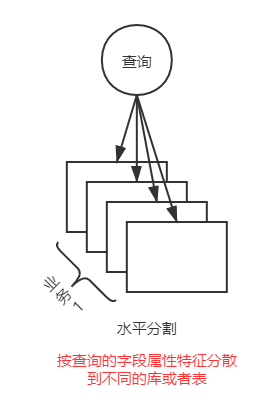

分库

1. 概念：以**字段**为依据，按照一定策略（hash、range等），将一个**库**中的数据拆分到多个**库**中。
2. 结果：
   - 每个**库**的**结构**都一样；
   - 每个**库**的**数据**都不一样，没有交集；
   - 所有**库**的**并集**是全量数据；
3. 场景：系统绝对并发量上来了，分表难以根本上解决问题，并且还没有明显的业务归属来垂直分库。
4. 分析：库多了，io和cpu的压力自然可以成倍缓解。


分表

1. 概念：以**字段**为依据，按照一定策略（hash、range等），将一个**表**中的数据拆分到多个**表**中。
2. 结果：
   - 每个**表**的**结构**都一样；
   - 每个**表**的**数据**都不一样，没有交集；
   - 所有**表**的**并集**是全量数据；
3. 场景：系统绝对并发量并没有上来，只是单表的数据量太多，影响了SQL效率，加重了CPU负担，以至于成为瓶颈。
4. 分析：表的数据量少了，单次SQL执行效率高，自然减轻了CPU的负担。


### 垂直分

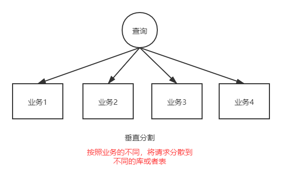


1. 概念：以**表**为依据，按照业务归属不同，将不同的**表**拆分到不同的**库**中。
2. 结果：
   - 每个**库**的**结构**都不一样；
   - 每个**库**的**数据**也不一样，没有交集；
   - 所有**库**的**并集**是全量数据；
3. 场景：系统绝对并发量上来了，并且可以抽象出单独的业务模块。
4. 分析：到这一步，基本上就可以服务化了。例如，随着业务的发展一些公用的配置表、字典表等越来越多，这时可以将这些表拆到单独的库中，甚至可以服务化。再有，随着业务的发展孵化出了一套业务模式，这时可以将相关的表拆到单独的库中，甚至可以服务化。


分表

1. 概念：以**字段**为依据，按照字段的活跃性，将**表**中字段拆到不同的**表**（主表和扩展表）中。
2. 结果：
   - 每个**表**的**结构**都不一样；
   - 每个**表**的**数据**也不一样，一般来说，每个表的**字段**至少有一列交集，一般是主键，用于关联数据；
   - 所有**表**的**并集**是全量数据；
3. 场景：系统绝对并发量并没有上来，表的记录并不多，但是字段多，并且热点数据和非热点数据在一起，单行数据所需的存储空间较大。以至于数据库缓存的数据行减少，查询时会去读磁盘数据产生大量的随机读IO，产生IO瓶颈。
4. 分析：可以用列表页和详情页来帮助理解。垂直分表的拆分原则是将热点数据（可能会冗余经常一起查询的数据）放在一起作为主表，非热点数据放在一起作为扩展表。这样更多的热点数据就能被缓存下来，进而减少了随机读IO。拆了之后，要想获得全部数据就需要关联两个表来取数据。但记住，千万别用join，因为join不仅会增加CPU负担并且会讲两个表耦合在一起（必须在一个数据库实例上）。关联数据，应该在业务Service层做文章，分别获取主表和扩展表数据然后用关联字段关联得到全部数据。


## 数据库的备份是如何实现的


## MySQL的优化

https://www.jianshu.com/p/b84a02fb12b5


## 什么是临时表，临时表什么时候删除

在MySQL中，临时表是一种特殊类型的表，它用来存储一个临时结果集，可以在单个会话中多次重用，当会话关闭是，会自动删除表并释放空间。

当使用[JOIN](http://www.yiibai.com/mysql/inner-join.html)子句查询需要单个[SELECT](http://www.yiibai.com/mysql/select-statement-query-data.html)语句的数据是不可能或遇到瓶颈的时候，临时表非常方便。 在这种情况下，我们就可以使用临时表来存储直接结果，并使用另一个查询来处理它。

MySQL临时表具有以下特殊功能：

- 使用`CREATE TEMPORARY TABLE`语句创建临时表。请注意，在`CREATE`和`TABLE`关键字之间添加`TEMPORARY`关键字。
- 当会话结束或连接终止时，MySQL会自动删除临时表。当您不再使用临时表时，也可以使用[DROP TABLE](http://www.yiibai.com/mysql/drop-table.html)语句来显式删除临时表。
- 一个临时表只能由创建它的客户机访问。不同的客户端可以创建具有相同名称的临时表，而不会导致错误，因为只有创建临时表的客户端才能看到它。 但是，在同一个会话中，两个临时表不能共享相同的名称。
- 临时表可以与数据库中的普通表具有相同的名称。 例如，如果在[示例数据库(yiibaidb)](http://www.yiibai.com/mysql/sample-database.html)中创建一个名为`employees`的临时表，则现有的`employees`表将变得无法访问。 对`employees`表发出的每个查询现在都是指`employees`临时表。 当删除`您`临时表时，永久`employees`表可以再次访问。


在涉及到子查询，join 包括not in、exist等操作的时候，可能会使用到临时表。


### 临时表与视图的区别

视图：视图与表的不同之处：视图是一个虚表，即视图所对应的数据不进行实际存储，数据库只存储视图的定义，对视图的数据进行操作时，系统根据视图的定义去操作与视图相关联的基本表。

视图主要用于系统的安全、查询和效率，在安全方面，举个例子：例如，你只想让用户看到某一表的某几个字段，有些字段想不让用户看见，这是用视图解决会很好，当然在select时也可以实现。第在查询方面，对于比较复杂的查询，可以大大减少频繁编写sql语句的烦恼。同时，在效率上，数据分布在多台服务器上，视图一定会带来效率上的好处。


临时表：临时表与永久表相似，但临时表存储在 tempdb 中，当不再使用时会自动删除。它们仅对当前的用户连接是可见的；当用户从 SQL Server 实例断开连接时被删除。


二者区别：
空间分配：物理空间的分配不一样，视图不分配空间，临时表会分配空间
虚实：视图是一条预编译的SQL语句，并不保存实际数据，是一个虚表；而临时表是保存在tempdb中的实际的表。是客观存在的表对象。

## MySQL的表连接？？？

什么是内连接、外连接、交叉连接


### 自然连接

### 外连接

### 左连接

### 右连接


## mybatis的#和$区别

`${}`直接变量的值直接拼接到sql中，一般用于传递数据库相关的参数，比如表名，字段名等。但它是非安全的，存在sql注入风险。

`#{}`将参数用`?`占位，编译好了SQL语句再放入值，传入的参数在sql中都会有引号括起来，不存在sql注入风险，是安全的。


为保证安全，通常优先考虑`#{}`

只能`${}`的情况：order by、like( `'%${value}%'`)等，或者动态拼接sql也要用`${}`


## 什么时候是行锁，什么时候是表锁？？？


## redis的原理（内存，单线程，多路复用，持久化，一致性哈希）


## Mysql主从复制原理，mysql中如何做故障转移？？


## 有哪些查询优化方式？？？


## 哪些措施加强 MySQL 安全？？？


## 数据库的三范式

第一范式：强调的是**列的原子性**，即每个属性都不能够再细分。

第二范式：首先是 1NF，另外要求非主键必须完全依赖于主键，也就是**一个主键一定可以唯一确定一条记录**。

第三范式：首先是2NF，另外要求**一条记录中不存在传递依赖**。即存在A->B, B->C的情况。


### 不满足范式要求会导致的问题

数据冗余

插入异常

删除异常

修改异常


## Redis 和 数据库是怎么保持一致性的？


## Redis中哈希表的实现原理


## 缓存的一致性，缓存雪崩、击穿、穿透的问题？？


## 一致性哈希

一致性哈希就是用0到2^32-1的数构成一个逻辑上的换，通过哈希函数计算出来的整数哈希值，将对象和机器分布到这个逻辑的环上，每个对象指向从该对象开始顺时针的第一个机器上，反之，每个机器管理从本机器往逆时针方向前一个机器之间的所有对象。

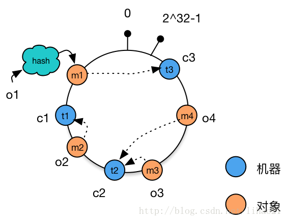

一致性哈希的优点在于：

1. 当有机器从环中移除时，影响的对象只有分布该机器逆时针方向到前一台机器之间的对象，如t2移除，只有m3,m4需要从新设置指向到t1.
2. 同样有新增机器时，影响的对象只有分布新增机器逆时针方向到前一台机器之间的对象，例如在m3,m4之间新增一台机器t4，那么只有对象m4需要重新跟新指向，其他的不用变动。


### 一致性哈希的用途


# Linux

## 进程和线程的区别

定义方面：进程是程序在某个数据集合上的一次运行活动；线程是进程中的一个执行路径。（进程可以创建多个线程）

角色方面：在支持线程机制的系统中，**进程是系统资源分配的单位**，**线程是CPU调度的单位**。

资源共享方面：不同进程不在同一进程空间，不能共享资源；而线程共享所在进程的地址空间和其它资源。同时线程还有自己的栈和栈指针，程序计数器等寄存器。

独立性方面：进程有自己独立的地址空间，而线程没有，线程必须依赖于进程而存在。

开销方面。进程切换的开销较大。线程相对较小。


## 进程间的通信方式

用户进程间通信主要哪几种方式？

解答：主要有以下6种：

- 1、管道：管道是单向的、先进先出的、无结构的、固定大小的字节流，它把一个进程的标准输出和另一个进程的标准输入连接在一起。写进程在管道的尾端写入数据，读进程在管道的道端读出数据。数据读出后将从管道中移走，其它读进程都不能再读到这些数据。管道提供了简单的流控制机制。进程试图读空管道时，在有数据写入管道前，进程将一直阻塞。同样地，管道已经满时，进程再试图写管道，在其它进程从管道中移走数据之前，写进程将一直阻塞。
  - 无名管道：管道是一种半双工的通信方式，数据只能单向流动，而且只能在具有亲缘关系（通常是指父子进程关系）的进程间使用。
  - 命名管道：命名管道也是半双工的通信方式，在文件系统中作为一个特殊的设备文件而存在，但是它允许无亲缘关系进程间的通信。当共享管道的进程执行完所有的I/O操作以后，命名管道将继续保存在文件系统中以便以后使用。
- 2、信号量：信号量是一个计数器，可以用来控制多个进程对共享资源的访问。它常作为一种锁机制，防止某进程正在访问共享资源时，其它进程也访问该资源。因此，主要作为进程间以及同一进程内不同线程之间的同步手段。
- 3、消息队列：消息队列是由消息的链表，存放在内核中并由消息队列标识符标识。消息队列克服了信号传递信息少、管道只能承载无格式字节流以及缓冲区大小受限等缺点。
- 4、信号：信号是一种比较复杂的通信方式，用于通知接收进程某个事件已经发生。
- 5、共享内存：共享内存就是映射一段能被其它进程所访问的内存，这段共享内存由一个进程创建，但多个进程都可以访问。共享内存是最快的IPC方式，它是针对其它进程间通信方式运行效率低而专门设计的。它往往与其它通信机制（如信号量）配合使用，来实现进程间的同步和通信。
- 6、套接字：套接字也是一种进程间通信机制，与其它通信机制不同的是，它可用于不同机器间的进程通信。

## top命令输出内容的解释

top命令的输出如下：

```text
top - 16:03:58 up 23:55, 17 users,  load average: 3.39, 3.88, 3.62
top - 16:03:58 up 23:55, 17 users,  load average: 3.39, 3.88, 3.62
Tasks: 288 total,   4 running, 284 sleeping,   0 stopped,   0 zombie
Cpu(s): 30.1%us,  0.5%sy,  0.0%ni, 65.4%id,  3.9%wa,  0.0%hi,  0.1%si,  0.0%st
Mem:  32797280k total, 32570120k used,   227160k free,   170492k buffers
Swap: 33554424k total,     1364k used, 33553060k free, 27500872k cached
 
  PID USER      PR  NI  VIRT  RES  SHR S %CPU %MEM    TIME+  COMMAND
27545 root  20   0 2523m 2.4g  620 R 100.0  7.8   7:26.00 fsmepsnormalize
```

内容解释：

第一行概要

> 16：03：58 表示系统当前时间。
> up 23:55，表示系统已经运行时间。
> 17 users，当前登录的用户数。
> load average: 3.39 , 3.88 , 3.62。这分别表示内核任务队列在1分钟、5分钟、15分钟的负载。

第二行进程摘要

> Tasks:288 total。当前系统的进程总数。
> 4 running，当前系统中有4个正在运行的进程。
> 284 sleeping ，当前系统中有284个休眠的进程。
> 0 stopped 。停止进程数为0。
> 0 zombie。僵死进程数为0。

第三行CPU信息

> %us。用户空间进程占用CPU时间的百分比。
> %sy。内核空间进程占用CPU时间的百分比。
> %ni。ni表示nice的意思，也就是哪些用户进程被提升优先级之后，占用的CPU运行时间。
> %id。系统空闲时间。
> %wa。这个表示CPU在等待磁盘写入的时间。
> %si。CPU处理软中断(soft interrupt）的时间百分比。
> %hi。CPU处理硬中断(hard interrupt）的时间百分比。
> %st。这个表示在有虚拟机的时候，被虚拟机占用的CPU时间。st表示窃取的意思，steal的意思。

第四行内存使用信息

> total。表示系统可用的物理内存总量。
> used。当前已经使用的物理内存总量。
> free。当前的空闲内存总量。
> buffers。用作系统内核缓存的物理内存总量。

第五行交换区信息

> total。系统全部的交换区总量。
> used。当前已经使用的交换区总量。
> free。空闲的交换区总量。
> cached。被缓冲的交换区总量。

负载均衡的定义见：https://www.ruanyifeng.com/blog/2011/07/linux_load_average_explained.html


### top查看线程

top运行时，你也可以通过按“H”键将线程查看模式切换为开或关。

> $ top -H

要让top输出某个特定进程<pid>并检查该进程内运行的线程状况：

> $ top -H -p <pid>


## 读写权限编码

读取权限  r = 4
写入权限  w = 2
执行权限  x = 1

777 这三个数字代表拥有者，组用户，其他用户的权限都为rwx


## Linux中异步IO是如何实现的，消息队列如何实现的


## Linux内核是怎么实现定时器的

使用Alarm系统调用，捕捉SIGALARM信号并为其绑定信号处理函数，在该函数中检查定时任务是否已经到时间，如果到了时间，就执行处理事件的函数。


## select,poll,epoll 有什么区别

### IO多路复用

select，poll，epoll都是**IO多路复用的机制。I/O多路复用就是通过一种机制，一个进程可以监视多个描述符，一旦某个描述符就绪（一般是读就绪或者写就绪），能够通知程序进行相应的读写操作**。但select，poll，epoll本质上都是同步I/O，因为他们都需要在读写事件就绪后自己负责进行读写，也就是说这个读写过程是阻塞的，而异步I/O则无需自己负责进行读写，异步I/O的实现会负责把数据从内核拷贝到用户空间。


参考链接

https://segmentfault.com/a/1190000003063859?utm_source=Weibo&utm_medium=shareLink&utm_campaign=socialShare&from=timeline&isappinstalled=0

### select

select 函数监视的文件描述符分3类，分别是writefds、readfds、和exceptfds。调用后select函数会阻塞，直到有描述副就绪（有数据 可读、可写、或者有except），或者超时（timeout指定等待时间，如果立即返回设为null即可），函数返回。当select函数返回后，可以 通过遍历fdset，来找到就绪的描述符。

select目前几乎在所有的平台上支持，其良好跨平台支持也是它的一个优点。

缺点有如下：

（1）单个进程能够监视的文件描述符的数量有限制，通常为1024，可以通过重新编译内核改变，但是由于select和poll在内核中都是通过轮询的方式扫描文件描述符来判断事件发生的，文件描述符越多，性能越差。

（2）内核/用户空间的内存拷贝问题。每次调用select，都需要把fd集合从用户态拷贝到内核态，这个开销在fd很多时会很大。

（3）当监视的文件描述符上有事件发生时，select返回的是含有整个fd的数组，应用程序需要遍历整个fdset才能发现哪些fd发生了事件。

（4）select的触发方式是水平触发（LE），应用程序如果没有完成对一个已经就绪的文件描述符进行IO操作，那么以后每次调用select调用时，还是会将这些文件描述符通知进程。

**select：**

select本质上是通过设置或者检查存放fd标志位的数据结构来进行下一步处理。这样所带来的缺点是：

1、 单个进程可监视的fd数量被限制，即能监听端口的大小有限。

   一般来说这个数目和系统内存关系很大，具体数目可以cat /proc/sys/fs/file-max察看。32位机默认是1024个。64位机默认是2048.

2、 对socket进行扫描时是线性扫描，即采用轮询的方法，效率较低：

​    当套接字比较多的时候，每次select()都要通过遍历FD_SETSIZE个Socket来完成调度,不管哪个Socket是活跃的,都遍历一遍。这会浪费很多CPU时间。如果能给套接字注册某个回调函数，当他们活跃时，自动完成相关操作，那就避免了轮询，这正是epoll与kqueue做的。

3、需要维护一个用来存放大量fd的数据结构，这样会使得用户空间和内核空间在传递该结构时复制开销大


### poll

poll本质上和select没有区别，它将用户传入的数组拷贝到内核空间，然后查询每个fd对应的设备状态，如果设备就绪则在设备等待队列中加入一项并继续遍历，如果遍历完所有fd后没有发现就绪设备，则挂起当前进程，直到设备就绪或者主动超时，被唤醒后它又要再次遍历fd。这个过程经历了多次无谓的遍历。

**它没有最大连接数的限制**，原因是它是基于链表来存储的，但是同样有一个缺点：

1、大量的fd的数组被整体复制于用户态和内核地址空间之间，而不管这样的复制是不是有意义。          

2、poll还有一个特点是“水平触发”，如果报告了fd后，没有被处理，那么下次poll时会再次报告该fd。


### epoll

epoll有EPOLLLT和EPOLLET两种触发模式，LT是默认的模式，ET是“高速”模式。LT模式下，只要这个fd还有数据可读，每次 epoll_wait都会返回它的事件，提醒用户程序去操作，而在ET（边缘触发）模式中，它只会提示一次，直到下次再有数据流入之前都不会再提示了，无 论fd中是否还有数据可读。所以在ET模式下，read一个fd的时候一定要把它的buffer读光，也就是说一直读到read的返回值小于请求值，或者 遇到EAGAIN错误。还有一个特点是，epoll使用“事件”的就绪通知方式，通过epoll_ctl注册fd，一旦该fd就绪，内核就会采用类似callback的回调机制来激活该fd，epoll_wait便可以收到通知。

**epoll为什么要有EPOLLET触发模式？**

如果采用EPOLLLT模式的话，系统中一旦有大量你不需要读写的就绪文件描述符，它们每次调用epoll_wait都会返回，这样会大大降低处理程序检索自己关心的就绪文件描述符的效率.。而采用EPOLLET这种边沿触发模式的话，当被监控的文件描述符上有可读写事件发生时，epoll_wait()会通知处理程序去读写。如果这次没有把数据全部读写完(如读写缓冲区太小)，那么下次调用epoll_wait()时，它不会通知你，也就是它只会通知你一次，直到该文件描述符上出现第二次可读写事件才会通知你！！！**这种模式比水平触发效率高，系统不会充斥大量你不关心的就绪文件描述符**

**epoll的优点：**

1、**没有最大并发连接的限制，能打开的FD的上限远大于1024（1G的内存上能监听约10万个端口）**；
**2、效率提升，不是轮询的方式，不会随着FD数目的增加效率下降。只有活跃可用的FD才会调用callback函数；**
**即Epoll最大的优点就在于它只管你“活跃”的连接，而跟连接总数无关，因此在实际的网络环境中，Epoll的效率就会远远高于select和poll。**

3、 内存拷贝，利用mmap()文件映射内存加速与内核空间的消息传递；即epoll使用mmap减少复制开销。


#### 水平触发

LT(level triggered)是缺省的工作方式，并且同时支持block和no-block socket.在这种做法中，内核告诉你一个文件描述符是否就绪了，然后你可以对这个就绪的fd进行IO操作。如果你不作任何操作，内核还是会继续通知你的。

#### 边缘出发

ET(edge-triggered)是高速工作方式，只支持no-block socket。在这种模式下，当描述符从未就绪变为就绪时，内核通过epoll告诉你。然后它会假设你知道文件描述符已经就绪，并且不会再为那个文件描述符发送更多的就绪通知，直到你做了某些操作导致那个文件描述符不再为就绪状态了(比如，你在发送，接收或者接收请求，或者发送接收的数据少于一定量时导致了一个EWOULDBLOCK 错误）。但是请注意，如果一直不对这个fd作IO操作(从而导致它再次变成未就绪)，内核不会发送更多的通知(only once)

ET模式在很大程度上减少了epoll事件被重复触发的次数，因此效率要比LT模式高。epoll工作在ET模式的时候，必须使用非阻塞套接口，以避免由于一个文件句柄的阻塞读/阻塞写操作把处理多个文件描述符的任务饿死。


### select、poll、epoll的对比

1. select/poll只有LE水平触发这一种工作模式，而epoll支持更高效的边沿触发工作模式。
2. select每次调用时都会**存在内核/用户空间的fdset拷贝，产生巨大开销**，而epoll不需要（mmap+事件表）。
3. select在内核中通过该轮询的方式判断是否有事件就绪O(n)，而epoll是通过回调的方式判断，O(1)，所以epoll的时间开销不会随着fd的增加而线性增加。
4. select可以进行同时监听的fd数量有限制，而epoll没有。
5. epoll当有就绪事件发生时，即epoll_wait返回时，只返回就绪列表中的就绪事件的fd，从事件表复制到epoll_wait第二个参数epoll_event * events中，返回这些就绪的事件,而select返回所有的fd，还得通过遍历来得到就绪的事件。


# 数据结构与算法

100万个数集合A和B求交集

1T个数找重复最多的10个

200G的文本以ip为主键存储主机的记录。如何配置，使得用户可以通过api查询对应ip的信息？用什么数据结构去存放这些信息


## B树与B+树的区别？？？


## [红黑树](https://segmentfault.com/a/1190000014037447)

- 结点是红色或黑色 
- 根结点始终是黑色 
- 叶子结点（NIL结点）都是黑色 
- 红色结点的两个直接孩子结点都是黑色（即从叶子到根的所有路径上不存在两个连续的红色结点） 
- 从任一结点到每个叶子的所有简单路径都包含相同数目的黑色结点


## hashMap+双向链表实现LRU

思路：

自定义双向链表节点，节点中包括key，value，pre，next。

定义LRU类，在该类中手动维护一个双向链表，以表头记录最久的数据，表尾记录最近的数据，另外，使用hashMap记录链表中的每个节点，使用key做索引。

当插入数据的时候，首先通过hashMap检查链表中时候有数据，如果有，则通过hashMap找到目标node，将该node在双向链表中的位置调整到tail，表示最近访问；如果没有，检查集合是否已经超过设定限制，没有超过限制，就直接为数据构造新的node插入到链表尾部，否则删除链表头部数据，并从hashMap中移除该数据，再进行插入。

删除数据时删除链表表头数据，并从hashMap中移除该数据。


## 使用synchronized实现一个reentrantLock


# ----------------------------

# 面试记录

> **腾讯一面（2020-2-27，正好半小时）**
>
> C语言中的malloc和free与C++中new和delete的区别
>
> malloc和new的区别，如果没有申请到内存返回什么
>
> C++内存模型
>
> C++ STL Map的背后的数据结构
>
> C++虚函数在执行时是怎么绑定到具体函数的
>
> 如何判断当前计算机使用的字节序是大端还是小端
>
> 看过什么框架的源码
>
> 说说网络的三次握手和四次握手
>
> 如果网络拥塞了怎么办，让你设计怎么处理这种情况
>
> 无序的数中怎么选出前10大，堆怎么实现，堆排序的时间复杂度是多少


> **腾讯二面（2020-3-4，20多分钟）**
>
> 哪里人，什么时候毕业，实习时间
>
> 介绍一下实验室的情况
>
> 说说做过的项目（期间问了一下语言），有没做过网络相关的，介绍一下
>
> sql语句的使用
>
> hashmap的实现
>
> 说一下线程安全
>
> 你认为你的优势在哪里


>**蚂蚁金服金融核心部（2020-3-6，50多分钟）**
>上来面试官介绍了一下他们的部门的情况
>自我介绍
>对java有多熟悉，使用java多少年了，写过多少行代码，有统计过嘛
>本科代码写的多还是硕士代码写得多
>你觉得现在和过去本科的区别在哪里
>看没看过java实现的源码
>讲一下JVM的内存模型
>对多线程有了解吗？怎么保证线程安全
>说一下synchronized，volatile，lock，各自有什么特性，有什么区别，在什么样的场景下使用
>说一下线程间的通信，有哪些方式
>平时对哪一方面感兴趣（面试官举例提了NLP、图像处理等）
>看过哪些书
>有没有项目实践的经历
>然后出题：
>给一个很大的文件，内存有限（实际问的问题时间没有需要超大内存的情况），怎么处理下面的问题：
>
>3. 文本中是格式化的数据，每行是一个学生的成绩，多个省份的学生成绩都在一个文件中；现在数据库中每个省对于一张表，需要把数据从文件读出来，存入到数据库中。a)怎么操作？ b)怎么优化提升效率 c)怎么判断写入到数据库中的数据没有丢失？
>
>了解索引吗？现在有学生的成绩，要对学生按成绩分级别，说说你了解的数据库是怎么建立索引的，背后使用的什么数据结构
>有什么问题问我


> 阿里零售部门（2020-3-9,56分钟）
>
> 自我介绍
>
> 本科成绩、硕士成绩
>
> 使用java多少年
>
> java虚拟机内存
>
> 垃圾回收算法
>
> 垃圾回收器cms/G1
>
> 如果发生平凡的Full GC可能是什么原因
>
> 用没用过jmap，jstack
>
> 数据库建表要遵循哪些原则
>
> 说说数据库的索引
>
> 做过的项目最具代表性的是哪一个，说说，然后细问项目相关的问题
>
> 怎分布式中，怎么知道那个任务在哪台机器上运行？怎么知道哪台机器已经挂了
>
> 幂等性，怎么防止用户重复提交任务，分布式系统中呢？
>
> 如果一台web服务器挂了怎么办，或者是反向代理服务器，让了解zookeeper
>
> 一致性哈希
>
> 说说数据库中的悲观锁与乐观锁
>
> 


> 阿里中台 （2020-3-10，40分钟）
>
> 自我介绍
>
> 问项目，先让你介绍，然后问问题，问得很细，项目有什么亮点？
>
> 队列中的数据如果断电了或者系统崩溃了怎么办
>
> java的基本类型和包装类型，他们有什么区别
>
> JVM内存布局
>
> 垃圾回收算法
>


> 飞猪一面（2020-3-13，36分钟）
>
> 自我介绍
>
> 挨个问建立上的项目，问得比较细
>
> 数据库索引，如果是非主键的索引和主键的索引有什么区别？
>
> 创建线程的方式？线程池了解吗？有什么参数？线程池满了有那些拒绝策略？
>
> 如果程序发生了OOM崩溃了，可能是什么原因，怎么排查问题
>
> 在Linux中如果发现程序的cpu消耗比较高，可能是什么原因，怎么排查问题？
>
> 平时怎么关注和学习新的技术？
>
> 
>
> 二面
>
> 说说servlet的生命周期
>
> 使用spring有什么优点
>
> 什么是依赖注入
>
> spring中请求的处理流程是怎么样的
>
> 


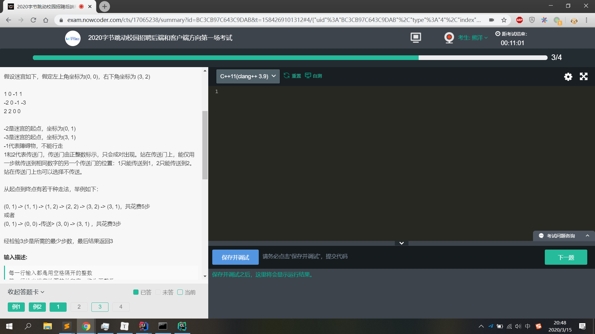


> 花呗一面（2020-3-15，33分钟）
>
> 自我介绍
>
> 说说最有代表性的项目
>
> 说说jvm的内存布局和垃圾回收机制
>
> 为什么大文件会分配在老年代
>
> 类加载机制和类加载的过程
>
> 讲一下volatile，它起什么作用，怎么实现的
>
> java7和java8有什么区别，两者对应的jvm呢（不会）
>
> 数据结构了解吗，说说B+树，说说红黑树
>
> 加入现在让你实现一个12306的火车票网站，你会怎么设计？怎么检查爬虫或者其他的恶意请求？


>美团视频一面（2020-03-16，1h40m）
>
>自我介绍
>
>分别介绍一下C语言和java语言各有什么特性和优缺点
>
>介绍一个最有代表性的项目（然后一直根据这个项目提问）
>
>进程和线程的区别
>
>http1.0和http1.1有什么区别，长连接与短连接
>
>网络建立连接的三次握手
>
>拥塞控制、流量控制
>
>抓过包没有，怎配判断一个被重复发送的包
>
>了解过中间件没？使用过spring boot没？都没使用过
>
>使用过spring MVC，说说使用spring mvc有哪些优点
>
>看没看过spring的源码？
>
>常用哪些Linux命令，shell脚本会不会，Linux中有哪些工具处理文本
>
>数据库的表连接使用什么关键词，怎么连接
>
>数据库单机物理的承载能力有效，如果并发量操过了承载能力，读写分别应该怎么处理
>
>使用java多少年，对java最了解的是哪一方面
>
>说一下java的垃圾回收机制
>
>饿汉懒汉问题（不会）
>
>最后要求现场写一个java快速排序


>美团视频2面（2020-3-18,1h）
>
>自我介绍
>
>手写合并有序链表
>
>tcp/udp区别，各自适合什么场景
>
>udp上的音频视频传输协议，了解吗
>
>哪些协议使用tcp，哪些协议使用udp，
>
>tcp三次握手与四次握手
>
>为什么要有第三次握手
>
>怎么使用命令检查一个web服务在正常运行
>
>修改文件权限怎么操作，怎么创建文件夹
>
>怎么查看文件
>
>使用过哪些搜索命令
>
>使用grep怎么查看文件中某个特征行出现了多少行
>
>Linux怎么重定向输出
>
>红黑树了解吗，介绍一下红黑树
>
>java深拷贝浅拷贝（不会）
>
>进程间有哪些同步机制
>
>数据库事务有哪些特性
>
>数据库慢查询怎么排查
>
>mysql的explain用过吗，说说（不会）
>
>然后问了一些中间件，redis，kafka，dubbo，spring boot等一系列（不会）
>
>IO复用，select和epoll，写过epoll的程序没有
>
>同步与异步的区别，分别应用在什么场景
>
>最后问项目（答得不是太好）


> 字节跳动（2020-3-21，53分钟）
>
> TCP四次握手
>
> 2MSL是什么（不会）
>
> 如果多台web服务器，其中一个挂了怎么办（不会）
>
> HTTP状态码：304,504，如果用户传递的参数不合法应该返回什么（不会）
>
> json中传递大整数有什么问题（不会）
>
> 写一个LRU（不会）
>
> 问git，merge与rebase，为什么说git是分布式


写一个死锁

写一个合并链表

写一个快速排序


总结：

项目一定非常了解

注意听完了面试老师的话再作答，不要太快

语言组织好的再作答


