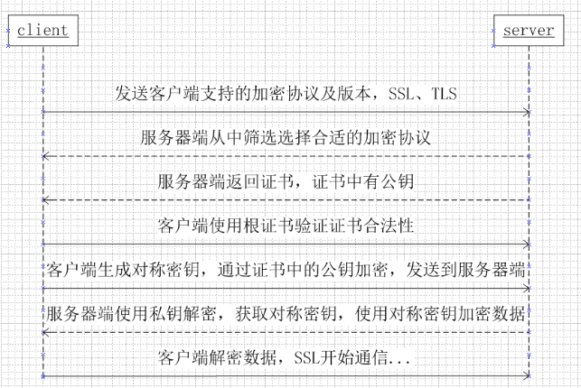

# 自我介绍

姓名，学校，学历，毕业时间，实习经历，项目经历，竞赛经历，可实习时间。

不要描述细节，但要说清楚是什么，有什么，自我介绍有可能被打断，重点前面说。

**邮件标题：**应聘职位+学校+姓名+手机号

**利用初面官通过复面。**在初面快结束时，建议询问面试官自己的不足，针对这些不足如何提高，以及自己最得意的项目有哪些不足，如何改进，拿着这些建议和准备去参加复面会更容易通过。


# 计算机网络

## 三次握手与四次握手

连接阶段与释放阶段的示意图：


### 三次握手

建立连接的流程：

1. 第一次握手：建立连接。客户端发送连接请求报文段，将SYN位置为1，Sequence Number为x；然后，客户端进入SYN_SEND状态，等待服务器的确认。
2. 第二次握手：服务器收到SYN报文段。服务器收到客户端的SYN报文段，需要对这个SYN报文段进行确认，设置Acknowledgment Number为x+1(Sequence Number+1)；同时，自己自己还要发送SYN请求信息，将SYN位置为1，Sequence Number为y；服务器端将上述所有信息放到一个报文段（即SYN+ACK报文段）中，一并发送给客户端，此时服务器进入SYN_RECV状态。
3. 第三次握手：客户端收到服务器的SYN+ACK报文段。然后将Acknowledgment Number设置为y+1，向服务器发送ACK报文段，这个报文段发送完毕以后，客户端和服务器端都进入ESTABLISHED状态，完成TCP三次握手。


为什么需要第三次握手：**为了防止已失效（长时间没有到达服务器的第一次握手包）的连接请求报文段突然又传送到了服务端，因而产生错误**。

所谓”已经失效的连接请求报文段”是这样产生的

> ​	client发出的第一个连接请求报文段并没有丢失，而是在某个网络结点长时间的滞留了，于是client重新与server建立了连接，以致延误到client新建的连接释放以后的某个时间才到达server。本来这是一个早已失效的报文段。但server收到此失效的连接请求报文段后，就误认为是client再次发出的一个新的连接请求。于是就向client发出确认报文段，同意建立连接。假设不采用“三次握手”，那么只要server发出确认，新的连接就建立了。
>
> ​	由于现在client并没有发出建立连接的请求，因此不会理睬server的确认，也不会向server发送数据。但server却以为新的运输连接已经建立，并一直等待client发来数据。这样，server的很多资源就白白浪费掉了。采用“三次握手”的办法可以防止上述现象发生。例如刚才那种情况，client不会向server的确认发出确认。server由于收不到确认，就知道client并没有要求建立连接。”


### 四次握手

断开连接的过程：

1. 第一次握手：主机1（可以使客户端，也可以是服务器端），设置Sequence Number和Acknowledgment Number，向主机2发送一个FIN报文段；此时，主机1进入FIN_WAIT_1状态；这表示主机1没有数据要发送给主机2了；
2. 第二次握手：主机2收到了主机1发送的FIN报文段，向主机1回一个ACK报文段，Acknowledgment Number为Sequence Number加1；主机1进入FIN_WAIT_2状态；主机2告诉主机1，我“同意”你的关闭请求；
3. 第三次握手：主机2向主机1发送FIN报文段，请求关闭连接，同时主机2进入LAST_ACK状态；
4. 第四次握手：主机1收到主机2发送的FIN报文段，向主机2发送ACK报文段，然后主机1进入TIME_WAIT状态；主机2收到主机1的ACK报文段以后，就关闭连接；此时，主机1等待2MSL后依然没有收到回复，则证明Server端已正常关闭，那好，主机1也可以关闭连接了。


为什么需要第四次握手：TCP是全双工模式，这就意味着，*当主机1发出FIN报文段时，只是表示主机1已经没有数据要发送了*，主机1告诉主机2，它的数据已经全部发送完毕了；但是，这个时候主机1还是可以接受来自主机2的数据；当主机2返回ACK报文段时，表示它已经知道主机1没有数据发送了，但是主机2还是可以发送数据到主机1的；*当主机2也发送了FIN报文段时，这个时候就表示主机2也没有数据要发送了*，就会告诉主机1，我也没有数据要发送了，之后彼此就会愉快的中断这次TCP连接。


为什么主机A需要在TIME-WAIT状态下等待2MSL：

**第一：为了保证A发送的最后一个ACK报文能够顺利到达B，因为这个ACK报文可能丢失，因而使得处于LAST-ACK状态的B收不到这个确认，这是B给A超时重传一个FIN-ACK报文，而A就在2MSL内收到这个重传报文。接着A重传一次ACK确认，并重启2MSL计时器。最后A,B都进入CLOSED状态。  如果A在TIME-WAIT状态不等待一段时间，而是发完最后一个ACK之后就立即释放连接，那么就无法收到B重传的FIN-ACK报文，因此也不会在重新发一次确认报文。这样，B就无法正常进入CLOSED状态。**

第二：防止产生三次握手提到的“已经失效的连接请求报文段”出现在本连接中。A在发送完最后一个ACK之后，再经过2MSL，可以使本连接持续时间内所产生的所有报文段都从网络中消失，从而杜绝这种情况的产生。


## 流量控制原理

- 目的是接收方通过TCP头窗口字段告知发送方本方可接收的最大数据量，用以解决发送速率过快导致接收方不能接收的问题。所以流量控制是点对点控制。
- TCP是双工协议，双方可以同时通信，所以发送方接收方各自维护一个发送窗和接收窗。
  - 发送窗：用来限制发送方可以发送的数据大小，其中发送窗口的大小由接收端返回的TCP报文段中窗口字段来控制，接收方通过此字段告知发送方自己的缓冲（受系统、硬件等限制）大小。
  - 接收窗：用来标记可以接收的数据大小。
- TCP是流数据，发送出去的数据流可以被分为以下四部分：已发送且被确认部分 | 已发送未被确认部分 | 未发送但可发送部分 | 不可发送部分，其中发送窗 = 已发送未确认部分 + 未发但可发送部分。接收到的数据流可分为：已接收 | 未接收但准备接收 | 未接收不准备接收。接收窗 = 未接收但准备接收部分。
- 发送窗内数据只有当接收到接收端某段发送数据的ACK响应时才移动发送窗，左边缘紧贴刚被确认的数据。接收窗也只有接收到数据且最左侧连续时才移动接收窗口。


## 拥塞控制原理

- 拥塞控制目的是防止数据被过多注网络中导致网络资源（路由器、交换机等）过载。因为拥塞控制涉及网络链路全局，所以属于全局控制。控制拥塞使用拥塞窗口。

- TCP拥塞控制算法：
  - 慢开始 ：先试探网络拥塞程度再逐渐增大拥塞窗口。每次收到确认后拥塞窗口翻倍，直到达到阀值ssthresh，这部分是慢开始过程。
  - 拥塞避免：达到阀值后每次以一个MSS为单位增长拥塞窗口大小，使数据线性增加直到发生拥塞（超时未收到确认）。此时将阀值ssthresh减为原先一半，这个过程为拥塞避免。
  - 快速重传 & 快速恢复：略。
  - 最终拥塞窗口会收敛于稳定值。
  
  
  
  


加入快重传与快恢复的拥塞控制：


如何区分流量控制和拥塞控制？

- 流量控制属于通信双方协商；拥塞控制涉及通信链路全局。
- 流量控制需要通信双方各维护一个发送窗、一个接收窗，对任意一方，接收窗大小由自身决定，发送窗大小由接收方响应的TCP报文段中窗口值确定；拥塞控制的拥塞窗口大小变化由试探性发送一定数据量数据探查网络状况后而自适应调整。
- 实际最终发送窗口 = min{流控发送窗口，拥塞窗口}。


## HTTPS，SSL握手的过程

HTTP 主要有这些不足,例举如下。

- 通信使用明文(不加密),内容可能会被窃听
- 不验证通信方的身份,因此有可能遭遇伪装
- 无法证明报文的完整性,所以有可能已遭篡改


HTTP 协议中没有加密机制,但可以通过和 SSL(Secure Socket Layer,安全套接层)或TLS(Transport Layer Security,安全层传输协议)的组合使用,加密 HTTP 的通信内容。用 SSL 建立安全通信线路之后,就可以在这条线路上进行 HTTP通信了。**与 SSL 组合使用的 HTTP 被称为 HTTPS**(HTTP Secure,超文本传输安全协议)或 HTTP over SSL


通常,HTTP 直接和 TCP 通信。当使用 SSL 时,则演变成先和 SSL 通信,再由 SSL 和 TCP 通信了。简言之,所谓 HTTPS,其实就是身披SSL 协议这层外壳的 HTTP。


### HTTPS加密机制
HTTPS 采用对称加密和非对称加密两者并用的混合加密机制。若密钥能够实现安全交换,那么有可能会考虑仅使用非对称密钥加密来通信。但是非对称加密与对称加密相比,其处理速度要慢。

所以应充分利用两者各自的优势,将多种方法组合起来用于通
信。在交换对称密钥环节使用非对称加密方式,之后的建立通信交换报文阶段则使用对称加密方式。


### HTTPS通信过程



如上图所示：

1. Client向Server发起建立连接的请求，并在请求信息中告知自己支持的各种支持的加密算法、协议版本以及压缩算法。目的是通知 Server 在所给的算法中选择一种，以便于之后通信的加解密。
2. Server选择一种加密算法，将该信息和SSL证书（包含Server的域名、公钥等信息）发送给Client。
3. Client收到证书之后，使用内置证书颁发机构的公钥来验证证书中的签名（证书信息的哈希经过CA机构私钥加密有的信息），如果验证通过，说明Server是可靠的。之后，Client生成一个随机对称秘钥（仅本次通信有效），使用Sever的公钥加密发送给Server。
4. Server给Client发送一个确认消息。之后，Client与Server就可以使用对称秘钥进行加密通信了


申请证书的过程如下：

> 服务端向 CA 申请自己的 HTTPS 证书， CA 审核通过后，就会将服务端的域名、公钥、证书的有效期等信息写到证书里。 同时 CA 会对证书里的信息做一个哈希获得一个哈希值， 用自己的秘钥对这个哈希值进行加密获得一个加密串， 并把加密串也写到证书里。这一过程称之为签名。 （签名就是证明这证书的确是 CA 发的，CA 为证书进行背书。）
>
> 
>
>  现在，当我们访问网站后收到一个证书时， 首先用 CA 的公钥对加密串进行解密，得到加密前的哈希值。 再对证书本身的数据做一个哈希，如果这两个哈希值是一致的说明证书有效。 同时还要注意证书是否在有效期内。 通过以上校验，我们就可以认为这的确是我们期望的服务端下发的证书。


## HTTP的持久连接

在HTTP1.0中，每请求一个资源都进行一次连接的建立与释放，比如请求的一个页面中有大量图片，那么请求每张图片的时候都有连接的建立过程，这样导致大量的开销。

HTTP1.1提出了持久连接(HTTP Persistent Connections,也称为 HTTP keep-alive 或HTTP connection reuse)的方法。且所**有的HTTP1.1连接默认都是持久连接。持久连接的特点是，只要任意一端没有明确提出断开连接，则保持 TCP 连接状态**。持久连接的好处在于减少了 TCP 连接的重复建立和断开所造成的额外开销,减轻了服务器端的负载。另外,减少开销的那部分时间,使HTTP 请求和响应能够更早地结束,这样 Web 页面的显示速度也就相应提高了。


## Range指定下载范围

如果需要指定下载的实体范围，使用Range字段，**如果服务器端无法响应范围请求,则会返回状态码 200 OK 和完整的实体内容。**

执行范围请求时,会用到首部字段 Range 来指定资源的 byte 范围。
byte 范围的指定形式如下。
5001~10 000 字节：`Range: bytes=5001-10000`
从 5001 字节之后全部的：`Range: bytes=5001-`
从一开始到 3000 字节和 5000~7000 字节的多重范围：`Range: bytes=-3000, 5000-7000`
针对范围请求,响应会返回状态码为 206 Partial Content 的响应报文。另外,对于多重范围的范围请求,响应会在首部字段 Content-Type 标明 multipart/byteranges 后返回响应报文


## HTTP状态码

状态码的类别

|   状态码   |   类别   |   原因   |
| ---- | ---- | ---- |
|1XX | Informational(信息性状态码) |接收的请求正在处理|
|2XX | Success(成功状态码) |请求正常处理完毕|
|3XX | Redirection(重定向状态码) |需要进行附加操作以完成请求|
|4XX | Client Error(客户端错误状态码) |服务器无法处理请求|
|5XX | Server Error(服务器错误状态码)| 服务器处理请求出错|

### 成功状态码2XX

- 200 OK
- 204 No Content
- 206 Partial Content


### 重定向3XX

- 301 Moved Permanently
- 302 Found
- 303 See Other
- 304 Not Modified 资源已找到但不符合要求

当 301、302、303 响应状态码返回时,几乎所有的浏览器都会把
POST 改成 GET,并删除请求报文内的主体,之后请求会自动再次
发送。
301、302 标准是禁止将 POST 方法改变成 GET 方法的,但实际使用时大家都会这么做。


### 客户端错误码4XX

- 400 Bad Request 该状态码表示请求报文中存在语法错误。当错误发生时,需修改请求的内容后再次发送请求。
- 401 Unauthorized 该状态码表示发送的请求需要有通过 HTTP 认证(BASIC 认证、DIGEST 认证)的认证信息。
- 403 Forbidden 该状态码表明对请求资源的访问被服务器拒绝了。服务器端没有必要给出拒绝的详细理由,但如果想作说明的话,可以在实体的主体部分对原因进行描述。
- 404 Not Found 该状态码表明服务器上无法找到请求的资源。除此之外,也可以在服务器端拒绝请求且不想说明理由时使用。


### 服务器错误5XX 

- 500 Internal Server Error 该状态码表明服务器端在执行请求时发生了错误。也有可能是 Web应用存在的 bug 或某些临时的故障。
- 502 Bad Gateway 这个问题是由后端电脑之间不良的 IP 通讯造成的， 可能包括正在尝试访问的网站的 Web 服务器
- 503 Service Unavailable 该状态码表明服务器暂时处于超负载或正在进行停机维护,现在无法处理请求。


**不少返回的状态码响应都是错误的,但是用户可能察觉不到这点。比如 Web 应用程序内部发生错误,状态码依然返回 200 OK,这种情况也经常遇到。**


## WEB代理


代理服务器的基本行为就是接收客户端发送的请求后转发给其他服务器。代理不改变请求 URI,会直接发送给前方持有资源的目标服务器。


使用代理服务器的理由有:利用缓存技术(稍后讲解)减少网络带宽
的流量,组织内部针对特定网站的访问控制,以获取访问日志为主要目的,等等。

代理有多种使用方法,按两种基准分类。一种是是否使用缓存,另一种是是否会修改报文。

- 缓存代理：代理转发响应时,缓存代理(Caching Proxy)会预先将资源的副本(缓存)保存在代理服务器上。当代理再次接收到对相同资源的请求时,就可以不从源服务器那里获取资源,而是将之前缓存的资源作为响应返回。
- 透明代理：转发请求或响应时,不对报文做任何加工的代理类型被称为透明代理(Transparent Proxy)。反之,对报文内容进行加工的代理被称为非透明代理。


## HTTP请求首部为什么要有HOST

首部字段 Host 和以单台服务器分配多个域名的虚拟主机的工作机制有很密切的关联,这是首部字段 Host 必须存在的意义。当数据包到达主机的时候，通过IP地址路由，这是一个主机上的多个服务器都是同一个IP地址，HOST存放的域名就是分发请求的依据。


## Cookie与Session

由于HTTP协议本身是无状态的，所以在用户的方法过程中如果需要跟踪其活动状态，那么就需要使用Cookie或者是Session

### Cookie

Cookie存放到客户本地，server在设置Cookie时，会在相应头中设置`Set-Cookie`字段，保存用户相关的信息，一旦 Cookie 从服务器端发送至客户端,服务器端就不存在可以显式删除 Cookie 的方法。但可通过覆盖已过期的 Cookie,实现对客户端 Cookie 的实质性删除操作。

Cookie 的 HttpOnly 属性是 Cookie 的扩展功能,它使 JavaScript 的 document.cookie 就无法读取 Cookie。其主要目的为防止跨站脚本攻击(Cross-sitescripting,XSS)对 Cookie 的信息窃取。发送指定 HttpOnly 属性的 Cookie 的方法如：
`Set-Cookie: name=value; HttpOnly`

### Session

Session与Cookie不同的区别在于，Cookie的数据存放在客户端，而Session的数据存放在服务器，但实际上Session也要使用Cookie辅助访问，Session在服务器中以字典的形式组织，在访问对应数据的时候需要使用Cookie提交上来的SessionID检索目标Session。


两者的优缺点：

Cookie 保存在客户端，容易篡改，但不会给服务造成存储压力，不存在重启服务丢失的情况 。
Session 保存在服务端，连接较大的话会给服务端带来压力，但分布式的情况下可以放在数据库中，且有如下优点

1. 简单且高性能
2. 支持分布式与集群
3. 支持服务器断电和重启

分布式环境下的缺点是：需要额外的工作检查和维护session过期，手动维护cookie；处于效率考虑且不适合有频繁的session数据存取。


# Java编程及虚拟机

### Java内存模型

java内存模型定义了final，volatile和synchronized关键词的行为并保证正确同步的java程序能够正确运行在不同架构的处理器上。java内存模型从以下几个方法解答了线程安全性问题：

原子性问题

可见性问题

重排序问题


## synchronized与lock的区别

### 内部锁synchronized

**synchronized保障原子性、一致性和可见性**

加锁对象：synchronized作用与实例方法或者一个作用域是，默认使用上下文中的this对象作为加锁对象；作用与静态方法时加锁对象为当前类的Class对象。此外也可以通过为其指定一个加锁对象。

**内部锁仅支持非公平调度**。虚拟机为每个内部锁分配一个入口集合(Entry Set)，记录正在等待该锁的线程，该集合中线程的状态为BLOCKED，当锁被释放时，虚拟机从集合中随机选取一个线程调度。

内部锁的使用比较简单，请求与释放锁都由系统自动完成，即使产生了异常，也能释放锁，不易出错；一般使用在一个函数或者局部代码块中，不能跨方法、跨作用域使用。


**实现机制：**

synchronized原始采用的是CPU悲观锁机制，即线程获得的是独占锁。独占锁意味着其他线程只能依靠阻塞来等待线程释放锁。而在CPU转换线程阻塞时会引起线程上下文切换，当有很多线程竞争锁的时候，会引起CPU频繁的上下文切换导致效率很低；


### 显示锁lock接口

Lock接口通常使用ReentrantLock的实例，加锁对象为该实例本身，默认为非公平锁，也可以通过实例化参数设置为公平锁。

显示锁提供更更丰富的接口和更灵活的使用方式，加锁与释放锁都需要用户显示操作，可以在不同的地方进行请求与释放的操作，因此更容易出错。

**公平锁的适用场景：**适合于锁被持有时间相对长或者线程申请锁的平均时间间隔较长的情况。避免出现饥饿现象。


**实现机制：**

而Lock用的是乐观锁方式。所谓乐观锁就是，**每次不加锁而是假设没有冲突而去完成某项操作，如果因为冲突失败就重试，直到成功为止。**乐观锁实现的机制就是CAS操作（Compare and Swap）。我们可以进一步研究ReentrantLock的源代码，会发现其中比较重要的获得锁的一个方法是compareAndSetState。这里其实就是调用的CPU提供的特殊指令。


## JVM垃圾回收

### 新生代垃圾回收机制（Minor GC）

新生代分为Eden和两个Survivor区，比例为8:1:1，对象在被创建时，内存首先是在年轻代进行分配（注意，大对象可以直接在老年代分配）。当年轻代需要回收时会触发Minor GC(也称作Young GC)。

当GC线程启动时，会通过可达性分析法把Eden区和From Space区的存活对象复制到To Space区，然后把Eden Space和From Space区的对象释放掉。当GC轮训扫描To Space区一定次数后，把依然存活的对象复制到老年代，然后释放To Space区的对象。对于新生代的垃圾回收也叫Minor GC。


### 老年代垃圾回收机制（Full GC）

老年代用于存放在年轻代中经多次垃圾回收仍然存活的对象，可以理解为比较老一点的对象，例如缓存对象；新建的对象也有可能在老年代上直接分配内存，这主要有两种情况：一种为大对象，另一种为大的数组。

老年代一般使用的算法是*标记-整理算法*


### 永久代的垃圾回收

关于方法区即永久代的回收，永久代的回收有两种：常量池中的常量，无用的类信息，常量的回收很简单，没有引用了就可以被回收。对于无用的类进行回收，必须保证3点：
1. 类的所有实例都已经被回收。
2. 加载类的ClassLoader已经被回收。
3. 类对象的Class对象没有被引用（即没有通过反射引用该类的地方）。永久代的回收并不是必须的，可以通过参数来设置是否对类进行回收。


### Minor GC触发条件

当Eden区满时，触发Minor GC。

### Full GC触发条件

1. **调用System.gc时，系统建议执行Full GC，但是不必然执行**
2. 老年代空间不足
3. 方法区空间不足
4. 通过Minor GC后进入老年代的平均大小大于老年代的可用内存
5. 由Eden区、From Space区向To Space区复制时，对象大小大于To Space可用内存，则把该对象转存到老年代，且老年代的可用内存小于该对象大小。

**Full GC的速度一般比Minor GC的速度慢10倍以上。**


### 如果Full GC回收不了足够的空间了会发生什么？


## 虚拟机中的四种内存屏障

### 可见性（加载/存储屏障）

- 加载屏障(Load Barrier)：作用为从内存中加载数据刷新处理器缓存

- 存储屏障(Story Barrier)：作用为将处理器缓存中的数据冲刷到内存。

### 有序性（获取/释放屏障）

- 获取屏障(Aquire Barrier)：`读|读写`

  获取屏障的使用方式是在一个**读操作之后**插入内存屏障，其作用是禁止该读操作与**其后面的任何读写**操作进行重排序。**保证操作所访问的数据是最新的**

  

- 释放屏障(Release Barrier)：`读写|写`

  释放屏障的使用方式是在一个**写操作之前**插入内存屏障，其作用是禁止该读操作与**其前面的任何读写**操作进行重排序。**保证对数据的操作都结束之后，才会进行写入操作**

  


## volatile如何保证内存可见性

volatile修饰的变量一般作为通知信息的变量，在多线程环境下，如何保证通知变量在逻辑上的正确性（防止被重排序）以及变量的值一定是最新的值（可见性），通过内存屏障的配合使用，能达成相应目标。


### 内存屏障对**写volatile变量**的保护

（**先禁止写操作与前面的读写重排序，然后将变量数据更新到内存**）

**写volatile变量操作与该操作之前的任何读、写操作不会被重排序。**


### 内存屏障对**读volatile变量**的保护

（**先将数据从内存加载到缓存，然后禁止后面的读写与更新变量的操作重排序**）

**读volatile变量操作与该操作之后的任何读、写操作不会被重排序。**


### volatile的开销

volatile修饰的变量的开销介于普通变量与加锁变量之间。因为volatile变量没有锁，不存在上下文切换过程，所以比加锁的操纵更快；但因为volatile需要通过内存屏障保证变量的可见性与有序性，导致编译器对指令的优化不及普通变量，所以其性能低于普通变量。


### volatile的适用场景

- 使用volatile修饰的变量作状态标志
- 使用volatile变量替换锁：利用volatile变量的读写操纵具有原子性，可以把一组volatile变量封装成一个对象，那么对这些变量的更新操作就能通过新建一个对象，并替换掉就对象的引用来实现。这个过程中保证了原子性和可见性，从而避免了锁的使用。


## 多读少写场景应对
`CopyOnWriteArrayList`这个容器适用于多读少写，该容器读写并不是在同一个对象上。在写时会大面积复制数组，所以写的性能差，在写完成后将读的引用改为执行写的对象

选择使用锁的使用应该使用**读写锁**


## 反射的原理

反射就是指程序在运行时能够动态的获取到一个类的类型信息的一种操作。很多框架提供的一些特性都是靠反射实现的，这也是为什么各类框架都不允许你覆盖掉默认的无参构造器的原因，因为框架需要以反射机制利用无参构造器创建实例。


每一种类类型都会在初次使用时被加载进虚拟机内存的方法区中，保存为一个Class对象，其中包含类中定义的属性字段，方法字节码等信息。Java 中使用类 java.lang.Class 来指向一个类型信息，通过这个 Class 对象，我们就可以得到该类的所有内部信息。而获取一个 Class 对象的方法主要有以下三种。

- `类名.class`：获取Class对象不会导致类的初始化
- `实例.getClass()`
- `Class.forName()`方法：传入一个类全名，该方法会返回方法区代表这个类型的 Class 对象，如果这个类还没有被加载进方法区，forName 会先进行类加载。


拿到了某个类的Class对象之后，通过反射就能获取到类的属性，方法，父类，接口等信息。也可以生成该类的实例（有默认构造方法的前提下），调用该类对象的方法获访问属性（即使是私有方法或者属性，都可以在修改访问权限之后再访问）。


## 写过注解没，知道注解原理吗？

注解定定义与接口类似，定义注解如下：

```java
public @interface TestAnnotation {
	int intv();
    String strv();
}
```

注解是一系列元数据，它提供数据用来解释程序代码，但是注解并非是所解释的代码本身的一部分。注解对于代码的运行效果没有直接影响。

注解通过反射获取。首先可以通过 Class 对象的 isAnnotationPresent() 方法判断它是否应用了某个注解，并可以提取注解中的内容应用到代码中。


## Java 的八种基本数据类型

| 基本类型 | boolean          | byte | char(Unicode) | short | int  | float | long | double |
| -------- | ---------------- | ---- | ------------- | ----- | ---- | ----- | ---- | ------ |
| 位数     | 虚拟机无明确大小 | 8位  | 16位          | 16位  | 32位 | 32位  | 64位 | 64位   |


## JUC包下的内容（计数器，循环栅栏，信号量）


## Java代理

代理模式是常用的java设计模式，他的特征是代理类与委托类有同样的接口，代理类主要负责为委托类预处理消息、过滤消息、把消息转发给委托类，以及事后处理消息等。代理类与委托类之间通常会存在关联关系，一个代理类的对象与一个委托类的对象关联，代理类的对象本身并不真正实现服务，而是通过调用委托类的对象的相关方法，来提供特定的服务。

### 静态代理

静态代理在使用时,需要定义接口或者父类,被代理对象与代理对象一起实现相同的接口或者是继承相同父类.

> 一个接口inter：接口中声明被代理的是什么样的方法。
>
> 一个代理对象proxy：实现接口inter，并持有obj的一个引用，在接口方法中调用obj对象的同名方法。
>
> 一个被代理对象obj：实现接口inter，定义真正需要被使用（被代理）的方法。

优缺点：

- 优点：可以做到在不修改目标对象的功能前提下,对目标功能扩展.
- 缺点：因为代理对象需要与被代理对象实现一样的接口，所以会有较多的类。同时，一旦接口增加方法，目标对象与代理对象都要维护。


### 动态代理

Java动态代理的优势是实现无侵入式的代码扩展，也就是方法的增强；让你可以在不用修改源码的情况下，增强一些方法；在方法的前后你可以做你任何想做的事情（甚至不去执行这个方法就可以）。AOP可以算作是代理模式的一个典型应用。

使用动态代理代理对象不需要实现接口。被代理的类在程序运行时，通过反射机制动态生成。

```java
interface Work { //代理接口
    void doSomething();
    void getMoney();
}
//使用反射，使用更加灵活的动态代理方法
class DynamicProxyHandler implements InvocationHandler {
    private Object proxied; //持有一个被代理的对象
    DynamicProxyHandler(Object proxied) {
        this.proxied = proxied;
    }

    /*
     * proxy:  代理对象
     * method: 被调用的方法
     * args:   被调用方法的参数列表
     */
    @Override
    public Object invoke(Object proxy, Method method, Object[] args) throws Throwable {
        // 定义代理方式
        System.out.println(proxy.getClass());
        System.out.println("before " + method);
        return method.invoke(proxied, args); //执行被代理对象的方法
    }
}

class PRT {
    public static void main(String[] args) throws Exception {
        //使用动态代理，
        Work proxy = (Work) Proxy.newProxyInstance(
            	Work.class.getClassLoader(), //一个类加载器
                new Class[] {Work.class},    //希望该代理实现的接口，可以实现多个接口
                new DynamicProxyHandler(new Worker())); //被代理的对象
        proxy.doSomething();
    }
}
```


### cglib动态代理

上面的静态代理和动态代理模式都是要求目标对象是实现一个接口的目标对象，但是有时候目标对象只是一个单独的对象，并没有实现任何的接口，这个时候就可以使用以目标对象子类的方式类实现代理,这种方法就叫做：Cglib代理

Cglib代理也叫作子类代理，它是在内存中构建一个增强子类对象从而实现对目标对象功能的扩展。

- JDK的动态代理有一个限制,就是使用动态代理的对象必须实现一个或多个接口,如果想代理没有实现接口的类,就可以使用Cglib实现.
- Cglib是一个强大的高性能的代码生成包,它可以在运行期扩展java类与实现java接口.它广泛的被许多AOP的框架使用,例如Spring AOP和synaop,为他们提供方法的interception(拦截)
- Cglib包的底层是通过使用一个小而块的字节码处理框架ASM来转换字节码并生成新的类.不鼓励直接使用ASM,因为它要求你必须对JVM内部结构包括class文件的格式和指令集都很熟悉.


## Java的NIO与IO


### Daemon线程及其意义


### Java多线程之间的通讯和协作


## Java锁有哪些种类，以及区别

### 公平锁/非公平锁
这个是在ReentrankLock中实现的，synchronized没有，是用一个队列实现的，在公平锁好理解，就是先进这个队列的，也先出队列获得资源，而非公平锁的话，则是还没有进队列之前可以与队列中的线程竞争尝试获得锁，如果获取失败，则进队列，此时也是要乖乖等前面出队才行

### 可重入锁
可重入锁，也叫做递归锁。如果一个线程获得过该锁，可以再次获得。主要是用途就是在递归方面，还有就是防止死锁，比如在一个同步方法块中调用了另一个相同锁对象的同步方法块

### 独享锁/共享锁
共享锁可以由多个线程获取使用，而独享锁只能由一个线程获取。
对ReentrantReadWriteLock其读锁是共享锁，其写锁是独占锁
读锁的共享锁可保证并发读是非常高效的，读写，写读，写写的过程是互斥的。其中获得写锁的线程还能同时获得读锁，然后通过释放写锁来降级。读锁则不能升级

### 互斥锁/读写锁
 上面讲的独享锁/共享锁就是一种广义的说法，互斥锁/读写锁就是具体的实现。
 互斥锁在Java中的具体实现就是ReentrantLock
 读写锁在Java中的具体实现就是ReadWriteLock

### 乐观锁/悲观锁
 乐观锁就是乐观的认为不会发生冲突，用cas和版本号实现
 悲观锁就是认为一定会发生冲突，对操作上锁

### 偏向锁/轻量级锁/重量级锁
 在jdk1.6中做了第synchronized的优化，
 偏向锁指的是当前只有这个线程获得，没有发生争抢，此时将方法头的markword设置成0，然后每次过来都cas一下就好，不用重复的获取锁
 轻量级锁：在偏向锁的基础上，有线程来争抢，此时膨胀为轻量级锁，多个线程获取锁时用cas自旋获取，而不是阻塞状态
 重量级锁：轻量级锁自旋一定次数后，膨胀为重量级锁，其他线程阻塞，当获取锁线程释放锁后唤醒其他线程。（线程阻塞和唤醒比上下文切换的时间影响大的多，涉及到用户态和内核态的切换）
 自旋锁：在没有获取锁的时候，不挂起而是不断轮询锁的状态


## AOP(面向切面编程)的原理

AOP：面向切面编程，就是典型的代理模式的体现。

采用动态代理技术可以实现AOP，利用截取方法的方式，对该方法进行功能增强，在不修改原有代码的情况下丰富其功能。通过AOP可以非常方便的在不影响原有代码的基础上把将程序中的交叉业务逻辑（比如安全，日志，事务等），封装成一个切面，然后注入到目标对象（具体业务逻辑）中去。


## IOC(依赖注入/控制反转)的原理

IOC：控制反转也叫依赖注入。利用了工厂模式

将对象交给容器管理，你只需要在spring配置文件总配置相应的bean，以及设置相关的属性，让spring容器来生成类的实例对象以及管理对象。在spring容器启动的时候，spring会把你在配置文件中配置的bean都初始化好，然后在你需要调用的时候，就把它已经初始化好的那些bean分配给你需要调用这些bean的类（假设这个类名是A），分配的方法就是调用A的setter方法来注入，而不需要你在A里面new这些bean了。


## 设计模式，举例说说在jdk源码

### 单例模式

### 模板模式

### 责任链模式

### 工厂模式

### 代理模式


## 缓存的一致性，缓存雪崩、击穿、穿透的问题


## 一致性哈希

一致性哈希就是用0到2^32-1的数构成一个逻辑上的换，通过哈希函数计算出来的整数哈希值，将对象和机器分布到这个逻辑的环上，每个对象指向从该对象开始顺时针的第一个机器上，反之，每个机器管理从本机器往逆时针方向前一个机器之间的所有对象。


一致性哈希的优点在于：

1. 当有机器从环中移除时，影响的对象只有分布该机器逆时针方向到前一台机器之间的对象，如t2移除，只有m3,m4需要从新设置指向到t1.
2. 同样有新增机器时，影响的对象只有分布新增机器逆时针方向到前一台机器之间的对象，例如在m3,m4之间新增一台机器t4，那么只有对象m4需要重新跟新指向，其他的不用变动。


## 多线程的锁优化

- 锁消除（通过推断，如果得出一个加锁区域不会被多个线程同时执行的情况，那么把这个区域的锁移除以提升效率）
- 锁粗化（扩大封锁的粒度，但会降低并发度）
- 偏向锁（有点代码局部性原理的感觉，意思是这个锁会偏向于第一个获得它的线程，如果在接下来的执行过程中，该锁没有被其他的线程获取，则持有偏向锁的线程将永远不需要再进行同步）
- 适应性锁与自旋锁（使用忙等来降低上下文切换带来的开销）


## 死锁产生的必要条件

- 资源互斥
- 资源不可抢夺
- 持有资源并请求其他资源（使用粗化锁，一次性给足全部资源）
- 循环等待（给所有资源全局唯一编号，所有线程按顺序请求资源）


## 线程池

线程池内部预先创建一定数量的工作线程，客户端有任务时并不是从线程池中取出一个线程，而是将任务提交到线程池，线程池将这些任务缓存到一个队列，然后从中取出任务相继执行。

线程池有三个参数：

- 当前线程池大小：线程池中实际的工作线程数量
- 最大线程池大小：线程池中允许的工作线程的数量上限
- 核心线程池大小：表示一个不大于最大线程池大小的工作线程数量上限（相当于池中的默认线程数/也就是任务需要排队的临界值）

三种关系满足以：

​	`当前线程池大小<核心线程池大小<最大线程池大小`  或者 `核心线程池大小<=当前线程池大小<=最大线程池大小`

当提交一个任务到线程池时，线程池会创建一个线程来执行任务，即使其他空闲的基本线程能够执行新任务也会创建线程，等到当前线程池大小达到线程池核心线程数大小时就不再创建。

`当前线程数`达到`核心线程数`后，新来的任务被缓存到等待队列，待某一工作线程空闲时取出执行，当缓存队列满的时候，线程池会创建新的线程执行任务，直到`当前线程池的大小`达到`最大线程池数量`。当缓存队列和线程数量都饱和的时候，线程池会拒绝后续提交的任务。

Java Executor框架就是线程池的实现，该框架中提供了多种可供选择的不同线程池实现。

### 线程池的优点

第一：降低资源消耗。通过重复利用已创建的线程降低线程创建和销毁造成的消耗。

第二：提高响应速度。当任务到达时，任务可以不需要的等到线程创建就能立即执行。

第三：提高线程的可管理性。线程是稀缺资源，如果无限制的创建，不仅会消耗系统资源，还会降低系统的稳定性，使用线程池可以进行统一的分配，调优和监控。


### 线程池的使用

#### 提交任务

可以使用execute提交的任务，但是execute方法没有返回值，所以无法判断任务知否被线程池执行成功。

也可以使用submit 方法来提交任务，它会返回一个future,那么我们可以通过这个future来判断任务是否执行成功，通过future的get方法来获取返回值，get方法会阻塞住直到任务完成，而使用get(long timeout, TimeUnit unit)方法则会阻塞一段时间后立即返回，这时有可能任务没有执行完。


#### 关闭线程池

我们可以通过调用线程池的shutdown或shutdownNow方法来关闭线程池，但是它们的实现原理不同，shutdown的原理是只是将线程池的状态设置成SHUTDOWN状态，然后中断所有没有正在执行任务的线程。shutdownNow的原理是遍历线程池中的工作线程，然后逐个调用线程的interrupt方法来中断线程，所以无法响应中断的任务可能永远无法终止。shutdownNow会首先将线程池的状态设置成STOP，然后尝试停止所有的正在执行或暂停任务的线程，并返回等待执行任务的列表。

只要调用了这两个关闭方法的其中一个，isShutdown方法就会返回true。当所有的任务都已关闭后,才表示线程池关闭成功，这时调用isTerminaed方法会返回true。至于我们应该调用哪一种方法来关闭线程池，应该由提交到线程池的任务特性决定，通常调用shutdown来关闭线程池，如果任务不一定要执行完，则可以调用shutdownNow。


### 线程池的配置

要想合理的配置线程池，就必须首先分析任务特性，可以从以下几个角度来进行分析：

1. 任务的性质：CPU密集型、IO密集型、混合型任务。
2. 任务的优先级：高，中和低。
3. 任务的执行时间：长，中和短。
4. 任务的依赖性：是否依赖其他系统资源，如数据库连接。

任务性质不同的任务可以用不同规模的线程池分开处理。

- CPU密集型任务配置尽可能少的线程数量，如配置Ncpu+1个线程的线程池。

- IO密集型任务则由于需要等待IO操作，线程并不是一直在执行任务，则配置尽可能多的线程，如2*Ncpu。

- 混合型的任务，如果可以拆分，则将其拆分成一个CPU密集型任务和一个IO密集型任务，只要这两个任务执行的时间相差不是太大，那么分解后执行的吞吐率要高于串行执行的吞吐率，如果这两个任务执行时间相差太大，则没必要进行分解。我们可以通过Runtime.getRuntime().availableProcessors()方法获得当前设备的CPU个数。

优先级不同的任务可以使用优先级队列PriorityBlockingQueue来处理。它可以让优先级高的任务先得到执行，需要注意的是如果一直有优先级高的任务提交到队列里，那么优先级低的任务可能永远不能执行。

执行时间不同的任务可以交给不同规模的线程池来处理，或者也可以使用优先级队列，让执行时间短的任务先执行。

依赖数据库连接池的任务，因为线程提交SQL后需要等待数据库返回结果，如果等待的时间越长CPU空闲时间就越长，那么线程数应该设置越大，这样才能更好的利用CPU。

**建议使用有界队列**，有界队列能增加系统的稳定性和预警能力，可以根据需要设大一点，比如几千。有一次我们组使用的后台任务线程池的队列和线程池全满了，不断的抛出抛弃任务的异常，通过排查发现是数据库出现了问题，导致执行SQL变得非常缓慢，因为后台任务线程池里的任务全是需要向数据库查询和插入数据的，所以导致线程池里的工作线程全部阻塞住，任务积压在线程池里。如果当时我们设置成无界队列，线程池的队列就会越来越多，有可能会撑满内存，导致整个系统不可用，而不只是后台任务出现问题。当然我们的系统所有的任务是用的单独的服务器部署的，而我们使用不同规模的线程池跑不同类型的任务，但是出现这样问题时也会影响到其他任务。


### 阻塞队列分类

按空间大小划分有：

- **有界队列(Bounded Queue)**。有界队列的容量在使用前有用户指定容量大小
- **无界队列(Unbounded Queue)**。无界队列的容量大小为`Integer.MAX_VALUE`


按数据结构划分有：

- **ArrayBlockingQueue**。内部使用数组来存储数据，数组的空间是预先分配的，所以在工作期间不存在存储空间的申请与释放，没有垃圾回收的负担。但由于消费者的`take`和生产者`put`的操作都是使用同一个锁，在高并发情况下由于频繁的锁申请与释放会导致较多的上下文切换

- **LinkedBlockingQueue**。内部使用链表来存储数组，存储数据没有容量的上限，并且**消费者的`take`和生产者`put`的操作同步在不同的锁上（putLock和takeLock），所以相对数组实现的队列，有更少的上下文切换**；但由于每次加入和取出数据都有链表节点对象的申请与释放，需要消耗时间，同时也会增加垃圾回收的负担。另外**LinkedBlockingQueue**使用了一个**AtomicInteger**来维持队列的`size`，而生产与消费过程对这个变量的更新也会产生额外开销。

- **SynchronousQueue**。没有存储元素的空间，但实际上可以看成是只有一个存储的特殊队列。生产者执行`synchronousQueue.put(E)`时如果没有消费线程执行`synchronousQueue.take`消费，那么生产者线程将会被阻塞，知道消费者线程消费；类似的，如果消费者线程执行执行`synchronousQueue.take`时，生产者没有生产数据，消费者会被暂停直到生产者生产了数据。


### 队列的选用原则

1. 如果线程的并发度较高，优先选择**LinkedBlockingQueue**
2. 如果线程的并发度一般，一般选择**ArrayBlockingQueue**
3. 如果生产者与消费者的生产能力与消费能力相当，选择**SynchronousQueue**


## Java类加载机制

Java虚拟机把描述类的数据从Class文件加载到内存，并对数据进行校验、转换解析和初始化，最终形成可以被虚拟机直接使用的Java类型，这就是虚拟机的加载机制。* Class文件由类装载器装载后，在JVM中将形成一份描述Class结构的元信息对象，通过该元信息对象可以获知Class的结构信息：如构造函数，属性和方法等，Java允许用户借由这个Class相关的元信息对象间接调用Class对象的功能,这里就是我们经常能见到的Class类。


### 类与类加载器

对于任何一个类，都需要由加载它的类加载器和这个类来确立其在JVM中的唯一性。也就是说，两个类来源于同一个Class文件，并且被同一个类加载器加载，这两个类才相等。


- **Bootstrap ClassLoader (启动类加载器)**：负责加载JAVA_HOME\lib目录中并且能被虚拟机识别的类库到JVM内存中，如果名称不符合的类库即使放在lib目录中也不会被加载。该类加载器无法被Java程序直接引用。

- **Extension ClassLoader (扩展类加载器)**：该加载器主要是负责加载JAVA_HOME\lib\，该加载器可以被开发者直接使用。

- **Application ClassLoader (应用程序类加载器)**：该类加载器也称为系统类加载器，它负责加载用户类路径（Classpath）上所指定的类库，开发者可以直接使用该类加载器，如果应用程序中没有自定义过自己的类加载器，一般情况下这个就是程序中默认的类加载器。

  


类加载器层次关系：


如上图所示的类加载器之间的这种层次关系，就称为类加载器的双亲委派模型（Parent Delegation Model）。该模型**要求除了顶层的启动类加载器外，其余的类加载器都应当有自己的父类加载器**。子类加载器和父类加载器不是以继承（Inheritance）的关系来实现，而是通过组合（Composition）关系来复用父加载器的代码。

双亲委派模型的工作过程为：如果一个类加载器收到了类加载的请求，它首先不会自己去尝试加载这个类，而是把这个请求委派给父类加载器去完成，每一个层次的加载器都是如此，因此所有的类加载请求都会传给顶层的启动类加载器，只有当父加载器反馈自己无法完成该加载请求（该加载器的搜索范围中没有找到对应的类）时，子加载器才会尝试自己去加载。

使用这种模型来组织类加载器之间的关系的好处是Java类随着它的类加载器一起具备了一种带有优先级的层次关系。例如java.lang.Object类，无论哪个类加载器去加载该类，最终都是由启动类加载器进行加载，因此Object类在程序的各种类加载器环境中都是同一个类。否则的话，如果不使用该模型的话，如果用户自定义一个java.lang.Object类且存放在classpath中，那么系统中将会出现多个Object类，应用程序也会变得很混乱。如果我们自定义一个rt.jar中已有类的同名Java类，会发现JVM可以正常编译，但该类永远无法被加载运行。


### 类加载流程


## Java集合框架

### Java基本类型对应对象的缓存

对常用的数值类型进行缓存之后，即使某个数字被弃用，那么该对象也不符合垃圾回收器的条件，因为始终cache中始终有指向该数值对象的应用。

各个对象缓存范围如下：

| 类型     | Boolean | Byte   | Charactor | Short       | Integer     | Long        | Float | Double |
| -------- | ------- | ------ | --------- | ----------- | ----------- | ----------- | ----- | ------ |
| 缓存范围 | 全缓存  | 全缓存 | [0, 127]  | [-128, 127] | [-128, 127] | [-128, 127] | 无    | 无     |

**当非使用显示的new对象时，系统就会使用缓存中的对象**，比如使用Integer，如下写法就不会产生新的对象：

```java
Integer i = 123;
Integer j = Integer.valueOf(123)
//j == i为true。i,j都是使用的缓存中的123
```

另外，虚拟机在server模式下，使用-XX:AutoBoxCacheMax=NNN参数即可将Integer的自动缓存区间设置为[-128,NNN]。注意区间的下界固定在-128不可配置。 


### ArrayList与Vector对比

|              | ArrayList   | Vector    |
| ------------ | ----------- | --------- |
| 初始长度     | 10          | 10        |
| 扩容倍数     | 扩容到1.5倍 | 扩容到2倍 |
| 是否线程安全 | 非线程安全  | 线程安全  |

两者的扩容方式都是：**创建一个新容量的数组，然后将旧数组的数据复制到新数组，最后将引用指向这个新数组，原数组被抛弃**


### HashMap和HashTable的区别

​	HashTable 的方法是 Synchronize 的，而 HashMap 不是，在多个线程访问 Hashtable 时，不需要自己为它的方法实现同步，而 HashMap 就必须为之提供外同步

​	HashMap允许将 null 作为一个 entry 的 key 或者 value，而 Hashtable 不允许

​	HashMap重新计算了哈希值`Objects.hashCode(key) ^ Objects.hashCode(value);`，HashTable使用的就是原始的哈希。


> The <tt>HashMap</tt>class is roughly equivalent to <tt>Hashtable</tt>, except that it is
> unsynchronized and permits nulls


### 为什么HashMap不是线程安全的，有什么问题

在JDK8中，当链表长度达到8，会转化成红黑树，以提升它的查询、插入效率。

Java的HashMap是非线程安全的。多线程下应该用ConcurrentHashMap。

多线程下[HashMap]的问题（这里主要说死循环问题）：
1、多线程put操作后，get操作导致死循环。
2、多线程put非NULL元素后，get操作得到NULL值。
3、多线程put操作，导致元素丢失。

1、为何出现死循环？
HashMap是采用链表解决Hash冲突，因为是链表结构，那么就很容易形成闭合的链路，这样在循环的时候只要有线程对这个HashMap进行get操作就会产生死循环。
在单线程情况下，只有一个线程对HashMap的数据结构进行操作，是不可能产生闭合的回路的。
那就只有在多线程并发的情况下才会出现这种情况，那就是在put操作的时候，如果size>initialCapacity*loadFactor，那么这时候HashMap就会进行rehash操作，随之HashMap的结构就会发生翻天覆地的变化。很有可能就是在两个线程在这个时候同时触发了rehash操作，产生了闭合的回路。


## Java如何实现多态的，接口和虚函数怎么调用


## 惊群问题


## 常见的并发模型有哪些


## HashMap 和 hashTable 区别？


## sleep和wait的区别

1. sleep是单个线程自己的状态控制，睡眠一段时间自动醒来，wait是多个线程通信的一种方式，只有在收到notify信息后才会继续执行。
2. 在同步块中，sleep方法不会释放锁，wait方法会释放锁等待其他线程通知
3. sleep必须捕获异常，而wait，notify和notifyAll不需要捕获异常
4. sleep可以直接使用，wait只能在sychronized块中调用。


## ConcurrentHashMap问细节put的过程


腾讯一面（2020-2-27，正好半小时）

C语言中的malloc和free与C++中new和delete的区别

malloc和new的区别，如果没有申请到内存返回什么

C++内存模型

C++ STL Map的背后的数据结构

C++虚函数在执行时是怎么绑定到具体函数的

如何判断当前计算机使用的字节序是大端还是小端

看过什么框架的源码

说说网络的三次握手和四次握手

如果网络拥塞了怎么办，让你设计怎么处理这种情况

无序的数中怎么选出前10大，堆怎么实现，堆排序的时间复杂度是多少


腾讯二面（2020-3-4，20多分钟）

哪里人，什么时候毕业，实习时间

介绍一下实验室的情况

说说做过的项目（期间问了一下语言），有没做过网络相关的，介绍一下

sql语句的使用

hashmap的实现

说一下线程安全

你认为你的优势在哪里


蚂蚁金服金融核心部（2020-3-6，50多分钟）

上来面试官介绍了一下他们的部门的情况

自我介绍

对java有多熟悉，使用java多少年了，写过多少行代码，有统计过嘛

本科代码写的多还是硕士代码写得多

你觉得现在和过去本科的区别在哪里

看没看过java实现的源码

讲一下JVM的内存模型

对多线程有了解吗？怎么保证线程安全

说一下synchronize，volatile，lock，各自有什么特性，有什么区别，在什么样的场景下使用

说一下线程间的通信，有哪些方式

平时对哪一方面感兴趣（面试官举例提了NLP、图像处理等）

看过哪些书

有没有项目实践的经历

然后出题：

给一个很大的文件，内存有限（实际问的问题时间没有需要超大内存的情况），怎么处理下面的问题：

1. 文本中有四种类型的字符，怎么把这些字符放到对应不同的四个文件中去？

	2. 文本中混杂有很多数字串，如何统计数字串出现的次数？如何统计不同数字字符串出现的次数？（以及一些变种问题）
 	3. 文本中是格式化的数据，每行是一个学生的成绩，多个省份的学生成绩都在一个文件中；现在数据库中每个省对于一张表，需要把数据从文件读出来，存入到数据库中。a)怎么操作？ b)怎么优化提升效率 c)怎么判断写入到数据库中的数据没有丢失？

了解索引吗？现在有学生的成绩，要对学生按成绩分级别，说说你了解的数据库是怎么建立索引的，背后使用的什么数据结构

有什么问题问我


>**蚂蚁金服金融核心部（2020-3-6，50多分钟）**
>上来面试官介绍了一下他们的部门的情况
>自我介绍
>对java有多熟悉，使用java多少年了，写过多少行代码，有统计过嘛
>本科代码写的多还是硕士代码写得多
>你觉得现在和过去本科的区别在哪里
>看没看过java实现的源码
>讲一下JVM的内存模型
>对多线程有了解吗？怎么保证线程安全
>说一下synchronize，volatile，lock，各自有什么特性，有什么区别，在什么样的场景下使用
>说一下线程间的通信，有哪些方式
>平时对哪一方面感兴趣（面试官举例提了NLP、图像处理等）
>看过哪些书
>有没有项目实践的经历
>然后出题：
>给一个很大的文件，内存有限（实际问的问题时间没有需要超大内存的情况），怎么处理下面的问题：
> 3. 文本中是格式化的数据，每行是一个学生的成绩，多个省份的学生成绩都在一个文件中；现在数据库中每个省对于一张表，需要把数据从文件读出来，存入到数据库中。a)怎么操作？ b)怎么优化提升效率 c)怎么判断写入到数据库中的数据没有丢失？
>
>了解索引吗？现在有学生的成绩，要对学生按成绩分级别，说说你了解的数据库是怎么建立索引的，背后使用的什么数据结构
> 有什么问题问我


## 设计一个秒杀系统逻辑和架构

**前端**

1. 页面能静态化的尽可能静态化；将js、css压缩，并使用CDN做静态内容分发。减少业务服务器的网络传输压力
2. 在页面设置锁定操作，一旦用户参与了秒杀活动，锁定操作界面，防止用户重复提交。

**限流**

对于秒杀活动，相当多的用户实际上是拿不到秒杀奖品的，可以随机性的过滤掉一部分用户的请求，降低需要处理实际业务的请求量。

**请求分流**

在有大量业务请求爆发的情况下，一定有集群服务的支持，需要使用**反向代理**将请求均匀的分发到处理服务器上。

**单独配置**

为本次秒杀活动独立分配机器，同时隔离开其他业务，提升秒杀服务的服务能力，同时也不影响常规业务的正常运转。

**削峰**

使用消息队列缓存瞬时的高请求量，使得系统可以在自己处理能力范围内，将所有的请求处理完毕。

**使用缓存**

由于用于数据和秒杀奖品的数据都存放在数据库，如果每次请求都访问数据库，那么数据库的IO操作将成为性能的瓶颈，因此可以部署大内存的机器在数据库和处理业务的机器之间做缓存机器。

**数据预热**

避免业务开始之前对数据进行预热，提升请求数据的命中率


## nginx的原理（多进程单线程多路复用）


# 数据库


## 数据库事务的ACID

### 原子性（Atomicity）
指所有在事务中的操作要么都成功，要么都不成功，所有的操作都不可分割，没有中间状态。一旦某一步执行失败，就会全部回滚到初始状态。
### 一致性（Consistency）
是指事务执行的结果必须是使数据库从一个一致性状态变到另一个一致性状态。保证数据库一致性是指当事务完成时，必须使所有数据都具有一致的状态。**数据符合现实和物理逻辑**

### 隔离性（Isolation）
事务的隔离性基于原子性和一致性，每一个事务可以并发执行，但是他们互不干扰，但是也有可能不同的事务会操作同一个资源，这个时候为了保持隔离性会用到锁方案。
### 持久性（Durability）
当一个事务提交了之后那这个数据库状态就发生了改变，哪怕是提交后刚写入一半数据到数据库中，数据库宕机(死机)了，那当你下次重启的时候数据库也会根据提交日志进行回滚，最终将全部的数据写入。


### 不一致性的主要问题

**丢失修改**：丢失修改是事务A和B先后更改数据数据x（假设初始是x0)，但是在A未正式更改前，B已经读取了原先的数据x0，最后A更改后为x1，B更改的并不是A更新后的x1，而是更改的x0，更改后假设为x2，这时x2将x1覆盖了，相当于事务A针对x的更改丢失了。

**读脏数据**： 事务T1读取了T2更改的x，但是T2在实际存储数据时可能出错回滚了，这时T1读取的实际是无效的数据，这种情况下就是脏读

**不可重复读**：是说在T1读取x时，由于中间T2更改了x，所以T1前后两次读取的x值不相同，这就是所谓的不可重复读

**幻读**：在T1读取符合某个条件的所有记录时，T2增加了一条符合该条件的记录，这就导致T1执行过程中前后读取的记录可能不一致，即T2之后读取时会多出一条记录。


## 事务的隔离级别

SQL标准定义了4类隔离级别，包括了一些具体规则，用来限定事务内外的哪些改变是可见的，哪些是不可见的。低级别的隔离级一般支持更高的并发处理，并拥有更低的系统开销。

详细介绍：https://juejin.im/post/5b90cbf4e51d450e84776d27

### SERIALIZABLE（串行化）

当数据库系统使用SERIALIZABLE隔离级别时，一个事务在执行过程中完全看不到其他事务对数据库所做的更新。当两个事务同时操作数据库中相同数据时，如果第一个事务已经在访问该数据，第二个事务只能停下来等待，必须等到第一个事务结束后才能恢复运行。因此这两个事务实际上是串行化方式运行。

### REPEATABLE READ（可重复读）

当数据库系统使用REPEATABLE READ隔离级别时，一个事务在执行过程中可以看到其他事务已经提交的新插入的记录，但是不能看到其他事务对已有记录的更新。

### READ COMMITTED（读已提交数据）

当数据库系统使用READ COMMITTED隔离级别时，一个事务在执行过程中可以看到其他事务已经提交的新插入的记录，而且还能看到其他事务已经提交的对已有记录的更新。

### READ UNCOMMITTED（读未提交数据）

当数据库系统使用READ UNCOMMITTED隔离级别时，一个事务在执行过程中可以看到其他事务没有提交的新插入的记录，而且还能看到其他事务没有提交的对已有记录的更新。
以上的四种隔离级别按从高到底排序，你可能会说，选择SERIALIZABLE，因为它最安全！没错，它是最安全，但它也是最慢的！四种隔离级别的安全性与性能成反比！最安全的性能最差，最不安全的性能最好！


## B+树索引和hash索引的区别

### Hash索引

在理想的情况下，key非常分散，不存在Hash碰撞的话，采用Hash索引可以唯一得确定一个key的位置，并且这个位置上就只有一个key，所以查找时间复杂度是O（1），非常快，这是Hash索引的最主要优势。但是呢，Hash索引不是没有缺点，不存在Hash碰撞这是理想情况，通常情况下，同一个Hash值都不只有一个key，也就是说你根据一个key找到了他的hash值位置之后，但是这个位置还有别的key，所以你还得从这个位置找到真正的key，至于怎么找，这个和具体的hash碰撞处理方式有关，最常用的扩展链表法，就是在hash位置上放置链表，此时，就存在一个链表查询的过程，如果hash碰撞比较严重，查询的时间复杂度就远不止O(1)，那么hash索引的优势就失去了。其次，Hash索引是不排序的，因此它只适用于等值查询，如果你要查询一定的范围内的数据，那么hash索引是无能为力的，只能把数据挨个查，而不能仅仅是查询到头尾数据之后，从头读到位。并且，hash索引也无法根据索引完成排序，这也是它的不足之一。

### B+树索引

B+树是一颗严格平衡搜索的树，从根节点到达每一个叶子节点的路径长度都是一样的，并且每个节点可以有多个孩子节点，所以可以进可能的把树的高度降到很低。这么做的好处是可以降低读取节点的次数，这就是的B+树非常适合做外部文件索引了。在外部文件索引中，必须要读取到一个节点之后，才能知道它所有的孩子几点的位置，而读取一个节点对应一次IO，所以读取叶子节点的IO数就等于树的高度了，因此树的高度越低，所需要的IO次数就越少。B+树是一颗搜索树，所有的数据都放在叶子节点上，并且这些数据是按顺序排列的。所以在范围查询中，只需要找到范围的上下界节点，就可以得到整个范围内的数据，而且还有一个好处，由于这些数据都是排好序的，所以无需对数据进行再次排序。

### Hash与B+树的对比

1. Hash索引在不存在hash碰撞的情况下，之需一次读取，查询复杂度为O（1），比B+树快。

2. Hash索引是无序的，所以只适用于等值查询，而不能用于范围查询或者模糊查询，自然也不具备排序性。根据hash索引查询出来的数据，还有再次进行排序

3. B+树索引的复杂度等于树的高度，一般为3-5次IO。但是B+树叶子节点上的数据是排过序的，因此可以作用于范围查找，而且查询的数据是排过序的，无需再次排序。对于像“SELECT xxx FROM TABLE1 WHERE xxx LIKE 'aaa%'”这样涉及到模糊匹配的查询，本质上也是范围查询。

4. 还有一点，数据库中的多列索引中，只能用B+树索引。数据在B+树的哪个结点上，只取决于最左边的列上的key，在结点中在一次按照第二列、第三列排序。所以B+树索引有最左原则的特性。


## MySQL存储引擎MyISAM与InnoDB区别

### MyISAM与InnoDB表锁和行锁的解释

MyISAM（**使用B+Tree作为索引结构，叶节点存放的是数据记录的地址**）表级锁有两种模式：表共享读锁（Table Read Lock）和表独占写锁（Table Write Lock）。什么意思呢，就是说对MyISAM表进行读操作时，它不会阻塞其他用户对同一表的读请求，但会阻塞对同一表的写操作；而对MyISAM表的写操作，则会阻塞其他用户对同一表的读和写操作。

InnoDB（**基于B+树，叶节点包含了完整的数据记录，这种索引叫做聚集索引【数据与索引放在一起】**）行锁是通过给索引项加锁来实现的，即只有通过索引条件检索数据，InnoDB才使用行级锁，否则将使用表锁！行级锁在每次获取锁和释放锁的操作需要消耗比表锁更多的资源。在InnoDB两个事务发生死锁的时候，会计算出每个事务影响的行数，然后回滚行数少的那个事务。当锁定的场景中不涉及Innodb的时候，InnoDB是检测不到的。只能依靠锁定超时来解决。


### 区别

1. **InnoDB 支持事务，MyISAM 不支持事务**。这是 MySQL 将默认存储引擎从 MyISAM 变成 InnoDB 的重要原因之一；

2. **InnoDB 支持外键，而 MyISAM 不支持**。对一个包含外键的 InnoDB 表转为 MYISAM 会失败； 

3. InnoDB 是聚集索引，MyISAM 是非聚集索引。聚簇索引的文件存放在主键索引的叶子节点上，**数据文件本身要按主键聚集，因此 InnoDB 必须要有主键，通过主键索引效率很高**。但是辅助索引需要两次查询，先查询到主键（**InnoDB的辅助索引data域存储相应记录主键的值而不是地址**），然后再通过主键查询到数据。因此，主键不应该过大，因为主键太大，其他索引也都会很大。而 MyISAM 是非聚集索引，数据文件是分离的，索引保存的是数据文件的指针。主键索引和辅助索引是独立的。 

4. **InnoDB 不保存表的具体行数，执行 select count(*) from table 时需要全表扫描。而MyISAM 用一个变量保存了整个表的行数**，执行上述语句时只需要读出该变量即可，速度很快；    

5. **InnoDB 最小的锁粒度是行锁，MyISAM 最小的锁粒度是表锁**。一个更新语句会锁住整张表，导致其他查询和更新都会被阻塞，因此并发访问受限。这也是 MySQL 将默认存储引擎从 MyISAM 变成 InnoDB 的重要原因之一；

### 如何选择

1. 是否要支持事务，如果要请选择 InnoDB，如果不需要可以考虑 MyISAM；

2. 如果表中绝大多数都是Select，可以考虑 MyISAM；如果执行大量的INSERT或UPDATE，请使用InnoDB。

3. 系统奔溃后，MyISAM恢复起来更困难，能否接受，不能接受就选 InnoDB；

4. MySQL5.5版本开始Innodb已经成为Mysql的默认引擎(之前是MyISAM)，说明其优势是有目共睹的。如果你不知道用什么存储引擎，那就用InnoDB，至少不会差。


## 什么时候是行锁，什么时候是表锁


## redis的原理（内存，单线程，多路复用，持久化，一致性哈希）


## Mysql主从复制原理，mysql中如何做故障转移


## 数据库的三范式

第一范式：强调的是**列的原子性**，即每个属性都不能够再细分。

第二范式：首先是 1NF，另外要求非主键必须完全依赖于主键，也就是一个主键一定可以唯一确定一条记录。

第三范式：首先是2NF，另外要求一条记录中不存在传递依赖。即存在A->B, B->C的情况。


### 不满足范式要求会导致的问题

数据冗余

插入异常

删除异常

修改异常


## 索引数据结构、种类、区别（聚集索引和非聚集索引）


## Redis 和 数据库是怎么保持一致性的？


## Redis中哈希表的实现原理


# Linux

## top命令输出内容的解释

top命令的输出如下：

```text
top - 16:03:58 up 23:55, 17 users,  load average: 3.39, 3.88, 3.62
top - 16:03:58 up 23:55, 17 users,  load average: 3.39, 3.88, 3.62
Tasks: 288 total,   4 running, 284 sleeping,   0 stopped,   0 zombie
Cpu(s): 30.1%us,  0.5%sy,  0.0%ni, 65.4%id,  3.9%wa,  0.0%hi,  0.1%si,  0.0%st
Mem:  32797280k total, 32570120k used,   227160k free,   170492k buffers
Swap: 33554424k total,     1364k used, 33553060k free, 27500872k cached
 
  PID USER      PR  NI  VIRT  RES  SHR S %CPU %MEM    TIME+  COMMAND
27545 root  20   0 2523m 2.4g  620 R 100.0  7.8   7:26.00 fsmepsnormalize
```

内容解释：

第一行概要

> 16：03：58 表示系统当前时间。
> up 23:55，表示系统已经运行时间。
> 17 users，当前登录的用户数。
> load average: 3.39 , 3.88 , 3.62。这分别表示内核任务队列在1分钟、5分钟、15分钟的负载。

第二行进程摘要

> Tasks:288 total。当前系统的进程总数。
> 4 running，当前系统中有4个正在运行的进程。
> 284 sleeping ，当前系统中有284个休眠的进程。
> 0 stopped 。停止进程数为0。
> 0 zombie。僵死进程数为0。

第三行CPU信息

> %us。用户空间进程占用CPU时间的百分比。
> %sy。内核空间进程占用CPU时间的百分比。
> %ni。ni表示nice的意思，也就是哪些用户进程被提升优先级之后，占用的CPU运行时间。
> %id。系统空闲时间。
> %wa。这个表示CPU在等待磁盘写入的时间。
> %si。CPU处理软中断(soft interrupt）的时间百分比。
> %hi。CPU处理硬中断(hard interrupt）的时间百分比。
> %st。这个表示在有虚拟机的时候，被虚拟机占用的CPU时间。st表示窃取的意思，steal的意思。

第四行内存使用信息

> total。表示系统可用的物理内存总量。
> used。当前已经使用的物理内存总量。
> free。当前的空闲内存总量。
> buffers。用作系统内核缓存的物理内存总量。

第五行交换区信息

> total。系统全部的交换区总量。
> used。当前已经使用的交换区总量。
> free。空闲的交换区总量。
> cached。被缓冲的交换区总量。

负载均衡的定义见：https://www.ruanyifeng.com/blog/2011/07/linux_load_average_explained.html


### top查看线程

top运行时，你也可以通过按“H”键将线程查看模式切换为开或关。

> $ top -H

要让top输出某个特定进程<pid>并检查该进程内运行的线程状况：

> $ top -H -p <pid>


## Linux中异步IO是如何实现的，消息队列如何实现的


## Linux内核是怎么实现定时器的

使用Alarm系统调用，捕捉SIGALARM信号并为其绑定信号处理函数，在该函数中检查定时任务是否已经到时间，如果到了时间，就执行处理事件的函数。


## select,poll,epoll 有什么区别

select，poll，epoll都是**IO多路复用的机制。I/O多路复用就是通过一种机制，一个进程可以监视多个描述符，一旦某个描述符就绪（一般是读就绪或者写就绪），能够通知程序进行相应的读写操作**。但select，poll，epoll本质上都是同步I/O，因为他们都需要在读写事件就绪后自己负责进行读写，也就是说这个读写过程是阻塞的，而异步I/O则无需自己负责进行读写，异步I/O的实现会负责把数据从内核拷贝到用户空间。


### select

select 函数监视的文件描述符分3类，分别是writefds、readfds、和exceptfds。调用后select函数会阻塞，直到有描述副就绪（有数据 可读、可写、或者有except），或者超时（timeout指定等待时间，如果立即返回设为null即可），函数返回。当select函数返回后，可以 通过遍历fdset，来找到就绪的描述符。

select目前几乎在所有的平台上支持，其良好跨平台支持也是它的一个优点。

缺点有如下：

（1）单个进程能够监视的文件描述符的数量有限制，通常为1024，可以通过重新编译内核改变，但是由于select和poll在内核中都是通过轮询的方式扫描文件描述符来判断事件发生的，文件描述符越多，性能越差。

（2）内核/用户空间的内存拷贝问题。每次调用select，都需要把fd集合从用户态拷贝到内核态，这个开销在fd很多时会很大。

（3）当监视的文件描述符上有事件发生时，select返回的是含有整个fd的数组，应用程序需要遍历整个fdset才能发现哪些fd发生了事件。

（4）select的触发方式是水平触发（LE），应用程序如果没有完成对一个已经就绪的文件描述符进行IO操作，那么以后每次调用select调用时，还是会将这些文件描述符通知进程。


### poll

poll的机制与select类似，与select在本质上没有多大差别，管理多个描述符也是进行轮询，根据描述符的状态进行处理，但是**poll没有最大文件描述符数量的限制**。


### epoll


#### 水平触发

LT(level triggered)是缺省的工作方式，并且同时支持block和no-block socket.在这种做法中，内核告诉你一个文件描述符是否就绪了，然后你可以对这个就绪的fd进行IO操作。如果你不作任何操作，内核还是会继续通知你的。

#### 边缘出发

ET(edge-triggered)是高速工作方式，只支持no-block socket。在这种模式下，当描述符从未就绪变为就绪时，内核通过epoll告诉你。然后它会假设你知道文件描述符已经就绪，并且不会再为那个文件描述符发送更多的就绪通知，直到你做了某些操作导致那个文件描述符不再为就绪状态了(比如，你在发送，接收或者接收请求，或者发送接收的数据少于一定量时导致了一个EWOULDBLOCK 错误）。但是请注意，如果一直不对这个fd作IO操作(从而导致它再次变成未就绪)，内核不会发送更多的通知(only once)

ET模式在很大程度上减少了epoll事件被重复触发的次数，因此效率要比LT模式高。epoll工作在ET模式的时候，必须使用非阻塞套接口，以避免由于一个文件句柄的阻塞读/阻塞写操作把处理多个文件描述符的任务饿死。


